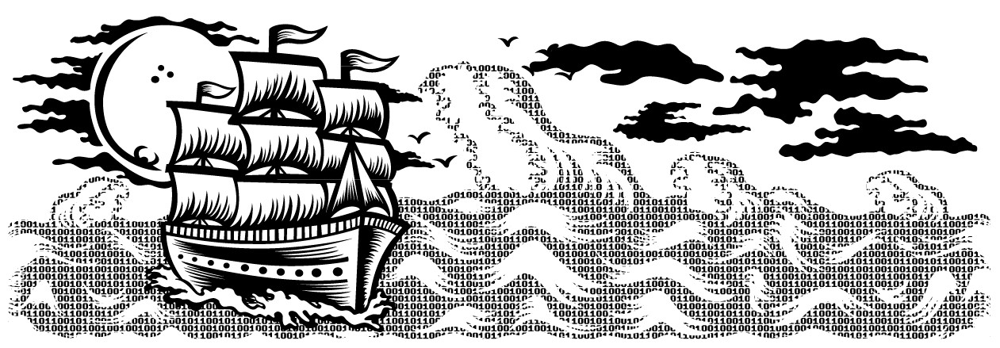
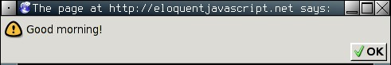

<h1 align="center">Eloquent JavaScript</h2>

// <h6 align="center">(by Colleen van Lent - University of Michigan)</h6>
<!--~~~~~~~~~~~~~~~~~~~~~~~~~~~~~~~~~~~~~~~~~~~~~~~~~~~~~~~~~~~~~~~~~~~~~~~~~~~~~~~~~~~~~~~~~~~~-->
<!--~~~~~~~~~~~~~~~~~~~~~~~~~~~~~ readme.md of eloquent-js ~~~~~~~~~~~~~~~~~~~~~~~~~~~~~~-->
<!--~~~~~~~~~~~~~~~~~~~~~~~~~~~~~~~~~~~~~~~~~~~~~~~~~~~~~~~~~~~~~~~~~~~~~~~~~~~~~~~~~~~~~~~~~~~~-->
<!--~~~~~~~~~~~~~~ 01/02. eloquent javascript (01) ~~~~~~~~~~~~~~~~~-->
<p align="center" width="100%">

</p>

<h2 id="#about">About this Course:</h2>
**Eloquent JavaScript**
>
**A Modern Introduction to Programming**

### Marijn Haverbeke

Copyright © 2014 by Marijn Haverbeke

This work is licensed under a Creative Commons attribution-noncommercial

license (<http://creativecommons.org/licenses/by-nc/3.0/>). All code in
the book may also be considered licensed under an MIT license ([http://
opensource.org/licenses/MIT](http://opensource.org/licenses/MIT)).

The illustrations are contributed by various artists: Cover by Wasif
Hyder. Computer (introduction) and unicycle people (Chapter 21) by

Max Xiantu. Sea of bits (Chapter 1) and weresquirrel (Chapter 4) by
Margarita Martínez and José Menor. Octopuses (Chapter 2 and 4) by Jim
Tierney. Object with on/off switch (Chapter 6) by Dyle MacGregor.
Regular expression diagrams in Chapter 9 generated with
[regexper.com](http://regexper.com/) by Jeff Avallone. Game concept for
Chapter 15 by [Thomas Palef.](http://lessmilk.com/) Pixel art in Chapter
16 by Antonio Perdomo Pastor.

The second edition of Eloquent JavaScript was made possible by [454
financial backers.](http://eloquentjavascript.net/backers.html)

You can buy a print version of this book, with an extra bonus chapter
included, printed by No Starch Press at
[http://www.amazon.com/gp/product/](http://www.amazon.com/gp/product/1593275846/ref=as_li_qf_sp_asin_il_tl?ie=UTF8&camp=1789&creative=9325&creativeASIN=1593275846&linkCode=as2&tag=marijhaver-20&linkId=VPXXXSRYC5COG5R5)

[1593275846/ref=as_li_qf_sp_asin_il_tl?ie=UTF8&camp=1789&creative=9325&creativeASIN=
1593275846&linkCode=as2&tag=marijhaver-20&linkId=VPXXXSRYC5COG5R5](http://www.amazon.com/gp/product/1593275846/ref=as_li_qf_sp_asin_il_tl?ie=UTF8&camp=1789&creative=9325&creativeASIN=1593275846&linkCode=as2&tag=marijhaver-20&linkId=VPXXXSRYC5COG5R5).

**Contents**

[On programming [2](#on-programming)](#on-programming)

[Why language matters [4](#why-language-matters)](#why-language-matters)

[What is JavaScript? [7](#what-is-javascript)](#what-is-javascript)

[Code, and what to do with it
[8](#code-and-what-to-do-with-it)](#code-and-what-to-do-with-it)

[Overview of this book
[9](#overview-of-this-book)](#overview-of-this-book)

[Typographic conventions
[10](#typographic-conventions)](#typographic-conventions)

[**1 Values, Types, and Operators**
[**11**](#values-types-and-operators)](#values-types-and-operators)

[Values [11](#values)](#values)

[Numbers [12](#numbers)](#numbers)

[Strings [15](#strings)](#strings)

[Unary operators [16](#unary-operators)](#unary-operators)

[Boolean values [17](#boolean-values)](#boolean-values)

[Undefined values [19](#undefined-values)](#undefined-values)

[Automatic type conversion
[19](#automatic-type-conversion)](#automatic-type-conversion)

[Summary [22](#summary)](#summary)

[**2 Program Structure**
[**23**](#program-structure)](#program-structure)

[Expressions and statements
[23](#expressions-and-statements)](#expressions-and-statements)

[Variables [24](#variables)](#variables)

[Keywords and reserved words
[26](#keywords-and-reserved-words)](#keywords-and-reserved-words)

[The environment [27](#the-environment)](#the-environment)

[Functions [27](#functions)](#functions)

[The console.log function
[28](#the-console.log-function)](#the-console.log-function)

[Return values [28](#return-values)](#return-values)

[prompt and confirm [29](#prompt-and-confirm)](#prompt-and-confirm)

[Control flow [30](#control-flow)](#control-flow)

[Conditional execution
[30](#conditional-execution)](#conditional-execution)

[while and do loops [32](#while-and-do-loops)](#while-and-do-loops)

[Indenting Code [34](#indenting-code)](#indenting-code)

[for loops [35](#for-loops)](#for-loops)

[Breaking Out of a Loop
[36](#breaking-out-of-a-loop)](#breaking-out-of-a-loop)

[Updating variables succinctly
[36](#updating-variables-succinctly)](#updating-variables-succinctly)

[Dispatching on a value with switch
[37](#dispatching-on-a-value-with-switch)](#dispatching-on-a-value-with-switch)

[Capitalization [38](#capitalization)](#capitalization)

[Comments [38](#comments)](#comments)

[Summary [39](#summary-1)](#summary-1)

[Exercises [40](#exercises)](#exercises)

[**3 Functions** [**42**](#functions-1)](#functions-1)

[Defining a function [42](#defining-a-function)](#defining-a-function)

[Parameters and scopes
[43](#parameters-and-scopes)](#parameters-and-scopes)

[Nested scope [45](#nested-scope)](#nested-scope)

[Functions as values [46](#functions-as-values)](#functions-as-values)

[Declaration notation
[47](#declaration-notation)](#declaration-notation)

[The call stack [48](#the-call-stack)](#the-call-stack)

[Optional Arguments [49](#optional-arguments)](#optional-arguments)

[Closure [50](#closure)](#closure)

[Recursion [52](#recursion)](#recursion)

[Growing functions [55](#growing-functions)](#growing-functions)

[Functions and side effects
[58](#functions-and-side-effects)](#functions-and-side-effects)

[Summary [58](#summary-2)](#summary-2)

[Exercises [59](#exercises-1)](#exercises-1)

[**4 Data Structures: Objects and Arrays**
[**61**](#data-structures-objects-and-arrays)](#data-structures-objects-and-arrays)

[The weresquirrel [61](#the-weresquirrel)](#the-weresquirrel)

[Data sets [62](#data-sets)](#data-sets)

[Properties [63](#properties)](#properties)

[Methods [64](#methods)](#methods)

[Objects [65](#objects)](#objects)

[Mutability [68](#mutability)](#mutability)

[The lycanthrope's log
[69](#the-lycanthropes-log)](#the-lycanthropes-log)

[Computing correlation
[71](#computing-correlation)](#computing-correlation)

[Objects as maps [73](#objects-as-maps)](#objects-as-maps)

[The final analysis [74](#the-final-analysis)](#the-final-analysis)

[Further arrayology [76](#further-arrayology)](#further-arrayology)

[Strings and their properties
[78](#strings-and-their-properties)](#strings-and-their-properties)

[The arguments object
[79](#the-arguments-object)](#the-arguments-object)

[The Math object [80](#the-math-object)](#the-math-object)

[The global object [82](#the-global-object)](#the-global-object)

[Summary [82](#summary-3)](#summary-3)

[Exercises [83](#exercises-2)](#exercises-2)

[**5 Higher-Order Functions**
[**86**](#higher-order-functions)](#higher-order-functions)

[Abstraction [87](#abstraction)](#abstraction)

[Abstracting array traversal
[88](#abstracting-array-traversal)](#abstracting-array-traversal)

[Higher-order functions
[90](#higher-order-functions-1)](#higher-order-functions-1)

[Passing along arguments
[91](#passing-along-arguments)](#passing-along-arguments)

[JSON [92](#json)](#json)

[Filtering an array [94](#filtering-an-array)](#filtering-an-array)

[Transforming with map
[95](#transforming-with-map)](#transforming-with-map)

[Summarizing with reduce
[95](#summarizing-with-reduce)](#summarizing-with-reduce)

[Composability [96](#composability)](#composability)

[The cost [98](#the-cost)](#the-cost)

[Great-great-great-great-
[99](#great-great-great-great-)](#great-great-great-great-)

[Binding [102](#binding)](#binding)

[Summary [102](#summary-4)](#summary-4)

[Exercises [103](#exercises-3)](#exercises-3)

[**6 The Secret Life of Objects**
[**105**](#the-secret-life-of-objects)](#the-secret-life-of-objects)

[History [105](#history)](#history)

[Methods [107](#methods-1)](#methods-1)

[Prototypes [108](#prototypes)](#prototypes)

[Constructors [109](#constructors)](#constructors)

[Overriding derived properties
[110](#overriding-derived-properties)](#overriding-derived-properties)

[Prototype interference
[112](#prototype-interference)](#prototype-interference)

[Prototype-less objects
[114](#prototype-less-objects)](#prototype-less-objects)

[Polymorphism [115](#polymorphism)](#polymorphism)

[Laying out a table [115](#laying-out-a-table)](#laying-out-a-table)

[Getters and setters [121](#getters-and-setters)](#getters-and-setters)

[Inheritance [122](#inheritance)](#inheritance)

[The instanceof operator
[124](#the-instanceof-operator)](#the-instanceof-operator)

[Summary [125](#summary-5)](#summary-5)

[Exercises [126](#exercises-4)](#exercises-4)

[**7 Project: Electronic Life**
[**128**](#project-electronic-life)](#project-electronic-life)

[Definition [128](#definition)](#definition)

[Representing space [129](#representing-space)](#representing-space)

[A critter's programming interface
[131](#a-critters-programming-interface)](#a-critters-programming-interface)

[The world object [132](#the-world-object)](#the-world-object)

[this and its scope [134](#this-and-its-scope)](#this-and-its-scope)

[Animating life [136](#animating-life)](#animating-life)

[It moves [139](#it-moves)](#it-moves)

[More life forms [140](#more-life-forms)](#more-life-forms)

[A more lifelike simulation
[141](#a-more-lifelike-simulation)](#a-more-lifelike-simulation)

[Action handlers [142](#action-handlers)](#action-handlers)

[Populating the new world
[144](#populating-the-new-world)](#populating-the-new-world)

[Bringing it to life [145](#bringing-it-to-life)](#bringing-it-to-life)

[Exercises [147](#exercises-5)](#exercises-5)

[**8 Bugs and Error Handling**
[**149**](#bugs-and-error-handling)](#bugs-and-error-handling)

[Programmer mistakes [149](#programmer-mistakes)](#programmer-mistakes)

[Strict mode [150](#strict-mode)](#strict-mode)

[Testing [151](#testing)](#testing)

[Debugging [153](#debugging)](#debugging)

[Error propagation [154](#error-propagation)](#error-propagation)

[Exceptions [156](#exceptions)](#exceptions)

[Cleaning up after exceptions
[157](#cleaning-up-after-exceptions)](#cleaning-up-after-exceptions)

[Selective catching [159](#selective-catching)](#selective-catching)

[Assertions [161](#assertions)](#assertions)

[Summary [162](#summary-6)](#summary-6)

[Exercises [163](#exercises-6)](#exercises-6)

[**9 Regular Expressions**
[**164**](#regular-expressions)](#regular-expressions)

[Creating a regular expression
[164](#creating-a-regular-expression)](#creating-a-regular-expression)

[Testing for matches [165](#testing-for-matches)](#testing-for-matches)

[Matching a set of characters
[165](#matching-a-set-of-characters)](#matching-a-set-of-characters)

[Repeating parts of a pattern
[167](#repeating-parts-of-a-pattern)](#repeating-parts-of-a-pattern)

[Grouping subexpressions
[168](#grouping-subexpressions)](#grouping-subexpressions)

[Matches and groups [168](#matches-and-groups)](#matches-and-groups)

[The date type [170](#the-date-type)](#the-date-type)

[Word and string boundaries
[171](#word-and-string-boundaries)](#word-and-string-boundaries)

[Choice patterns [172](#choice-patterns)](#choice-patterns)

[The mechanics of matching
[172](#the-mechanics-of-matching)](#the-mechanics-of-matching)

[Backtracking [174](#backtracking)](#backtracking)

[The replace method [176](#the-replace-method)](#the-replace-method)

[Greed [177](#greed)](#greed)

[Dynamically creating RegExp objects
[179](#dynamically-creating-regexp-objects)](#dynamically-creating-regexp-objects)

[The search method [180](#the-search-method)](#the-search-method)

[The lastIndex property
[180](#the-lastindex-property)](#the-lastindex-property)

[Parsing an INI file [182](#parsing-an-ini-file)](#parsing-an-ini-file)

[International characters
[184](#international-characters)](#international-characters)

[Summary [185](#summary-7)](#summary-7)

[Exercises [186](#exercises-7)](#exercises-7)

[**10 Modules** [**188**](#modules)](#modules)

[Why modules help [188](#why-modules-help)](#why-modules-help)

[Using functions as namespaces
[191](#using-functions-as-namespaces)](#using-functions-as-namespaces)

[Objects as interfaces
[192](#objects-as-interfaces)](#objects-as-interfaces)

[Detaching from the global scope
[193](#detaching-from-the-global-scope)](#detaching-from-the-global-scope)

[Evaluating data as code
[194](#evaluating-data-as-code)](#evaluating-data-as-code)

[Require [195](#require)](#require)

[Slow-loading modules
[197](#slow-loading-modules)](#slow-loading-modules)

[Interface design [200](#interface-design)](#interface-design)

[Summary [202](#summary-8)](#summary-8)

[Exercises [203](#exercises-8)](#exercises-8)

[**11 Project: A Programming Language**
[**205**](#project-a-programming-language)](#project-a-programming-language)

[Parsing [205](#parsing)](#parsing)

[The evaluator [210](#the-evaluator)](#the-evaluator)

[Special forms [211](#special-forms)](#special-forms)

[The environment [213](#the-environment-1)](#the-environment-1)

[Functions [215](#functions-2)](#functions-2)

[Compilation [216](#compilation)](#compilation)

[Cheating [217](#cheating)](#cheating)

[Exercises [218](#exercises-9)](#exercises-9)

[**12 JavaScript and the Browser**
[**220**](#javascript-and-the-browser)](#javascript-and-the-browser)

[Networks and the Internet
[220](#networks-and-the-internet)](#networks-and-the-internet)

[The Web [222](#the-web)](#the-web)

[HTML [223](#html)](#html)

[HTML and JavaScript [225](#html-and-javascript)](#html-and-javascript)

[In the sandbox [226](#in-the-sandbox)](#in-the-sandbox)

[Compatibility and the browser wars
[227](#compatibility-and-the-browser-wars)](#compatibility-and-the-browser-wars)

[**13 The Document Object Model**
[**229**](#the-document-object-model)](#the-document-object-model)

[Document structure [229](#document-structure)](#document-structure)

[Trees [230](#trees)](#trees)

[The standard [232](#the-standard)](#the-standard)

[Moving through the tree
[233](#moving-through-the-tree)](#moving-through-the-tree)

[Finding elements [234](#finding-elements)](#finding-elements)

[Changing the document
[235](#changing-the-document)](#changing-the-document)

[Creating nodes [236](#creating-nodes)](#creating-nodes)

[Attributes [238](#attributes)](#attributes)

[Layout [241](#layout)](#layout)

[Styling [243](#styling)](#styling)

[Cascading styles [244](#cascading-styles)](#cascading-styles)

[Query selectors [246](#query-selectors)](#query-selectors)

[Positioning and animating
[247](#positioning-and-animating)](#positioning-and-animating)

[Summary [249](#summary-9)](#summary-9)

[Exercises [250](#exercises-10)](#exercises-10)

[**14 Handling Events** [**252**](#handling-events)](#handling-events)

[Event handlers [252](#event-handlers)](#event-handlers)

[Events and DOM nodes
[253](#events-and-dom-nodes)](#events-and-dom-nodes)

[Event objects [254](#event-objects)](#event-objects)

[Propagation [254](#propagation)](#propagation)

[Default actions [256](#default-actions)](#default-actions)

[Key events [257](#key-events)](#key-events)

[Mouse clicks [259](#mouse-clicks)](#mouse-clicks)

[Mouse motion [260](#mouse-motion)](#mouse-motion)

[Scroll events [263](#scroll-events)](#scroll-events)

[Focus events [264](#focus-events)](#focus-events)

[Load event [265](#load-event)](#load-event)

[Script execution timeline
[266](#script-execution-timeline)](#script-execution-timeline)

[Setting timers [267](#setting-timers)](#setting-timers)

[Debouncing [268](#debouncing)](#debouncing)

[Summary [270](#summary-10)](#summary-10)

[Exercises [270](#exercises-11)](#exercises-11)

[**15 Project: A Platform Game**
[**272**](#project-a-platform-game)](#project-a-platform-game)

[The game [272](#the-game)](#the-game)

[The technology [273](#the-technology)](#the-technology)

[Levels [274](#levels)](#levels)

[Reading a level [275](#reading-a-level)](#reading-a-level)

[Actors [276](#actors)](#actors)

[Encapsulation as a burden
[279](#encapsulation-as-a-burden)](#encapsulation-as-a-burden)

[Drawing [280](#drawing)](#drawing)

[Motion and collision
[285](#motion-and-collision)](#motion-and-collision)

[Actors and actions [288](#actors-and-actions)](#actors-and-actions)

[Tracking keys [292](#tracking-keys)](#tracking-keys)

[Running the game [293](#running-the-game)](#running-the-game)

[Exercises [295](#exercises-12)](#exercises-12)

[**16 Drawing on Canvas**
[**297**](#drawing-on-canvas)](#drawing-on-canvas)

[SVG [297](#svg)](#svg)

[The canvas element [298](#the-canvas-element)](#the-canvas-element)

[Filling and stroking
[300](#filling-and-stroking)](#filling-and-stroking)

[Paths [301](#paths)](#paths)

[Curves [302](#curves)](#curves)

[Drawing a pie chart [306](#drawing-a-pie-chart)](#drawing-a-pie-chart)

[Text [307](#text)](#text)

[Images [308](#images)](#images)

[Transformation [310](#transformation)](#transformation)

[Storing and clearing transformations
[313](#storing-and-clearing-transformations)](#storing-and-clearing-transformations)

[Back to the game [314](#back-to-the-game)](#back-to-the-game)

[Choosing a graphics interface
[320](#choosing-a-graphics-interface)](#choosing-a-graphics-interface)

[Summary [321](#summary-11)](#summary-11)

[Exercises [322](#exercises-13)](#exercises-13)

[**17 HTTP** [**324**](#http)](#http)

[The protocol [324](#the-protocol)](#the-protocol)

[Browsers and HTTP [326](#browsers-and-http)](#browsers-and-http)

[XMLHttpRequest [328](#xmlhttprequest)](#xmlhttprequest)

[Sending a request [328](#sending-a-request)](#sending-a-request)

[Asynchronous Requests
[330](#asynchronous-requests)](#asynchronous-requests)

[Fetching XML Data [330](#fetching-xml-data)](#fetching-xml-data)

[HTTP sandboxing [331](#http-sandboxing)](#http-sandboxing)

[Abstracting requests
[332](#abstracting-requests)](#abstracting-requests)

[Promises [335](#promises)](#promises)

[Appreciating HTTP [338](#appreciating-http)](#appreciating-http)

[Security and HTTPS [338](#security-and-https)](#security-and-https)

[Summary [339](#summary-12)](#summary-12)

[Exercises [340](#exercises-14)](#exercises-14)

[**18 Forms and Form Fields**
[**342**](#forms-and-form-fields)](#forms-and-form-fields)

[Fields [342](#fields)](#fields)

[Focus [344](#focus)](#focus)

[Disabled fields [345](#disabled-fields)](#disabled-fields)

[The form as a whole [345](#the-form-as-a-whole)](#the-form-as-a-whole)

[Text fields [347](#text-fields)](#text-fields)

[Checkboxes and radio buttons
[348](#checkboxes-and-radio-buttons)](#checkboxes-and-radio-buttons)

[Select fields [349](#select-fields)](#select-fields)

[File fields [351](#file-fields)](#file-fields)

[Storing data client-side
[353](#storing-data-client-side)](#storing-data-client-side)

[Summary [356](#summary-13)](#summary-13)

[Exercises [357](#exercises-15)](#exercises-15)

[**19 Project: A Paint Program**
[**359**](#project-a-paint-program)](#project-a-paint-program)

[Implementation [360](#implementation)](#implementation)

[Building the DOM [360](#building-the-dom)](#building-the-dom)

[The foundation [361](#the-foundation)](#the-foundation)

[Tool selection [362](#tool-selection)](#tool-selection)

[Color and brush size
[365](#color-and-brush-size)](#color-and-brush-size)

[Saving [367](#saving)](#saving)

[Loading image files [368](#loading-image-files)](#loading-image-files)

[Finishing up [370](#finishing-up)](#finishing-up)

[Exercises [372](#exercises-16)](#exercises-16)

[**20 Node.js** [**376**](#node.js)](#node.js)

[Background [376](#background)](#background)

[Asynchronicity [377](#asynchronicity)](#asynchronicity)

[The node command [378](#the-node-command)](#the-node-command)

[Modules [380](#modules-1)](#modules-1)

[Installing with NPM [381](#installing-with-npm)](#installing-with-npm)

[The file system module
[382](#the-file-system-module)](#the-file-system-module)

[The HTTP module [384](#the-http-module)](#the-http-module)

[Streams [386](#streams)](#streams)

[A simple file server
[388](#a-simple-file-server)](#a-simple-file-server)

[Error handling [393](#error-handling)](#error-handling)

[Summary [395](#summary-14)](#summary-14)

[Exercises [395](#exercises-17)](#exercises-17)

[**21 Project: Skill-Sharing Website**
[**399**](#project-skill-sharing-website)](#project-skill-sharing-website)

[Design [400](#design)](#design)

[Long polling [401](#long-polling)](#long-polling)

[HTTP interface [402](#http-interface)](#http-interface)

[The server [404](#the-server)](#the-server)

[The client [413](#the-client)](#the-client)

[Exercises [421](#exercises-18)](#exercises-18)

[Program Structure [424](#program-structure-1)](#program-structure-1)

[Functions [425](#functions-3)](#functions-3)

[Data Structures: Objects and Arrays
[426](#data-structures-objects-and-arrays-1)](#data-structures-objects-and-arrays-1)

[Higher-Order Functions
[428](#higher-order-functions-2)](#higher-order-functions-2)

[The Secret Life of Objects
[429](#the-secret-life-of-objects-1)](#the-secret-life-of-objects-1)

[Project: Electronic Life
[430](#project-electronic-life-1)](#project-electronic-life-1)

[Bugs and Error Handling
[432](#bugs-and-error-handling-1)](#bugs-and-error-handling-1)

[Regular Expressions
[432](#regular-expressions-1)](#regular-expressions-1)

[Modules [433](#modules-2)](#modules-2)

[Project: A Programming Language
[435](#project-a-programming-language-1)](#project-a-programming-language-1)

[The Document Object Model
[436](#the-document-object-model-1)](#the-document-object-model-1)

[Handling Events [437](#handling-events-1)](#handling-events-1)

[Project: A Platform Game
[438](#project-a-platform-game-1)](#project-a-platform-game-1)

[Drawing on Canvas [439](#drawing-on-canvas-1)](#drawing-on-canvas-1)

[HTTP [441](#http-1)](#http-1)

[Forms and Form Fields
[442](#forms-and-form-fields-1)](#forms-and-form-fields-1)

[Project: A Paint Program
[444](#project-a-paint-program-1)](#project-a-paint-program-1)

[Node.js [446](#node.js-1)](#node.js-1)

[Project: Skill-Sharing Website
[448](#project-skill-sharing-website-1)](#project-skill-sharing-website-1)

**Introduction**

This is a book about getting computers to do what you want them to do.
Computers are about as common as screwdrivers today, but they contain a
lot more hidden complexity and thus are harder to operate and
understand. To many, they remain alien, slightly threatening things.

{width="5.236319991251094in"
height="1.7437970253718285in"}

We've found two effective ways of bridging the communication gap between
us, squishy biological organisms with a talent for social and spatial
reasoning, and computers, unfeeling manipulators of meaningless data.
The first is to appeal to our sense of the physical world and build
interfaces that mimic that world and allow us to manipulate shapes on a
screen with our fingers. This works very well for casual machine
interaction.

But we have not yet found a good way to use the point-and-click approach
to communicate things to the computer that the designer of the interface
did not anticipate. For open-ended interfaces, such as instructing the
computer to perform arbitrary tasks, we've had more luck with an
approach that makes use of our talent for language: teaching the machine
a language.

Human languages allow words and phrases to be combined in many ways,
which allows us to say many different things. Computer languages, though
typically less grammatically flexible, follow a similar principle.

Casual computing has become much more widespread in the past 20 years,
and language-based interfaces, which once were the default way in which
people interacted with computers, have largely been replaced with
graphical interfaces. But they are still there, if you know where to
look. One such language, JavaScript, is built into almost every web
browser and is thus available on just about every consumer device.

This book intends to make you familiar enough with this language to be
able to make a computer do what you want.

## On programming

I do not enlighten those who are not eager to learn, nor arouse those
who are not anxious to give an explanation themselves. If I have
presented one corner of the square and they cannot come back to me
with the other three, I should not go over the points again.
>
---Confucius

Besides explaining JavaScript, I also will introduce the basic
principles of programming. Programming, it turns out, is hard. The
fundamental rules are typically simple and clear. But programs built on
top of these rules tend to become complex enough to introduce their own
rules and complexity. You're building your own maze, in a way, and you
might just get lost in it.

There will be times when reading this book feels terribly frustrating.
If you are new to programming, there will be a lot of new material to
digest. Much of this material will then be *combined* in ways that
require you to make additional connections.

It is up to you to make the necessary effort. When you are struggling to
follow the book, do not jump to any conclusions about your own
capabilities. You are fine---you just need to keep at it. Take a break,
reread some material, and *always* make sure you read and understand the
example programs and exercises. Learning is hard work, but everything
you learn is yours and will make subsequent learning easier.

The computer programmer is a creator of universes for which he &lbrack;sic&rbrack;
alone is responsible. Universes of virtually unlimited complexity can
be created in the form of computer programs.

---Joseph Weizenbaum, *Computer Power and Human Reason*

A program is many things. It is a piece of text typed by a programmer,
it is the directing force that makes the computer do what it does, it is
data in the computer's memory, yet it controls the actions performed on
this same memory. Analogies that try to compare programs to objects we
are familiar with tend to fall short. A superficially fitting one is
that of a machine---lots of separate parts tend to be involved, and to
make the whole thing tick, we have to consider the ways in which these
parts interconnect and contribute to the operation of the whole.

A computer is a machine built to act as a host for these immaterial
machines. Computers themselves can do only stupidly straightforward
things. The reason they are so useful is that they do these things at an
incredibly high speed. A program can ingeniously combine an enormous
number of these simple actions in order to do very complicated things.

To some of us, writing computer programs is a fascinating game. A
program is a building of thought. It is costless to build, it is
weightless, and it grows easily under our typing hands.

But without care, a program's size and complexity will grow out of
control, confusing even the person who created it. Keeping programs
under control is the main problem of programming. When a program works,
it is beautiful. The art of programming is the skill of controlling
complexity. The great program is subdued---made simple in its
complexity.

Many programmers believe that this complexity is best managed by using
only a small set of well-understood techniques in their programs. They
have composed strict rules ("best practices") prescribing the form
programs should have, and the more zealous among them will consider
those who go outside of this safe little zone to be *bad* programmers.

What hostility to the richness of programming---to try to reduce it to
something straightforward and predictable, to place a taboo on all the
weird and beautiful programs! The landscape of programming techniques is
enormous, fascinating in its diversity, and still largely unexplored. It
is certainly dangerous going, luring the inexperienced programmer into
all kinds of confusion, but that only means you should proceed with
caution and keep your wits about you. As you learn there will always be
new challenges and new territory to explore. Programmers who refuse to
keep exploring will stagnate, forget their joy, and get bored with their
craft.

## Why language matters

In the beginning, at the birth of computing, there were no programming
languages. Programs looked something like this:

00110001 00000000 00000000
>
00110001 00000001 00000001
>
00110011 00000001 00000010
>
01010001 00001011 00000010
>
00100010 00000010 00001000
>
01000011 00000001 00000000
>
01000001 00000001 00000001
>
00010000 00000010 00000000
>
01100010 00000000 00000000

That is a program to add the numbers from 1 to 10 together and print out
the result: 1 + 2 + \... + 10 = 55. It could run on a simple,
hypothetical machine. To program early computers, it was necessary to
set large arrays of switches in the right position or punch holes in
strips of cardboard and feed them to the computer. You can probably
imagine how tedious and error-prone this procedure was. Even writing
simple programs required much cleverness and discipline. Complex ones
were nearly inconceivable.

Of course, manually entering these arcane patterns of bits (the ones and
zeros) did give the programmer a profound sense of being a mighty
wizard. And that has to be worth something in terms of job satisfaction.

Each line of the previous program contains a single instruction. It
could be written in English like this:

1.  Store the number 0 in memory location 0.

2.  Store the number 1 in memory location 1.

3.  Store the value of memory location 1 in memory location 2.

4.  Subtract the number 11 from the value in memory location 2.

5.  If the value in memory location 2 is the number 0,continue with
    instruction 9.

6.  Add the value of memory location 1 to memory location 0.

7.  Add the number 1 to the value of memory location 1.

8.  Continue with instruction 3.

9.  Output the value of memory location 0.

Although that is already more readable than the soup of bits, it is
still rather unpleasant. It might help to use names instead of numbers
for the instructions and memory locations.

Set &quot;total&quot; to 0.

Set &quot;count&quot; to 1.

&lbrack;loop&rbrack;

Set &quot;compare&quot; to &quot;count&quot;.

Subtract 11 from &quot;compare&quot;.

If &quot;compare&quot; is zero, continue at &lbrack;end&rbrack;.

Add &quot;count&quot; to &quot;total&quot;.

Add 1 to &quot;count&quot;.

Continue at &lbrack;loop&rbrack;.

&lbrack;end&rbrack; Output &quot;total&quot;.

Can you see how the program works at this point? The first two lines
give two memory locations their starting values: total will be used to
build up the result of the computation, and count will keep track of the
number that we are currently looking at. The lines using compare are
probably the weirdest ones. The program wants to see whether count is
equal to 11 in order to decide whether it can stop running. Because our
hypothetical machine is rather primitive, it can only test whether a
number is zero and make a decision (or jump) based on that. So it uses
the memory location labeled compare to compute the value of count - 11
and makes a decision based on that value. The next two lines add the
value of count to the result and increment count by 1 every time the
program has decided that count is not 11 yet.

Here is the same program in JavaScript:

```
var total = 0, count = 1; while (count &lt;= 10) {
total += count; count += 1;
}
console.log(total);
// ~→~ 55
```

This version gives us a few more improvements. Most importantly, there
is no need to specify the way we want the program to jump back and forth
anymore. The while language construct takes care of that. It continues
executing the block (wrapped in braces) below it as long as the
condition it was given holds. That condition is count &lt;= 10, which
means "count is less than or equal to 10". We no longer have to create a
temporary value and compare that to zero, which was an uninteresting
detail. Part of the power of programming languages is that they take
care of uninteresting details for us.

At the end of the program, after the while construct has finished, the
console.log operation is applied to the result in order to write it as
output.

Finally, here is what the program could look like if we happened to have
the convenient operations range and sum available, which respectively
create a collection of numbers within a range and compute the sum of a
collection of numbers:

```
console.log(sum(range(1, 10)));
// ~→~ 55
```

The moral of this story is that the same program can be expressed in
long and short, unreadable and readable ways. The first version of the
program was extremely obscure, whereas this last one is almost English:
log the sum of the range of numbers from 1 to 10. (We will see in later
chapters how to build operations like sum and range.)

A good programming language helps the programmer by allowing them to
talk about the actions that the computer has to perform on a higher
level. It helps omit uninteresting details, provides convenient building
blocks (such as while and console.log), allows you to define your own
building blocks (such as sum and range), and makes those blocks easy to
compose.

## What is JavaScript?

JavaScript was introduced in 1995 as a way to add programs to web pages
in the Netscape Navigator browser. The language has since been adopted
by all other major graphical web browsers. It has made modern web
applications possible---applications with which you can interact
directly, without doing a page reload for every action. But it is also
used in more traditional websites to provide various forms of
interactivity and cleverness.

It is important to note that JavaScript has almost nothing to do with
the programming language named Java. The similar name was inspired by
marketing considerations, rather than good judgment. When JavaScript was
being introduced, the Java language was being heavily marketed and was
gaining popularity. Someone thought it was a good idea to try to ride
along on this success. Now we are stuck with the name.

After its adoption outside of Netscape, a standard document was written
to describe the way the JavaScript language should work to make sure the
various pieces of software that claimed to support JavaScript were
actually talking about the same language. This is called the ECMAScript
standard, after the Ecma International organization that did the
standardization. In practice, the terms ECMAScript and JavaScript can be
used interchangeably---they are two names for the same language.

There are those who will say *terrible* things about the JavaScript
language. Many of these things are true. When I was required to write
something in JavaScript for the first time, I quickly came to despise
it. It would accept almost anything I typed but interpret it in a way
that was completely different from what I meant. This had a lot to do
with the fact that I did not have a clue what I was doing, of course,
but there is a real issue here: JavaScript is ridiculously liberal in
what it allows. The idea behind this design was that it would make
programming in JavaScript easier for beginners. In actuality, it mostly
makes finding problems in your programs harder because the system will
not point them out to you.

This flexibility also has its advantages, though. It leaves space for a
lot of techniques that are impossible in more rigid languages, and as
you will see (for example in Chapter 10) it can be used to overcome some
of JavaScript's shortcomings. After learning the language properly and
working with it for a while, I have learned to actually *like*
JavaScript.

There have been several versions of JavaScript. ECMAScript version 3 was
the widely supported version in the time of JavaScript's ascent to
dominance, roughly between 2000 and 2010. During this time, work was
underway on an ambitious version 4, which planned a number of radical
improvements and extensions to the language. Changing a living, widely
used language in such a radical way turned out to be politically
difficult, and work on the version 4 was abandoned in 2008, leading to
the much less ambitious version 5 coming out in 2009. We're now at the
point where all major browsers support version 5, which is the language
version that this book will be focusing on. A version 6 is in the
process of being finalized, and some browsers are starting to support
new features from this version.

Web browsers are not the only platforms on which JavaScript is used.
Some databases, such as MongoDB and CouchDB, use JavaScript as their
scripting and query language. Several platforms for desktop and server
programming, most notably the Node.js project (the subject of Chapter
20) are providing a powerful environment for programming JavaScript
outside of the browser.

## Code, and what to do with it

Code is the text that makes up programs. Most chapters in this book
contain quite a lot of it. In my experience, reading code and writing
code are indispensable parts of learning to program, so try to not just
glance over the examples. Read them attentively and understand them.
This may be slow and confusing at first, but I promise that you will
quickly get the hang of it. The same goes for the exercises. Don't
assume you understand them until you've actually written a working
solution.

I recommend you try your solutions to exercises in an actual JavaScript
interpreter. That way, you'll get immediate feedback on whether what you
are doing is working, and, I hope, you'll be tempted to experiment and
go beyond the exercises.

The easiest way to run the example code in the book, and to experiment
with it, is to look it up in the online version of the book at
[*eloquentjavascript.net*](http://eloquentjavascript.net/). There, you
can click any code example to edit and run it and to see the output it
produces. To work on the exercises, go to
[*eloquentjavascript.net/code*](http://eloquentjavascript.net/code),
which provides starting code for each coding exercise and allows you to
look at the solutions.

If you want to run the programs defined in this book outside of the
book's sandbox, some care is required. Many examples stand on their own
and should work in any JavaScript environment. But code in later
chapters is mostly written for a specific environment (the browser or
Node.js) and can run only there. In addition, many chapters define
bigger programs, and the pieces of code that appear in them depend on
each other or on external files. The
[sandbox](http://eloquentjavascript.net/code) on the website provides
links to Zip files containing all of the scripts and data files
necessary to run the code for a given chapter.

## Overview of this book

This book contains roughly three parts. The first 11 chapters discuss
the JavaScript language itself. The next eight chapters are about web
browsers and the way JavaScript is used to program them. Finally, two
chapters are devoted to Node.js, another environment to program
JavaScript in.

Throughout the book, there are five *project chapters*, which describe
larger example programs to give you a taste of real programming. In
order of appearance, we will work through building an artificial life
simulation, a programming language, a platform game, a paint program,
and a dynamic website.

The language part of the book starts with four chapters to introduce the
basic structure of the JavaScript language. They introduce control
structures (such as the while word you saw in this introduction),
functions (writing your own operations), and data structures. After
these, you will be able to write simple programs. Next, Chapters 5 and 6
introduce techniques to use functions and objects to write more
*abstract* code and thus keep complexity under control.

After a first project chapter, the first part of the book continues with
chapters on error handling and fixing, on regular expressions (an
important tool for working with text data), and on modularity---another
weapon against complexity. The second project chapter concludes the
first part of the book.

The second part, Chapters 12 to 19, describes the tools that browser
JavaScript has access to. You'll learn to display things on the screen
(Chapters 13 and 16), respond to user input (Chapters 14 and 18), and
communicate over the network (Chapter 17). There are again two project
chapters in this part.

After that, Chapter 20 describes Node.js, and Chapter 21 builds a simple
web system using that tool.

## Typographic conventions

In this book, text written in a monospaced font will represent elements
of programs---sometimes they are self-sufficient fragments, and
sometimes they just refer to part of a nearby program. Programs (of
which you have already seen a few), are written as follows:

```
function fac(n) {
if (n == 0) return 1;
else
return fac(n - 1) \* n;
}
```

Sometimes, in order to show the output that a program produces, the
expected output is written after it, with two slashes and an arrow in
front.

```
console.log(fac(8));
// ~→~ 40320 Good luck!
```

*"Below the surface of the machine, the program moves. Without effort,
it expands and contracts. In great harmony, electrons scatter and
regroup. The forms on the monitor are but ripples on the water. The
essence stays invisibly below."*

---Master Yuan-Ma, *The Book of Programming*

# 1 Values, Types, and Operators

Inside the computer's world, there is only data. You can read data,
modify data, create new data---but anything that isn't data simply does
not exist. All this data is stored as long sequences of bits and is thus
fundamentally alike.

Bits are any kind of two-valued things, usually described as zeros and
ones. Inside the computer, they take forms such as a high or low
electrical charge, a strong or weak signal, or a shiny or dull spot on
the surface of a CD. Any piece of discrete information can be reduced to
a sequence of zeros and ones and thus represented in bits.

For example, think about how you might show the number 13 in bits. It
works the same way you write decimal numbers, but instead of 10
different digits, you have only 2, and the weight of each increases by a
factor of 2 from right to left. Here are the bits that make up the
number 13, with the weights of the digits shown below them:

0 0 0 0 1 1 0 1

128 64 32 16 8 4 2 1

So that's the binary number 00001101, or 8 + 4 + 1, which equals 13.

## Values

Imagine a sea of bits. An ocean of them. A typical modern computer has
more than 30 billion bits in its volatile data storage. Nonvolatile
storage (the hard disk or equivalent) tends to have yet a few orders of
magnitude more.
<!--~~~~~~~~~~~~~~~~~~~~~~~~~~~~~~~~~~~~~~~~~~~~~~~~~~~~~~~~~~~~~~~~~~~~~~~~~~~~~~~~~~~~~~~~~~~~-->
<!--~~~~~~~~~~~~~~~~~~~~~~~~~~~~~~ 02.  (##) ~~~~~~~~~~~~~~~~~~~~~~~~~~~~~~~~-->
<p align="left">
  
</p>
//{width="5.235998468941382in" height="1.8228412073490814in"}

To be able to work with such quantities of bits without getting lost,
you can separate them into chunks that represent pieces of information.
In a JavaScript environment, those chunks are called *values*. Though
all values are made of bits, they play different roles. Every value has
a type that determines its role. There are six basic types of values in
JavaScript:

numbers, strings, Booleans, objects, functions, and undefined values.

To create a value, you must merely invoke its name. This is convenient.
You don't have to gather building material for your values or pay for
them. You just call for one, and *woosh*, you have it. They are not
created from thin air, of course. Every value has to be stored
somewhere, and if you want to use a gigantic amount of them at the same
time, you might run out of bits. Fortunately, this is a problem only if
you need them all simultaneously. As soon as you no longer use a value,
it will dissipate, leaving behind its bits to be recycled as building
material for the next generation of values.

This chapter introduces the atomic elements of JavaScript programs, that
is, the simple value types and the operators that can act on such
values.

## Numbers

Values of the *number* type are, unsurprisingly, numeric values. In a
JavaScript program, they are written as follows:

13

Use that in a program, and it will cause the bit pattern for the number
13 to come into existence inside the computer's memory.

JavaScript uses a fixed number of bits, namely 64 of them, to store a
single number value. There are only so many patterns you can make with
64 bits, which means that the amount of different numbers that can be
represented is limited. For *N* decimal digits, the amount of numbers
that can be represented is 10*^N^*. Similarly, given 64 binary digits,
you can represent 2^64^ different numbers, which is about 18 quintillion
(an 18 with 18 zeros after it). This is a lot.

Computer memory used to be a lot smaller, and people tended to use
groups of 8 or 16 bits to represent their numbers. It was easy to
accidentally *overflow* such small numbers---to end up with a number
that did not fit into the given amount of bits. Today, even personal
computers have plenty of memory, so you are free to use 64-bit chunks,
which means you need to worry about overflow only when dealing with
truly astronomical numbers.

Not all whole numbers below 18 quintillion fit in a JavaScript number,
though. Those bits also store negative numbers, so one bit indicates the
sign of the number. A bigger issue is that nonwhole numbers must also be
represented. To do this, some of the bits are used to store the position
of the decimal point. The actual maximum whole number that can be stored
is more in the range of 9 quadrillion (15 zeros), which is still
pleasantly huge.

Fractional numbers are written by using a dot.

9.81

For very big or very small numbers, you can also use scientific notation
by adding an "e" (for "exponent"), followed by the exponent of the
number:

2.998e8

That is 2.998 × 10^8^ = 299,800,000.

Calculations with whole numbers (also called *integers*) smaller than
the aforementioned 9 quadrillion are guaranteed to always be precise.
Unfortunately, calculations with fractional numbers are generally not.
Just as *π* (pi) cannot be precisely expressed by a finite number of
decimal digits, many numbers lose some precision when only 64 bits are
available to store them. This is a shame, but it causes practical
problems only in specific situations. The important thing is to be aware
of it and treat fractional digital numbers as approximations, not as
precise values.

#### Arithmetic

The main thing to do with numbers is arithmetic. Arithmetic operations
such as addition or multiplication take two number values and produce a
new number from them. Here is what they look like in JavaScript:

100 + 4 \* 11

The + and \* symbols are called *operators*. The first stands for
addition, and the second stands for multiplication. Putting an operator
between two values will apply it to those values and produce a new
value.

Does the example mean "add 4 and 100, and multiply the result by 11", or
is the multiplication done before the adding? As you might have guessed,
the multiplication happens first. But as in mathematics, you can change
this by wrapping the addition in parentheses.

(100 + 4) \* 11

For subtraction, there is the - operator, and division can be done with
the / operator.

When operators appear together without parentheses, the order in which
they are applied is determined by the *precedence* of the operators. The
example shows that multiplication comes before addition. The / operator
has the same precedence as \*. Likewise for + and -. When multiple
operators with the same precedence appear next to each other, as in 1 -
2 + 1, they are applied left to right: (1 - 2)+ 1.

These rules of precedence are not something you should worry about. When
in doubt, just add parentheses.

There is one more arithmetic operator, which you might not immediately
recognize. The % symbol is used to represent the *remainder* operation.
X % Y is the remainder of dividing X by Y. For example, 314 % 100
produces 14, and 144 % 12 gives 0. Remainder's precedence is the same as
that of multiplication and division. You'll often see this operator
referred to as *modulo*, though technically *remainder* is more
accurate.

#### Special numbers

There are three special values in JavaScript that are considered numbers
but don't behave like normal numbers.

The first two are Infinity and -Infinity, which represent the positive
and negative infinities. Infinity - 1 is still Infinity, and so on.
Don't put too much trust in infinity-based computation. It isn't
mathematically solid, and it will quickly lead to our next special
number: NaN.

NaN stands for "not a number", even though it is a value of the number
type. You'll get this result when you, for example, try to calculate 0 /
0 (zero divided by zero), Infinity - Infinity, or any number of other
numeric operations that don't yield a precise, meaningful result.

## Strings

The next basic data type is the *string*. Strings are used to represent
text. They are written by enclosing their content in quotes.

&quot;Patch my boat with chewing gum&quot;
>
\'Monkeys wave goodbye\'

Both single and double quotes can be used to mark strings as long as the
quotes at the start and the end of the string match.

Almost anything can be put between quotes, and JavaScript will make a
string value out of it. But a few characters are more difficult. You can
imagine how putting quotes between quotes might be hard. *Newlines* (the
characters you get when you press Enter) also can't be put between
quotes. The string has to stay on a single line.

To make it possible to include such characters in a string, the
following notation is used: whenever a backslash (\\) is found inside
quoted text, it indicates that the character after it has a special
meaning. This is called *escaping* the character. A quote that is
preceded by a backslash will not end the string but be part of it. When
an n character occurs after a backslash, it is interpreted as a newline.
Similarly, a t after a backslash means a tab character. Take the
following string:

&quot;This is the first line\\nAnd this is the second&quot; The actual text
contained is this:

This is the first line

And this is the second

There are, of course, situations where you want a backslash in a string
to be just a backslash, not a special code. If two backslashes follow
each other, they will collapse together, and only one will be left in
the resulting string value. This is how the string "A newline character
is written like &quot;\\n&quot;." can be expressed:

&quot;A newline character is written like \\&quot;\\\\n\\&quot;.&quot;

Strings cannot be divided, multiplied, or subtracted, but the + operator
*can* be used on them. It does not add, but it *concatenates*---it glues
two strings together. The following line will produce the string
&quot;concatenate&quot;:

&quot;con&quot; + &quot;cat&quot; + &quot;e&quot; + &quot;nate&quot;

There are more ways of manipulating strings, which we will discuss when
we get to methods in Chapter 4.

## Unary operators

Not all operators are symbols. Some are written as words. One example is
the typeof operator, which produces a string value naming the type of
the value you give it.

console.log(typeof 4.5) // ~→~ number console.log(typeof &quot;x&quot;)

// ~→~ string

We will use console.log in example code to indicate that we want to see
the result of evaluating something. When you run such code, the value
produced should be shown on the screen, though how it appears will
depend on the JavaScript environment you use to run it.

The other operators we saw all operated on two values, but typeof takes
only one. Operators that use two values are called *binary* operators,
while those that take one are called *unary* operators. The minus
operator can be used both as a binary operator and as a unary operator.

console.log(- (10 - 2))

// ~→~ -8

## Boolean values

Often, you will need a value that simply distinguishes between two
possibilities, like "yes" and "no" or "on" and "off". For this,
JavaScript has a *Boolean* type, which has just two values: true and
false (which are written simply as those words).

#### Comparisons

Here is one way to produce Boolean values:

console.log(3 &gt; 2) // ~→~ true console.log(3 &lt; 2)

// ~→~ false

The &gt; and &lt; signs are the traditional symbols for "is greater than"
and "is less than", respectively. They are binary operators. Applying
them results in a Boolean value that indicates whether they hold true in
this case.

Strings can be compared in the same way.

console.log(&quot;Aardvark&quot; &lt; &quot;Zoroaster&quot;)

// ~→~ true

The way strings are ordered is more or less alphabetic: uppercase
letters are always "less" than lowercase ones, so &quot;Z&quot; &lt; &quot;a&quot; is
true, and nonalphabetic characters (!, -, and so on) are also included
in the ordering. The actual comparison is based on the *Unicode*
standard. This standard assigns a number to virtually every character
you would ever need, including characters from Greek, Arabic, Japanese,
Tamil, and so on. Having such numbers is useful for storing strings
inside a computer because it makes it possible to represent them as a
sequence of numbers. When comparing strings, JavaScript goes over them
from left to right, comparing the numeric codes of the characters one by
one.

Other similar operators are &gt;= (greater than or equal to), &lt;= (less
than or equal to), == (equal to), and != (not equal to).

console.log(&quot;Itchy&quot; != &quot;Scratchy&quot;)

// ~→~ true

There is only one value in JavaScript that is not equal to itself, and
that is NaN, which stands for "not a number".

console.log(NaN == NaN)

// ~→~ false

NaN is supposed to denote the result of a nonsensical computation, and
as such, it isn't equal to the result of any *other* nonsensical
computations.

#### Logical operators

There are also some operations that can be applied to Boolean values
themselves. JavaScript supports three logical operators: *and*, *or*,
and *not*. These can be used to "reason" about Booleans.

The && operator represents logical *and*. It is a binary operator, and
its result is true only if both the values given to it are true.

console.log(true && false)

// ~→~ false console.log(true && true)

// ~→~ true

The \|\| operator denotes logical *or*. It produces true if either of
the values given to it is true.

console.log(false \|\| true)

// ~→~ true console.log(false \|\| false)

// ~→~ false

*Not* is written as an exclamation mark (!). It is a unary operator that
flips the value given to it---!true produces false and !false gives
true.

When mixing these Boolean operators with arithmetic and other operators,
it is not always obvious when parentheses are needed. In practice, you
can usually get by with knowing that of the operators we have seen so
far, \|\| has the lowest precedence, then comes &&, then the comparison
operators (&gt;, ==, and so on), and then the rest. This order has been
chosen such that, in typical expressions like the following one, as few
parentheses as possible are necessary:

1 + 1 == 2 && 10 \* 10 &gt; 50

The last logical operator I will discuss is not unary, not binary, but
*ternary*, operating on three values. It is written with a question mark
and a colon, like this:

console.log(true ? 1 : 2);

// ~→~ 1

console.log(false ? 1 : 2);

// ~→~ 2

This one is called the *conditional* operator (or sometimes just
*ternary* operator since it is the only such operator in the language).
The value on the left of the question mark "picks" which of the other
two values will come out. When it is true, the middle value is chosen,
and when it is false, the value on the right comes out.

## Undefined values

There are two special values, written null and undefined, that are used
to denote the absence of a meaningful value. They are themselves values,
but they carry no information.

Many operations in the language that don't produce a meaningful value
(you'll see some later) yield undefined simply because they have to
yield *some* value.

The difference in meaning between undefined and null is an accident of
JavaScript's design, and it doesn't matter most of the time. In the
cases where you actually have to concern yourself with these values, I
recommend treating them as interchangeable (more on that in a moment).

## Automatic type conversion

In the introduction, I mentioned that JavaScript goes out of its way to
accept almost any program you give it, even programs that do odd things.
This is nicely demonstrated by the following expressions:

console.log(8 \* null)

// ~→~ 0

console.log(&quot;5&quot; - 1)

// ~→~ 4

console.log(&quot;5&quot; + 1)

// ~→~ 51

console.log(&quot;five&quot; \* 2) // ~→~ NaN

console.log(false == 0)

// ~→~ true

When an operator is applied to the "wrong" type of value, JavaScript
will quietly convert that value to the type it wants, using a set of
rules that often aren't what you want or expect. This is called *type
coercion*. So the null in the first expression becomes 0, and the &quot;5&quot;
in the second expression becomes 5 (from string to number). Yet in the
third expression, + tries string concatenation before numeric addition,
so the 1 is converted to &quot;1&quot; (from number to string).

When something that doesn't map to a number in an obvious way

(such as &quot;five&quot; or undefined) is converted to a number, the value NaN
is produced. Further arithmetic operations on NaN keep producing NaN, so
if you find yourself getting one of those in an unexpected place, look
for accidental type conversions.

When comparing values of the same type using ==, the outcome is easy to
predict: you should get true when both values are the same, except in
the case of NaN. But when the types differ, JavaScript uses a
complicated and confusing set of rules to determine what to do. In most
cases, it just tries to convert one of the values to the other value's
type. However, when null or undefined occurs on either side of the
operator, it produces true only if both sides are one of null or
undefined.

console.log(null == undefined);

// ~→~ true console.log(null == 0);

// ~→~ false

That last piece of behavior is often useful. When you want to test
whether a value has a real value instead of null or undefined, you can
simply compare it to null with the == (or !=) operator.

But what if you want to test whether something refers to the precise
value false? The rules for converting strings and numbers to Boolean
values state that 0, NaN, and the empty string (&quot;&quot;) count as false,
while all the other values count as true. Because of this, expressions
like 0

== false and &quot;&quot; == false are also true. For cases like this, where you
do *not* want any automatic type conversions to happen, there are two
extra operators: === and !==. The first tests whether a value is
precisely equal to the other, and the second tests whether it is not
precisely equal. So &quot;&quot; === false is false as expected.

I recommend using the three-character comparison operators defensively
to prevent unexpected type conversions from tripping you up. But when
you're certain the types on both sides will be the same, there is no
problem with using the shorter operators.

#### Short-circuiting of logical operators

The logical operators && and \|\| handle values of different types in a
peculiar way. They will convert the value on their left side to Boolean
type in order to decide what to do, but depending on the operator and
the result of that conversion, they return either the *original*
left-hand value or the right-hand value.

The \|\| operator, for example, will return the value to its left when
that can be converted to true and will return the value on its right
otherwise. This conversion works as you'd expect for Boolean values and
should do something analogous for values of other types.

console.log(null \|\| &quot;user&quot;)

// ~→~ user console.log(&quot;Karl&quot; \|\| &quot;user&quot;)

// ~→~ Karl

This functionality allows the \|\| operator to be used as a way to fall
back on a default value. If you give it an expression that might produce
an empty value on the left, the value on the right will be used as a
replacement in that case.

The && operator works similarly, but the other way around. When the
value to its left is something that converts to false, it returns that
value, and otherwise it returns the value on its right.

Another important property of these two operators is that the expression
to their right is evaluated only when necessary. In the case of true
\|\| X, no matter what X is---even if it's an expression that does
something *terrible*---the result will be true, and X is never
evaluated. The same goes for false && X, which is false and will ignore
X. This is called *short-circuit evaluation*.

The conditional operator works in a similar way. The first expression is
always evaluated, but the second or third value, the one that is not
picked, is not.

## Summary

We looked at four types of JavaScript values in this chapter: numbers,
strings, Booleans, and undefined values.

Such values are created by typing in their name (true, null) or value
(13, &quot;abc&quot;). You can combine and transform values with operators. We
saw binary operators for arithmetic (+, -, \*, /, and %), string
concatenation (+), comparison (==, !=, ===, !==, &lt;, &gt;, &lt;=, &gt;=), and
logic (&&, \|\|), as well as several unary operators (- to negate a
number, ! to negate logically, and typeof to find a value's type) and a
ternary operator (?:) to pick one of two values based on a third value.

This gives you enough information to use JavaScript as a pocket
calculator, but not much more. The next chapter will start tying these
expressions together into basic programs.

*"And my heart glows bright red under my filmy, translucent skin and
they have to administer 10cc of JavaScript to get me to come back. (I
respond well to toxins in the blood.) Man, that stuff will kick the
peaches right out your gills!"*

---\_why, *Why's (Poignant) Guide to Ruby*

# 2 Program Structure

In this chapter, we will start to do things that can actually be called
*programming*. We will expand our command of the JavaScript language
beyond the nouns and sentence fragments we've seen so far, to the point
where we can express some meaningful prose.

## Expressions and statements

In Chapter 1, we made some values and then applied operators to them to
get new values. Creating values like this is an essential part of every
JavaScript program, but it is only a part.

A fragment of code that produces a value is called an *expression*.
Every value that is written literally (such as 22 or &quot;psychoanalysis&quot;)
is an expression. An expression between parentheses is also an
expression, as is a binary operator applied to two expressions or a
unary operator applied to one.

This shows part of the beauty of a language-based interface. Expressions
can nest in a way very similar to the way subsentences in human
languages are nested---a subsentence can contain its own subsentences,
and so on. This allows us to combine expressions to express arbitrarily
complex computations.

If an expression corresponds to a sentence fragment, a JavaScript
*statement* corresponds to a full sentence in a human language. A
program is simply a list of statements.

The simplest kind of statement is an expression with a semicolon after
it. This is a program:

1;

!false;

It is a useless program, though. An expression can be content to just
produce a value, which can then be used by the enclosing expression. A
statement stands on its own and amounts to something only if it affects
the world. It could display something on the screen---that counts as
changing the world---or it could change the internal state of the
machine in a way that will affect the statements that come after it.
These changes are called *side effects*. The statements in the previous
example just produce the values 1 and true and then immediately throw
them away. This leaves no impression on the world at all. When executing
the program, nothing observable happens.

In some cases, JavaScript allows you to omit the semicolon at the end of
a statement. In other cases, it has to be there, or the next line will
be treated as part of the same statement. The rules for when it can be
safely omitted are somewhat complex and error-prone. In this book, every
statement that needs a semicolon will always be terminated by one. I
recommend you do the same in your own programs, at least until you've
learned more about subtleties involved in leaving out semicolons.

## Variables

How does a program keep an internal state? How does it remember things?
We have seen how to produce new values from old values, but this does
not change the old values, and the new value has to be immediately used
or it will dissipate again. To catch and hold values, JavaScript
provides a thing called a *variable*.

var caught = 5 \* 5;

And that gives us our second kind of statement. The special word
(*keyword*) var indicates that this sentence is going to define a
variable. It is followed by the name of the variable and, if we want to
immediately give it a value, by an = operator and an expression.

The previous statement creates a variable called caught and uses it to
grab hold of the number that is produced by multiplying 5 by 5.

After a variable has been defined, its name can be used as an
expression. The value of such an expression is the value the variable
currently holds. Here's an example:

var ten = 10; console.log(ten \* ten);

// ~→~ 100

Variable names can be any word that isn't a reserved word (such as var).
They may not include spaces. Digits can also be part of variable
names---catch22 is a valid name, for example---but the name must not
start with a digit. A variable name cannot include punctuation, except
for the characters \$ and \_.

When a variable points at a value, that does not mean it is tied to that
value forever. The = operator can be used at any time on existing
variables to disconnect them from their current value and have them
point to a new one.

var mood = &quot;light&quot;; console.log(mood);

// ~→~ light mood = &quot;dark&quot;; console.log(mood);

// ~→~ dark

You should imagine variables as tentacles, rather than boxes. They do
not *contain* values; they *grasp* them---two variables can refer to the
same value. A program can access only the values that it still has a
hold on. When you need to remember something, you grow a tentacle to
hold on to it or you reattach one of your existing tentacles to it.
<!--~~~~~~~~~~~~~~~~~~~~~~~~~~~~~~~~~~~~~~~~~~~~~~~~~~~~~~~~~~~~~~~~~~~~~~~~~~~~~~~~~~~~~~~~~~~~-->
<!--~~~~~~~~~~~~~~~~~~~~~~~~~~~~~~ 03.  (##) ~~~~~~~~~~~~~~~~~~~~~~~~~~~~~~~~-->
<p align="left">
  
</p>
// {width="5.236770559930009in" height="2.380349956255468in"}

Let's look at an example. To remember the number of dollars that Luigi
still owes you, you create a variable. And then when he pays back \$35,
you give this variable a new value.

var luigisDebt = 140; luigisDebt = luigisDebt - 35;
console.log(luigisDebt);

// ~→~ 105

When you define a variable without giving it a value, the tentacle has
nothing to grasp, so it ends in thin air. If you ask for the value of an
empty variable, you'll get the value undefined.

A single var statement may define multiple variables. The definitions
must be separated by commas.

var one = 1, two = 2;

console.log(one + two);

// ~→~ 3

## Keywords and reserved words

Words with a special meaning, such as var, are *keywords*, and they may
not be used as variable names. There are also a number of words that are
"reserved for use" in future versions of JavaScript. These are also
officially not allowed to be used as variable names, though some
JavaScript environments do allow them. The full list of keywords and
reserved words is rather long.

break case catch class const continue debugger default delete do else
enum export extends false finally for function if implements import in
instanceof interface let new null package private protected public
return static super switch this throw true try typeof var void while
with yield

Don't worry about memorizing these, but remember that this might be the
problem when a variable definition does not work as expected.

## The environment

The collection of variables and their values that exist at a given time
is called the *environment*. When a program starts up, this environment
is not empty. It always contains variables that are part of the language
standard, and most of the time, it has variables that provide ways to
interact with the surrounding system. For example, in a browser, there
are variables and functions to inspect and influence the currently
loaded website and to read mouse and keyboard input.

## Functions

A lot of the values provided in the default environment have the type
*function*. A function is a piece of program wrapped in a value. Such
values can be *applied* in order to run the wrapped program. For
example, in a browser environment, the variable alert holds a function
that shows a little dialog box with a message. It is used like this:

alert(&quot;Good morning!&quot;);
<!--~~~~~~~~~~~~~~~~~~~~~~~~~~~~~~~~~~~~~~~~~~~~~~~~~~~~~~~~~~~~~~~~~~~~~~~~~~~~~~~~~~~~~~~~~~~~-->
<!--~~~~~~~~~~~~~~~~~~~~~~~~~~~~~~ 04.  (##) ~~~~~~~~~~~~~~~~~~~~~~~~~~~~~~~~-->
<p align="left">
  
</p>
// {width="4.023651574803149in" height="0.6651115485564304in"}

Executing a function is called *invoking*, *calling*, or *applying* it.
You can call a function by putting parentheses after an expression that
produces a function value. Usually you'll directly use the name of the
variable that holds the function. The values between the parentheses are
given to the program inside the function. In the example, the alert
function uses the string that we give it as the text to show in the
dialog box. Values given to functions are called *arguments*. The alert
function needs only one of them, but other functions might need a
different number or different types of arguments.

## The console.log function

The alert function can be useful as an output device when experimenting,
but clicking away all those little windows will get on your nerves. In
past examples, we've used console.log to output values. Most JavaScript
systems (including all modern web browsers and Node.js) provide a
console .log function that writes out its arguments to *some* text
output device. In browsers, the output lands in the JavaScript console.
This part of the browser interface is hidden by default, but most
browsers open it when you press F12 or, on Mac, when you press
Command-Option-I. If that does not work, search through the menus for an
item named "web console" or "developer tools".

var x = 30;

console.log(&quot;the value of x is&quot;, x);

// ~→~ the value of x is 30

Though variable names cannot contain period characters, console.log
clearly has one. This is because console.log isn't a simple variable. It
is actually an expression that retrieves the log property from the value
held by the console variable. We will find out exactly what this means
in Chapter 4.

## Return values

Showing a dialog box or writing text to the screen is a *side effect*. A
lot of functions are useful because of the side effects they produce.
Functions may also produce values, and in that case, they don't need to
have a side effect to be useful. For example, the function Math.max
takes any number of number values and gives back the greatest.

console.log(Math.max(2, 4));

// ~→~ 4

When a function produces a value, it is said to *return* that value.
Anything that produces a value is an expression in JavaScript, which
means function calls can be used within larger expressions. Here a call
to Math .min, which is the opposite of Math.max, is used as an input to
the plus operator:

console.log(Math.min(2, 4) + 100);

// ~→~ 102

The next chapter explains how to write your own functions.

## prompt and confirm

Browser environments contain other functions besides alert for popping
up windows. You can ask the user an OK/Cancel question using confirm.
This returns a Boolean: true if the user clicks OK and false if the user
clicks Cancel.

confirm(&quot;Shall we, then?&quot;);
<!--~~~~~~~~~~~~~~~~~~~~~~~~~~~~~~~~~~~~~~~~~~~~~~~~~~~~~~~~~~~~~~~~~~~~~~~~~~~~~~~~~~~~~~~~~~~~-->
<!--~~~~~~~~~~~~~~~~~~~~~~~~~~~~~~ 05.  (##) ~~~~~~~~~~~~~~~~~~~~~~~~~~~~~~~~-->
<p align="left">
  
</p>
// {width="4.0236220472440944in" height="0.7071030183727034in"}

The prompt function can be used to ask an "open" question. The first
argument is the question, the second one is the text that the user
starts with. A line of text can be typed into the dialog window, and the
function will return this text as a string.

prompt(&quot;Tell me everything you know.&quot;, &quot;\...&quot;);
<!--~~~~~~~~~~~~~~~~~~~~~~~~~~~~~~~~~~~~~~~~~~~~~~~~~~~~~~~~~~~~~~~~~~~~~~~~~~~~~~~~~~~~~~~~~~~~-->
<!--~~~~~~~~~~~~~~~~~~~~~~~~~~~~~~ 06.  (##) ~~~~~~~~~~~~~~~~~~~~~~~~~~~~~~~~-->
<p align="left">
  
</p>
// {width="4.023480971128609in" height="0.8703783902012249in"}

These two functions aren't used much in modern web programming, mostly
because you have no control over the way the resulting windows look, but
they are useful for toy programs and experiments.

## Control flow

When your program contains more than one statement, the statements are
executed, predictably, from top to bottom. As a basic example, this
program has two statements. The first one asks the user for a number,
and the second, which is executed afterward, shows the square of that
number.

var theNumber = Number(prompt(&quot;Pick a number&quot;, &quot;&quot;)); alert(&quot;Your
number is the square root of &quot; + theNumber \* theNumber);

The function Number converts a value to a number. We need that
conversion because the result of prompt is a string value, and we want a
number. There are similar functions called String and Boolean that
convert values to those types.

Here is the rather trivial schematic representation of straight control
flow:

## Conditional execution

Executing statements in straight-line order isn't the only option we
have. An alternative is *conditional execution*, where we choose between
two different routes based on a Boolean value, like this:

Conditional execution is written with the if keyword in JavaScript. In
the simple case, we just want some code to be executed if, and only if,
a certain condition holds. For example, in the previous program, we
might want to show the square of the input only if the input is actually
a number. var theNumber = Number(prompt(&quot;Pick a number&quot;, &quot;&quot;));

if (!isNaN(theNumber))

alert(&quot;Your number is the square root of &quot; + theNumber \*
theNumber);

With this modification, if you enter "cheese", no output will be shown.

The keyword if executes or skips a statement depending on the value of a
Boolean expression. The deciding expression is written after the
keywords, between parentheses, followed by the statement to execute.

The isNaN function is a standard JavaScript function that returns true
only if the argument it is given is NaN. The Number function happens to
return NaN when you give it a string that doesn't represent a valid
number. Thus, the condition translates to "unless theNumber is
not-a-number, do this".

You often won't just have code that executes when a condition holds
true, but also code that handles the other case. This alternate path is
represented by the second arrow in the diagram. The else keyword can be
used, together with if, to create two separate, alternative execution
paths.

var theNumber = Number(prompt(&quot;Pick a number&quot;, &quot;&quot;));

if (!isNaN(theNumber))

alert(&quot;Your number is the square root of &quot; + theNumber \*
theNumber);

else

alert(&quot;Hey. Why didn\'t you give me a number?&quot;);

If we have more than two paths to choose from, multiple if/else pairs
can be "chained" together. Here's an example: var num =
Number(prompt(&quot;Pick a number&quot;, &quot;0&quot;));

if (num &lt; 10)

alert(&quot;Small&quot;);

else if (num &lt; 100) alert(&quot;Medium&quot;);

else

alert(&quot;Large&quot;);

The program will first check whether num is less than 10. If it is, it
chooses that branch, shows &quot;Small&quot;, and is done. If it isn't, it takes
the else branch, which itself contains a second if. If the second
condition (&lt; 100) holds, that means the number is between 10 and 100,
and &quot;Medium&quot; is shown. If it doesn't, the second, and last, else
branch is chosen.

The flow chart for this program looks something like this:

## while and do loops

Consider a program that prints all even numbers from 0 to 12. One way to
write this is as follows:

console.log(0); console.log(2); console.log(4); console.log(6);
console.log(8); console.log(10); console.log(12);

That works, but the idea of writing a program is to make something
*less* work, not more. If we needed all even numbers less than 1,000,
the previous would be unworkable. What we need is a way to repeat some
code. This form of control flow is called a *loop*:

Looping control flow allows us to go back to some point in the program
where we were before and repeat it with our current program state. If we
combine this with a variable that counts, we can do something like this:

var number = 0; while (number &lt;= 12) { console.log(number); number =
number + 2;

}

// ~→~ 0

// ~→~ 2

// \... etcetera

A statement starting with the keyword while creates a loop. The word
while is followed by an expression in parentheses and then a statement,
much like if. The loop executes that statement as long as the expression
produces a value that is true when converted to Boolean type.

In this loop, we want to both print the current number and add two to
our variable. Whenever we need to execute multiple statements inside a
loop, we wrap them in curly braces ({ and }). Braces do for statements
what parentheses do for expressions: they group them together, making
them count as a single statement. A sequence of statements wrapped in
braces is called a *block*.

Many JavaScript programmers wrap every single loop or if body in braces.
They do this both for the sake of consistency and to avoid having to add
or remove braces when changing the number of statements in the body
later. In this book, I will write most single-statement bodies without
braces, since I value brevity. You are free to go with whichever style
you prefer.

The variable number demonstrates the way a variable can track the
progress of a program. Every time the loop repeats, number is
incremented by 2. Then, at the beginning of every repetition, it is
compared with the number 12 to decide whether the program has done all
the work it intended to do.

As an example that actually does something useful, we can now write a
program that calculates and shows the value of 2^10^ (2 to the 10th
power). We use two variables: one to keep track of our result and one to
count how often we have multiplied this result by 2. The loop tests
whether the second variable has reached 10 yet and then updates both
variables.

var result = 1; var counter = 0; while (counter &lt; 10) { result =
result \* 2;

counter = counter + 1;

}

console.log(result);

// ~→~ 1024

The counter could also start at 1 and check for &lt;= 10, but, for reasons
that will become apparent in Chapter 4, it is a good idea to get used to
counting from 0.

The do loop is a control structure similar to the while loop. It differs
only on one point: a do loop always executes its body at least once, and
it starts testing whether it should stop only after that first
execution. To reflect this, the test appears after the body of the loop:

do {

var name = prompt(&quot;Who are you?&quot;);

} while (!name); console.log(name);

This program will force you to enter a name. It will ask again and again
until it gets something that is not an empty string. Applying the !
operator will convert a value to Boolean type before negating it, and
all strings except &quot;&quot; convert to true.

## Indenting Code

You've probably noticed the spaces I put in front of some statements. In
JavaScript, these are not required---the computer will accept the
program just fine without them. In fact, even the line breaks in
programs are optional. You could write a program as a single long line
if you felt like it. The role of the indentation inside blocks is to
make the structure of the code stand out. In complex code, where new
blocks are opened inside other blocks, it can become hard to see where
one block ends and another begins. With proper indentation, the visual
shape of a program corresponds to the shape of the blocks inside it. I
like to use two spaces for every open block, but tastes differ---some
people use four spaces, and some people use tab characters.

## for loops

Many loops follow the pattern seen in the previous while examples.
First, a "counter" variable is created to track the progress of the
loop. Then comes a while loop, whose test expression usually checks
whether the counter has reached some boundary yet. At the end of the
loop body, the counter is updated to track progress.

Because this pattern is so common, JavaScript and similar languages
provide a slightly shorter and more comprehensive form, the for loop.

for (var number = 0; number &lt;= 12; number = number + 2)
console.log(number);

// ~→~ 0

// ~→~ 2

// \... etcetera

This program is exactly equivalent to the earlier even-number-printing
example. The only change is that all the statements that are related to
the "state" of the loop are now grouped together.

The parentheses after a for keyword must contain two semicolons. The
part before the first semicolon *initializes* the loop, usually by
defining a variable. The second part is the expression that *checks*
whether the loop must continue. The final part *updates* the state of
the loop after every iteration. In most cases, this is shorter and
clearer than a while construct.

Here is the code that computes 2^10^, using for instead of while:

var result = 1;

for (var counter = 0; counter &lt; 10; counter = counter + 1)

result = result \* 2; console.log(result);

// ~→~ 1024

Note that even though no block is opened with a {, the statement in the
loop is still indented two spaces to make it clear that it "belongs" to
the line before it.

## Breaking Out of a Loop

Having the loop's condition produce false is not the only way a loop can
finish. There is a special statement called break that has the effect of
immediately jumping out of the enclosing loop.

This program illustrates the break statement. It finds the first number
that is both greater than or equal to 20 and divisible by 7.

for (var current = 20; ; current++) {

if (current % 7 == 0) break; }

console.log(current);

// ~→~ 21

Using the remainder (%) operator is an easy way to test whether a number
is divisible by another number. If it is, the remainder of their
division is zero.

The for construct in the example does not have a part that checks for
the end of the loop. This means that the loop will never stop unless the
break statement inside is executed.

If you were to leave out that break statement or accidentally write a
condition that always produces true, your program would get stuck in an
*infinite loop*. A program stuck in an infinite loop will never finish
running, which is usually a bad thing.

The continue keyword is similar to break, in that it influences the
progress of a loop. When continue is encountered in a loop body, control
jumps out of the body and continues with the loop's next iteration.

## Updating variables succinctly

Especially when looping, a program often needs to "update" a variable to
hold a value based on that variable's previous value. counter =
counter + 1;

JavaScript provides a shortcut for this:

counter += 1;

Similar shortcuts work for many other operators, such as result \*= 2 to
double result or counter -= 1 to count downward.

This allows us to shorten our counting example a little more.

for (var number = 0; number &lt;= 12; number += 2) console.log(number);

For counter += 1 and counter -= 1, there are even shorter equivalents:
counter ++ and counter&dash;-.

## Dispatching on a value with switch

It is common for code to look like this:

if (variable == &quot;value1&quot;) action1(); else if (variable ==
&quot;value2&quot;) action2(); else if (variable == &quot;value3&quot;) action3();
else defaultAction();

There is a construct called switch that is intended to solve such a
"dispatch" in a more direct way. Unfortunately, the syntax JavaScript
uses for this (which it inherited from the C/Java line of programming
languages) is somewhat awkward---a chain of if statements often looks
better. Here is an example:

switch (prompt(&quot;What is the weather like?&quot;)) {

case &quot;rainy&quot;:

console.log(&quot;Remember to bring an umbrella.&quot;); break;

case &quot;sunny&quot;: console.log(&quot;Dress lightly.&quot;);

case &quot;cloudy&quot;:

console.log(&quot;Go outside.&quot;);

break; default: console.log(&quot;Unknown weather type!&quot;);

break;

}

You may put any number of case labels inside the block opened by switch.
The program will jump to the label that corresponds to the value that
switch was given or to default if no matching value is found. It starts
executing statements there, even if they're under another label, until
it reaches a break statement. In some cases, such as the &quot;sunny&quot; case
in the example, this can be used to share some code between cases (it
recommends going outside for both sunny and cloudy weather). But beware:
it is easy to forget such a break, which will cause the program to
execute code you do not want executed.

## Capitalization

Variable names may not contain spaces, yet it is often helpful to use
multiple words to clearly describe what the variable represents. These
are pretty much your choices for writing a variable name with several
words in it:

fuzzylittleturtle fuzzy_little_turtle FuzzyLittleTurtle
fuzzyLittleTurtle

The first style can be hard to read. Personally, I like the look of the
underscores, though that style is a little painful to type. The standard
JavaScript functions, and most JavaScript programmers, follow the bottom
style---they capitalize every word except the first. It is not hard to
get used to little things like that, and code with mixed naming styles
can be jarring to read, so we will just follow this convention.

In a few cases, such as the Number function, the first letter of a
variable is also capitalized. This was done to mark this function as a
constructor. What a constructor is will become clear in Chapter 6. For
now, the important thing is not to be bothered by this apparent lack of
consistency.

## Comments

Often, raw code does not convey all the information you want a program
to convey to human readers, or it conveys it in such a cryptic way that
people might not understand it. At other times, you might just feel
poetic or want to include some thoughts as part of your program. This is
what *comments* are for.

A comment is a piece of text that is part of a program but is completely
ignored by the computer. JavaScript has two ways of writing comments. To
write a single-line comment, you can use two slash characters (//) and
then the comment text after it.

var accountBalance = calculateBalance(account); // It\'s a green
hollow where a river sings accountBalance.adjust();

// Madly catching white tatters in the grass. var report = new
Report();

// Where the sun on the proud mountain rings:

addToReport(accountBalance, report);

// It\'s a little valley, foaming like light in a glass.

A // comment goes only to the end of the line. A section of text between
/\* and \*/ will be ignored, regardless of whether it contains line
breaks. This is often useful for adding blocks of information about a
file or a chunk of program.

/\*

I first found this number scrawled on the back of one of my notebooks
a few years ago. Since then, it has often dropped by, showing up in
phone numbers and the serial numbers of products that I\'ve bought. It
obviously likes me, so I\'ve decided to keep it.

\*/

var myNumber = 11213;

## Summary

You now know that a program is built out of statements, which themselves
sometimes contain more statements. Statements tend to contain
expressions, which themselves can be built out of smaller expressions.

Putting statements after one another gives you a program that is
executed from top to bottom. You can introduce disturbances in the flow
of control by using conditional (if, else, and switch) and looping
(while, do, and for) statements.

Variables can be used to file pieces of data under a name, and they are
useful for tracking state in your program. The environment is the set of
variables that are defined. JavaScript systems always put a number of
useful standard variables into your environment.

Functions are special values that encapsulate a piece of program. You
can invoke them by writing functionName(argument1, argument2). Such a
function call is an expression, and may produce a value.

## Exercises

If you are unsure how to try your solutions to exercises, refer to the
introduction.

Each exercise starts with a problem description. Read that and try to
solve the exercise. If you run into problems, consider reading the hints
(!interactive after the exercise!)at the end of the book. Full solutions
to the exercises are not included in this book, but you can find them
online at
[*eloquentjavascript.net/code*](http://eloquentjavascript.net/code). If
you want to learn something from the exercises, I recommend looking at
the solutions only after you've solved the exercise, or at least after
you've attacked it long and hard enough to have a slight headache.

#### Looping a triangle

Write a loop that makes seven calls to console.log to output the
following triangle:

\#

\##

\###

\####

\#####

\######

\#######

It may be useful to know that you can find the length of a string by
writing .length after it.

var abc = &quot;abc&quot;;

console.log(abc.length);

// ~→~ 3

#### FizzBuzz

Write a program that uses console.log to print all the numbers from 1 to
100, with two exceptions. For numbers divisible by 3, print &quot;Fizz&quot;
instead of the number, and for numbers divisible by 5 (and not 3), print
&quot;Buzz&quot; instead.

When you have that working, modify your program to print &quot;FizzBuzz&quot;,
for numbers that are divisible by both 3 and 5 (and still print &quot;Fizz&quot;
or &quot;Buzz&quot; for numbers divisible by only one of those).

(This is actually an interview question that has been claimed to weed
out a significant percentage of programmer candidates. So if you solved
it, you're now allowed to feel good about yourself.)

#### Chess board

Write a program that creates a string that represents an 8×8 grid, using
newline characters to separate lines. At each position of the grid there
is either a space or a "#" character. The characters should form a chess
board.

Passing this string to console.log should show something like this:

\# \# \# \# \# \# \# \#

\# \# \# \# \# \# \# \#

\# \# \# \# \# \# \# \#

\# \# \# \#

\# \# \# \#

When you have a program that generates this pattern, define a variable
size = 8 and change the program so that it works for any size,
outputting a grid of the given width and height.

*"People think that computer science is the art of geniuses but the
actual reality is the opposite, just many people doing things that
build on each other, like a wall of mini stones."*

---Donald Knuth

# 3 Functions

You've seen function values, such as alert, and how to call them.
Functions are the bread and butter of JavaScript programming. The
concept of wrapping a piece of program in a value has many uses. It is a
tool to structure larger programs, to reduce repetition, to associate
names with subprograms, and to isolate these subprograms from each
other.

The most obvious application of functions is defining new vocabulary.
Creating new words in regular, human-language prose is usually bad
style. But in programming, it is indispensable.

Typical adult English speakers have some 20,000 words in their
vocabulary. Few programming languages come with 20,000 commands built
in. And the vocabulary that *is* available tends to be more precisely
defined, and thus less flexible, than in human language. Therefore, we
usually *have* to add some of our own vocabulary to avoid repeating
ourselves too much.

## Defining a function

A function definition is just a regular variable definition where the
value given to the variable happens to be a function. For example, the
following code defines the variable square to refer to a function that
produces the square of a given number:

var square = function(x) {

return x \* x;

};

console.log(square(12));

// ~→~ 144

A function is created by an expression that starts with the keyword
function. Functions have a set of *parameters* (in this case, only x)
and a *body*, which contains the statements that are to be executed when
the function is called. The function body must always be wrapped in
braces, even when it consists of only a single statement (as in the
previous example).

A function can have multiple parameters or no parameters at all. In the
following example, makeNoise does not list any parameter names, whereas
power lists two:

var makeNoise = function() {

console.log(&quot;Pling!&quot;);

};

makeNoise(); // ~→~ Pling!

var power = function(base, exponent) {

var result = 1;

for (var count = 0; count &lt; exponent; count++)

result \*= base;

return result;

};

console.log(power(2, 10));

// ~→~ 1024

Some functions produce a value, such as power and square, and some
don't, such as makeNoise, which produces only a side effect. A return
statement determines the value the function returns. When control comes
across such a statement, it immediately jumps out of the current
function and gives the returned value to the code that called the
function. The return keyword without an expression after it will cause
the function to return undefined.

## Parameters and scopes

The parameters to a function behave like regular variables, but their
initial values are given by the *caller* of the function, not the code
in the function itself.

An important property of functions is that the variables created
inside of them, including their parameters, are *local* to the
function. This means, for example, that the result variable in the
power example will be newly created every time the function is called,
and these separate incarnations do not interfere with each other.

This "localness" of variables applies only to the parameters and to
variables declared with the var keyword inside the function body.
Variables declared outside of any function are called *global*, because
they are visible throughout the program. It is possible to access such
variables from inside a function, as long as you haven't declared a
local variable with the same name.

The following code demonstrates this. It defines and calls two functions
that both assign a value to the variable x. The first one declares the
variable as local and thus changes only the local variable. The second
does not declare x locally, so references to x inside of it refer to the
global variable x defined at the top of the example.

var x = &quot;outside&quot;;

var f1 = function() {

var x = &quot;inside f1&quot;;

}; f1(); console.log(x); // ~→~ outside

var f2 = function() {

x = &quot;inside f2&quot;;

}; f2();

console.log(x);

// ~→~ inside f2

This behavior helps prevent accidental interference between functions.
If all variables were shared by the whole program, it'd take a lot of
effort to make sure no name is ever used for two different purposes. And
if you *did* reuse a variable name, you might see strange effects from
unrelated code messing with the value of your variable. By treating
function-local variables as existing only within the function, the
language makes it possible to read and understand functions as small
universes, without having to worry about all the code at once.

## Nested scope

JavaScript distinguishes not just between *global* and *local*
variables. Functions can be created inside other functions, producing
several degrees of locality.

For example, this rather nonsensical function has two functions inside
of it:

var landscape = function() { var result = &quot;&quot;; var flat =
function(size) {

for (var count = 0; count &lt; size; count++)

result += &quot;\_&quot;;

};

var mountain = function(size) {

result += &quot;/&quot;;

for (var count = 0; count &lt; size; count++)

result += &quot;\'&quot;;

result += &quot;\\\\&quot;;

};

flat(3); mountain(4); flat(6); mountain(1); flat(1); return result;

};

console.log(landscape());

// ~→~ \_\_\_/\'\'\'\'\\\_\_\_\_\_\_/\'\\\_

The flat and mountain functions can "see" the variable called result,
since they are inside the function that defines it. But they cannot see
each other's count variables since they are outside each other's scope.
The environment outside of the landscape function doesn't see any of the
variables defined inside landscape.

In short, each local scope can also see all the local scopes that
contain

it. The set of variables visible inside a function is determined by the
place of that function in the program text. All variables from blocks
*around* a function's definition are visible---meaning both those in
function bodies that enclose it and those at the top level of the
program. This approach to variable visibility is called *lexical
scoping*.

People who have experience with other programming languages might expect
that any block of code between braces produces a new local environment.
But in JavaScript, functions are the only things that create a new
scope. You are allowed to use free-standing blocks.

var something = 1;

{

var something = 2;

// Do stuff with variable something\...

}

// Outside of the block again\...

But the something inside the block refers to the same variable as the
one outside the block. In fact, although blocks like this are allowed,
they are useful only to group the body of an if statement or a loop.

If you find this odd, you're not alone. The next version of JavaScript
will introduce a let keyword, which works like var but creates a
variable that is local to the enclosing *block*, not the enclosing
*function*.

## Functions as values

Function variables usually simply act as names for a specific piece of
the program. Such a variable is defined once and never changed. This
makes it easy to start confusing the function and its name.

But the two are different. A function value can do all the things that
other values can do---you can use it in arbitrary expressions, not just
call it. It is possible to store a function value in a new place, pass
it as an argument to a function, and so on. Similarly, a variable that
holds a function is still just a regular variable and can be assigned a
new value, like so:

var launchMissiles = function(value) {

missileSystem.launch(&quot;now&quot;);

}; if (safeMode)

launchMissiles = function(value) {/\* do nothing \*/};

In Chapter 5, we will discuss the wonderful things that can be done by
passing around function values to other functions.

## Declaration notation

There is a slightly shorter way to say "var square = \...function". The
function keyword can also be used at the start of a statement, as in the
following:

function square(x) {

return x \* x;

}

This is a function *declaration*. The statement defines the variable
square and points it at the given function. So far so good. There is one
subtlety with this form of function definition, however.
console.log(&quot;The future says:&quot;, future());

function future() {

return &quot;We STILL have no flying cars.&quot;;

}

This code works, even though the function is defined *below* the code
that uses it. This is because function declarations are not part of the
regular top-to-bottom flow of control. They are conceptually moved to
the top of their scope and can be used by all the code in that scope.
This is sometimes useful because it gives us the freedom to order code
in a way that seems meaningful, without worrying about having to define
all functions above their first use.

What happens when you put such a function definition inside a
conditional (if) block or a loop? Well, don't do that. Different
JavaScript platforms in different browsers have traditionally done
different things in that situation, and the latest standard actually
forbids it. If you want your programs to behave consistently, only use
this form of functiondefining statements in the outermost block of a
function or program.

function example() { function a() {} // Okay if (something) {

function b() {} // Danger!

}

}

## The call stack

It will be helpful to take a closer look at the way control flows
through functions. Here is a simple program that makes a few function
calls:

function greet(who) {

console.log(&quot;Hello &quot; + who);

} greet(&quot;Harry&quot;); console.log(&quot;Bye&quot;);

A run through this program goes roughly like this: the call to greet
causes control to jump to the start of that function (line 2). It calls
console.log (a built-in browser function), which takes control, does its
job, and then returns control to line 2. Then it reaches the end of the
greet function, so it returns to the place that called it, at line 4.
The line after that calls console.log again.

We could show the flow of control schematically like this:

top greet console.log

greet

top console.log

top

Because a function has to jump back to the place of the call when it
returns, the computer must remember the context from which the function
was called. In one case, console.log has to jump back to the greet
function. In the other case, it jumps back to the end of the program.

The place where the computer stores this context is the *call stack*.
Every time a function is called, the current context is put on top of
this "stack". When the function returns, it removes the top context from
the stack and uses it to continue execution.

Storing this stack requires space in the computer's memory. When the
stack grows too big, the computer will fail with a message like "out of
stack space" or "too much recursion". The following code illustrates
this by asking the computer a really hard question, which causes an
infinite back-and-forth between two functions. Rather, it *would* be
infinite, if the computer had an infinite stack. As it is, we will run
out of space, or "blow the stack".

function chicken() {

return egg();

}

function egg() {

return chicken();

}

console.log(chicken() + &quot; came first.&quot;); // ~→~ ??

## Optional Arguments

The following code is allowed and executes without any problem:
alert(&quot;Hello&quot;, &quot;Good Evening&quot;, &quot;How do you do?&quot;);

The function alert officially accepts only one argument. Yet when you
call it like this, it doesn't complain. It simply ignores the other
arguments and shows you "Hello".

JavaScript is extremely broad-minded about the number of arguments you
pass to a function. If you pass too many, the extra ones are ignored. If
you pass too few, the missing parameters simply get assigned the value
undefined.

The downside of this is that it is possible---likely, even---that you'll
accidentally pass the wrong number of arguments to functions and no one
will tell you about it.

The upside is that this behavior can be used to have a function take
"optional" arguments. For example, the following version of power can be
called either with two arguments or with a single argument, in which
case the exponent is assumed to be two, and the function behaves like
square.

function power(base, exponent) {

if (exponent == undefined)

exponent = 2; var result = 1;

for (var count = 0; count &lt; exponent; count++)

result \*= base;

return result;

}

console.log(power(4));

// ~→~ 16

console.log(power(4, 3));

// ~→~ 64

In the next chapter, we will see a way in which a function body can get
at the exact list of arguments that were passed. This is helpful because
it makes it possible for a function to accept any number of arguments.
For example, console.log makes use of this---it outputs all of the
values it is given.

console.log(&quot;R&quot;, 2, &quot;D&quot;, 2);

// ~→~ R 2 D 2

## Closure

The ability to treat functions as values, combined with the fact that
local variables are "re-created" every time a function is called, brings
up an interesting question. What happens to local variables when the
function call that created them is no longer active?

The following code shows an example of this. It defines a function,
wrapValue, which creates a local variable. It then returns a function
that accesses and returns this local variable.

function wrapValue(n) {

var localVariable = n;

return function() { return localVariable; };

}

var wrap1 = wrapValue(1); var wrap2 = wrapValue(2);
console.log(wrap1());

// ~→~ 1

console.log(wrap2());

// ~→~ 2

This is allowed and works as you'd hope---the variable can still be
accessed. In fact, multiple instances of the variable can be alive at
the same time, which is another good illustration of the concept that
local variables really are re-created for every call---different calls
can't trample on one another's local variables.

This feature---being able to reference a specific instance of local
variables in an enclosing function---is called *closure*. A function
that "closes over" some local variables is called *a* closure. This
behavior not only frees you from having to worry about lifetimes of
variables but also allows for some creative use of function values.

With a slight change, we can turn the previous example into a way to
create functions that multiply by an arbitrary amount.

function multiplier(factor) { return function(number) { return number
\* factor;

};

}

var twice = multiplier(2); console.log(twice(5));

// ~→~ 10

The explicit localVariable from the wrapValue example isn't needed since
a parameter is itself a local variable.

Thinking about programs like this takes some practice. A good mental
model is to think of the function keyword as "freezing" the code in its
body and wrapping it into a package (the function value). So when you
read return function(\...){\...}, think of it as returning a handle to a
piece of computation, frozen for later use.

In the example, multiplier returns a frozen chunk of code that gets
stored in the twice variable. The last line then calls the value in this
variable, causing the frozen code (return number \* factor;) to be
activated. It still has access to the factor variable from the
multiplier call that created it, and in addition it gets access to the
argument passed when unfreezing it, 5, through its number parameter.

## Recursion

It is perfectly okay for a function to call itself, as long as it takes
care not to overflow the stack. A function that calls itself is called
*recursive*. Recursion allows some functions to be written in a
different style. Take, for example, this alternative implementation of
power:

function power(base, exponent) {

if (exponent == 0)

return 1;

else

return base \* power(base, exponent - 1);

}

console.log(power(2, 3));

// ~→~ 8

This is rather close to the way mathematicians define exponentiation and
arguably describes the concept in a more elegant way than the looping
variant does. The function calls itself multiple times with different
arguments to achieve the repeated multiplication.

But this implementation has one important problem: in typical JavaScript
implementations, it's about 10 times slower than the looping version.
Running through a simple loop is a lot cheaper than calling a function
multiple times.

The dilemma of speed versus elegance is an interesting one. You can see
it as a kind of continuum between human-friendliness and
machinefriendliness. Almost any program can be made faster by making it
bigger and more convoluted. The programmer must decide on an appropriate
balance.

In the case of the earlier power function, the inelegant (looping)
version is still fairly simple and easy to read. It doesn't make much
sense to replace it with the recursive version. Often, though, a program
deals with such complex concepts that giving up some efficiency in order
to make the program more straightforward becomes an attractive choice.

The basic rule, which has been repeated by many programmers and with
which I wholeheartedly agree, is to not worry about efficiency until you
know for sure that the program is too slow. If it is, find out which
parts are taking up the most time, and start exchanging elegance for
efficiency in those parts.

Of course, this rule doesn't mean one should start ignoring performance
altogether. In many cases, like the power function, not much simplicity
is gained from the "elegant" approach. And sometimes an experienced
programmer can see right away that a simple approach is never going to
be fast enough.

The reason I'm stressing this is that surprisingly many beginning
programmers focus fanatically on efficiency, even in the smallest
details. The result is bigger, more complicated, and often less correct
programs, that take longer to write than their more straightforward
equivalents and that usually run only marginally faster.

But recursion is not always just a less-efficient alternative to
looping. Some problems are much easier to solve with recursion than with
loops. Most often these are problems that require exploring or
processing several "branches", each of which might branch out again into
more branches.

Consider this puzzle: by starting from the number 1 and repeatedly
either adding 5 or multiplying by 3, an infinite amount of new numbers
can be produced. How would you write a function that, given a number,
tries to find a sequence of such additions and multiplications that
produce that number? For example, the number 13 could be reached by
first multiplying by 3 and then adding 5 twice, whereas the number 15
cannot be reached at all. Here is a recursive solution:

function findSolution(target) { function find(start, history) {

if (start == target)

return history;

else if (start &gt; target)

return null;

else

return find(start + 5, &quot;(&quot; + history + &quot; + 5)&quot;) \|\| find(start \*
3, &quot;(&quot; + history + &quot; \* 3)&quot;);

}

return find(1, &quot;1&quot;);

}

console.log(findSolution(24));

// ~→~ (((1 \* 3) + 5) \* 3)

Note that this program doesn't necessarily find the *shortest* sequence
of operations. It is satisfied when it finds any sequence at all.

I don't necessarily expect you to see how it works right away. But let's
work through it, since it makes for a great exercise in recursive
thinking.

The inner function find does the actual recursing. It takes two
arguments--- the current number and a string that records how we reached
this number--- and returns either a string that shows how to get to the
target or null.

To do this, the function performs one of three actions. If the current
number is the target number, the current history is a way to reach that
target, so it is simply returned. If the current number is greater than
the target, there's no sense in further exploring this history since
both adding and multiplying will only make the number bigger. And
finally, if we're still below the target, the function tries both
possible paths that start from the current number, by calling itself
twice, once for each of the allowed next steps. If the first call
returns something that is not null, it is returned. Otherwise, the
second call is returned---regardless of whether it produces a string or
null.

To better understand how this function produces the effect we're looking
for, let's look at all the calls to find that are made when searching
for a solution for the number 13.

find(1, &quot;1&quot;)

find(6, &quot;(1 + 5)&quot;)

find(11, &quot;((1 + 5) + 5)&quot;)

find(16, &quot;(((1 + 5) + 5) + 5)&quot;)

too big

find(33, &quot;(((1 + 5) + 5) \* 3)&quot;)

too big

find(18, &quot;((1 + 5) \* 3)&quot;)

too big

find(3, &quot;(1 \* 3)&quot;)

find(8, &quot;((1 \* 3) + 5)&quot;) find(13, &quot;(((1 \* 3) + 5) + 5)&quot;) found!

The indentation suggests the depth of the call stack. The first time
find is called it calls itself twice to explore the solutions that start
with (1 + 5) and (1 \* 3). The first call tries to find a solution that
starts with (1 + 5) and, using recursion, explores *every* solution that
yields a number less than or equal to the target number. Since it
doesn't find a solution that hits the target, it returns null back to
the first call. There the \|\| operator causes the call that explores (1
\* 3) to happen. This search has more luck because its first recursive
call, through yet *another* recursive call, hits upon the target number,
13. This innermost recursive call returns a string, and each of the \|\|
operators in the intermediate calls pass that string along, ultimately
returning our solution.

## Growing functions

There are two more or less natural ways for functions to be introduced
into programs.

The first is that you find yourself writing very similar code multiple
times. We want to avoid doing that since having more code means more
space for mistakes to hide and more material to read for people trying
to understand the program. So we take the repeated functionality, find a
good name for it, and put it into a function.

The second way is that you find you need some functionality that you
haven't written yet and that sounds like it deserves its own function.
You'll start by naming the function, and you'll then write its body. You
might even start writing code that uses the function before you actually
define the function itself.

How difficult it is to find a good name for a function is a good
indication of how clear a concept it is that you're trying to wrap.
Let's go through an example.

We want to write a program that prints two numbers, the numbers of cows
and chickens on a farm, with the words Cows and Chickens after them, and
zeros padded before both numbers so that they are always three digits
long.

007 Cows

011 Chickens

That clearly asks for a function of two arguments. Let's get coding.

function printFarmInventory(cows, chickens) {

var cowString = String(cows); while (cowString.length &lt; 3)

cowString = &quot;0&quot; + cowString;

console.log(cowString + &quot; Cows&quot;); var chickenString =
String(chickens); while (chickenString.length &lt; 3)

chickenString = &quot;0&quot; + chickenString;

console.log(chickenString + &quot; Chickens&quot;);

}

printFarmInventory(7, 11);

Adding .length after a string value will give us the length of that
string. Thus, the while loops keep adding zeros in front of the number
strings until they are at least three characters long.

Mission accomplished! But just as we are about to send the farmer the
code (along with a hefty invoice, of course), he calls and tells us he's
also started keeping pigs, and couldn't we please extend the software to
also print pigs?

We sure can. But just as we're in the process of copying and pasting
those four lines one more time, we stop and reconsider. There has to be
a better way. Here's a first attempt:

function printZeroPaddedWithLabel(number, label) {

var numberString = String(number); while (numberString.length &lt; 3)

numberString = &quot;0&quot; + numberString;

console.log(numberString + &quot; &quot; + label);

}

function printFarmInventory(cows, chickens, pigs) {
printZeroPaddedWithLabel(cows, &quot;Cows&quot;);
printZeroPaddedWithLabel(chickens, &quot;Chickens&quot;);

printZeroPaddedWithLabel(pigs, &quot;Pigs&quot;);

}

printFarmInventory(7, 11, 3);

It works! But that name, printZeroPaddedWithLabel, is a little awkward.
It conflates three things---printing, zero-padding, and adding a
label---into a single function.

Instead of lifting out the repeated part of our program wholesale, let's
try to pick out a single *concept*.

function zeroPad(number, width) { var string = String(number); while
(string.length &lt; width)

string = &quot;0&quot; + string;

return string;

}

function printFarmInventory(cows, chickens, pigs) {
console.log(zeroPad(cows, 3) + &quot; Cows&quot;);
console.log(zeroPad(chickens, 3) + &quot; Chickens&quot;);

console.log(zeroPad(pigs, 3) + &quot; Pigs&quot;);

}

printFarmInventory(7, 16, 3);

A function with a nice, obvious name like zeroPad makes it easier for
someone who reads the code to figure out what it does. And it is useful
in more situations than just this specific program. For example, you
could use it to help print nicely aligned tables of numbers.

How smart and versatile should our function be? We could write anything
from a terribly simple function that simply pads a number so that it's
three characters wide to a complicated generalized numberformatting
system that handles fractional numbers, negative numbers, alignment of
dots, padding with different characters, and so on.

A useful principle is not to add cleverness unless you are absolutely
sure you're going to need it. It can be tempting to write general
"frameworks" for every little bit of functionality you come across.
Resist that urge. You won't get any real work done, and you'll end up
writing a lot of code that no one will ever use.

## Functions and side effects

Functions can be roughly divided into those that are called for their
side effects and those that are called for their return value. (Though
it is definitely also possible to have both side effects and return a
value.)

The first helper function in the farm example, printZeroPaddedWithLabel,
is called for its side effect: it prints a line. The second version,
zeroPad, is called for its return value. It is no coincidence that the
second is useful in more situations than the first. Functions that
create values are easier to combine in new ways than functions that
directly perform side effects.

A *pure* function is a specific kind of value-producing function that
not only has no side effects but also doesn't rely on side effects from
other code---for example, it doesn't read global variables that are
occasionally changed by other code. A pure function has the pleasant
property that, when called with the same arguments, it always produces
the same value (and doesn't do anything else). This makes it easy to
reason about. A call to such a function can be mentally substituted by
its result, without changing the meaning of the code. When you are not
sure that a pure function is working correctly, you can test it by
simply calling it, and know that if it works in that context, it will
work in any context. Nonpure functions might return different values
based on all kinds of factors and have side effects that might be hard
to test and think about.

Still, there's no need to feel bad when writing functions that are not
pure or to wage a holy war to purge them from your code. Side effects
are often useful. There'd be no way to write a pure version of console
.log, for example, and console.log is certainly useful. Some operations
are also easier to express in an efficient way when we use side effects,
so computing speed can be a reason to avoid purity.

## Summary

This chapter taught you how to write your own functions. The function
keyword, when used as an expression, can create a function value. When
used as a statement, it can be used to declare a variable and give it a
function as its value.

// Create a function value f var f = function(a) { console.log(a + 2);

};

// Declare g to be a function function g(a, b) {

return a \* b \* 3.5;

}

A key aspect in understanding functions is understanding local scopes.
Parameters and variables declared inside a function are local to the
function, re-created every time the function is called, and not visible
from the outside. Functions declared inside another function have access
to the outer function's local scope.

Separating the tasks your program performs into different functions is
helpful. You won't have to repeat yourself as much, and functions can
make a program more readable by grouping code into conceptual chunks, in
the same way that chapters and sections help organize regular text.

## Exercises

#### Minimum

The previous chapter introduced the standard function Math.min that
returns its smallest argument. We can do that ourselves now. Write a
function min that takes two arguments and returns their minimum.

#### Recursion

We've seen that % (the remainder operator) can be used to test whether a
number is even or odd by using % 2 to check whether it's divisible by
two. Here's another way to define whether a positive whole number is
even or odd:

-   Zero is even.

-   One is odd.

-   For any other number *N*, its evenness is the same as *N* - 2.

Define a recursive function isEven corresponding to this description.
The function should accept a number parameter and return a Boolean.

Test it on 50 and 75. See how it behaves on -1. Why? Can you think of a
way to fix this?

#### Bean counting

You can get the Nth character, or letter, from a string by writing
&quot;string&quot;. charAt(N), similar to how you get its length with
&quot;s&quot;.length. The returned value will be a string containing only one
character (for example, &quot;b&quot; ). The first character has position zero,
which causes the last one to be found at position string.length - 1. In
other words, a two-character string has length 2, and its characters
have positions 0 and 1.

Write a function countBs that takes a string as its only argument and
returns a number that indicates how many uppercase "B" characters are in
the string.

Next, write a function called countChar that behaves like countBs,
except it takes a second argument that indicates the character that is
to be counted (rather than counting only uppercase "B" characters).
Rewrite countBs to make use of this new function.

*"On two occasions I have been asked, 'Pray, Mr. Babbage, if you put
into the machine wrong figures, will the right answers come out?'
&lbrack;...&rbrack; I am not able rightly to apprehend the kind of confusion of
ideas that could provoke such a question."*

---Charles Babbage, *Passages from the Life of a Philosopher (1864)*

# 4 Data Structures: Objects and Arrays

Numbers, Booleans, and strings are the bricks that data structures are
built from. But you can't make much of a house out of a single brick.
*Objects* allow us to group values---including other objects---together
and thus build more complex structures.

The programs we have built so far have been seriously hampered by the
fact that they were operating only on simple data types. This chapter
will add a basic understanding of data structures to your toolkit. By
the end of it, you'll know enough to start writing some useful programs.

The chapter will work through a more or less realistic programming
example, introducing concepts as they apply to the problem at hand. The
example code will often build on functions and variables that were
introduced earlier in the text.

The online coding sandbox for the book
([*eloquentjavascript.net/code*](http://eloquentjavascript.net/code))
provides a way to run code in the context of a specific chapter. If you
decide to work through the examples in another environment, be sure to
first download the full code for this chapter from the sandbox page.

## The weresquirrel

Every now and then, usually between eight and ten in the evening,
Jacques finds himself transforming into a small furry rodent with a
bushy tail.

On one hand, Jacques is quite glad that he doesn't have classic
lycanthropy. Turning into a squirrel tends to cause fewer problems than
turning into a wolf. Instead of having to worry about accidentally
eating the neighbor (*that* would be awkward), he worries about being
eaten by the neighbor's cat. After two occasions where he woke up on a
precariously thin branch in the crown of an oak, naked and disoriented,
he has taken to locking the doors and windows of his room at night and
putting a few walnuts on the floor to keep himself busy.
<!--~~~~~~~~~~~~~~~~~~~~~~~~~~~~~~~~~~~~~~~~~~~~~~~~~~~~~~~~~~~~~~~~~~~~~~~~~~~~~~~~~~~~~~~~~~~~-->
<!--~~~~~~~~~~~~~~~~~~~~~~~~~~~~~~ 07.  (##) ~~~~~~~~~~~~~~~~~~~~~~~~~~~~~~~~-->
<p align="left">
  
</p>
// {width="5.236205161854768in" height="2.190369641294838in"}

That takes care of the cat and oak problems. But Jacques still suffers
from his condition. The irregular occurrences of the transformation make
him suspect that they might be triggered by something. For a while, he
believed that it happened only on days when he had touched trees. So he
stopped touching trees entirely and even avoided going near them. But
the problem persisted.

Switching to a more scientific approach, Jacques intends to start
keeping a daily log of everything he did that day and whether he changed
form. With this data he hopes to narrow down the conditions that trigger
the transformations.

The first thing he does is design a data structure to store this
information.

## Data sets

To work with a chunk of digital data, we'll first have to find a way to
represent it in our machine's memory. Say, as a simple example, that we
want to represent a collection of numbers: 2, 3, 5, 7, and 11.

We could get creative with strings---after all, strings can be any
length, so we can put a lot of data into them---and use &quot;2 3 5 7 11&quot;
as our representation. But this is awkward. You'd have to somehow
extract the digits and convert them back to numbers to access them.

Fortunately, JavaScript provides a data type specifically for storing
sequences of values. It is called an *array* and is written as a list of
values between square brackets, separated by commas.

var listOfNumbers = &lbrack;2, 3, 5, 7, 11&rbrack;;
console.log(listOfNumbers&lbrack;1&rbrack;);

// ~→~ 3

console.log(listOfNumbers&lbrack;1 - 1&rbrack;);

// ~→~ 2

The notation for getting at the elements inside an array also uses
square brackets. A pair of square brackets immediately after an
expression, with another expression inside of them, will look up the
element in the lefthand expression that corresponds to the *index* given
by the expression in the brackets.

The first index of an array is zero, not one. So the first element can
be read with listOfNumbers&lbrack;0&rbrack;. If you don't have a programming
background, this convention might take some getting used to. But
zero-based counting has a long tradition in technology, and as long as
this convention is followed consistently (which it is, in JavaScript),
it works well.

## Properties

We've seen a few suspicious-looking expressions like myString.length (to
get the length of a string) and Math.max (the maximum function) in past
examples. These are expressions that access a *property* of some value.
In the first case, we access the length property of the value in
myString. In the second, we access the property named max in the Math
object (which is a collection of mathematics-related values and
functions).

Almost all JavaScript values have properties. The exceptions are null
and undefined. If you try to access a property on one of these
nonvalues, you get an error.

null.length;

// ~→~ TypeError: Cannot read property \'length\' of null

The two most common ways to access properties in JavaScript are with a
dot and with square brackets. Both value.x and value&lbrack;x&rbrack; access a
property on value---but not necessarily the same property. The
difference is in how x is interpreted. When using a dot, the part after
the dot must be a valid variable name, and it directly names the
property. When using square brackets, the expression between the
brackets is *evaluated* to get the property name. Whereas value.x
fetches the property of value named "x", value&lbrack;x&rbrack; tries to evaluate
the expression x and uses the result as the property name.

So if you know that the property you are interested in is called
"length", you say value.length. If you want to extract the property
named by the value held in the variable i, you say value&lbrack;i&rbrack;. And
because property names can be any string, if you want to access a
property named "2" or "John Doe", you must use square brackets:
value&lbrack;2&rbrack; or value&lbrack;&quot;John Doe&quot;&rbrack;. This is the case even though you
know the precise name of the property in advance, because neither "2"
nor "John Doe" is a valid variable name and so cannot be accessed
through dot notation.

The elements in an array are stored in properties. Because the names of
these properties are numbers and we often need to get their name from a
variable, we have to use the bracket syntax to access them. The length
property of an array tells us how many elements it contains. This
property name is a valid variable name, and we know its name in advance,
so to find the length of an array, you typically write array.length
because that is easier to write than array&lbrack;&quot;length&quot;&rbrack;.

## Methods

Both string and array objects contain, in addition to the length
property, a number of properties that refer to function values.

var doh = &quot;Doh&quot;;

console.log(typeof doh.toUpperCase);

// ~→~ function console.log(doh.toUpperCase());

// ~→~ DOH

Every string has a toUpperCase property. When called, it will return a
copy of the string, in which all letters have been converted to
uppercase. There is also toLowerCase. You can guess what that does.

Interestingly, even though the call to toUpperCase does not pass any
arguments, the function somehow has access to the string &quot;Doh&quot;, the
value whose property we called. How this works is described in Chapter

6\.

Properties that contain functions are generally called *methods* of the
value they belong to. As in, "toUpperCase is a method of a string".

This example demonstrates some methods that array objects have:

var mack = &lbrack;&rbrack;;

mack.push(&quot;Mack&quot;); mack.push(&quot;the&quot;, &quot;Knife&quot;);

console.log(mack);

// ~→~ &lbrack;&quot;Mack&quot;, &quot;the&quot;, &quot;Knife&quot;&rbrack;

console.log(mack.join(&quot; &quot;)); // ~→~ Mack the Knife

console.log(mack.pop());

// ~→~ Knife

console.log(mack);

// ~→~ &lbrack;&quot;Mack&quot;, &quot;the&quot;&rbrack;

The push method can be used to add values to the end of an array. The
pop method does the opposite: it removes the value at the end of the
array and returns it. An array of strings can be flattened to a single
string with the join method. The argument given to join determines the
text that is glued between the array's elements.

## Objects

Back to the weresquirrel. A set of daily log entries can be represented
as an array. But the entries do not consist of just a number or a
string--- each entry needs to store a list of activities and a Boolean
value that indicates whether Jacques turned into a squirrel. Ideally, we
would like to group these values together into a single value and then
put these grouped values into an array of log entries.

Values of the type *object* are arbitrary collections of properties, and
we can add or remove these properties as we please. One way to create an
object is by using a curly brace notation.

var day1 = {

squirrel: false,

events: &lbrack;&quot;work&quot;, &quot;touched tree&quot;, &quot;pizza&quot;, &quot;running&quot;,
&quot;television&quot;&rbrack;

};

console.log(day1.squirrel);

// ~→~ false

console.log(day1.wolf); // ~→~ undefined day1.wolf = false;
console.log(day1.wolf);

// ~→~ false

Inside the curly braces, we can give a list of properties separated by
commas. Each property is written as a name, followed by a colon,
followed by an expression that provides a value for the property. Spaces
and line breaks are not significant. When an object spans multiple
lines, indenting it like in the previous example improves readability.
Properties whose names are not valid variable names or valid numbers
have to be quoted.

var descriptions = {

work: &quot;Went to work&quot;,

&quot;touched tree&quot;: &quot;Touched a tree&quot;

};

This means that curly braces have *two* meanings in JavaScript. At the
start of a statement, they start a block of statements. In any other
position, they describe an object. Fortunately, it is almost never
useful to start a statement with a curly-brace object, and in typical
programs, there is no ambiguity between these two uses.

Reading a property that doesn't exist will produce the value undefined,
which happens the first time we try to read the wolf property in the
previous example.

It is possible to assign a value to a property expression with the =
operator. This will replace the property's value if it already existed
or create a new property on the object if it didn't.

To briefly return to our tentacle model of variable bindings---property
bindings are similar. They *grasp* values, but other variables and
properties might be holding onto those same values. You may think of
objects as octopuses with any number of tentacles, each of which has a
name inscribed on it.
<!--~~~~~~~~~~~~~~~~~~~~~~~~~~~~~~~~~~~~~~~~~~~~~~~~~~~~~~~~~~~~~~~~~~~~~~~~~~~~~~~~~~~~~~~~~~~~-->
<!--~~~~~~~~~~~~~~~~~~~~~~~~~~~~~~ 08.  (##) ~~~~~~~~~~~~~~~~~~~~~~~~~~~~~~~~-->
<p align="left">
  
</p>
// {width="5.236770559930009in" height="2.380349956255468in"}

The delete operator cuts off a tentacle from such an octopus. It is a
unary operator that, when applied to a property access expression, will
remove the named property from the object. This is not a common thing to
do, but it is possible.

var anObject = {left: 1, right: 2}; console.log(anObject.left);

// ~→~ 1

delete anObject.left;

console.log(anObject.left); // ~→~ undefined console.log(&quot;left&quot; in
anObject);

// ~→~ false console.log(&quot;right&quot; in anObject);

// ~→~ true

The binary in operator, when applied to a string and an object, returns
a Boolean value that indicates whether that object has that property.
The difference between setting a property to undefined and actually
deleting it is that, in the first case, the object still *has* the
property (it just doesn't have a very interesting value), whereas in the
second case the property is no longer present and in will return false.

Arrays, then, are just a kind of object specialized for storing
sequences of things. If you evaluate typeof &lbrack;1, 2&rbrack;, this produces
&quot;object&quot;. You can see them as long, flat octopuses with all their arms
in a neat row, labeled with numbers.
<!--~~~~~~~~~~~~~~~~~~~~~~~~~~~~~~~~~~~~~~~~~~~~~~~~~~~~~~~~~~~~~~~~~~~~~~~~~~~~~~~~~~~~~~~~~~~~-->
<!--~~~~~~~~~~~~~~~~~~~~~~~~~~~~~~ 09.  (##) ~~~~~~~~~~~~~~~~~~~~~~~~~~~~~~~~-->
<p align="left">
  
</p>
// {width="5.236770559930009in" height="2.380349956255468in"}

So we can represent Jacques' journal as an array of objects.

var journal = &lbrack;

{events: &lbrack;&quot;work&quot;, &quot;touched tree&quot;, &quot;pizza&quot;,

&quot;running&quot;, &quot;television&quot;&rbrack;, squirrel: false},

{events: &lbrack;&quot;work&quot;, &quot;ice cream&quot;, &quot;cauliflower&quot;,

&quot;lasagna&quot;, &quot;touched tree&quot;, &quot;brushed teeth&quot;&rbrack;, squirrel: false},

{events: &lbrack;&quot;weekend&quot;, &quot;cycling&quot;, &quot;break&quot;,

&quot;peanuts&quot;, &quot;beer&quot;&rbrack;, squirrel: true},

/\* and so on\... \*/

&rbrack;;

## Mutability

We will get to actual programming *real* soon now. But first, there's
one last piece of theory to understand.

We've seen that object values can be modified. The types of values
discussed in earlier chapters, such as numbers, strings, and Booleans,
are all *immutable*---it is impossible to change an existing value of
those types. You can combine them and derive new values from them, but
when you take a specific string value, that value will always remain the
same. The text inside it cannot be changed. If you have reference to a
string that contains &quot;cat&quot;, it is not possible for other code to
change a character in *that* string to make it spell &quot;rat&quot;.

With objects, on the other hand, the content of a value *can* be
modified by changing its properties.

When we have two numbers, 120 and 120, we can consider them precisely
the same number, whether or not they refer to the same physical bits.
But with objects, there is a difference between having two references to
the same object and having two different objects that contain the same
properties. Consider the following code:

```
var object1 = {value: 10}; 
var object2 = object1; 
var object3 = {value: 10};
console.log(object1 == object2); // ~→~ true console.log(object1 == object3);
// ~→~ false
object1.value = 15;
console.log(object2.value);
// ~→~ 15
console.log(object3.value);
// ~→~ 10
```

The object1 and object2 variables grasp the *same* object, which is why
changing object1 also changes the value of object2. The variable object3
points to a different object, which initially contains the same
properties as object1 but lives a separate life.

JavaScript's == operator, when comparing objects, will return true only
if both objects are precisely the same value. Comparing different
objects will return false, even if they have identical contents. There
is no "deep" comparison operation built into JavaScript, which looks at
object's contents, but it is possible to write it yourself (which will
be one of the exercises at the end of this chapter).

## The lycanthrope's log

So Jacques starts up his JavaScript interpreter and sets up the
environment he needs to keep his journal.

```
var journal = &lbrack;&rbrack;;
function addEntry(events, didITurnIntoASquirrel) {
journal.push({
events: events,
squirrel: didITurnIntoASquirrel
});
}
```

And then, every evening at ten---or sometimes the next morning, after
climbing down from the top shelf of his bookcase---he records the day.

```
addEntry(&lbrack;&quot;work&quot;, &quot;touched tree&quot;, &quot;pizza&quot;, &quot;running&quot;,
&quot;television&quot;&rbrack;, false); addEntry(&lbrack;&quot;work&quot;, &quot;ice cream&quot;,
&quot;cauliflower&quot;, &quot;lasagna&quot;,
&quot;touched tree&quot;, &quot;brushed teeth&quot;&rbrack;, false); addEntry(&lbrack;&quot;weekend&quot;,
&quot;cycling&quot;, &quot;break&quot;, &quot;peanuts&quot;,
&quot;beer&quot;&rbrack;, true);
```

Once he has enough data points, he intends to compute the correlation
between his squirrelification and each of the day's events and ideally
learn something useful from those correlations.

*Correlation* is a measure of dependence between variables ("variables"
in the statistical sense, not the JavaScript sense). It is usually
expressed as a coefficient that ranges from -1 to 1. Zero correlation
means the variables are not related, whereas a correlation of one
indicates that the two are perfectly related---if you know one, you also
know the other. Negative one also means that the variables are perfectly
related but that they are opposites---when one is true, the other is
false.

For binary (Boolean) variables, the *phi* coefficient (*φ*) provides a
good measure of correlation and is relatively easy to compute. To
compute *φ*, we need a table *n* that contains the number of times the
various combinations of the two variables were observed. For example, we
could take the event of eating pizza and put that in a table like this:

| No squirrel, no pizza 76       | No squirrel, pizza          | 9 |
| Squirrel, no pizza 4           | Squirrel, pizza             | 1 |

*φ* can be computed using the following formula, where *n* refers to the
table:
<!--~~~~~~~~~~~~~~~~~~~~~~~~~~~~~~~~~~~~~~~~~~~~~~~~~~~~~~~~~~~~~~~~~~~~~~~~~~~~~~~~~~~~~~~~~~~~-->
<!--~~~~~~~~~~~~~~~~~~~~~~~~~~~~~~ 10.  (##) ~~~~~~~~~~~~~~~~~~~~~~~~~~~~~~~~-->
<p align="left"
  <img src="./images/image010.jpg"
  title=""
  alt="."
  style="border: 2px solid #000000; width:15%;" /
</p
// {width="1.47in" height="0.36333333333333334in"} (4.1)

The notation *n*~01~ indicates the number of measurements where the
first variable (squirrelness) is false (0) and the second variable
(pizza) is true (1). In this example, *n*~01~ is 9.

The value *n*~1~• refers to the sum of all measurements where the first
variable is true, which is 5 in the example table. Likewise, *n*•~0~
refers to the sum of the measurements where the second variable is
false.

So for the pizza table, the part above the division line (the dividend)
would be 1be the square root of 5×76 - 4×9 = 4085 , and the part below
it (the divisor) would10 80, or √~340000.\ This\ comes\ out\ to\ *φ\ *~≈

× × ×

0.069, which is tiny. Eating pizza does not appear to have influence on
the transformations.

## Computing correlation

We can represent a two-by-two table in JavaScript with a four-element
array (&lbrack;76, 9, 4, 1&rbrack;). We could also use other representations, such
as an array containing two two-element arrays (&lbrack;&lbrack;76, 9&rbrack;, &lbrack;4, 1&rbrack;&rbrack;)
or an object with property names like &quot;11&quot; and &quot;01&quot;, but the flat
array is simple and makes the expressions that access the table
pleasantly short. We'll interpret the indices to the array as two-bit
binary number, where the leftmost (most significant) digit refers to the
squirrel variable and the rightmost (least significant) digit refers to
the event variable. For example, the binary number 10 refers to the case
where Jacques did turn into a squirrel, but the event (say, "pizza")
didn't occur. This happened four times. And since binary 10 is 2 in
decimal notation, we will store this number at index 2 of the array.

This is the function that computes the *φ* coefficient from such an
array:

```
function phi(table) {
return (table&lbrack;3&rbrack; \* table&lbrack;0&rbrack; - table&lbrack;2&rbrack; \* table&lbrack;1&rbrack;) /
Math.sqrt((table&lbrack;2&rbrack; + table&lbrack;3&rbrack;) \* (table&lbrack;0&rbrack; + table&lbrack;1&rbrack;) \*
(table&lbrack;1&rbrack; + table&lbrack;3&rbrack;) \*
(table&lbrack;0&rbrack; + table&lbrack;2&rbrack;));
}

console.log(phi(&lbrack;76, 9, 4, 1&rbrack;));

// ~→~ 0.068599434
```

This is simply a direct translation of the *φ* formula into JavaScript.
Math .sqrt is the square root function, as provided by the Math object
in a standard JavaScript environment. We have to sum two fields from the
table to get fields like *n*~1~• because the sums of rows or columns are
not stored directly in our data structure.

Jacques kept his journal for three months. The resulting data set is
available in the coding sandbox for this
chapter([*eloquentjavascript.net/code#4*](http://eloquentjavascript.net/code#{}4)),
where it is stored in the JOURNAL variable, and in a downloadable
[file.](http://eloquentjavascript.net/code/jacques_%7B%7Djournal.js)

To extract a two-by-two table for a specific event from this journal, we
must loop over all the entries and tally up how many times the event
occurs in relation to squirrel transformations.

```
function hasEvent(event, entry) {
  return entry.events.indexOf(event) != -1;
}
function tableFor(event, journal) {
  var table = &lbrack;0, 0, 0, 0&rbrack;; for (var i = 0; i &lt; journal.length; i++)
  var entry = journal&lbrack;i&rbrack;, index = 0;
  if (hasEvent(event, entry)) index += 1; 
    if (entry.squirrel) index +=
      2; table&lbrack;index&rbrack; += 1;
    }
  return table;
}
console.log(tableFor(&quot;pizza&quot;, JOURNAL));
// ~→~ &lbrack;76, 9, 4, 1&rbrack;
```

The hasEvent function tests whether an entry contains a given event.
Arrays have an indexOf method that tries to find a given value (in this
case, the event name) in the array and returns the index at which it was
found or -1 if it wasn't found. So if the call to indexOf doesn't return
-1, then we know the event was found in the entry.

The body of the loop in tableFor figures out which box in the table each
journal entry falls into by checking whether the entry contains the
specific event it's interested in and whether the event happens
alongside a squirrel incident. The loop then adds one to the number in
the array that corresponds to this box on the table.

We now have the tools we need to compute individual correlations. The
only step remaining is to find a correlation for every type of event
that was recorded and see whether anything stands out. But how should we
store these correlations once we compute them?

## Objects as maps

One possible way is to store all the correlations in an array, using
objects with name and value properties. But that makes looking up the
correlation for a given event somewhat cumbersome: you'd have to loop
over the whole array to find the object with the right name. We could
wrap this lookup process in a function, but we would still be writing
more code, and the computer would be doing more work than necessary.

A better way is to use object properties named after the event types. We
can use the square bracket access notation to create and read the
properties and can use the in operator to test whether a given property
exists.

```
var map = {};
function storePhi(event, phi) {
map&lbrack;event&rbrack; = phi;
}
storePhi(&quot;pizza&quot;, 0.069); storePhi(&quot;touched tree&quot;, -0.081);
console.log(&quot;pizza&quot; in map);
// ~→~ true
console.log(map&lbrack;&quot;touched tree&quot;&rbrack;);
// ~→~ -0.081
```

A *map* is a way to go from values in one domain (in this case, event
names) to corresponding values in another domain (in this case, *φ*
coefficients).

There are a few potential problems with using objects like this, which
we will discuss in Chapter 6, but for the time being, we won't worry
about those.

What if we want to find all the events for which we have stored a
coefficient? The properties don't form a predictable series, like they
would in an array, so we cannot use a normal for loop. JavaScript
provides a loop construct specifically for going over the properties of
an object. It looks a little like a normal for loop but distinguishes
itself by the use of the word in.

```
for (var event in map)
console.log(&quot;The correlation for \'&quot; + event +
&quot;\' is &quot; + map&lbrack;event&rbrack;);
// ~→~ The correlation for \'pizza\' is 0.069
// ~→~ The correlation for \'touched tree\' is -0.081
```

## The final analysis

To find all the types of events that are present in the data set, we
simply process each entry in turn and then loop over the events in that
entry. We keep an object phis that has correlation coefficients for all
the event types we have seen so far. Whenever we run across a type that
isn't in the phis object yet, we compute its correlation and add it to
the object.

```
function gatherCorrelations(journal) {
  var phis = {};
  for (var entry = 0; entry &lt; journal.length; entry++) {
    var events = journal&lbrack;entry&rbrack;.events; for (var i = 0; i &lt;
    events.length; i++) {
      var event = events&lbrack;i&rbrack;; if (!(event in phis))
      phis&lbrack;event&rbrack; = phi(tableFor(event, journal));
    }
  }
  return phis;
}
var correlations = gatherCorrelations(JOURNAL);
console.log(correlations.pizza);
// ~→~ 0.068599434
```

Let's see what came out.

```
for (var event in correlations)
console.log(event + &quot;: &quot; + correlations&lbrack;event&rbrack;);
// ~→~ carrot: 0.0140970969 // ~→~ exercise: 0.0685994341 // ~→~
weekend: 0.1371988681 // ~→~ bread: -0.0757554019 // ~→~ pudding:
-0.0648203724 // and so on\...
```

Most correlations seem to lie close to zero. Eating carrots, bread, or
pudding apparently does not trigger squirrel-lycanthropy. It *does* seem
to occur somewhat more often on weekends, however. Let's filter the
results to show only correlations greater than 0.1 or less than -0.1.

```
for (var event in correlations) {
var correlation = correlations&lbrack;event&rbrack;; if (correlation &gt; 0.1 \|\|
correlation &lt; -0.1)
console.log(event + &quot;: &quot; + correlation);
}
// ~→~ weekend: 0.1371988681
// ~→~ brushed teeth: -0.3805211953
// ~→~ candy: 0.1296407447 // ~→~ work: -0.1371988681 // ~→~
spaghetti: 0.2425356250 // ~→~ reading: 0.1106828054
// ~→~ peanuts: 0.5902679812
```

A-ha! There are two factors whose correlation is clearly stronger than
the others. Eating peanuts has a strong positive effect on the chance of
turning into a squirrel, whereas brushing his teeth has a significant
negative effect.

Interesting. Let's try something.

```
for (var i = 0; i &lt; JOURNAL.length; i++) {
var entry = JOURNAL&lbrack;i&rbrack;; if (hasEvent(&quot;peanuts&quot;, entry) &&
!hasEvent(&quot;brushed teeth&quot;, entry)) entry.events.push(&quot;peanut
teeth&quot;);
}
console.log(phi(tableFor(&quot;peanut teeth&quot;, JOURNAL)));
// ~→~ 1
```

Well, that's unmistakable! The phenomenon occurs precisely when Jacques
eats peanuts and fails to brush his teeth. If only he weren't such a
slob about dental hygiene, he'd have never even noticed his affliction.

Knowing this, Jacques simply stops eating peanuts altogether and finds
that this completely puts an end to his transformations.

All is well with Jacques for a while. But a few years later, he loses
his job and is eventually forced to take employment with a circus, where
he performs as *The Incredible Squirrelman* by stuffing his mouth with
peanut butter before every show. One day, fed up with this pitiful
existence, Jacques fails to change back into his human form, hops
through a crack in the circus tent, and vanishes into the forest. He is
never seen again.

## Further arrayology

Before finishing up this chapter, I want to introduce you to a few more
object-related concepts. We'll start by introducing some generally
useful array methods.

We saw push and pop, which add and remove elements at the end of an
array, earlier in this chapter. The corresponding methods for adding and
removing things at the start of an array are called unshift and shift.

```
var todoList = &lbrack;&rbrack;; function rememberTo(task) {
todoList.push(task);
}
function whatIsNext() {
return todoList.shift();
}
function urgentlyRememberTo(task) {
todoList.unshift(task);
}
```

The previous program manages lists of tasks. You add tasks to the end of
the list by calling rememberTo(&quot;eat&quot;), and when you're ready to do
something, you call whatIsNext() to get (and remove) the front item from
the list. The urgentlyRememberTo function also adds a task but adds it
to the front instead of the back of the list.

The indexOf method has a sibling called lastIndexOf, which starts
searching for the given element at the end of the array instead of the
front.

```
console.log(&lbrack;1, 2, 3, 2, 1&rbrack;.indexOf(2));
// ~→~ 1
console.log(&lbrack;1, 2, 3, 2, 1&rbrack;.lastIndexOf(2));
// ~→~ 3
```

Both indexOf and lastIndexOf take an optional second argument that
indicates where to start searching from.

Another fundamental method is slice, which takes a start index and an
end index and returns an array that has only the elements between those
indices. The start index is inclusive, the end index exclusive.

```
console.log(&lbrack;0, 1, 2, 3, 4&rbrack;.slice(2, 4));
// ~→~ &lbrack;2, 3&rbrack;
console.log(&lbrack;0, 1, 2, 3, 4&rbrack;.slice(2));
// ~→~ &lbrack;2, 3, 4&rbrack;
```

When the end index is not given, slice will take all of the elements
after the start index. Strings also have a slice method, which has a
similar effect.

The concat method can be used to glue arrays together, similar to what
the + operator does for strings. The following example shows both concat
and slice in action. It takes an array and an index, and it returns a
new array that is a copy of the original array with the element at the
given index removed.

```
function remove(array, index) {
return array.slice(0, index)
.concat(array.slice(index + 1));
}
console.log(remove(&lbrack;&quot;a&quot;, &quot;b&quot;, &quot;c&quot;, &quot;d&quot;, &quot;e&quot;&rbrack;, 2));
// ~→~ &lbrack;&quot;a&quot;, &quot;b&quot;, &quot;d&quot;, &quot;e&quot;&rbrack;
```

## Strings and their properties

We can read properties like length and toUpperCase from string values.
But if you try to add a new property, it doesn't stick.

```
var myString = &quot;Fido&quot;; myString.myProperty = &quot;value&quot;;
console.log(myString.myProperty);
// ~→~ undefined
```

Values of type string, number, and Boolean are not objects, and though
the language doesn't complain if you try to set new properties on them,
it doesn't actually store those properties. The values are immutable and
cannot be changed.

But these types do have some built-in properties. Every string value has
a number of methods. The most useful ones are probably slice and
indexOf, which resemble the array methods of the same name.

```
console.log(&quot;coconuts&quot;.slice(4, 7)); // ~→~ nut
console.log(&quot;coconut&quot;.indexOf(&quot;u&quot;));
// ~→~ 5
```

One difference is that a string's indexOf can take a string containing
more than one character, whereas the corresponding array method looks
only for a single element.

```
console.log(&quot;one two three&quot;.indexOf(&quot;ee&quot;));
// ~→~ 11
```

The trim method removes whitespace (spaces, newlines, tabs, and similar
characters) from the start and end of a string.

```
console.log(&quot; okay \\n &quot;.trim());
// ~→~ okay
```

We have already seen the string type's length property. Accessing the
individual characters in a string can be done with the charAt method but
also by simply reading numeric properties, like you'd do for an array.

```
var string = &quot;abc&quot;; console.log(string.length);
// ~→~ 3
console.log(string.charAt(0));
// ~→~ a
console.log(string&lbrack;1&rbrack;);
// ~→~ b
```

## The arguments object

Whenever a function is called, a special variable named arguments is
added to the environment in which the function body runs. This variable
refers to an object that holds all of the arguments passed to the
function. Remember that in JavaScript you are allowed to pass more (or
fewer) arguments to a function than the number of parameters the
function itself declares.

function noArguments() {} noArguments(1, 2, 3); // This is okay
function threeArguments(a, b, c) {} threeArguments(); // And so is
this

The arguments object has a length property that tells us the number of
arguments that were really passed to the function. It also has a
property for each argument, named 0, 1, 2, and so on.

If that sounds a lot like an array to you, you're right, it *is* a lot
like an array. But this object, unfortunately, does not have any array
methods (like slice or indexOf), so it is a little harder to use than a

```
real array. function argumentCounter() {
console.log(&quot;You gave me&quot;, arguments.length, &quot;arguments.&quot;);
}
argumentCounter(&quot;Straw man&quot;, &quot;Tautology&quot;, &quot;Ad hominem&quot;); // ~→~
```

You gave me 3 arguments.

Some functions can take any number of arguments, like console.log. These
typically loop over the values in their arguments object. They can be
used to create very pleasant interfaces. For example, remember how we
created the entries to Jacques' journal.

```
addEntry(&lbrack;&quot;work&quot;, &quot;touched tree&quot;, &quot;pizza&quot;, &quot;running&quot;,
&quot;television&quot;&rbrack;, false);
```

Since he is going to be calling this function a lot, we could create an
alternative that is easier to call.

```
function addEntry(squirrel) {
var entry = {events: &lbrack;&rbrack;, squirrel: squirrel};
for (var i = 1; i &lt; arguments.length; i++)
entry.events.push(arguments&lbrack;i&rbrack;);
journal.push(entry);
}
addEntry(true, &quot;work&quot;, &quot;touched tree&quot;, &quot;pizza&quot;,
&quot;running&quot;, &quot;television&quot;);
```

This version reads its first argument (squirrel) in the normal way and
then goes over the rest of the arguments (the loop starts at index 1,
skipping the first) to gather them into an array.

## The Math object

As we've seen, Math is a grab-bag of number-related utility functions,
such as Math.max (maximum), Math.min (minimum), and Math.sqrt (square
root).

The Math object is used simply as a container to group a bunch of
related functionality. There is only one Math object, and it is almost
never useful as a value. Rather, it provides a *namespace* so that all
these functions and values do not have to be global variables.

Having too many global variables "pollutes" the namespace. The more
names that have been taken, the more likely you are to accidentally
overwrite the value of some variable. For example, it's not unlikely
that you'll want to name something max in one of your programs. Since
JavaScript's built-in max function is tucked safely inside the Math
object, we don't have to worry about overwriting it.

Many languages will stop you, or at least warn you, when you are
defining a variable with a name that is already taken. JavaScript does
neither, so be careful.

Back to the Math object. If you need to do trigonometry, Math can help.
It contains cos (cosine), sin (sine), and tan (tangent), as well as
their inverse functions, acos, asin, and atan, respectively. The number
*π* (pi)--- or at least the closest approximation that fits in a
JavaScript number---is available as Math.PI. (There is an old
programming tradition of writing the names of constant values in all
caps.)

```
function randomPointOnCircle(radius) { var angle = Math.random() \* 2
\* Math.PI; return {x: radius \* Math.cos(angle), y: radius \*
Math.sin(angle)};
}
console.log(randomPointOnCircle(2));
// ~→~ {x: 0.3667, y: 1.966}
```

If sines and cosines are not something you are very familiar with, don't
worry. When they are used in this book, in Chapter 13, I'll explain
them.

The previous example uses Math.random. This is a function that returns a
new pseudorandom number between zero (inclusive) and one (exclusive)
every time you call it.

```
console.log(Math.random()); // ~→~ 0.36993729369714856
console.log(Math.random()); // ~→~ 0.727367032552138
console.log(Math.random());
// ~→~ 0.40180766698904335
```

Though computers are deterministic machines---they always react the same
way if given the same input---it is possible to have them produce
numbers that appear random. To do this, the machine keeps a number (or a
bunch of numbers) in its internal state. Then, every time a random
number is requested, it performs some complicated deterministic
computations on this internal state and returns part of the result of
those computations. The machine also uses the outcome to change its own
internal state so that the next "random" number produced will be
different.

If we want a whole random number instead of a fractional one, we can use
Math.floor (which rounds down to the nearest whole number) on the result
of Math.random.

```
console.log(Math.floor(Math.random() \* 10));
// ~→~ 2
```

Multiplying the random number by 10 gives us a number greater than or
equal to zero, and below 10. Since Math.floor rounds down, this
expression will produce, with equal chance, any number from 0 through

9\.

There are also the functions Math.ceil (for "ceiling", which rounds up
to a whole number) and Math.round (to the nearest whole number).

## The global object

The global scope, the space in which global variables live, can also be
approached as an object in JavaScript. Each global variable is present
as a property of this object. In browsers, the global scope object is
stored in the window variable.

```
var myVar = 10; console.log(&quot;myVar&quot; in window);
// ~→~ true
console.log(window.myVar);
// ~→~ 10
```

## Summary

Objects and arrays (which are a specific kind of object) provide ways to
group several values into a single value. Conceptually, this allows us
to put a bunch of related things in a bag and run around with the bag,
instead of trying to wrap our arms around all of the individual things
and trying to hold on to them separately.

Most values in JavaScript have properties, the exceptions being null and
undefined. Properties are accessed using value.propName or value&lbrack;&quot;
propName&quot;&rbrack;. Objects tend to use names for their properties and store
more or less a fixed set of them. Arrays, on the other hand, usually
contain varying numbers of conceptually identical values and use numbers
(starting from 0) as the names of their properties.

There *are* some named properties in arrays, such as length and a number
of methods. Methods are functions that live in properties and (usually)
act on the value they are a property of.

Objects can also serve as maps, associating values with names. The in
operator can be used to find out whether an object contains a property
with a given name. The same keyword can also be used in a for loop (for
(var name in object)) to loop over an object's properties.

## Exercises

#### The sum of a range

The introduction of this book alluded to the following as a nice way to
compute the sum of a range of numbers: console.log(sum(range(1, 10)));

Write a range function that takes two arguments, start and end, and
returns an array containing all the numbers from start up to (and
including) end.

Next, write a sum function that takes an array of numbers and returns
the sum of these numbers. Run the previous program and see whether it
does indeed return 55.

As a bonus assignment, modify your range function to take an optional
third argument that indicates the "step" value used to build up the
array. If no step is given, the array elements go up by increments of
one, corresponding to the old behavior. The function call range(1, 10,
2) should return &lbrack;1, 3, 5, 7, 9&rbrack;. Make sure it also works with
negative step values so that range(5, 2, -1) produces &lbrack;5, 4, 3, 2&rbrack;.

#### Reversing an array

Arrays have a method reverse, which changes the array by inverting the
order in which its elements appear. For this exercise, write two
functions, reverseArray and reverseArrayInPlace. The first,
reverseArray, takes an array as argument and produces a *new* array that
has the same elements in the inverse order. The second,
reverseArrayInPlace, does what the reverse method does: it modifies the
array given as argument in order to reverse its elements. Neither may
use the standard reverse method.

Thinking back to the notes about side effects and pure functions in the
previous chapter, which variant do you expect to be useful in more
situations? Which one is more efficient?

#### A list

Objects, as generic blobs of values, can be used to build all sorts of
data structures. A common data structure is the *list* (not to be
confused with the array). A list is a nested set of objects, with the
first object holding a reference to the second, the second to the third,
and so on.

var list = {

value: 1, rest: { value: 2, rest: {

value: 3,

rest: null

}

}

};

The resulting objects form a chain, like this:

value: 1

rest:

value: 2

rest:

value: 3

rest: null

A nice thing about lists is that they can share parts of their
structure.

For example, if I create two new values {value: 0, rest: list} and
{value: -1, rest: list} (with list referring to the variable defined
earlier), they are both independent lists, but they share the structure
that makes up their last three elements. In addition, the original list
is also still a valid three-element list.

Write a function arrayToList that builds up a data structure like the
previous one when given &lbrack;1, 2, 3&rbrack; as argument, and write a listToArray
function that produces an array from a list. Also write the helper
functions prepend, which takes an element and a list and creates a new
list that adds the element to the front of the input list, and nth,
which takes a list and a number and returns the element at the given
position in the list, or undefined when there is no such element.

If you haven't already, also write a recursive version of nth.

#### Deep comparison

The == operator compares objects by identity. But sometimes, you would
prefer to compare the values of their actual properties.

Write a function, deepEqual, that takes two values and returns true only
if they are the same value or are objects with the same properties whose
values are also equal when compared with a recursive call to deepEqual.

To find out whether to compare two things by identity (use the ===
operator for that) or by looking at their properties, you can use the
typeof operator. If it produces &quot;object&quot; for both values, you should
do a deep comparison. But you have to take one silly exception into
account: by a historical accident, typeof null also produces &quot;object&quot;.

*"There are two ways of constructing a software design: One way is to
make it so simple that there are obviously no deficiencies, and the
other way is to make it so complicated that there are no obvious
deficiencies."*

---C.A.R. Hoare, *1980 ACM Turing Award Lecture*

# 5 Higher-Order Functions

A large program is a costly program, and not just because of the time it
takes to build. Size almost always involves complexity, and complexity
confuses programmers. Confused programmers, in turn, tend to introduce
mistakes (*bugs*) into programs. A large program also provides a lot of
space for these bugs to hide, making them hard to find.

Let's briefly go back to the final two example programs in the
introduction. The first is self-contained and six lines long.

var total = 0, count = 1; while (count &lt;= 10) {

total += count;

count += 1;

}

console.log(total);

The second relies on two external functions and is one line long.
console.log(sum(range(1, 10)));

Which one is more likely to contain a bug?

If we count the size of the definitions of sum and range, the second
program is also big---even bigger than the first. But still, I'd argue
that it is more likely to be correct.

It is more likely to be correct because the solution is expressed in a
vocabulary that corresponds to the problem being solved. Summing a range
of numbers isn't about loops and counters. It is about ranges and sums.

The definitions of this vocabulary (the functions sum and range) will
still involve loops, counters, and other incidental details. But because
they are expressing simpler concepts than the program as a whole, they
are easier to get right.

## Abstraction

In the context of programming, these kinds of vocabularies are usually
called *abstractions*. Abstractions hide details and give us the ability
to talk about problems at a higher (or more abstract) level.

As an analogy, compare these two recipes for pea soup:

Put 1 cup of dried peas per person into a container. Add water until
the peas are well covered. Leave the peas in water for at least 12
hours. Take the peas out of the water and put them in a cooking pan.
Add 4 cups of water per person. Cover the pan and keep the peas
simmering for two hours. Take half an onion per person. Cut it into
pieces with a knife. Add it to the peas. Take a stalk of celery per
person. Cut it into pieces with a knife. Add it to the peas. Take a
carrot per person. Cut it into pieces. With a knife! Add it to the
peas. Cook for 10 more minutes.

And the second recipe:

Per person: 1 cup dried split peas, half a chopped onion, a stalk of
celery, and a carrot.

Soak peas for 12 hours. Simmer for 2 hours in 4 cups of water (per
person). Chop and add vegetables. Cook for 10 more minutes.

The second is shorter and easier to interpret. But you do need to
understand a few more cooking-related words---*soak*, *simmer*, *chop*,
and, I guess, *vegetable*.

When programming, we can't rely on all the words we need to be waiting
for us in the dictionary. Thus, you might fall into the pattern of the
first recipe---work out the precise steps the computer has to perform,
one by one, blind to the higher-level concepts that they express.

It has to become second nature, for a programmer, to notice when a
concept is begging to be abstracted into a new word.

## Abstracting array traversal

Plain functions, as we've seen them so far, are a good way to build
abstractions. But sometimes they fall short.

In the previous chapter, this type of for loop made several
appearances:

var array = &lbrack;1, 2, 3&rbrack;; for (var i = 0; i &lt; array.length; i++) {

var current = array&lbrack;i&rbrack;; console.log(current);

}

It's trying to say, "For each element in the array, log it to the
console". But it uses a roundabout way that involves a counter variable
i, a check against the array's length, and an extra variable declaration
to pick out the current element. Apart from being a bit of an eyesore,
this provides a lot of space for potential mistakes. We might
accidentally reuse the i variable, misspell length as lenght, confuse
the i and current variables, and so on.

So let's try to abstract this into a function. Can you think of a way?

Well, it's easy to write a function that goes over an array and calls
console.log on every element.

function logEach(array) { for (var i = 0; i &lt; array.length; i++)
console.log(array&lbrack;i&rbrack;);

}

But what if we want to do something other than logging the elements?
Since "doing something" can be represented as a function and functions
are just values, we can pass our action as a function value.

function forEach(array, action) {

for (var i = 0; i &lt; array.length; i++) action(array&lbrack;i&rbrack;);

}

forEach(&lbrack;&quot;Wampeter&quot;, &quot;Foma&quot;, &quot;Granfalloon&quot;&rbrack;, console.log);

// ~→~ Wampeter

// ~→~ Foma

// ~→~ Granfalloon

Often, you don't pass a predefined function to forEach but create a
function value on the spot instead.

var numbers = &lbrack;1, 2, 3, 4, 5&rbrack;, sum = 0; forEach(numbers,
function(number) {

sum += number;

}); console.log(sum);

// ~→~ 15

This looks quite a lot like the classical for loop, with its body
written as a block below it. However, now the body is inside the
function value, as well as inside the parentheses of the call to
forEach. This is why it has to be closed with the closing brace *and*
closing parenthesis.

Using this pattern, we can specify a variable name for the current
element (number), rather than having to pick it out of the array
manually.

In fact, we don't need to write forEach ourselves. It is available as a
standard method on arrays. Since the array is already provided as the
thing the method acts on, forEach takes only one required argument: the
function to be executed for each element.

To illustrate how helpful this is, let's look back at a function from
the previous chapter. It contains two array-traversing loops.

function gatherCorrelations(journal) {

var phis = {};

for (var entry = 0; entry &lt; journal.length; entry++) {

var events = journal&lbrack;entry&rbrack;.events; for (var i = 0; i &lt;
events.length; i++) {

var event = events&lbrack;i&rbrack;; if (!(event in phis))

phis&lbrack;event&rbrack; = phi(tableFor(event, journal));

}

}

return phis;

}

Working with forEach makes it slightly shorter and quite a bit cleaner.

function gatherCorrelations(journal) { var phis = {};

journal.forEach(function(entry) { entry.events.forEach(function(event)
{

if (!(event in phis))

phis&lbrack;event&rbrack; = phi(tableFor(event, journal)); }); }); return phis;

}

## Higher-order functions

Functions that operate on other functions, either by taking them as
arguments or by returning them, are called *higher-order functions*. If
you have already accepted the fact that functions are regular values,
there is nothing particularly remarkable about the fact that such
functions exist. The term comes from mathematics, where the distinction
between functions and other values is taken more seriously.

Higher-order functions allow us to abstract over *actions*, not just
values. They come in several forms. For example, you can have functions
that create new functions.

function greaterThan(n) {

return function(m) { return m &gt; n; };

}

var greaterThan10 = greaterThan(10); console.log(greaterThan10(11));

// ~→~ true

And you can have functions that change other functions.

function noisy(f) {

return function(arg) {

console.log(&quot;calling with&quot;, arg);

var val = f(arg);

console.log(&quot;called with&quot;, arg, &quot;- got&quot;, val); return val;

}; }

noisy(Boolean)(0);

// ~→~ calling with 0

// ~→~ called with 0 - got false

You can even write functions that provide new types of control flow.

function unless(test, then) {

if (!test) then();

}

function repeat(times, body) {

for (var i = 0; i &lt; times; i++) body(i);

}

repeat(3, function(n) {

unless(n % 2, function() {

console.log(n, &quot;is even&quot;);

});

});

// ~→~ 0 is even

// ~→~ 2 is even

The lexical scoping rules that we discussed in Chapter 3 work to our
advantage when using functions in this way. In the previous example, the
n variable is a parameter to the outer function. Because the inner
function lives inside the environment of the outer one, it can use n.
The bodies of such inner functions can access the variables around them.
They can play a role similar to the {} blocks used in regular loops and
conditional statements. An important difference is that variables
declared inside inner functions do not end up in the environment of the
outer function. And that is usually a good thing.

## Passing along arguments

The noisy function defined earlier, which wraps its argument in another
function, has a rather serious deficit.

function noisy(f) {

return function(arg) {

console.log(&quot;calling with&quot;, arg);

var val = f(arg);

console.log(&quot;called with&quot;, arg, &quot;- got&quot;, val); return val;

};

}

If f takes more than one parameter, it gets only the first one. We could
add a bunch of arguments to the inner function (arg1, arg2, and so on)
and pass them all to f, but it is not clear how many would be enough.
This solution would also deprive f of the information in
arguments.length. Since we'd always pass the same number of arguments,
it wouldn't know how many arguments were originally given.

For these kinds of situations, JavaScript functions have an apply
method. You pass it an array (or array-like object) of arguments, and it
will call the function with those arguments.

function transparentWrapping(f) {

return function() {

return f.apply(null, arguments);

};

}

That's a useless function, but it shows the pattern we are interested
in--- the function it returns passes all of the given arguments, and
only those arguments, to f. It does this by passing its own arguments
object to apply. The first argument to apply, for which we are passing
null here, can be used to simulate a method call. We will come back to
that in the next chapter.

## JSON

Higher-order functions that somehow apply a function to the elements of
an array are widely used in JavaScript. The forEach method is the most
primitive such function. There are a number of other variants available
as methods on arrays. To familiarize ourselves with them, let's play
around with another data set.

A few years ago, someone crawled through a lot of archives and put
together a book on the history of my family name (Haverbeke---meaning
Oatbrook). I opened it hoping to find knights, pirates, and alchemists
... but the book turns out to be mostly full of Flemish farmers. For my
amusement, I extracted the information on my direct ancestors and put it
into a computer-readable format.

The file I created looks something like this:

&lbrack;

{&quot;name&quot;: &quot;Emma de Milliano&quot;, &quot;sex&quot;: &quot;f&quot;,

&quot;born&quot;: 1876, &quot;died&quot;: 1956,

&quot;father&quot;: &quot;Petrus de Milliano&quot;,

&quot;mother&quot;: &quot;Sophia van Damme&quot;},

{&quot;name&quot;: &quot;Carolus Haverbeke&quot;, &quot;sex&quot;: &quot;m&quot;,

&quot;born&quot;: 1832, &quot;died&quot;: 1905, &quot;father&quot;: &quot;Carel Haverbeke&quot;,
&quot;mother&quot;: &quot;Maria van Brussel&quot;},\...

and so on

&rbrack;

This format is called JSON (pronounced "Jason"), which stands for
JavaScript Object Notation. It is widely used as a data storage and
communication format on the Web.

JSON is similar to JavaScript's way of writing arrays and objects, with
a few restrictions. All property names have to be surrounded by double
quotes, and only simple data expressions are allowed---no function
calls, variables, or anything that involves actual computation. Comments
are not allowed in JSON.

JavaScript gives us functions, JSON.stringify and JSON.parse, that
convert data from and to this format. The first takes a JavaScript value
and returns a JSON-encoded string. The second takes such a string and
converts it to the value it encodes.

var string = JSON.stringify({name: &quot;X&quot;, born: 1980});

console.log(string); // ~→~ {&quot;name&quot;:&quot;X&quot;,&quot;born&quot;:1980}
console.log(JSON.parse(string).born);

// ~→~ 1980

The variable ANCESTRY_FILE, available in the sandbox for this chapter
and in [a downloadable
file](http://eloquentjavascript.net/code/ancestry.js) on the
website([*eloquentjavascript.net/code#5*](http://eloquentjavascript.net/code#{}5)),
contains the content of my JSON file as a string. Let's decode it and
see how many people it contains.

var ancestry = JSON.parse(ANCESTRY_FILE);
console.log(ancestry.length);

// ~→~ 39

## Filtering an array

To find the people in the ancestry data set who were young in 1924, the
following function might be helpful. It filters out the elements in an
array that don't pass a test.

function filter(array, test) {

var passed = &lbrack;&rbrack;;

for (var i = 0; i &lt; array.length; i++) { if (test(array&lbrack;i&rbrack;))

passed.push(array&lbrack;i&rbrack;);

}

return passed;

}

console.log(filter(ancestry, function(person) {

return person.born &gt; 1900 && person.born &lt; 1925;

}));

// ~→~ &lbrack;{name: &quot;Philibert Haverbeke&quot;, \...}, \...&rbrack;

This uses the argument named test, a function value, to fill in a "gap"
in the computation. The test function is called for each element, and
its return value determines whether an element is included in the
returned array.

Three people in the file were alive and young in 1924: my grandfather,
grandmother, and great-aunt.

Note how the filter function, rather than deleting elements from the
existing array, builds up a new array with only the elements that pass
the test. This function is *pure*. It does not modify the array it is
given.

Like forEach, filter is also a standard method on arrays. The example
defined the function only in order to show what it does internally. From
now on, we'll use it like this instead:

console.log(ancestry.filter(function(person) {

return person.father == &quot;Carel Haverbeke&quot;;

}));

// ~→~ &lbrack;{name: &quot;Carolus Haverbeke&quot;, \...}&rbrack;

## Transforming with map

Say we have an array of objects representing people, produced by
filtering the ancestry array somehow. But we want an array of names,
which is easier to read.

The map method transforms an array by applying a function to all of its
elements and building a new array from the returned values. The new
array will have the same length as the input array, but its content will
have been "mapped" to a new form by the function.

function map(array, transform) {

var mapped = &lbrack;&rbrack;;

for (var i = 0; i &lt; array.length; i++)
mapped.push(transform(array&lbrack;i&rbrack;));

return mapped;

}

var overNinety = ancestry.filter(function(person) {

return person.died - person.born &gt; 90;

});

console.log(map(overNinety, function(person) {

return person.name;

}));

// ~→~ &lbrack;&quot;Clara Aernoudts&quot;, &quot;Emile Haverbeke&quot;,

// &quot;Maria Haverbeke&quot;&rbrack;

Interestingly, the people who lived to at least 90 years of age are the
same three people who we saw before---the people who were young in the
1920s, which happens to be the most recent generation in my data set. I
guess medicine has come a long way.

Like forEach and filter, map is also a standard method on arrays.

## Summarizing with reduce

Another common pattern of computation on arrays is computing a single
value from them. Our recurring example, summing a collection of numbers,
is an instance of this. Another example would be finding the person with
the earliest year of birth in the data set.

The higher-order operation that represents this pattern is called
*reduce* (or sometimes *fold*). You can think of it as folding up the
array, one element at a time. When summing numbers, you'd start with
the number zero and, for each element, combine it with the current sum
by adding the two.

The parameters to the reduce function are, apart from the array, a
combining function and a start value. This function is a little less
straightforward than filter and map, so pay careful attention.

function reduce(array, combine, start) { var current = start; for (var
i = 0; i &lt; array.length; i++)

current = combine(current, array&lbrack;i&rbrack;);

return current;

}

console.log(reduce(&lbrack;1, 2, 3, 4&rbrack;, function(a, b) {

return a + b;

}, 0));

// ~→~ 10

The standard array method reduce, which of course corresponds to this
function, has an added convenience. If your array contains at least one
element, you are allowed to leave off the start argument. The method
will take the first element of the array as its start value and start
reducing at the second element.

To use reduce to find my most ancient known ancestor, we can write
something like this:

console.log(ancestry.reduce(function(min, cur) {

if (cur.born &lt; min.born) return cur; else return min;

}));

// ~→~ {name: &quot;Pauwels van Haverbeke&quot;, born: 1535, \...}

## Composability

Consider how we would have written the previous example (finding the
person with the earliest year of birth) without higher-order functions.

The code is not that much worse.

var min = ancestry&lbrack;0&rbrack;;

for (var i = 1; i &lt; ancestry.length; i++) {

var cur = ancestry&lbrack;i&rbrack;; if (cur.born &lt; min.born)

min = cur;

}

console.log(min);

// ~→~ {name: &quot;Pauwels van Haverbeke&quot;, born: 1535, \...}

There are a few more variables, and the program is two lines longer but
still quite easy to understand.

Higher-order functions start to shine when you need to *compose*
functions. As an example, let's write code that finds the average age
for men and for women in the data set.

function average(array) {

function plus(a, b) { return a + b; }

return array.reduce(plus) / array.length;

}

function age(p) { return p.died - p.born; } function male(p) { return
p.sex == &quot;m&quot;; } function female(p) { return p.sex == &quot;f&quot;; }

console.log(average(ancestry.filter(male).map(age)));

// ~→~ 61.67

console.log(average(ancestry.filter(female).map(age)));

// ~→~ 54.56

(It's a bit silly that we have to define plus as a function, but
operators in JavaScript, unlike functions, are not values, so you can't
pass them as arguments.)

Instead of tangling the logic into a big loop, it is neatly composed
into the concepts we are interested in---determining sex, computing age,
and averaging numbers. We can apply these one by one to get the result
we are looking for.

This is *fabulous* for writing clear code. Unfortunately, this clarity
comes at a cost.

## The cost

In the happy land of elegant code and pretty rainbows, there lives a
spoil-sport monster called *inefficiency*.

A program that processes an array is most elegantly expressed as a
sequence of cleanly separated steps that each do something with the
array and produce a new array. But building up all those intermediate
arrays is somewhat expensive.

Likewise, passing a function to forEach and letting that method handle
the array iteration for us is convenient and easy to read. But function
calls in JavaScript are costly compared to simple loop bodies.

And so it goes with a lot of techniques that help improve the clarity of
a program. Abstractions add layers between the raw things the computer
is doing and the concepts we are working with and thus cause the machine
to perform more work. This is not an iron law---there are programming
languages that have better support for building abstractions without
adding inefficiencies, and even in JavaScript, an experienced programmer
can find ways to write abstract code that is still fast. But it is a
problem that comes up a lot.

Fortunately, most computers are insanely fast. If you are processing a
modest set of data or doing something that has to happen only on a human
time scale (say, every time the user clicks a button), then it *does not
matter* whether you wrote a pretty solution that takes half a
millisecond or a super-optimized solution that takes a tenth of a
millisecond.

It is helpful to roughly keep track of how often a piece of your program
is going to run. If you have a loop inside a loop (either directly or
through the outer loop calling a function that ends up performing the
inner loop), the code inside the inner loop will end up running *N*×*M*
times, where *N* is the number of times the outer loop repeats and *M*
is the number of times the inner loop repeats within each iteration of
the outer loop. If that inner loop contains another loop that makes *P*
rounds, its body will run *M*×*N*×*P* times, and so on. This can add up
to large numbers, and when a program is slow, the problem can often be
traced to only a small part of the code, which sits inside an inner
loop.

## Great-great-great-great-...

My grandfather, Philibert Haverbeke, is included in the data file. By
starting with him, I can trace my lineage to find out whether the most
ancient person in the data, Pauwels van Haverbeke, is my direct
ancestor. And if he is, I would like to know how much DNA I
theoretically share with him.

To be able to go from a parent's name to the actual object that
represents this person, we first build up an object that associates
names with people.

var byName = {};

ancestry.forEach(function(person) {

byName&lbrack;person.name&rbrack; = person;

});

console.log(byName&lbrack;&quot;Philibert Haverbeke&quot;&rbrack;);

// ~→~ {name: &quot;Philibert Haverbeke&quot;, \...}

Now, the problem is not entirely as simple as following the father
properties and counting how many we need to reach Pauwels. There are
several cases in the family tree where people married their second
cousins (tiny villages and all that). This causes the branches of the
family tree to rejoin in a few places, which means I share more than
1/2*^G^* of my genes with this person, where *G* for the number of
generations between Pauwels and me. This formula comes from the idea
that each generation splits the gene pool in two.

A reasonable way to think about this problem is to look at it as being
analogous to reduce, which condenses an array to a single value by
repeatedly combining values, left to right. In this case, we also want
to condense our data structure to a single value but in a way that
follows family lines. The *shape* of the data is that of a family tree,
rather than a flat list.

The way we want to reduce this shape is by computing a value for a given
person by combining values from their ancestors. This can be done
recursively: if we are interested in person *A*, we have to compute the
values for *A*'s parents, which in turn requires us to compute the value
for *A*'s grandparents, and so on. In principle, that'd require us to
look at an infinite number of people, but since our data set is finite,
we have to stop somewhere. We'll allow a default value to be given to
our reduction function, which will be used for people who are not in the
data. In our case, that value is simply zero, on the assumption that
people not in the list don't share DNA with the ancestor we are looking
at.

Given a person, a function to combine values from the two parents of a
given person, and a default value, reduceAncestors condenses a value
from a family tree.

function reduceAncestors(person, f, defaultValue) {

function valueFor(person) {

if (person == null)

return defaultValue;

else

return f(person, valueFor(byName&lbrack;person.mother&rbrack;),
valueFor(byName&lbrack;person.father&rbrack;));

}

return valueFor(person);

}

The inner function (valueFor) handles a single person. Through the magic
of recursion, it can simply call itself to handle the father and the
mother of this person. The results, along with the person object itself,
are passed to f, which returns the actual value for this person.

We can then use this to compute the amount of DNA my grandfather shared
with Pauwels van Haverbeke and divide that by four.

function sharedDNA(person, fromMother, fromFather) {

if (person.name == &quot;Pauwels van Haverbeke&quot;)

return 1;

else

return (fromMother + fromFather) / 2;

}

var ph = byName&lbrack;&quot;Philibert Haverbeke&quot;&rbrack;;
console.log(reduceAncestors(ph, sharedDNA, 0) / 4);

// ~→~ 0.00049

The person with the name Pauwels van Haverbeke obviously shared 100
percent of his DNA with Pauwels van Haverbeke (there are no people who
share names in the data set), so the function returns 1 for him. All
other people share the average of the amounts that their parents share.

So, statistically speaking, I share about 0.05 percent of my DNA with
this 16th-century person. It should be noted that this is only a
statistical approximation, not an exact amount. It is a rather small
number, but given how much genetic material we carry (about 3 billion
base pairs), there's still probably some aspect in the biological
machine that is me that originates with Pauwels.

We could also have computed this number without relying on
reduceAncestors . But separating the general approach (condensing a
family tree) from the specific case (computing shared DNA) can improve
the clarity of the code and allows us to reuse the abstract part of the
program for other cases. For example, the following code finds the
percentage of known ancestors, for a given person, who lived past 70:

function countAncestors(person, test) { function combine(person,
fromMother, fromFather) {

var thisOneCounts = test(person);

return fromMother + fromFather + (thisOneCounts ? 1 : 0);

}

return reduceAncestors(person, combine, 0);

}

function longLivingPercentage(person) {

var all = countAncestors(person, function(person) {

return true;

});

var longLiving = countAncestors(person, function(person) {

return (person.died - person.born) &gt;= 70;

});

return longLiving / all;

}

console.log(longLivingPercentage(byName&lbrack;&quot;Emile Haverbeke&quot;&rbrack;)); //
~→~ 0.145

Such numbers are not to be taken too seriously, given that our data set
contains a rather arbitrary collection of people. But the code
illustrates the fact that reduceAncestors gives us a useful piece of
vocabulary for working with the family tree data structure.

## Binding

The bind method, which all functions have, creates a new function that
will call the original function but with some of the arguments already
fixed.

The following code shows an example of bind in use. It defines a
function isInSet that tells us whether a person is in a given set of
strings. To call filter in order to collect those person objects whose
names are in a specific set, we can either write a function expression
that makes a call to isInSet with our set as its first argument or
*partially apply* the isInSet function.

var theSet = &lbrack;&quot;Carel Haverbeke&quot;, &quot;Maria van Brussel&quot;,

&quot;Donald Duck&quot;&rbrack;;

function isInSet(set, person) {

return set.indexOf(person.name) &gt; -1;

}

console.log(ancestry.filter(function(person) {

return isInSet(theSet, person);

}));

// ~→~ &lbrack;{name: &quot;Maria van Brussel&quot;, \...}, // {name: &quot;Carel
Haverbeke&quot;, \...}&rbrack;

console.log(ancestry.filter(isInSet.bind(null, theSet)));

// ~→~\... same result

The call to bind returns a function that will call isInSet with theSet
as first argument, followed by any remaining arguments given to the
bound function.

The first argument, where the example passes null, is used for method
calls, similar to the first argument to apply. I'll describe this in
more detail in the next chapter.

## Summary

Being able to pass function values to other functions is not just a
gimmick but a deeply useful aspect of JavaScript. It allows us to write
computations with "gaps" in them as functions and have the code that
calls these functions fill in those gaps by providing function values
that describe the missing computations.

Arrays provide a number of useful higher-order methods---forEach to do
something with each element in an array, filter to build a new array
with some elements filtered out, map to build a new array where each
element has been put through a function, and reduce to combine all an
array's elements into a single value.

Functions have an apply method that can be used to call them with an
array specifying their arguments. They also have a bind method, which is
used to create a partially applied version of the function.

## Exercises

#### Flattening

Use the reduce method in combination with the concat method to "flatten"
an array of arrays into a single array that has all the elements of the
input arrays.

#### Mother-child age difference

Using the example data set from this chapter, compute the average age
difference between mothers and children (the age of the mother when the
child is born). You can use the average function defined earlier in this
chapter.

Note that not all the mothers mentioned in the data are themselves
present in the array. The byName object, which makes it easy to find a
person's object from their name, might be useful here.

#### Historical life expectancy

When we looked up all the people in our data set that lived more than 90
years, only the latest generation in the data came out. Let's take a
closer look at that phenomenon.

Compute and output the average age of the people in the ancestry data
set per century. A person is assigned to a century by taking their year
of death, dividing it by 100, and rounding it up, as in
Math.ceil(person. died / 100).

For bonus points, write a function groupBy that abstracts the grouping
operation. It should accept as arguments an array and a function that
computes the group for an element in the array and returns an object
that maps group names to arrays of group members.

#### Every and then some

Arrays also come with the standard methods every and some. Both take a
predicate function that, when called with an array element as argument,
returns true or false. Just like && returns a true value only when the
expressions on both sides are true, every returns true only when the
predicate returns true for *all* elements of the array. Similarly, some
returns true as soon as the predicate returns true for *any* of the
elements. They do not process more elements than necessary---for
example, if some finds that the predicate holds for the first element of
the array, it will not look at the values after that.

Write two functions, every and some, that behave like these methods,
except that they take the array as their first argument rather than
being a method.

*"The problem with object-oriented languages is they've got all this
implicit environment that they carry around with them. You wanted a
banana but what you got was a gorilla holding the banana and the
entire jungle."*

---Joe Armstrong, *interviewed in Coders at Work*

# 6 The Secret Life of Objects

When a programmer says "object", this is a loaded term. In my
profession, objects are a way of life, the subject of holy wars, and a
beloved buzzword that still hasn't quite lost its power.

To an outsider, this is probably a little confusing. Let's start with a
brief history of objects as a programming construct.

## History

This story, like most programming stories, starts with the problem of
complexity. One philosophy is that complexity can be made manageable by
separating it into small compartments that are isolated from each other.
These compartments have ended up with the name *objects*.

An object is a hard shell that hides the gooey complexity inside it and
instead offers us a few knobs and connectors (such as methods) that
present an *interface* through which the object is to be used. The idea
is that the interface is relatively simple and all the complex things
going on *inside* the object can be ignored when working with it.
<!--~~~~~~~~~~~~~~~~~~~~~~~~~~~~~~~~~~~~~~~~~~~~~~~~~~~~~~~~~~~~~~~~~~~~~~~~~~~~~~~~~~~~~~~~~~~~-->
<!--~~~~~~~~~~~~~~~~~~~~~~~~~~~~~~ 11.  (##) ~~~~~~~~~~~~~~~~~~~~~~~~~~~~~~~~-->
<p align="left">
  
</p>
// {width="3.031653543307087in" height="3.148468941382327in"}

As an example, you can imagine an object that provides an interface to
an area on your screen. It provides a way to draw shapes or text onto
this area but hides all the details of how these shapes are converted to
the actual pixels that make up the screen. You'd have a set of
methods---for example, drawCircle---and those are the only things you
need to know in order to use such an object.

These ideas were initially worked out in the 1970s and 1980s and, in the
1990s, were carried up by a huge wave of hype---the object-oriented
programming revolution. Suddenly, there was a large tribe of people
declaring that objects were the *right* way to program---and that
anything that did not involve objects was outdated nonsense.

That kind of zealotry always produces a lot of impractical silliness,
and there has been a sort of counter-revolution since then. In some
circles, objects have a rather bad reputation nowadays.

I prefer to look at the issue from a practical, rather than ideological,
angle. There are several useful concepts, most importantly that of
*encapsulation* (distinguishing between internal complexity and external
interface), that the object-oriented culture has popularized. These are
worth studying.

This chapter describes JavaScript's rather eccentric take on objects and
the way they relate to some classical object-oriented techniques.

## Methods

Methods are simply properties that hold function values. This is a
simple method:

var rabbit = {}; rabbit.speak = function(line) {

console.log(&quot;The rabbit says \'&quot; + line + &quot;\'&quot;);

};

rabbit.speak(&quot;I\'m alive.&quot;);

// ~→~ The rabbit says \'I\'m alive.\'

Usually a method needs to do something with the object it was called on.
When a function is called as a method---looked up as a property and
immediately called, as in object.method()---the special variable this in
its body will point to the object that it was called on.

function speak(line) {

console.log(&quot;The &quot; + this.type + &quot; rabbit says \'&quot; + line +
&quot;\'&quot;);

}

var whiteRabbit = {type: &quot;white&quot;, speak: speak}; var fatRabbit =
{type: &quot;fat&quot;, speak: speak};

whiteRabbit.speak(&quot;Oh my ears and whiskers, &quot; +

&quot;how late it\'s getting!&quot;);

// ~→~ The white rabbit says \'Oh my ears and whiskers, how

// late it\'s getting!\'

fatRabbit.speak(&quot;I could sure use a carrot right now.&quot;);

// ~→~ The fat rabbit says \'I could sure use a carrot

// right now.\'

The code uses the this keyword to output the type of rabbit that is
speaking. Recall that the apply and bind methods both take a first
argument that can be used to simulate method calls. This first argument
is in fact used to give a value to this.

There is a method similar to apply, called call. It also calls the
function it is a method of but takes its arguments normally, rather than
as an array. Like apply and bind, call can be passed a specific this
value. speak.apply(fatRabbit, &lbrack;&quot;Burp!&quot;&rbrack;);

// ~→~ The fat rabbit says \'Burp!\' speak.call({type: &quot;old&quot;}, &quot;Oh
my.&quot;); // ~→~ The old rabbit says \'Oh my.\'

## Prototypes

Watch closely.

var empty = {};

console.log(empty.toString); // ~→~ function toString()\...{}

console.log(empty.toString());

// ~→~ &lbrack;object Object&rbrack;

I just pulled a property out of an empty object. Magic!

Well, not really. I have simply been withholding information about the
way JavaScript objects work. In addition to their set of properties,
almost all objects also have a *prototype*. A prototype is another
object that is used as a fallback source of properties. When an object
gets a request for a property that it does not have, its prototype will
be searched for the property, then the prototype's prototype, and so on.

So who is the prototype of that empty object? It is the great ancestral
prototype, the entity behind almost all objects, Object.prototype.

console.log(Object.getPrototypeOf({}) == Object.prototype);

// ~→~ true

console.log(Object.getPrototypeOf(Object.prototype));

// ~→~ null

As you might expect, the Object.getPrototypeOf function returns the
prototype of an object.

The prototype relations of JavaScript objects form a tree-shaped
structure, and at the root of this structure sits Object.prototype. It
provides a few methods that show up in all objects, such as toString,
which converts an object to a string representation.

Many objects don't directly have Object.prototype as their prototype,
but instead have another object, which provides its own default
properties. Functions derive from Function.prototype, and arrays derive
from

Array.prototype.

console.log(Object.getPrototypeOf(isNaN) == Function.prototype);

// ~→~ true

console.log(Object.getPrototypeOf(&lbrack;&rbrack;) == Array.prototype);

// ~→~ true

Such a prototype object will itself have a prototype, often
Object.prototype , so that it still indirectly provides methods like
toString.

The Object.getPrototypeOf function obviously returns the prototype of an
object. You can use Object.create to create an object with a specific
prototype.

var protoRabbit = {

speak: function(line) { console.log(&quot;The &quot; + this.type + &quot; rabbit
says \'&quot; + line + &quot;\'&quot;);

} };

var killerRabbit = Object.create(protoRabbit); killerRabbit.type =
&quot;killer&quot;;

killerRabbit.speak(&quot;SKREEEE!&quot;);

// ~→~ The killer rabbit says \'SKREEEE!\'

The "proto" rabbit acts as a container for the properties that are
shared by all rabbits. An individual rabbit object, like the killer
rabbit, contains properties that apply only to itself---in this case its
type---and derives shared properties from its prototype.

## Constructors

A more convenient way to create objects that derive from some shared
prototype is to use a *constructor*. In JavaScript, calling a function
with the new keyword in front of it causes it to be treated as a
constructor. The constructor will have its this variable bound to a
fresh object, and unless it explicitly returns another object value,
this new object will be returned from the call.

An object created with new is said to be an *instance* of its
constructor.

Here is a simple constructor for rabbits. It is a convention to
capitalize the names of constructors so that they are easily
distinguished from other functions.

function Rabbit(type) {

this.type = type;

}

var killerRabbit = new Rabbit(&quot;killer&quot;); var blackRabbit = new
Rabbit(&quot;black&quot;); console.log(blackRabbit.type);

// ~→~ black

Constructors (in fact, all functions) automatically get a property named
prototype, which by default holds a plain, empty object that derives
from Object.prototype. Every instance created with this constructor will
have this object as its prototype. So to add a speak method to rabbits
created with the Rabbit constructor, we can simply do this:

Rabbit.prototype.speak = function(line) { console.log(&quot;The &quot; +
this.type + &quot; rabbit says \'&quot; + line + &quot;\'&quot;);

};

blackRabbit.speak(&quot;Doom\...&quot;);

// ~→~ The black rabbit says \'Doom\...\'

It is important to note the distinction between the way a prototype is
associated with a constructor (through its prototype property) and the
way objects *have* a prototype (which can be retrieved with Object.
getPrototypeOf). The actual prototype of a constructor is
Function.prototype since constructors are functions. Its prototype
*property* will be the prototype of instances created through it but is
not its *own* prototype.

## Overriding derived properties

When you add a property to an object, whether it is present in the
prototype or not, the property is added to the object *itself*, which
will henceforth have it as its own property. If there *is* a property by
the same name in the prototype, this property will no longer affect the
object. The prototype itself is not changed.

Rabbit.prototype.teeth = &quot;small&quot;; console.log(killerRabbit.teeth);

// ~→~ small killerRabbit.teeth = &quot;long, sharp, and bloody&quot;;

console.log(killerRabbit.teeth); // ~→~ long, sharp, and bloody

console.log(blackRabbit.teeth);

// ~→~ small

console.log(Rabbit.prototype.teeth);

// ~→~ small

The following diagram sketches the situation after this code has run.
The Rabbit and Object prototypes lie behind killerRabbit as a kind of
backdrop, where properties that are not found in the object itself can
be looked up.

toString: &lt;function&gt;

\...

teeth: &quot;small&quot;

speak: &lt;function&gt;

killerRabbit

teeth: &quot;long, sharp, \...&quot;

adjective: &quot;killer&quot;

Rabbit

prototype

Object

create: &lt;function&gt;

prototype

\...

Overriding properties that exist in a prototype is often a useful thing
to do. As the rabbit teeth example shows, it can be used to express
exceptional properties in instances of a more generic class of objects,
while letting the nonexceptional objects simply take a standard value
from their prototype.

It is also used to give the standard function and array prototypes a
different toString method than the basic object prototype.

console.log(Array.prototype.toString ==

Object.prototype.toString);

// ~→~ false

console.log(&lbrack;1, 2&rbrack;.toString());

// ~→~ 1,2

Calling toString on an array gives a result similar to calling
.join(&quot;,&quot;) on it---it puts commas between the values in the array.
Directly calling Object.prototype.toString with an array produces a
different string. That function doesn't know about arrays, so it simply
puts the word "object" and the name of the type between square brackets.

console.log(Object.prototype.toString.call(&lbrack;1, 2&rbrack;));

// ~→~ &lbrack;object Array&rbrack;

## Prototype interference

A prototype can be used at any time to add new properties and methods to
all objects based on it. For example, it might become necessary for our
rabbits to dance.

Rabbit.prototype.dance = function() { console.log(&quot;The &quot; +
this.type + &quot; rabbit dances a jig.&quot;);

};

killerRabbit.dance();

// ~→~ The killer rabbit dances a jig.

That's convenient. But there are situations where it causes problems. In
previous chapters, we used an object as a way to associate values with
names by creating properties for the names and giving them the
corresponding value as their value. Here's an example from Chapter 4:

var map = {};

function storePhi(event, phi) {

map&lbrack;event&rbrack; = phi;

}

storePhi(&quot;pizza&quot;, 0.069); storePhi(&quot;touched tree&quot;, -0.081);

We can iterate over all phi values in the object using a for/in loop and
test whether a name is in there using the regular in operator. But
unfortunately, the object's prototype gets in the way.

Object.prototype.nonsense = &quot;hi&quot;; for (var name in map)
console.log(name);

// ~→~ pizza

// ~→~ touched tree // ~→~ nonsense console.log(&quot;nonsense&quot; in map);
// ~→~ true console.log(&quot;toString&quot; in map); // ~→~ true

// Delete the problematic property again delete
Object.prototype.nonsense;

That's all wrong. There is no event called "nonsense" in our data set.
And there *definitely* is no event called "toString".

Oddly, toString did not show up in the for/in loop, but the in operator
did return true for it. This is because JavaScript distinguishes between
*enumerable* and *nonenumerable* properties.

All properties that we create by simply assigning to them are
enumerable. The standard properties in Object.prototype are all
nonenumerable, which is why they do not show up in such a for/in loop.

It is possible to define our own nonenumerable properties by using the
Object.defineProperty function, which allows us to control the type of
property we are creating.

Object.defineProperty(Object.prototype, &quot;hiddenNonsense&quot;,

{enumerable: false, value: &quot;hi&quot;});

for (var name in map) console.log(name);

// ~→~ pizza

// ~→~ touched tree

console.log(map.hiddenNonsense);

// ~→~ hi

So now the property is there, but it won't show up in a loop. That's
good. But we still have the problem with the regular in operator
claiming that the Object.prototype properties exist in our object. For
that, we can use the object's hasOwnProperty method.

console.log(map.hasOwnProperty(&quot;toString&quot;));

// ~→~ false

This method tells us whether the object *itself* has the property,
without looking at its prototypes. This is often a more useful piece of
information than what the in operator gives us.

When you are worried that someone (some other code you loaded into your
program) might have messed with the base object prototype, I recommend
you write your for/in loops like this:

for (var name in map) {

if (map.hasOwnProperty(name)) {

// \... this is an own property

}

}

## Prototype-less objects

But the rabbit hole doesn't end there. What if someone registered the
name hasOwnProperty in our map object and set it to the value 42? Now
the call to map.hasOwnProperty will try to call the local property,
which holds a number, not a function.

In such a case, prototypes just get in the way, and we would actually
prefer to have objects without prototypes. We saw the Object.create
function, which allows us to create an object with a specific prototype.
You are allowed to pass null as the prototype to create a fresh object
with no prototype. For objects like map, where the properties could be
anything, this is exactly what we want.

var map = Object.create(null); map&lbrack;&quot;pizza&quot;&rbrack; = 0.069;
console.log(&quot;toString&quot; in map);

// ~→~ false console.log(&quot;pizza&quot; in map);

// ~→~ true

Much better! We no longer need the hasOwnProperty kludge because all the
properties the object has are its own properties. Now we can safely use
for/in loops, no matter what people have been doing to Object.prototype.

## Polymorphism

When you call the String function, which converts a value to a string,
on an object, it will call the toString method on that object to try to
create a meaningful string to return. I mentioned that some of the
standard prototypes define their own version of toString so they can
create a string that contains more useful information than &quot;&lbrack;object
Object&rbrack;&quot;.

This is a simple instance of a powerful idea. When a piece of code is
written to work with objects that have a certain interface---in this
case, a toString method---any kind of object that happens to support
this interface can be plugged into the code, and it will just work.

This technique is called *polymorphism*---though no actual
shape-shifting is involved. Polymorphic code can work with values of
different shapes, as long as they support the interface it expects.

## Laying out a table

I am going to work through a slightly more involved example in an
attempt to give you a better idea what polymorphism, as well as
objectoriented programming in general, looks like. The project is this:
we will write a program that, given an array of arrays of table cells,
builds up a string that contains a nicely laid out table---meaning that
the columns are straight and the rows are aligned. Something like this:

| name                  | height | country     |
| --------------------- | ------ | ----------- |
| Kilimanjaro           | 5895 Tanzania        |
| Everest               | 8848 Nepal           |
| Mount Fuji            | 3776 Japan           |
| Mont Blanc            | 4808 Italy/France    |
| Vaalserberg           | 323 Netherlands      |
| Denali                | 6168 United States   |
| Popocatepetl          | 5465 Mexico          |

The way our table-building system will work is that the builder function
will ask each cell how wide and high it wants to be and then use this
information to determine the width of the columns and the height of the
rows. The builder function will then ask the cells to draw themselves at
the correct size and assemble the results into a single string.

The layout program will communicate with the cell objects through a
well-defined interface. That way, the types of cells that the program
supports is not fixed in advance. We can add new cell styles later---
for example, underlined cells for table headers---and if they support
our interface, they will just work, without requiring changes to the
layout program.

This is the interface:

-   minHeight() returns a number indicating the minimum height this cell
    requires (in lines).

-   minWidth() returns a number indicating this cell's minimum width (in
    characters).

-   draw(width, height) returns an array of length height, which
    contains a series of strings that are each width characters wide.
    This represents the content of the cell.

I'm going to make heavy use of higher-order array methods in this
example since it lends itself well to that approach.

The first part of the program computes arrays of minimum column widths
and row heights for a grid of cells. The rows variable will hold an
array of arrays, with each inner array representing a row of cells.

```
function rowHeights(rows) {
  return rows.map(function(row) {
    return row.reduce(function(max, cell) {
      return Math.max(max, cell.minHeight());
 }, 0); });
}
function colWidths(rows) {
  return rows&lbrack;0&rbrack;.map(function(\_, i) {
    return rows.reduce(function(max, row) {
      return Math.max(max, row&lbrack;i&rbrack;.minWidth());
    }, 0); });
}
```

Using a variable name starting with an underscore (\_) or consisting
entirely of a single underscore is a way to indicate (to human readers)
that this argument is not going to be used.

The rowHeights function shouldn't be too hard to follow. It uses reduce
to compute the maximum height of an array of cells and wraps that in map
in order to do it for all rows in the rows array.

Things are slightly harder for the colWidths function because the outer
array is an array of rows, not of columns. I have failed to mention so
far that map (as well as forEach, filter, and similar array methods)
passes a second argument to the function it is given: the index of the
current element. By mapping over the elements of the first row and only
using the mapping function's second argument, colWidths builds up an
array with one element for every column index. The call to reduce runs
over the outer rows array for each index and picks out the width of the
widest cell at that index.

Here's the code to draw a table:

```
function drawTable(rows) {
  var heights = rowHeights(rows); var widths = colWidths(rows);
  function drawLine(blocks, lineNo) {
    return blocks.map(function(block) {
      return block&lbrack;lineNo&rbrack;;
    }).join(&quot; &quot;);
  }
  function drawRow(row, rowNum) {
    var blocks = row.map(function(cell, colNum) {
      return cell.draw(widths&lbrack;colNum&rbrack;, heights&lbrack;rowNum&rbrack;);
    });
    return blocks&lbrack;0&rbrack;.map(function(\_, lineNo) {
      return drawLine(blocks, lineNo);
    }).join(&quot;\\n&quot;);
  }
  return rows.map(drawRow).join(&quot;\\n&quot;); 
}
```

The drawTable function uses the internal helper function drawRow to draw
all rows and then joins them together with newline characters.

The drawRow function itself first converts the cell objects in the row
to *blocks*, which are arrays of strings representing the content of the
cells, split by line. A single cell containing simply the number 3776
might be represented by a single-element array like &lbrack;&quot;3776&quot;&rbrack;,
whereas an underlined cell might take up two lines and be represented by
the array &lbrack;&quot;name&quot;,

&quot;\-\-\--&quot;&rbrack;.

The blocks for a row, which all have the same height, should appear next
to each other in the final output. The second call to map in drawRow
builds up this output line by line by mapping over the lines in the
leftmost block and, for each of those, collecting a line that spans the
full width of the table. These lines are then joined with newline
characters to provide the whole row as drawRow's return value.

The function drawLine extracts lines that should appear next to each
other from an array of blocks and joins them with a space character to
create a one-character gap between the table's columns.

Now let's write a constructor for cells that contain text, which
implements the interface for table cells. The constructor splits a
string into an array of lines using the string method split, which cuts
up a string at every occurrence of its argument and returns an array of
the pieces. The minWidth method finds the maximum line width in this
array.

```
function repeat(string, times) { var result = &quot;&quot;; for (var i = 0; i
&lt; times; i++)

result += string;

return result;

}

function TextCell(text) {

this.text = text.split(&quot;\\n&quot;);

}

TextCell.prototype.minWidth = function() { return
this.text.reduce(function(width, line) {

return Math.max(width, line.length);

}, 0);

};

TextCell.prototype.minHeight = function() {

return this.text.length;

};

TextCell.prototype.draw = function(width, height) { var result = &lbrack;&rbrack;;
for (var i = 0; i &lt; height; i++) {
var line = this.text&lbrack;i&rbrack; \|\| &quot;&quot;;

result.push(line + repeat(&quot; &quot;, width - line.length));

}

return result;

};
```

The code uses a helper function called repeat, which builds a string
whose value is the string argument repeated times number of times. The
draw method uses it to add "padding" to lines so that they all have the
required length.

Let's try everything we've written so far by building up a 5 × 5
checkerboard.

var rows = &lbrack;&rbrack;; for (var i = 0; i &lt; 5; i++) { var row = &lbrack;&rbrack;; for
(var j = 0; j &lt; 5; j++) {

if ((j + i) % 2 == 0)

row.push(new TextCell(&quot;##&quot;));

else

row.push(new TextCell(&quot; &quot;));

}

rows.push(row);

}

console.log(drawTable(rows));

// ~→~ \## \## \## // \## \##

// \## \## \##

// \## \##

// \## \## \##

It works! But since all cells have the same size, the table-layout code
doesn't really do anything interesting.

The source data for the table of mountains that we are trying to build
is available in the MOUNTAINS variable in the sandbox and also
[downloadable](http://eloquentjavascript.net/code/mountains.js) from the
website([*eloquentjavascript.net/code#6*](http://eloquentjavascript.net/code#{}6)).

We will want to highlight the top row, which contains the column names,
by underlining the cells with a series of dash characters. No
problem---we simply write a cell type that handles underlining.

function UnderlinedCell(inner) {

this.inner = inner;

};

UnderlinedCell.prototype.minWidth = function() { return
this.inner.minWidth();

};

UnderlinedCell.prototype.minHeight = function() { return
this.inner.minHeight() + 1;

};

UnderlinedCell.prototype.draw = function(width, height) { return
this.inner.draw(width, height - 1)

.concat(&lbrack;repeat(&quot;-&quot;, width)&rbrack;);

};

An underlined cell *contains* another cell. It reports its minimum size
as being the same as that of its inner cell (by calling through to that
cell's minWidth and minHeight methods) but adds one to the height to
account for the space taken up by the underline.

Drawing such a cell is quite simple---we take the content of the inner
cell and concatenate a single line full of dashes to it.

Having an underlining mechanism, we can now write a function that builds
up a grid of cells from our data set.

function dataTable(data) {

var keys = Object.keys(data&lbrack;0&rbrack;); var headers =
keys.map(function(name) {

return new UnderlinedCell(new TextCell(name));

});

var body = data.map(function(row) {

return keys.map(function(name) {

return new TextCell(String(row&lbrack;name&rbrack;));

}); });

return &lbrack;headers&rbrack;.concat(body);

} console.log(drawTable(dataTable(MOUNTAINS))); // ~→~ name height
country

// \-\-\-\-\-\-\-\-\-\-\-- \-\-\-\-\-- \-\-\-\-\-\-\-\-\-\-\--//
Kilimanjaro 5895 Tanzania

// \... etcetera

The standard Object.keys function returns an array of property names in
an object. The top row of the table must contain underlined cells that
give the names of the columns. Below that, the values of all the objects
in the data set appear as normal cells---we extract them by mapping over
the keys array so that we are sure that the order of the cells is the
same in every row.

The resulting table resembles the example shown before, except that it
does not right-align the numbers in the height column. We will get to
that in a moment.

## Getters and setters

When specifying an interface, it is possible to include properties that
are not methods. We could have defined minHeight and minWidth to simply
hold numbers. But that'd have required us to compute them in the
constructor, which adds code there that isn't strictly relevant to
*constructing* the object. It would cause problems if, for example, the
inner cell of an underlined cell was changed, at which point the size of
the underlined cell should also change.

This has led some people to adopt a principle of never including
nonmethod properties in interfaces. Rather than directly access a simple
value property, they'd use getSomething and setSomething methods to read
and write the property. This approach has the downside that you will end
up writing---and reading---a lot of additional methods.

Fortunately, JavaScript provides a technique that gets us the best of
both worlds. We can specify properties that, from the outside, look like
normal properties but secretly have methods associated with them.

var pile = {

elements: &lbrack;&quot;eggshell&quot;, &quot;orange peel&quot;, &quot;worm&quot;&rbrack;, get height() {

return this.elements.length;

},

set height(value) {

console.log(&quot;Ignoring attempt to set height to&quot;, value);

} };

console.log(pile.height);

// ~→~ 3

pile.height = 100;

// ~→~ Ignoring attempt to set height to 100

In object literal, the get or set notation for properties allows you to
specify a function to be run when the property is read or written. You
can also add such a property to an existing object, for example a
prototype, using the Object.defineProperty function (which we previously
used to create nonenumerable properties).

Object.defineProperty(TextCell.prototype, &quot;heightProp&quot;, { get:
function() { return this.text.length; }

});

var cell = new TextCell(&quot;no\\nway&quot;); console.log(cell.heightProp);

// ~→~ 2

cell.heightProp = 100; console.log(cell.heightProp);

// ~→~ 2

You can use a similar set property, in the object passed to
defineProperty , to specify a setter method. When a getter but no setter
is defined, writing to the property is simply ignored.

## Inheritance

We are not quite done yet with our table layout exercise. It helps
readability to right-align columns of numbers. We should create another
cell type that is like TextCell, but rather than padding the lines on
the right side, it pads them on the left side so that they align to the
right.

We could simply write a whole new constructor with all three methods in
its prototype. But prototypes may themselves have prototypes, and this
allows us to do something clever.

function RTextCell(text) {

TextCell.call(this, text);

}

RTextCell.prototype = Object.create(TextCell.prototype);

RTextCell.prototype.draw = function(width, height) { var result =
&lbrack;&rbrack;; for (var i = 0; i &lt; height; i++) {

var line = this.text&lbrack;i&rbrack; \|\| &quot;&quot;;

result.push(repeat(&quot; &quot;, width - line.length) + line);

}

return result;

};

We reuse the constructor and the minHeight and minWidth methods from the
regular TextCell. An RTextCell is now basically equivalent to a
TextCell, except that its draw method contains a different function.

This pattern is called *inheritance*. It allows us to build slightly
different data types from existing data types with relatively little
work. Typically, the new constructor will call the old constructor
(using the call method in order to be able to give it the new object as
its this value). Once this constructor has been called, we can assume
that all the fields that the old object type is supposed to contain have
been added. We arrange for the constructor's prototype to derive from
the old prototype so that instances of this type will also have access
to the properties in that prototype. Finally, we can override some of
these properties by adding them to our new prototype.

Now, if we slightly adjust the dataTable function to use RTextCells for
cells whose value is a number, we get the table we were aiming for.

function dataTable(data) {

var keys = Object.keys(data&lbrack;0&rbrack;); var headers =
keys.map(function(name) {

return new UnderlinedCell(new TextCell(name));

});

var body = data.map(function(row) {

return keys.map(function(name) { var value = row&lbrack;name&rbrack;; // This was
changed:

if (typeof value == &quot;number&quot;)

return new RTextCell(String(value));

else

return new TextCell(String(value));

}); });

return &lbrack;headers&rbrack;.concat(body);

}

console.log(drawTable(dataTable(MOUNTAINS)));

// ~→~\... beautifully aligned table

Inheritance is a fundamental part of the object-oriented tradition,
alongside encapsulation and polymorphism. But while the latter two are
now generally regarded as wonderful ideas, inheritance is somewhat
controversial.

The main reason for this is that it is often confused with polymorphism,
sold as a more powerful tool than it really is, and subsequently
overused in all kinds of ugly ways. Whereas encapsulation and
polymorphism can be used to *separate* pieces of code from each other,
reducing the tangledness of the overall program, inheritance
fundamentally ties types together, creating *more* tangle.

You can have polymorphism without inheritance, as we saw. I am not going
to tell you to avoid inheritance entirely---I use it regularly in my own
programs. But you should see it as a slightly dodgy trick that can help
you define new types with little code, not as a grand principle of code
organization. A preferable way to extend types is through composition,
such as how UnderlinedCell builds on another cell object by simply
storing it in a property and forwarding method calls to it in its own
methods.

## The instanceof operator

It is occasionally useful to know whether an object was derived from a
specific constructor. For this, JavaScript provides a binary operator
called instanceof.

console.log(new RTextCell(&quot;A&quot;) instanceof RTextCell);

// ~→~ true console.log(new RTextCell(&quot;A&quot;) instanceof TextCell); //
~→~ true

console.log(new TextCell(&quot;A&quot;) instanceof RTextCell);

// ~→~ false console.log(&lbrack;1&rbrack; instanceof Array);

// ~→~ true

The operator will see through inherited types. An RTextCell is an
instance of TextCell because RTextCell.prototype derives from
TextCell.prototype. The operator can be applied to standard constructors
like Array. Almost every object is an instance of Object.

## Summary

So objects are more complicated than I initially portrayed them. They
have prototypes, which are other objects, and will act as if they have
properties they don't have as long as the prototype has that property.

Simple objects have Object.prototype as their prototype.

Constructors, which are functions whose names usually start with a
capital letter, can be used with the new operator to create new objects.
The new object's prototype will be the object found in the prototype
property of the constructor function. You can make good use of this by
putting the properties that all values of a given type share into their
prototype. The instanceof operator can, given an object and a
constructor, tell you whether that object is an instance of that
constructor.

One useful thing to do with objects is to specify an interface for them
and tell everybody that they are supposed to talk to your object only
through that interface. The rest of the details that make up your object
are now *encapsulated*, hidden behind the interface.

Once you are talking in terms of interfaces, who says that only one kind
of object may implement this interface? Having different objects expose
the same interface and then writing code that works on any object with
the interface is called *polymorphism*. It is very useful.

When implementing multiple types that differ in only some details, it
can be helpful to simply make the prototype of your new type derive from
the prototype of your old type and have your new constructor call the
old one. This gives you an object type similar to the old type but for
which you can add and override properties as you see fit.

## Exercises

#### A vector type

Write a constructor Vector that represents a vector in two-dimensional
space. It takes x and y parameters (numbers), which it should save to
properties of the same name.

Give the Vector prototype two methods, plus and minus, that take another
vector as a parameter and return a new vector that has the sum or
difference of the two vectors' (the one in this and the parameter) *x*
and *y* values.

Add a getter property length to the prototype that computes the length
of the vector---that is, the distance of the point (*x*, *y*) from the
origin (0,

0).

#### Another cell

Implement a cell type named StretchCell(inner, width, height) that
conforms to the table cell interface described earlier in the chapter.
It should wrap another cell (like UnderlinedCell does) and ensure that
the resulting cell has at least the given width and height, even if the
inner cell would naturally be smaller.

#### Sequence interface

Design an *interface* that abstracts iteration over a collection of
values. An object that provides this interface represents a sequence,
and the interface must somehow make it possible for code that uses such
an object to iterate over the sequence, looking at the element values it
is made up of and having some way to find out when the end of the
sequence is reached.

When you have specified your interface, try to write a function logFive
that takes a sequence object and calls console.log on its first five
elements--- or fewer, if the sequence has fewer than five elements.

Then implement an object type ArraySeq that wraps an array and allows
iteration over the array using the interface you designed. Implement
another object type RangeSeq that iterates over a range of integers
(taking from and to arguments to its constructor) instead.

*"&lbrack;...&rbrack; the question of whether Machines Can Think &lbrack;...&rbrack; is about
as relevant as the question of whether Submarines Can Swim."*

---Edsger Dijkstra, *The Threats to Computing Science*

# 7 Project: Electronic Life

In "project" chapters, I'll stop pummeling you with new theory for a
brief moment and instead work through a program with you. Theory is
indispensable when learning to program, but it should be accompanied by
reading and understanding nontrivial programs.

Our project in this chapter is to build a virtual ecosystem, a little
world populated with critters that move around and struggle for
survival.

## Definition

To make this task manageable, we will radically simplify the concept of
a *world*. Namely, a world will be a two-dimensional grid where each
entity takes up one full square of the grid. On every *turn*, the
critters all get a chance to take some action.

Thus, we chop both time and space into units with a fixed size: squares
for space and turns for time. Of course, this is a somewhat crude and
inaccurate approximation. But our simulation is intended to be amusing,
not accurate, so we can freely cut such corners.

We can define a world with a *plan*, an array of strings that lays out
the world's grid using one character per square.

var plan = &lbrack;&quot;############################&quot;, &quot;# \# \# o ##&quot;, &quot;#
#&quot;, &quot;# \##### #&quot;,

&quot;## \# \# \## #&quot;,

&quot;### \## \# #&quot;,

&quot;# \### \# #&quot;,

&quot;# \#### #&quot;,

&quot;# \## o #&quot;, &quot;# o \# o \### #&quot;,

&quot;# \# #&quot;,

&quot;############################&quot;&rbrack;;

The "#" characters in this plan represent walls and rocks, and the "o"
characters represent critters. The spaces, as you might have guessed,
are empty space.

A plan array can be used to create a world object. Such an object keeps
track of the size and content of the world. It has a toString method,
which converts the world back to a printable string (similar to the plan
it was based on) so that we can see what's going on inside. The world
object also has a turn method, which allows all the critters in it to
take one turn and updates the world to reflect their actions.

## Representing space

The grid that models the world has a fixed width and height. Squares are
identified by their x- and y-coordinates. We use a simple type, Vector
(as seen in the exercises for the previous chapter), to represent these
coordinate pairs.

function Vector(x, y) {

this.x = x; this.y = y;

}

Vector.prototype.plus = function(other) { return new Vector(this.x +
other.x, this.y + other.y);

};

Next, we need an object type that models the grid itself. A grid is part
of a world, but we are making it a separate object (which will be a
property of a world object) to keep the world object itself simple. The
world should concern itself with world-related things, and the grid
should concern itself with grid-related things.

To store a grid of values, we have several options. We can use an array
of row arrays and use two property accesses to get to a specific square,
like this:

var grid = &lbrack;&lbrack;&quot;top left&quot;, &quot;top middle&quot;, &quot;top right&quot;&rbrack;,

&lbrack;&quot;bottom left&quot;, &quot;bottom middle&quot;, &quot;bottom right&quot;&rbrack;&rbrack;;

console.log(grid&lbrack;1&rbrack;&lbrack;2&rbrack;);

// ~→~ bottom right

Or we can use a single array, with size width × height, and decide that
the element at (*x*,*y*) is found at position *x* + (*y* × width) in the
array.

var grid = &lbrack;&quot;top left&quot;, &quot;top middle&quot;, &quot;top right&quot;,

&quot;bottom left&quot;, &quot;bottom middle&quot;, &quot;bottom right&quot;&rbrack;;
console.log(grid&lbrack;2 + (1 \* 3)&rbrack;);

// ~→~ bottom right

Since the actual access to this array will be wrapped in methods on the
grid object type, it doesn't matter to outside code which approach we
take. I chose the second representation because it makes it much easier
to create the array. When calling the Array constructor with a single
number as an argument, it creates a new empty array of the given length.

This code defines the Grid object, with some basic methods:

function Grid(width, height) {

this.space = new Array(width \* height); this.width = width;

this.height = height;

}

Grid.prototype.isInside = function(vector) { return vector.x &gt;= 0 &&
vector.x &lt; this.width && vector.y &gt;= 0 && vector.y &lt; this.height;

};

Grid.prototype.get = function(vector) { return this.space&lbrack;vector.x +
this.width \* vector.y&rbrack;;

};

Grid.prototype.set = function(vector, value) { this.space&lbrack;vector.x +
this.width \* vector.y&rbrack; = value;

};

And here is a trivial test:

var grid = new Grid(5, 5);

console.log(grid.get(new Vector(1, 1)));

// ~→~ undefined grid.set(new Vector(1, 1), &quot;X&quot;);
console.log(grid.get(new Vector(1, 1)));

// ~→~ X

## A critter's programming interface

Before we can start on the World constructor, we must get more specific
about the critter objects that will be living inside it. I mentioned
that the world will ask the critters what actions they want to take.
This works as follows: each critter object has an act method that, when
called, returns an *action*. An action is an object with a type
property, which names the type of action the critter wants to take, for
example &quot;move&quot;. The action may also contain extra information, such as
the direction the critter wants to move in.

Critters are terribly myopic and can see only the squares directly
around them on the grid. But even this limited vision can be useful when
deciding which action to take. When the act method is called, it is
given a *view* object that allows the critter to inspect its
surroundings. We name the eight surrounding squares by their compass
directions: &quot;n&quot; for north, &quot;ne&quot; for northeast, and so on. Here's the
object we will use to map from direction names to coordinate offsets:

var directions = {

&quot;n&quot;: new Vector( 0, -1),

&quot;ne&quot;: new Vector( 1, -1),

&quot;e&quot;: new Vector( 1, 0),

&quot;se&quot;: new Vector( 1, 1),

&quot;s&quot;: new Vector( 0, 1),

&quot;sw&quot;: new Vector(-1, 1),

&quot;w&quot;: new Vector(-1, 0),

&quot;nw&quot;: new Vector(-1, -1)

};

The view object has a method look, which takes a direction and returns a
character, for example &quot;\\#&quot; when there is a wall in that direction,
or &quot; &quot; (space) when there is nothing there. The object also provides
the convenient methods find and findAll. Both take a map character as an
argument. The first returns a direction in which the character can be
found next to the critter or returns null if no such direction exists.
The second returns an array containing all directions with that
character. For example, a creature sitting left (west) of a wall will
get &lbrack;&quot;ne&quot;, &quot;e&quot;,

&quot;se&quot;&rbrack; when calling findAll on its view object with the &quot;\\#&quot;
character as argument.

Here is a simple, stupid critter that just follows its nose until it
hits an obstacle and then bounces off in a random open direction:

function randomElement(array) {

return array&lbrack;Math.floor(Math.random() \* array.length)&rbrack;;

}

var directionNames = &quot;n ne e se s sw w nw&quot;.split(&quot; &quot;);

function BouncingCritter() {

this.direction = randomElement(directionNames);

};

BouncingCritter.prototype.act = function(view) { if
(view.look(this.direction) != &quot; &quot;)

this.direction = view.find(&quot; &quot;) \|\| &quot;s&quot;;

return {type: &quot;move&quot;, direction: this.direction}; };

The randomElement helper function simply picks a random element from an
array, using Math.random plus some arithmetic to get a random index.
We'll use this again later because randomness can be useful in
simulations.

To pick a random direction, the BouncingCritter constructor calls
randomElement on an array of direction names. We could also have used
Object.keys to get this array from the directions object we defined
earlier, but that provides no guarantees about the order in which the
properties are listed. In most situations, modern JavaScript engines
will return properties in the order they were defined, but they are not
required to.

The "\|\| &quot;s&quot;" in the act method is there to prevent this.direction
from getting the value null if the critter is somehow trapped with no
empty space around it (for example when crowded into a corner by other
critters).

## The world object

Now we can start on the World object type. The constructor takes a plan
(the array of strings representing the world's grid, described earlier)
and a *legend* as arguments. A legend is an object that tells us what
each character in the map means. It contains a constructor for every
character---except for the space character, which always refers to null,
the value we'll use to represent empty space.

function elementFromChar(legend, ch) { if (ch == &quot; &quot;) return null;

var element = new legend&lbrack;ch&rbrack;(); element.originChar = ch;

return element;

}

function World(map, legend) {

var grid = new Grid(map&lbrack;0&rbrack;.length, map.length); this.grid = grid;
this.legend = legend;

map.forEach(function(line, y) { for (var x = 0; x &lt; line.length; x++)

grid.set(new Vector(x, y), elementFromChar(legend, line&lbrack;x&rbrack;)); });

}

In elementFromChar, first we create an instance of the right type by
looking up the character's constructor and applying new to it. Then we
add an originChar property to it to make it easy to find out what
character the element was originally created from.

We need this originChar property when implementing the world's toString
method. This method builds up a maplike string from the world's current
state by performing a two-dimensional loop over the squares on the grid.

function charFromElement(element) {

if (element == null)

return &quot; &quot;;

else

return element.originChar;

}

World.prototype.toString = function() { var output = &quot;&quot;;

for (var y = 0; y &lt; this.grid.height; y++) {

for (var x = 0; x &lt; this.grid.width; x++) {

var element = this.grid.get(new Vector(x, y)); output +=
charFromElement(element);

}

output += &quot;\\n&quot;;

}

return output;

};

A wall is a simple object---it is used only for taking up space and has
no act method. function Wall() {}

When we try the World object by creating an instance based on the plan
from earlier in the chapter and then calling toString on it, we get a
string very similar to the plan we put in.

var world = new World(plan, {&quot;#&quot;: Wall,

&quot;o&quot;: BouncingCritter});

console.log(world.toString()); // ~→~ \############################

// \# \# \# o \## // \# \# // \# \##### \#

// \## \# \# \## \#

// \### \## \# \#

// \# \### \# \#

// \# \#### \#

// \# \## o \# // \# o \# o \### \# // \# \# \#

// \############################

## this and its scope

The World constructor contains a call to forEach. One interesting thing
to note is that inside the function passed to forEach, we are no longer
directly in the function scope of the constructor. Each function call
gets its own this binding, so the this in the inner function does *not*
refer to the newly constructed object that the outer this refers to. In
fact, when a function isn't called as a method, this will refer to the
global object.

This means that we can't write this.grid to access the grid from inside
the loop. Instead, the outer function creates a normal local variable,
grid, through which the inner function gets access to the grid.

This is a bit of a design blunder in JavaScript. Fortunately, the next
version of the language provides a solution for this problem. Meanwhile,
there are workarounds. A common pattern is to say var self = this and
from then on refer to self, which is a normal variable and thus visible
to inner functions.

Another solution is to use the bind method, which allows us to provide
an explicit this object to bind to.

var test = {

prop: 10,

addPropTo: function(array) { return array.map(function(elt) {

return this.prop + elt;

}.bind(this));

} };

console.log(test.addPropTo(&lbrack;5&rbrack;));

// ~→~ &lbrack;15&rbrack;

The function passed to map is the result of the bind call and thus has
its this bound to the first argument given to bind---the outer
function's this value (which holds the test object).

Most standard higher-order methods on arrays, such as forEach and map,
take an optional second argument that can also be used to provide a this
for the calls to the iteration function. So you could express the
previous example in a slightly simpler way.

var test = {

prop: 10,

addPropTo: function(array) { return array.map(function(elt) {

return this.prop + elt;

}, this); // ← no bind

}

};

console.log(test.addPropTo(&lbrack;5&rbrack;));

// ~→~ &lbrack;15&rbrack;

This works only for higher-order functions that support such a *context*
parameter. When they don't, you'll need to use one of the other
approaches.

In our own higher-order functions, we can support such a context
parameter by using the call method to call the function given as an
argument. For example, here is a forEach method for our Grid type, which
calls a given function for each element in the grid that isn't null or
undefined:

Grid.prototype.forEach = function(f, context) { for (var y = 0; y &lt;
this.height; y++) {

for (var x = 0; x &lt; this.width; x++) {

var value = this.space&lbrack;x + y \* this.width&rbrack;; if (value != null)

f.call(context, value, new Vector(x, y));

}

}

};

## Animating life

The next step is to write a turn method for the world object that gives
the critters a chance to act. It will go over the grid using the forEach
method we just defined, looking for objects with an act method. When it
finds one, turn calls that method to get an action object and carries
out the action when it is valid. For now, only &quot;move&quot; actions are
understood.

There is one potential problem with this approach. Can you spot it? If
we let critters move as we come across them, they may move to a square
that we haven't looked at yet, and we'll allow them to move *again* when
we reach that square. Thus, we have to keep an array of critters that
have already had their turn and ignore them when we see them again.

World.prototype.turn = function() { var acted = &lbrack;&rbrack;;

this.grid.forEach(function(critter, vector) {

if (critter.act && acted.indexOf(critter) == -1) {

acted.push(critter);

this.letAct(critter, vector);

} }, this);

};

We use the second parameter to the grid's forEach method to be able to
access the correct this inside the inner function. The letAct method
contains the actual logic that allows the critters to move.

World.prototype.letAct = function(critter, vector) { var action =
critter.act(new View(this, vector)); if (action && action.type ==
&quot;move&quot;) {

var dest = this.checkDestination(action, vector); if (dest &&
this.grid.get(dest) == null) {

this.grid.set(vector, null);

this.grid.set(dest, critter);

}

}

};

World.prototype.checkDestination = function(action, vector) { if
(directions.hasOwnProperty(action.direction)) {

var dest = vector.plus(directions&lbrack;action.direction&rbrack;); if
(this.grid.isInside(dest))

return dest;

}

};

First, we simply ask the critter to act, passing it a view object that
knows about the world and the critter's current position in that world
(we'll define View in a moment). The act method returns an action of
some kind.

If the action's type is not &quot;move&quot;, it is ignored. If it *is*
&quot;move&quot;, if it has a direction property that refers to a valid
direction, *and* if the square in that direction is empty (null), we set
the square where the critter used to be to hold null and store the
critter in the destination square.

Note that letAct takes care to ignore nonsense input---it doesn't assume
that the action's direction property is valid or that the type property
makes sense. This kind of *defensive* programming makes sense in some
situations. The main reason for doing it is to validate inputs coming
from sources you don't control (such as user or file input), but it can
also be useful to isolate subsystems from each other. In this case, the
intention is that the critters themselves can be programmed sloppily---
they don't have to verify if their intended actions make sense. They can
just request an action, and the world will figure out whether to allow
it.

These two methods are not part of the external interface of a World
object. They are an internal detail. Some languages provide ways to
explicitly declare certain methods and properties *private* and signal
an error when you try to use them from outside the object. JavaScript
does not, so you will have to rely on some other form of communication
to describe what is part of an object's interface. Sometimes it can help
to use a naming scheme to distinguish between external and internal
properties, for example by prefixing all internal ones with an
underscore character (\_). This will make accidental uses of properties
that are not part of an object's interface easier to spot. The one
missing part, the View type, looks like this:

function View(world, vector) {

this.world = world;

this.vector = vector;

}

View.prototype.look = function(dir) { var target =
this.vector.plus(directions&lbrack;dir&rbrack;); if
(this.world.grid.isInside(target))

return charFromElement(this.world.grid.get(target));

else

return &quot;#&quot;;

};

View.prototype.findAll = function(ch) { var found = &lbrack;&rbrack;; for (var dir
in directions) if (this.look(dir) == ch)

found.push(dir);

return found;

};

View.prototype.find = function(ch) { var found = this.findAll(ch); if
(found.length == 0) return null; return randomElement(found);

};

The look method figures out the coordinates that we are trying to look
at and, if they are inside the grid, finds the character corresponding
to the element that sits there. For coordinates outside the grid, look
simply pretends that there is a wall there so that if you define a world
that isn't walled in, the critters still won't be tempted to try to walk
off the edges.

## It moves

We instantiated a world object earlier. Now that we've added all the
necessary methods, it should be possible to actually make the world
move.

for (var i = 0; i &lt; 5; i++) { world.turn();

console.log(world.toString());

}

// ~→~\... five turns of moving critters

The first two maps that are displayed will look something like this
(depending on the random direction the critters picked):

\############################ \############################

+----+-------+----------+---+------------+-------+----------+--------+
| \# | \#    | \#     |   | \## \#     | \#    | \#     | \##    |
+====+=======+==========+===+============+=======+==========+========+
| \# |       |          | o | \# \#    |       |          | \#     |
+----+-------+----------+---+------------+-------+----------+--------+
| \# |       | \##### |   | \# \#    |       | \##### | o \#   |
+----+-------+----------+---+------------+-------+----------+--------+
|  |       | \# \#    | | \# \##   |       | \# \#    | \## \# |
|  \ |       |          |   |            |       |          |        |
| ## |       |          | \ |            |       |          |        |
|    |       |          | # |            |       |          |        |
|    |       |          | # |            |       |          |        |
+----+-------+----------+---+------------+-------+----------+--------+
|  |       | \##    | | \# \###  |       | \##    | \# \#  |
| \# |       |          |   |            |       |          |        |
| ## |       |          | \ |            |       |          |        |
|    |       |          | # |            |       |          |        |
+----+-------+----------+---+------------+-------+----------+--------+
| \# |       | \###   | | \# \#    |       | \###   | \# \#  |
|    |       |          |   |            |       |          |        |
|    |       |          | \ |            |       |          |        |
|    |       |          | # |            |       |          |        |
+----+-------+----------+---+------------+-------+----------+--------+
| \# |     |          |   | \# \#    |     |          | \#     |
|    | \#### |          |   |            | \#### |          |        |
+----+-------+----------+---+------------+-------+----------+--------+
| \# | \##   |          |   | \# \#    | \##   |          | \#     |
+----+-------+----------+---+------------+-------+----------+--------+
| \# | \#  | o      |   | \### \# #o | \#  |          | \###   |
|    |       |          |   |            |       |          | \#     |
+----+-------+----------+---+------------+-------+----------+--------+
| #o | \#  | o      |   | \# \#    | \#  | o o    | \#     |
+----+-------+----------+---+------------+-------+----------+--------+

\############################ \############################

They move! To get a more interactive view of these critters crawling
around and bouncing off the walls, open this chapter in the online
version of the book at
[*eloquentjavascript.net*](http://eloquentjavascript.net/).

## More life forms

The dramatic highlight of our world, if you watch for a bit, is when two
critters bounce off each other. Can you think of another interesting
form of behavior?

The one I came up with is a critter that moves along walls.
Conceptually, the critter keeps its left hand (paw, tentacle, whatever)
to the wall and follows along. This turns out to be not entirely trivial
to implement.

We need to be able to "compute" with compass directions. Since
directions are modeled by a set of strings, we need to define our own
operation (dirPlus) to calculate relative directions. So
dirPlus(&quot;n&quot;, 1) means one 45degree turn clockwise from north, giving
&quot;ne&quot;. Similarly, dirPlus(&quot;s&quot;, -2) means 90 degrees counterclockwise
from south, which is east.

function dirPlus(dir, n) {

var index = directionNames.indexOf(dir);

return directionNames&lbrack;(index + n + 8) % 8&rbrack;;

}

function WallFollower() {

this.dir = &quot;s&quot;;

}

WallFollower.prototype.act = function(view) { var start = this.dir;

if (view.look(dirPlus(this.dir, -3)) != &quot; &quot;)

start = this.dir = dirPlus(this.dir, -2);

while (view.look(this.dir) != &quot; &quot;) {

this.dir = dirPlus(this.dir, 1);

if (this.dir == start) break;

}

return {type: &quot;move&quot;, direction: this.dir}; };

The act method only has to "scan" the critter's surroundings, starting
from its left side and going clockwise until it finds an empty square.
It then moves in the direction of that empty square.

What complicates things is that a critter may end up in the middle of
empty space, either as its start position or as a result of walking
around another critter. If we apply the approach I just described in
empty space, the poor critter will just keep on turning left at every
step, running in circles.

So there is an extra check (the if statement) to start scanning to the
left only if it looks like the critter has just passed some kind of
obstacle--- that is, if the space behind and to the left of the critter
is not empty. Otherwise, the critter starts scanning directly ahead, so
that it'll walk straight when in empty space.

And finally, there's a test comparing this.dir to start after every pass
through the loop to make sure that the loop won't run forever when the
critter is walled in or crowded in by other critters and can't find an
empty square.

## A more lifelike simulation

To make life in our world more interesting, we will add the concepts of
food and reproduction. Each living thing in the world gets a new
property, energy, which is reduced by performing actions and increased
by eating things. When the critter has enough energy, it can reproduce,
generating a new critter of the same kind. To keep things simple, the
critters in our world reproduce asexually, all by themselves.

If critters only move around and eat one another, the world will soon
succumb to the law of increasing entropy, run out of energy, and become
a lifeless wasteland. To prevent this from happening (too quickly, at
least), we add plants to the world. Plants do not move. They just use
photosynthesis to grow (that is, increase their energy) and reproduce.

To make this work, we'll need a world with a different letAct method. We
could just replace the method of the World prototype, but I've become
very attached to our simulation with the wall-following critters and
would hate to break that old world.

One solution is to use inheritance. We create a new constructor,

LifelikeWorld, whose prototype is based on the World prototype but which
overrides the letAct method. The new letAct method delegates the work of
actually performing an action to various functions stored in the
actionTypes

object.

function LifelikeWorld(map, legend) {

World.call(this, map, legend);

}

LifelikeWorld.prototype = Object.create(World.prototype); var
actionTypes = Object.create(null);

LifelikeWorld.prototype.letAct = function(critter, vector) { var
action = critter.act(new View(this, vector));

var handled = action &&

action.type in actionTypes && actionTypes&lbrack;action.type&rbrack;.call(this,
critter, vector, action);

if (!handled) {

critter.energy -= 0.2; if (critter.energy &lt;= 0)

this.grid.set(vector, null);

}

};

The new letAct method first checks whether an action was returned at
all, then whether a handler function for this type of action exists, and
finally whether that handler returned true, indicating that it
successfully handled the action. Note the use of call to give the
handler access to the world, through its this binding.

If the action didn't work for whatever reason, the default action is for
the creature to simply wait. It loses one-fifth point of energy, and if
its energy level drops to zero or below, the creature dies and is
removed from the grid.

## Action handlers

The simplest action a creature can perform is &quot;grow&quot;, used by plants.
When an action object like {type: &quot;grow&quot;} is returned, the following
handler method will be called:

actionTypes.grow = function(critter) {

critter.energy += 0.5;

return true;

};

Growing always succeeds and adds half a point to the plant's energy
level.

Moving is more involved.

actionTypes.move = function(critter, vector, action) {

var dest = this.checkDestination(action, vector);

if (dest == null \|\| critter.energy &lt;= 1 \|\| this.grid.get(dest) !=
null)

return false;

critter.energy -= 1; this.grid.set(vector, null); this.grid.set(dest,
critter); return true;

};

This action first checks, using the checkDestination method defined
earlier, whether the action provides a valid destination. If not, or if
the destination isn't empty, or if the critter lacks the required
energy, move returns false to indicate no action was taken. Otherwise,
it moves the critter and subtracts the energy cost. In addition to
moving, critters can eat.

actionTypes.eat = function(critter, vector, action) { var dest =
this.checkDestination(action, vector); var atDest = dest != null &&
this.grid.get(dest); if (!atDest \|\| atDest.energy == null)

return false;

critter.energy += atDest.energy; this.grid.set(dest, null); return
true;

};

Eating another critter also involves providing a valid destination
square. This time, the destination must not be empty and must contain
something with energy, like a critter (but not a wall---walls are not
edible). If so, the energy from the eaten is transferred to the eater,
and the victim is removed from the grid.

And finally, we allow our critters to reproduce. actionTypes.reproduce
= function(critter, vector, action) { var baby =
elementFromChar(this.legend, critter.originChar);

var dest = this.checkDestination(action, vector);

if (dest == null \|\| critter.energy &lt;= 2 \* baby.energy \|\|
this.grid.get(dest) != null)

return false;

critter.energy -= 2 \* baby.energy; this.grid.set(dest, baby); return
true;

};

Reproducing costs twice the energy level of the newborn critter. So we
first create a (hypothetical) baby using elementFromChar on the
critter's own origin character. Once we have a baby, we can find its
energy level and test whether the parent has enough energy to
successfully bring it into the world. We also require a valid (and
empty) destination.

If everything is okay, the baby is put onto the grid (it is now no
longer hypothetical), and the energy is spent.

## Populating the new world

We now have a framework to simulate these more lifelike creatures. We
could put the critters from the old world into it, but they would just
die since they don't have an energy property. So let's make new ones.
First we'll write a plant, which is a rather simple life-form.

function Plant() {

this.energy = 3 + Math.random() \* 4;

}

Plant.prototype.act = function(context) { if (this.energy &gt; 15) {

var space = context.find(&quot; &quot;); if (space)

return {type: &quot;reproduce&quot;, direction: space};

}

if (this.energy &lt; 20)

return {type: &quot;grow&quot;};

};

Plants start with an energy level between 3 and 7, randomized so that
they don't all reproduce in the same turn. When a plant reaches 15
energy points and there is empty space nearby, it reproduces into that
empty space. If a plant can't reproduce, it simply grows until it
reaches energy level 20.

We now define a plant eater.

function PlantEater() {

this.energy = 20;

}

PlantEater.prototype.act = function(context) { var space =
context.find(&quot; &quot;); if (this.energy &gt; 60 && space) return {type:
&quot;reproduce&quot;, direction: space};

var plant = context.find(&quot;\*&quot;); if (plant) return {type: &quot;eat&quot;,
direction: plant};

if (space)

return {type: &quot;move&quot;, direction: space};

};

We'll use the \* character for plants, so that's what this creature will
look for when it searches for food.

## Bringing it to life

And that gives us enough elements to try our new world. Imagine the
following map as a grassy valley with a herd of herbivores in it, some
boulders, and lush plant life everywhere.

var valley = new LifelikeWorld(

&lbrack;&quot;############################&quot;, &quot;##### ######&quot;, &quot;## \*\*\*
\*\*##&quot;, &quot;# \*##\*\* \*\* O \*##&quot;, &quot;# \*\*\* O ##\*\* \*#&quot;, &quot;# O
##\*\*\* #&quot;,

&quot;# ##\*\* #&quot;,

&quot;# O #\* #&quot;,

&quot;#\* #\*\* O #&quot;,

&quot;#\*\*\* ##\*\* O \*\*#&quot;, &quot;##\*\*\*\* ###\*\*\* \*###&quot;,
&quot;############################&quot;&rbrack;,

{&quot;#&quot;: Wall,

&quot;O&quot;: PlantEater,

&quot;\*&quot;: Plant}

);

Let's see what happens if we run this. These snapshots illustrate a
typical run of this world.

\############################ \############################

+----+------+--------+-------+----------------+------------------+---+
|  |      |        | \#  |                | \######          |   |
| \# |      |        | ##### |                |                  |   |
| ## |      |        | \   |                |                  |   |
| ## |      |        | ##### |                |                  |   |
|    |      |        |     |                |                  |   |
|    |      |        |  \*\* |                |                  |   |
+====+======+========+=======+================+==================+===+
|  | \* | O    |       | \*## \## \*\*  | O              | |
|  \ | \*\* |        |       | \*             |                  |   |
| ## |      |        |       |                |                  | \ |
|    |      |        |       |                |                  | # |
|    |      |        |       |                |                  | # |
+----+------+--------+-------+----------------+------------------+---+
| \# | \*   |        | \*\*  | \*## \# \*\*## |                  | |
|    | ##\* |        |       |                |                  |   |
|    |      |        |       |                |                  | \ |
|    |      |        |       |                |                  | # |
|    |      |        |       |                |                  | # |
+----+------+--------+-------+----------------+------------------+---+
| \# |    |        |     | \*# \# \*\*  | ##O            | \ |
|    | \*\* |        |  ##\* | O            |                  | # |
+----+------+--------+-------+----------------+------------------+---+
| \# |      |        |     | \# \# \*O      | \* \* \##        | \ |
|    |      |        |  ##\* |                |                  | # |
+----+------+--------+-------+----------------+------------------+---+
| \# |      |        | \## O | \# \#        | \*\*\* \##       | O |
|    |      |        |       |                |                  | \ |
|    |      |        |       |                |                  | # |
+----+------+--------+-------+----------------+------------------+---+
| \# |      | #\*  | O   | \# #\*\*     | #\*\*\*        | \ |
|    |      |        |       |                |                  | # |
+----+------+--------+-------+----------------+------------------+---+
|  |      | #\*\*  |       | \# #\*\*     | O #\*\*\*\*      | \ |
|  # |      | O      |       |                |                  | # |
| \* |      |        |       |                |                  |   |
+----+------+--------+-------+----------------+------------------+---+
|  | O  | O ##\* |       | \*\*# #\*\*\*  | ##\*\*\* O       | \ |
|  # |      |        |       |                |                  | # |
| \* |      |        |       |                |                  |   |
+----+------+--------+-------+----------------+------------------+---+
|  |      |      |       | \### ##\*\*    | ###\*\* O        | |
| ## |      |  ###\* |       |                |                  |   |
| \* |      |        |       |                |                  | \ |
|    |      |        |       |                |                  | # |
|    |      |        |       |                |                  | # |
|    |      |        |       |                |                  | # |
+----+------+--------+-------+----------------+------------------+---+

\############################ \############################

\############################ \############################

+-----+------+---------------+------------+---+---------------+------+
|   |      | \######       |            |   |               | \##  |
| ### |      | \##### O      |            |   |               | #### |
| ##O |      |               |            |   |               |      |
| O |      |               |            |   |               |      |
+=====+======+===============+============+===+===============+======+
|   |      |               | \## \##  |   |               | \##  |
| \## |      |               |            |   |               |      |
+-----+------+---------------+------------+---+---------------+------+
| \#  | ##O  |               | \## \#   | \ | O           | \##  |
|     |      |               |            | # |               |      |
|     |      |               |            | # |               |      |
+-----+------+---------------+------------+---+---------------+------+
| \#  |      | O O \*##    | \# \#    |   | \##         | \#   |
+-----+------+---------------+------------+---+---------------+------+
| \#  | O  | O \*\*##    | O \# \#    |   | \##         | \#   |
| O   |      |               |            |   |               |      |
+-----+------+---------------+------------+---+---------------+------+
| \#  |      | \*\*##      | O \# \#  |   | O \## \*      | \#   |
+-----+------+---------------+------------+---+---------------+------+
| \#  |      | \# \*\*\* \*  | \# \#    |   | \# O        | \#   |
+-----+------+---------------+------------+---+---------------+------+
| \#  |      | \#          | \# \#    |   | O \# O        | \#   |
|     |      | O\*\*\*\*\* |            |   |               |      |
|     |      | O           |            |   |               |      |
+-----+------+---------------+------------+---+---------------+------+
| \#  |      | #           | \# \#    |   | \## O         | O \# |
|     |      | #\*\*\*\*\*\* |            |   |               |      |
+-----+------+---------------+------------+---+---------------+------+
|   |      | ##            | \### \## |   | \### O      | \### |
| \## |      | #\*\*\*\*\*\* |            |   |               |      |
+-----+------+---------------+------------+---+---------------+------+

\############################ \############################

\############################ \############################

+------------+-------+----+---+------------------+-------+-----------+
| \#####   |       |    | \ |                  |       | \######   |
|            |       |    | # |                  |       |           |
|            |       |    | # |                  |       |           |
|            |       |    | # |                  |       |           |
|            |       |    | # |                  |       |           |
|            |       |    | # |                  |       |           |
|            |       |    | # |                  |       |           |
|            |       |    | \ |                  |       |           |
|            |       |    | # |                  |       |           |
|            |       |    | # |                  |       |           |
|            |       |    | # |                  |       |           |
|            |       |    | # |                  |       |           |
|            |       |    | # |                  |       |           |
+============+=======+====+===+==================+=======+===========+
| \##      |       |    | |                  |       | \*\* \* |
|            |       |    |   |                  |       | \##     |
|            |       |    | \ |                  |       |           |
|            |       |    | # |                  |       |           |
|            |       |    | # |                  |       |           |
|            |       |    | |                  |       |           |
|            |       |    |   |                  |       |           |
|            |       |    | \ |                  |       |           |
|            |       |    | # |                  |       |           |
|            |       |    | # |                  |       |           |
+------------+-------+----+---+------------------+-------+-----------+
| \# \##     |       |    | \ |                  |       | \       |
|            |       |    | # |                  |       | *\*\*\*\* |
|            |       |    | # |                  |       | \##     |
|            |       |    | \ |                  |       |           |
|            |       |    | # |                  |       |           |
|            |       |    | \ |                  |       |           |
|            |       |    | # |                  |       |           |
|            |       |    | # |                  |       |           |
+------------+-------+----+---+------------------+-------+-----------+
| \#         |       | \  | |                  |       | #         |
|            |       | ## |   |                  |       | #\*\*\*\* |
|            |       |    | \ |                  |       | \#        |
|            |       |    | # |                  |       |           |
|            |       |    | |                  |       |           |
|            |       |    |   |                  |       |           |
|            |       |    | \ |                  |       |           |
|            |       |    | # |                  |       |           |
+------------+-------+----+---+------------------+-------+-----------+
| \#         |     |    |   | \# \#          |       | ##\       |
|            |  ##\* |    |   |                  |       | *\*\*\*\* |
|            | \*  |    |   |                  |       | \#        |
+------------+-------+----+---+------------------+-------+-----------+
| \#         | O   |    |   | \# \#          |       | ##\*\     |
|            | \## |    |   |                  |       | *\*\*\*\* |
|            | \*  |    |   |                  |       | \#        |
+------------+-------+----+---+------------------+-------+-----------+
| \#         | \#  |    |   | \# \#          | \#  | \*\* \*\* |
|            |       |    |   |                  |       | \#        |
+------------+-------+----+---+------------------+-------+-----------+
| \#         | \#  |    |   | \# \#          | \#  | \#        |
+------------+-------+----+---+------------------+-------+-----------+
| \#         | \## |    |   | \# \#          | \## | \#        |
+------------+-------+----+---+------------------+-------+-----------+
| \##      | \###  |    |   | \### \##         | \###  | \###      |
+------------+-------+----+---+------------------+-------+-----------+

\############################ \############################

Most of the time, the plants multiply and expand quite quickly, but then
the abundance of food causes a population explosion of the herbivores,
who proceed to wipe out all or nearly all of the plants, resulting in a
mass starvation of the critters. Sometimes, the ecosystem recovers and
another cycle starts. At other times, one of the species dies out
completely. If it's the herbivores, the whole space will fill with
plants. If it's the plants, the remaining critters starve, and the
valley becomes a desolate wasteland. Ah, the cruelty of nature.

## Exercises

#### Artificial stupidity

Having the inhabitants of our world go extinct after a few minutes is
kind of depressing. To deal with this, we could try to create a smarter
plant eater.

There are several obvious problems with our herbivores. First, they are
terribly greedy, stuffing themselves with every plant they see until
they have wiped out the local plant life. Second, their randomized
movement (recall that the view.find method returns a random direction
when multiple directions match) causes them to stumble around
ineffectively and starve if there don't happen to be any plants nearby.
And finally, they breed very fast, which makes the cycles between
abundance and famine quite intense.

Write a new critter type that tries to address one or more of these
points and substitute it for the old PlantEater type in the valley
world.

See how it fares. Tweak it some more if necessary.

#### Predators

Any serious ecosystem has a food chain longer than a single link. Write
another critter that survives by eating the herbivore critter. You'll
notice that stability is even harder to achieve now that there are
cycles at multiple levels. Try to find a strategy to make the ecosystem
run smoothly for at least a little while.

One thing that will help is to make the world bigger. This way, local
population booms or busts are less likely to wipe out a species
entirely, and there is space for the relatively large prey population
needed to sustain a small predator population.

*"Debugging is twice as hard as writing the code in the first place.
Therefore, if you write the code as cleverly as possible, you are, by
definition, not smart enough to debug it."*

---Brian Kernighan and P.J. Plauger, *The Elements of Programming
Style*

# 8 Bugs and Error Handling

A program is crystallized thought. Sometimes those thoughts are
confused. Other times, mistakes are introduced when converting thought
into code. Either way, the result is a flawed program.

Flaws in a program are usually called bugs. Bugs can be programmer
errors or problems in other systems that the program interacts with.
Some bugs are immediately apparent, while others are subtle and might
remain hidden in a system for years.

Often, problems surface only when a program encounters a situation that
the programmer didn't originally consider. Sometimes such situations are
unavoidable. When the user is asked to input their age and types
*orange*, this puts our program in a difficult position. The situation
has to be anticipated and handled somehow.

## Programmer mistakes

When it comes to programmer mistakes, our aim is simple. We want to find
them and fix them. Such mistakes can range from simple typos that cause
the computer to complain as soon as it lays eyes on our program to
subtle mistakes in our understanding of the way the program operates,
causing incorrect outcomes only in specific situations. Bugs of the
latter type can take weeks to diagnose.

The degree to which languages help you find such mistakes varies.
Unsurprisingly, JavaScript is at the "hardly helps at all" end of that
scale. Some languages want to know the types of all your variables and
expressions before even running a program and will tell you right away
when a type is used in an inconsistent way. JavaScript considers types
only when actually running the program, and even then, it allows you to
do some clearly nonsensical things without complaint, such as x = true
\* &quot;monkey&quot;.

There are some things that JavaScript does complain about, though.
Writing a program that is not syntactically valid will immediately
trigger an error. Other things, such as calling something that's not a
function or looking up a property on an undefined value, will cause an
error to be reported when the program is running and encounters the
nonsensical action.

But often, your nonsense computation will simply produce a NaN (not a
number) or undefined value. And the program happily continues, convinced
that it's doing something meaningful. The mistake will manifest itself
only later, after the bogus value has traveled though several functions.
It might not trigger an error at all but silently cause the program's
output to be wrong. Finding the source of such problems can be
difficult.

The process of finding mistakes---bugs---in programs is called
*debugging*.

## Strict mode

JavaScript can be made a *little* more strict by enabling *strict mode*.
This is done by putting the string &quot;use strict&quot; at the top of a file
or a function body. Here's an example:

function canYouSpotTheProblem() {

&quot;use strict&quot;;

for (counter = 0; counter &lt; 10; counter++)

console.log(&quot;Happy happy&quot;);

}

canYouSpotTheProblem();

// ~→~ ReferenceError: counter is not defined

Normally, when you forget to put var in front of your variable, as with
counter in the example, JavaScript quietly creates a global variable and
uses that. In strict mode, however, an error is reported instead. This
is very helpful. It should be noted, though, that this doesn't work when
the variable in question already exists as a global variable, but only
when assigning to it would have created it.

Another change in strict mode is that the this binding holds the value
undefined in functions that are not called as methods. When making such
a call outside of strict mode, this refers to the global scope object.
So if you accidentally call a method or constructor incorrectly in
strict mode, JavaScript will produce an error as soon as it tries to
read something from this, rather than happily working with the global
object, creating and reading global variables.

For example, consider the following code, which calls a constructor
without the new keyword so that its this will *not* refer to a newly
constructed object:

function Person(name) { this.name = name; } var ferdinand =
Person(&quot;Ferdinand&quot;); // oops

console.log(name);

// ~→~ Ferdinand

So the bogus call to Person succeeded but returned an undefined value
and created the global variable name. In strict mode, the result is
different.

&quot;use strict&quot;;

function Person(name) { this.name = name; }

// Oops, forgot \'new\'

var ferdinand = Person(&quot;Ferdinand&quot;);

// ~→~ TypeError: Cannot set property \'name\' of undefined

We are immediately told that something is wrong. This is helpful.

Strict mode does a few more things. It disallows giving a function
multiple parameters with the same name and removes certain problematic
language features entirely (such as the with statement, which is so
misguided it is not further discussed in this book).

In short, putting a &quot;use strict&quot; at the top of your program rarely
hurts and might help you spot a problem.

## Testing

If the language is not going to do much to help us find mistakes, we'll
have to find them the hard way: by running the program and seeing
whether it does the right thing.

Doing this by hand, again and again, is a sure way to drive yourself
insane. Fortunately, it is often possible to write a second program that
automates testing your actual program.

As an example, we once again use the Vector type.

function Vector(x, y) {

this.x = x; this.y = y;

}

Vector.prototype.plus = function(other) { return new Vector(this.x +
other.x, this.y + other.y);

};

We will write a program to check that our implementation of Vector works
as intended. Then, every time we change the implementation, we follow up
by running the test program so that we can be reasonably confident that
we didn't break anything. When we add extra functionality (for example,
a new method) to the Vector type, we also add tests for the new feature.

function testVector() {

var p1 = new Vector(10, 20); var p2 = new Vector(-10, 5); var p3 =
p1.plus(p2);

if (p1.x !== 10) return &quot;fail: x property&quot;; if (p1.y !== 20) return
&quot;fail: y property&quot;; if (p2.x !== -10) return &quot;fail: negative x
property&quot;; if (p3.x !== 0) return &quot;fail: x from plus&quot;; if (p3.y !==
25) return &quot;fail: y from plus&quot;;

return &quot;everything ok&quot;;

}

console.log(testVector());

// ~→~ everything ok

Writing tests like this tends to produce rather repetitive, awkward
code. Fortunately, there exist pieces of software that help you build
and run collections of tests (*test suites*) by providing a language (in
the form of functions and methods) suited to expressing tests and by
outputting informative information when a test fails. These are called
*testing frameworks*.

## Debugging

Once you notice that there is something wrong with your program because
it misbehaves or produces errors, the next step is to figure out *what*
the problem is.

Sometimes it is obvious. The error message will point at a specific line
of your program, and if you look at the error description and that line
of code, you can often see the problem.

But not always. Sometimes the line that triggered the problem is simply
the first place where a bogus value produced elsewhere gets used in an
invalid way. And sometimes there is no error message at all---just an
invalid result. If you have been solving the exercises in the earlier
chapters, you will probably have already experienced such situations.

The following example program tries to convert a whole number to a
string in any base (decimal, binary, and so on) by repeatedly picking
out the last digit and then dividing the number to get rid of this
digit. But the insane output that it currently produces suggests that it
has a bug.

function numberToString(n, base) {

var result = &quot;&quot;, sign = &quot;&quot;; if (n &lt; 0) {

sign = &quot;-&quot;;

n = -n;

}

do {

result = String(n % base) + result; n /= base; } while (n &gt; 0);

return sign + result;

}

console.log(numberToString(13, 10));

// ~→~ 1.5e-3231.3e-3221.3e-3211.3e-3201.3e-3191.3e\...-3181.3

Even if you see the problem already, pretend for a moment that you
don't. We know that our program is malfunctioning, and we want to find
out why.

This is where you must resist the urge to start making random changes to
the code. Instead, *think*. Analyze what is happening and come up with a
theory of why it might be happening. Then, make additional observations
to test this theory---or, if you don't yet have a theory, make
additional observations that might help you come up with one.

Putting a few strategic console.log calls into the program is a good way
to get additional information about what the program is doing. In this
case, we want n to take the values 13, 1, and then 0. Let's write out
its value at the start of the loop.

13

1.3

0.13 0.013\...

1.5e-323

*Right*. Dividing 13 by 10 does not produce a whole number. Instead of n
/= base, what we actually want is n = Math.floor(n / base) so that the
number is properly "shifted" to the right.

An alternative to using console.log is to use the *debugger*
capabilities of your browser. Modern browsers come with the ability to
set a *breakpoint* on a specific line of your code. This will cause the
execution of the program to pause every time the line with the
breakpoint is reached and allow you to inspect the values of variables
at that point. I won't go into details here since debuggers differ from
browser to browser, but look in your browser's developer tools and
search the Web for more information. Another way to set a breakpoint is
to include a debugger statement (consisting of simply that keyword) in
your program. If the developer tools of your browser are active, the
program will pause whenever it reaches that statement, and you will be
able to inspect its state.

## Error propagation

Not all problems can be prevented by the programmer, unfortunately. If
your program communicates with the outside world in any way, there is a
chance that the input it gets will be invalid or that other systems that
it tries to talk to are broken or unreachable.

Simple programs, or programs that run only under your supervision, can
afford to just give up when such a problem occurs. You'll look into the
problem and try again. "Real" applications, on the other hand, are
expected to not simply crash. Sometimes the right thing to do is take
the bad input in stride and continue running. In other cases, it is
better to report to the user what went wrong and then give up. But in
either situation, the program has to actively do something in response
to the problem.

Say you have a function promptInteger that asks the user for a whole
number and returns it. What should it return if the user inputs
*orange*?

One option is to make it return a special value. Common choices for such
values are null and undefined.

function promptNumber(question) { var result = Number(prompt(question,
&quot;&quot;)); if (isNaN(result)) return null; else return result;

}

console.log(promptNumber(&quot;How many trees do you see?&quot;));

This is a sound strategy. Now any code that calls promptNumber must
check whether an actual number was read and, failing that, must somehow
recover---maybe by asking again or by filling in a default value. Or it
could again return a special value to *its* caller to indicate that it
failed to do what it was asked.

In many situations, mostly when errors are common and the caller should
be explicitly taking them into account, returning a special value is a
perfectly fine way to indicate an error. It does, however, have its
downsides. First, what if the function can already return every possible
kind of value? For such a function, it is hard to find a special value
that can be distinguished from a valid result.

The second issue with returning special values is that it can lead to
some very cluttered code. If a piece of code calls promptNumber 10
times, it has to check 10 times whether null was returned. And if its
response to finding null is to simply return null itself, the caller
will in turn have to check for it, and so on.

## Exceptions

When a function cannot proceed normally, what we would *like* to do is
just stop what we are doing and immediately jump back to a place that
knows how to handle the problem. This is what *exception handling* does.

Exceptions are a mechanism that make it possible for code that runs into
a problem to *raise* (or *throw*) an exception, which is simply a value.
Raising an exception somewhat resembles a super-charged return from a
function: it jumps out of not just the current function but also out of
its callers, all the way down to the first call that started the current
execution. This is called *unwinding the stack*. You may remember the
stack of function calls that was mentioned in Chapter 3. An exception
zooms down this stack, throwing away all the call contexts it
encounters.

If exceptions always zoomed right down to the bottom of the stack, they
would not be of much use. They would just provide a novel way to blow up
your program. Their power lies in the fact that you can set "obstacles"
along the stack to *catch* the exception as it is zooming down. Then you
can do something with it, after which the program continues running at
the point where the exception was caught.

Here's an example:

function promptDirection(question) { var result = prompt(question,
&quot;&quot;); if (result.toLowerCase() == &quot;left&quot;) return &quot;L&quot;; if
(result.toLowerCase() == &quot;right&quot;) return &quot;R&quot;; throw new
Error(&quot;Invalid direction: &quot; + result);

}

function look() {

if (promptDirection(&quot;Which way?&quot;) == &quot;L&quot;)

return &quot;a house&quot;;

else

return &quot;two angry bears&quot;;

}

try {

console.log(&quot;You see&quot;, look());

} catch (error) { console.log(&quot;Something went wrong: &quot; + error);

}

The throw keyword is used to raise an exception. Catching one is done by
wrapping a piece of code in a try block, followed by the keyword catch.
When the code in the try block causes an exception to be raised, the
catch block is evaluated. The variable name (in parentheses) after catch
will be bound to the exception value. After the catch block
finishes---or if the try block finishes without problems---control
proceeds beneath the entire try/catch statement.

In this case, we used the Error constructor to create our exception
value. This is a standard JavaScript constructor that creates an object
with a message property. In modern JavaScript environments, instances of
this constructor also gather information about the call stack that
existed when the exception was created, a so-called *stack trace*. This
information is stored in the stack property and can be helpful when
trying to debug a problem: it tells us the precise function where the
problem occurred and which other functions led up to the call that
failed.

Note that the function look completely ignores the possibility that
promptDirection might go wrong. This is the big advantage of
exceptions--- error-handling code is necessary only at the point where
the error occurs and at the point where it is handled. The functions in
between can forget all about it.

Well, almost...

## Cleaning up after exceptions

Consider the following situation: a function, withContext, wants to make
sure that, during its execution, the top-level variable context holds a
specific context value. After it finishes, it restores this variable to
its old value.

var context = null;

function withContext(newContext, body) {

var oldContext = context; context = newContext; var result = body();
context = oldContext;

return result;

}

What if body raises an exception? In that case, the call to withContext
will be thrown off the stack by the exception, and context will never be
set back to its old value.

There is one more feature that try statements have. They may be followed
by a finally block either instead of or in addition to a catch block. A
finally block means "No matter *what* happens, run this code after
trying to run the code in the try block". If a function has to clean
something up, the cleanup code should usually be put into a finally
block.

function withContext(newContext, body) {

var oldContext = context; context = newContext;

try {

return body();

} finally { context = oldContext;

}

}

Note that we no longer have to store the result of body (which we want
to return) in a variable. Even if we return directly from the try block,
the finally block will be run. Now we can do this and be safe:

try {

withContext(5, function() {

if (context &lt; 10)

throw new Error(&quot;Not enough context!&quot;); }); } catch (e) {
console.log(&quot;Ignoring: &quot; + e);

}

// ~→~ Ignoring: Error: Not enough context!

console.log(context);

// ~→~ null

Even though the function called from withContext exploded, withContext
itself still properly cleaned up the context variable.

## Selective catching

When an exception makes it all the way to the bottom of the stack
without being caught, it gets handled by the environment. What this
means differs between environments. In browsers, a description of the
error typically gets written to the JavaScript console (reachable
through the browser's Tools or Developer menu).

For programmer mistakes or problems that the program cannot possibly
handle, just letting the error go through is often okay. An unhandled
exception is a reasonable way to signal a broken program, and the
JavaScript console will, on modern browsers, provide you with some
information about which function calls were on the stack when the
problem occurred.

For problems that are *expected* to happen during routine use, crashing
with an unhandled exception is not a very friendly response.

Invalid uses of the language, such as referencing a nonexistent
variable, looking up a property on null, or calling something that's not
a function, will also result in exceptions being raised. Such exceptions
can be caught just like your own exceptions.

When a catch body is entered, all we know is that *something* in our try
body caused an exception. But we don't know *what*, or *which* exception
it caused.

JavaScript (in a rather glaring omission) doesn't provide direct support
for selectively catching exceptions: either you catch them all or you
don't catch any. This makes it very easy to *assume* that the exception
you get is the one you were thinking about when you wrote the catch
block.

But it might not be. Some other assumption might be violated, or you
might have introduced a bug somewhere that is causing an exception. Here
is an example, which *attempts* to keep on calling promptDirection until
it gets a valid answer:

for (;;) { try {

var dir = promtDirection(&quot;Where?&quot;); // ← typo!

console.log(&quot;You chose &quot;, dir);

break; } catch (e) { console.log(&quot;Not a valid direction. Try
again.&quot;);

}

}

The for (;;) construct is a way to intentionally create a loop that
doesn't terminate on its own. We break out of the loop only when a valid
direction is given. *But* we misspelled promptDirection, which will
result in an "undefined variable" error. Because the catch block
completely ignores its exception value (e), assuming it knows what the
problem is, it wrongly treats the variable error as indicating bad
input. Not only does this cause an infinite loop, but it also "buries"
the useful error message about the misspelled variable.

As a general rule, don't blanket-catch exceptions unless it is for the
purpose of "routing" them somewhere---for example, over the network to
tell another system that our program crashed. And even then, think
carefully about how you might be hiding information.

So we want to catch a *specific* kind of exception. We can do this by
checking in the catch block whether the exception we got is the one we
are interested in and by rethrowing it otherwise. But how do we
recognize an exception?

Of course, we could match its message property against the error message
we happen to expect. But that's a shaky way to write code---we'd be
using information that's intended for human consumption (the message) to
make a programmatic decision. As soon as someone changes (or translates)
the message, the code will stop working.

Rather, let's define a new type of error and use instanceof to identify
it.

function InputError(message) {

this.message = message;

this.stack = (new Error()).stack;

}

InputError.prototype = Object.create(Error.prototype);

InputError.prototype.name = &quot;InputError&quot;;

The prototype is made to derive from Error.prototype so that instanceof

Error will also return true for InputError objects. It's also given a
name property since the standard error types (Error, SyntaxError,
ReferenceError, and so on) also have such a property.

The assignment to the stack property tries to give this object a
somewhat useful stack trace, on platforms that support it, by creating
a regular error object and then using that object's stack property as
its own.

Now promptDirection can throw such an error.

function promptDirection(question) { var result = prompt(question,
&quot;&quot;); if (result.toLowerCase() == &quot;left&quot;) return &quot;L&quot;; if
(result.toLowerCase() == &quot;right&quot;) return &quot;R&quot;;

throw new InputError(&quot;Invalid direction: &quot; + result);

}

And the loop can catch it more carefully.

for (;;) {

try {

var dir = promptDirection(&quot;Where?&quot;); console.log(&quot;You chose &quot;,
dir);

break; } catch (e) { if (e instanceof InputError)

console.log(&quot;Not a valid direction. Try again.&quot;);

else

throw e;

}

}

This will catch only instances of InputError and let unrelated
exceptions through. If you reintroduce the typo, the undefined variable
error will be properly reported.

## Assertions

*Assertions* are a tool to do basic sanity checking for programmer
errors. Consider this helper function, assert:

function AssertionFailed(message) {

this.message = message;

}

AssertionFailed.prototype = Object.create(Error.prototype); function
assert(test, message) {

if (!test)

throw new AssertionFailed(message);

}

function lastElement(array) {

assert(array.length &gt; 0, &quot;empty array in lastElement&quot;); return
array&lbrack;array.length - 1&rbrack;;

}

This provides a compact way to enforce expectations, helpfully blowing
up the program if the stated condition does not hold. For instance, the
lastElement function, which fetches the last element from an array,
would return undefined on empty arrays if the assertion was omitted.
Fetching the last element from an empty array does not make much sense,
so it is almost certainly a programmer error to do so.

Assertions are a way to make sure mistakes cause failures at the point
of the mistake, rather than silently producing nonsense values that may
go on to cause trouble in an unrelated part of the system.

## Summary

Mistakes and bad input are facts of life. Bugs in programs need to be
found and fixed. They can become easier to notice by having automated
test suites and adding assertions to your programs.

Problems caused by factors outside the program's control should usually
be handled gracefully. Sometimes, when the problem can be handled
locally, special return values are a sane way to track them. Otherwise,
exceptions are preferable.

Throwing an exception causes the call stack to be unwound until the next
enclosing try/catch block or until the bottom of the stack. The
exception value will be given to the catch block that catches it, which
should verify that it is actually the expected kind of exception and
then do something with it. To deal with the unpredictable control flow
caused by exceptions, finally blocks can be used to ensure a piece of
code is *always* run when a block finishes.

## Exercises

#### Retry

Say you have a function primitiveMultiply that, in 50 percent of cases,
multiplies two numbers, and in the other 50 percent, raises an exception
of type MultiplicatorUnitFailure. Write a function that wraps this
clunky function and just keeps trying until a call succeeds, after which
it returns the result.

Make sure you handle only the exceptions you are trying to handle.

#### The locked box

Consider the following (rather contrived) object:

var box = {

locked: true,

unlock: function() { this.locked = false; }, lock: function() {
this.locked = true; },

\_content: &lbrack;&rbrack;, get content() {

if (this.locked) throw new Error(&quot;Locked!&quot;); return this.\_content;

}

};

It is a box with a lock. Inside is an array, but you can get at it only
when the box is unlocked. Directly accessing the \_content property is
not allowed.

Write a function called withBoxUnlocked that takes a function value as
argument, unlocks the box, runs the function, and then ensures that the
box is locked again before returning, regardless of whether the argument
function returned normally or threw an exception.

*"Some people, when confronted with a problem, think 'I know, I'll use
regular expressions.' Now they have two problems."*

---Jamie Zawinski

# 9 Regular Expressions

Programming tools and techniques survive and spread in a chaotic,
evolutionary way. It's not always the pretty or brilliant ones that win
but rather the ones that function well enough within the right
niche---for example, by being integrated with another successful piece
of technology.

In this chapter, I will discuss one such tool, *regular expressions*.
Regular expressions are a way to describe patterns in string data. They
form a small, separate language that is part of JavaScript and many
other languages and tools.

Regular expressions are both terribly awkward and extremely useful.
Their syntax is cryptic, and the programming interface JavaScript
provides for them is clumsy. But they are a powerful tool for inspecting
and processing strings. Properly understanding regular expressions will
make you a more effective programmer.

## Creating a regular expression

A regular expression is a type of object. It can either be constructed
with the RegExp constructor or written as a literal value by enclosing
the pattern in forward slash (/) characters.

var re1 = new RegExp(&quot;abc&quot;); var re2 = /abc/;

Both of these regular expression objects represent the same pattern: an
*a* character followed by a *b* followed by a *c*.

When using the RegExp constructor, the pattern is written as a normal
string, so the usual rules apply for backslashes.

The second notation, where the pattern appears between slash characters,
treats backslashes somewhat differently. First, since a forward slash
ends the pattern, we need to put a backslash before any forward slash
that we want to be *part* of the pattern. In addition, backslashes that
aren't part of special character codes (like \\n) will be *preserved*,
rather than ignored as they are in strings, and change the meaning of
the pattern. Some characters, such as question marks and plus signs,
have special meanings in regular expressions and must be preceded by a
backslash if they are meant to represent the character itself. var
eighteenPlus = /eighteen\\+/;

Knowing precisely what characters to backslash-escape when writing
regular expressions requires you to know every character with a special
meaning. For the time being, this may not be realistic, so when in
doubt, just put a backslash before any character that is not a letter,
number, or whitespace.

## Testing for matches

Regular expression objects have a number of methods. The simplest one is
test. If you pass it a string, it will return a Boolean telling you
whether the string contains a match of the pattern in the expression.

console.log(/abc/.test(&quot;abcde&quot;)); // ~→~ true

console.log(/abc/.test(&quot;abxde&quot;));

// ~→~ false

A regular expression consisting of only nonspecial characters simply
represents that sequence of characters. If *abc* occurs anywhere in the
string we are testing against (not just at the start), test will return
true.

## Matching a set of characters

Finding out whether a string contains *abc* could just as well be done
with a call to indexOf. Regular expressions allow us to go beyond that
and express more complicated patterns.

Say we want to match any number. In a regular expression, putting a set
of characters between square brackets makes that part of the expression
match any of the characters between the brackets.

Both of the following expressions match all strings that contain a
digit:

console.log(/&lbrack;0123456789&rbrack;/.test(&quot;in 1992&quot;));

// ~→~ true

console.log(/&lbrack;0-9&rbrack;/.test(&quot;in 1992&quot;));

// ~→~ true

Within square brackets, a dash (-) between two characters can be used to
indicate a range of characters, where the ordering is determined by the
character's Unicode number. Characters 0 to 9 sit right next to each
other in this ordering (codes 48 to 57), so &lbrack;0-9&rbrack; covers all of them
and matches any digit.

There are a number of common character groups that have their own
built-in shortcuts. Digits are one of them: \\d means the same thing as

&lbrack;0-9&rbrack;.

\\d Any digit character

\\w An alphanumeric character ("word character")

\\s Any whitespace character (space, tab, newline, and similar)

\\D A character that is *not* a digit

\\W A nonalphanumeric character

\\S A nonwhitespace character

. Any character except for newline

So you could match a date and time format like 30-01-2003 15:20 with the
following expression:

var dateTime = /\\d\\d-\\d\\d-\\d\\d\\d\\d \\d\\d:\\d\\d/;
console.log(dateTime.test(&quot;30-01-2003 15:20&quot;));

// ~→~ true

console.log(dateTime.test(&quot;30-jan-2003 15:20&quot;));

// ~→~ false

That looks completely awful, doesn't it? It has way too many
backslashes, producing background noise that makes it hard to spot the
actual pattern expressed. We'll see a slightly improved version of this
expression later.

These backslash codes can also be used inside square brackets. For
example, &lbrack;\\d.&rbrack; means any digit or a period character. But note that
the period itself, when used between square brackets, loses its special
meaning. The same goes for other special characters, such as +.

To *invert* a set of characters---that is, to express that you want to
match any character *except* the ones in the set---you can write a
caret (\^) character after the opening bracket.

var notBinary = /&lbrack;\^01&rbrack;/;

console.log(notBinary.test(&quot;1100100010100110&quot;)); // ~→~ false

console.log(notBinary.test(&quot;1100100010200110&quot;));

// ~→~ true

## Repeating parts of a pattern

We now know how to match a single digit. What if we want to match a
whole number---a sequence of one or more digits?

When you put a plus sign (+) after something in a regular expression, it
indicates that the element may be repeated more than once. Thus, /\\d+/
matches one or more digit characters.

console.log(/\'\\d+\'/.test(&quot;\'123\'&quot;));

// ~→~ true

console.log(/\'\\d+\'/.test(&quot;\'\'&quot;));

// ~→~ false

console.log(/\'\\d\*\'/.test(&quot;\'123\'&quot;));

// ~→~ true

console.log(/\'\\d\*\'/.test(&quot;\'\'&quot;));

// ~→~ true

The star (\*) has a similar meaning but also allows the pattern to match
zero times. Something with a star after it never prevents a pattern from
matching---it'll just match zero instances if it can't find any suitable
text to match.

A question mark makes a part of a pattern "optional", meaning it may
occur zero or one time. In the following example, the *u* character is
allowed to occur, but the pattern also matches when it is missing.

var neighbor = /neighbou?r/;
console.log(neighbor.test(&quot;neighbour&quot;));

// ~→~ true

console.log(neighbor.test(&quot;neighbor&quot;));

// ~→~ true

To indicate that a pattern should occur a precise number of times, use
curly braces. Putting {4} after an element, for example, requires it to
occur exactly four times. It is also possible to specify a range this
way: {2,4} means the element must occur at least twice and at most four
times.

Here is another version of the date and time pattern that allows both
single- and double-digit days, months, and hours. It is also slightly
more readable.

var dateTime = /\\d{1,2}-\\d{1,2}-\\d{4} \\d{1,2}:\\d{2}/;
console.log(dateTime.test(&quot;30-1-2003 8:45&quot;));

// ~→~ true

You can also specify open-ended ranges when using curly braces by
omitting the number on either side of the comma. So {,5} means zero to
five times, and {5,} means five or more times.

## Grouping subexpressions

To use an operator like \* or + on more than one element at a time, you
can use parentheses. A part of a regular expression that is enclosed in
parentheses counts as a single element as far as the operators following
it are concerned.

var cartoonCrying = /boo+(hoo+)+/i;

console.log(cartoonCrying.test(&quot;Boohoooohoohooo&quot;));

// ~→~ true

The first and second + characters apply only to the second *o* in *boo*
and *hoo*, respectively. The third + applies to the whole group (hoo+),
matching one or more sequences like that.

The i at the end of the expression in the previous example makes this
regular expression case insensitive, allowing it to match the uppercase
*B* in the input string, even though the pattern is itself all
lowercase.

## Matches and groups

The test method is the absolute simplest way to match a regular
expression. It tells you only whether it matched and nothing else.
Regular expressions also have an exec (execute) method that will return
null if no match was found and return an object with information about
the match otherwise.

var match = /\\d+/.exec(&quot;one two 100&quot;); console.log(match);

// ~→~ &lbrack;&quot;100&quot;&rbrack; console.log(match.index);

// ~→~ 8

An object returned from exec has an index property that tells us *where*
in the string the successful match begins. Other than that, the object
looks like (and in fact is) an array of strings, whose first element is
the string that was matched---in the previous example, this is the
sequence of digits that we were looking for.

String values have a match method that behaves similarly.

console.log(&quot;one two 100&quot;.match(/\\d+/));

// ~→~ &lbrack;&quot;100&quot;&rbrack;

When the regular expression contains subexpressions grouped with
parentheses, the text that matched those groups will also show up in the
array. The whole match is always the first element. The next element is
the part matched by the first group (the one whose opening parenthesis
comes first in the expression), then the second group, and so on.

var quotedText = /\'(&lbrack;\^\'&rbrack;\*)\'/;

console.log(quotedText.exec(&quot;she said \'hello\'&quot;));

// ~→~ &lbrack;&quot;\'hello\'&quot;, &quot;hello&quot;&rbrack;

When a group does not end up being matched at all (for example, when
followed by a question mark), its position in the output array will hold
undefined. Similarly, when a group is matched multiple times, only the
last match ends up in the array.

console.log(/bad(ly)?/.exec(&quot;bad&quot;)); // ~→~ &lbrack;&quot;bad&quot;, undefined&rbrack;
console.log(/(\\d)+/.exec(&quot;123&quot;));

// ~→~ &lbrack;&quot;123&quot;, &quot;3&quot;&rbrack;

Groups can be useful for extracting parts of a string. If we don't just
want to verify whether a string contains a date but also extract it and
construct an object that represents it, we can wrap parentheses around
the digit patterns and directly pick the date out of the result of exec.

But first, a brief detour, in which we discuss the preferred way to
store date and time values in JavaScript.

## The date type

JavaScript has a standard object type for representing dates---or
rather, points in time. It is called Date. If you simply create a date
object using new, you get the current date and time.

console.log(new Date());

// ~→~ Wed Dec 04 2013 14:24:57 GMT+0100 (CET) You can also create an
object for a specific time.

console.log(new Date(2009, 11, 9)); // ~→~ Wed Dec 09 2009 00:00:00
GMT+0100 (CET) console.log(new Date(2009, 11, 9, 12, 59, 59, 999));

// ~→~ Wed Dec 09 2009 12:59:59 GMT+0100 (CET)

JavaScript uses a convention where month numbers start at zero (so

December is 11), yet day numbers start at one. This is confusing and
silly. Be careful.

The last four arguments (hours, minutes, seconds, and milliseconds) are
optional and taken to be zero when not given.

Timestamps are stored as the number of milliseconds since the start of
1970, using negative numbers for times before 1970 (following a
convention set by "Unix time", which was invented around that time). The
getTime method on a date object returns this number. It is big, as you
can imagine.

console.log(new Date(2013, 11, 19).getTime());

// ~→~ 1387407600000 console.log(new Date(1387407600000));

// ~→~ Thu Dec 19 2013 00:00:00 GMT+0100 (CET)

If you give the Date constructor a single argument, that argument is
treated as such a millisecond count. You can get the current millisecond
count by creating a new Date object and calling getTime on it but also
by calling the Date.now function.

Date objects provide methods like getFullYear, getMonth, getDate,
getHours , getMinutes, and getSeconds to extract their components.
There's also getYear, which gives you a rather useless two-digit year
value (such as 93 or 14).

Putting parentheses around the parts of the expression that we are
interested in, we can now easily create a date object from a string.

function findDate(string) {

var dateTime = /(\\d{1,2})-(\\d{1,2})-(\\d{4})/; var match =
dateTime.exec(string); return new Date(Number(match&lbrack;3&rbrack;),

Number(match&lbrack;2&rbrack;) - 1,

Number(match&lbrack;1&rbrack;));

}

console.log(findDate(&quot;30-1-2003&quot;)); // ~→~ Thu Jan 30 2003 00:00:00
GMT+0100 (CET)

## Word and string boundaries

Unfortunately, findDate will also happily extract the nonsensical date
001-3000 from the string &quot;100-1-30000&quot;. A match may happen anywhere in
the string, so in this case, it'll just start at the second character
and end at the second-to-last character.

If we want to enforce that the match must span the whole string, we can
add the markers \^ and \$. The caret matches the start of the input
string, while the dollar sign matches the end. So, /\^\\d+\$/ matches a
string consisting entirely of one or more digits, /\^!/ matches any
string that starts with an exclamation mark, and /x\^/ does not match
any string (there cannot be an *x* before the start of the string).

If, on the other hand, we just want to make sure the date starts and
ends on a word boundary, we can use the marker \\b. A word boundary can
be the start or end of the string or any point in the string that has a
word character (as in \\w) on one side and a nonword character on the
other.

console.log(/cat/.test(&quot;concatenate&quot;));

// ~→~ true

console.log(/\\bcat\\b/.test(&quot;concatenate&quot;));

// ~→~ false

Note that a boundary marker doesn't represent an actual character. It
just enforces that the regular expression matches only when a certain
condition holds at the place where it appears in the pattern.

## Choice patterns

Say we want to know whether a piece of text contains not only a number
but a number followed by one of the words *pig*, *cow*, or *chicken*, or
any of their plural forms.

We could write three regular expressions and test them in turn, but
there is a nicer way. The pipe character (\|) denotes a choice between
the pattern to its left and the pattern to its right. So I can say this:

var animalCount = /\\b\\d+ (pig\|cow\|chicken)s?\\b/;
console.log(animalCount.test(&quot;15 pigs&quot;));

// ~→~ true

console.log(animalCount.test(&quot;15 pigchickens&quot;));

// ~→~ false

Parentheses can be used to limit the part of the pattern that the pipe
operator applies to, and you can put multiple such operators next to
each other to express a choice between more than two patterns.

## The mechanics of matching

Regular expressions can be thought of as flow diagrams. This is the
diagram for the livestock expression in the previous example:

&quot; &quot;

boundary

boundary

Group #1

&quot;chicken&quot;

&quot;cow&quot;

&quot;pig&quot;

digit

&quot;s&quot;

Our expression matches a string if we can find a path from the left side
of the diagram to the right side. We keep a current position in the
string, and every time we move through a box, we verify that the part of
the string after our current position matches that box.

So if we try to match &quot;the 3 pigs&quot; with our regular expression, our
progress through the flow chart would look like this:

-   At position 4, there is a word boundary, so we can move past the
    first box.

-   Still at position 4, we find a digit, so we can also move past the
    second box.

-   At position 5, one path loops back to before the second (digit) box,
    while the other moves forward through the box that holds a single
    space character. There is a space here, not a digit, so we must take
    the second path.

-   We are now at position 6 (the start of "pigs") and at the three-way
    branch in the diagram. We don't see "cow" or "chicken" here, but we
    do see "pig", so we take that branch.

-   At position 9, after the three-way branch, one path skips the *s*
    box and goes straight to the final word boundary, while the other
    path matches an *s*. There is an *s* character here, not a word
    boundary, so we go through the *s* box.

-   We're at position 10 (the end of the string) and can match only a
    word boundary. The end of a string counts as a word boundary, so we
    go through the last box and have successfully matched this string.

Conceptually, a regular expression engine looks for a match in a string
as follows: it starts at the start of the string and tries a match
there. In this case, there *is* a word boundary there, so it'd get past
the first box---but there is no digit, so it'd fail at the second box.
Then it moves on to the second character in the string and tries to
begin a new match there... and so on, until it finds a match or reaches
the end of the string and decides that there really is no match.

## Backtracking

The regular expression /\\b(&lbrack;01&rbrack;+b\|\\d+\|&lbrack;\\da-f&rbrack;+h)\\b/ matches
either a binary number followed by a *b*, a regular decimal number with
no suffix character, or a hexadecimal number (that is, base 16, with the
letters *a* to *f* standing for the digits 10 to 15) followed by an *h*.
This is the corresponding diagram:

boundary

Group #1

One of:

"

0

"

"

1

"

"

b

"

digit

One of:

digit

\-

"

a

"

"

f

"

"

h

"

boundary

When matching this expression, it will often happen that the top
(binary) branch is entered even though the input does not actually
contain a binary number. When matching the string &quot;103&quot;, for example,
it becomes clear only at the 3 that we are in the wrong branch. The
string *does* match the expression, just not the branch we are currently
in.

So the matcher *backtracks*. When entering a branch, it remembers its
current position (in this case, at the start of the string, just past
the first boundary box in the diagram) so that it can go back and try
another branch if the current one does not work out. For the string
&quot;103&quot;, after encountering the 3 character, it will start trying the
branch for decimal numbers. This one matches, so a match is reported
after all.

The matcher stops as soon as it finds a full match. This means that

if multiple branches could potentially match a string, only the first
one (ordered by where the branches appear in the regular expression) is
used.

Backtracking also happens for repetition operators like + and \*. If you
match /\^.\*x/ against &quot;abcxe&quot;, the .\* part will first try to consume
the whole string. The engine will then realize that it needs an *x* to
match the pattern. Since there is no *x* past the end of the string, the
star operator tries to match one character less. But the matcher doesn't
find an *x* after abcx either, so it backtracks again, matching the star
operator to just abc. *Now* it finds an *x* where it needs it and
reports a successful match from positions 0 to 4.

It is possible to write regular expressions that will do a *lot* of
backtracking. This problem occurs when a pattern can match a piece of
input in many different ways. For example, if we get confused while
writing a binary-number regular expression, we might accidentally write
something like /(&lbrack;01&rbrack;+)+b/.

&quot;b&quot;

Group #1

One of:

&quot;1&quot;

&quot;0&quot;

If that tries to match some long series of zeros and ones with no
trailing *b* character, the matcher will first go through the inner loop
until it runs out of digits. Then it notices there is no *b*, so it
backtracks one position, goes through the outer loop once, and gives up
again, trying to backtrack out of the inner loop once more. It will
continue to try every possible route through these two loops. This means
the amount of work *doubles* with each additional character. For even
just a few dozen characters, the resulting match will take practically
forever.

## The replace method

String values have a replace method, which can be used to replace part
of the string with another string.

console.log(&quot;papa&quot;.replace(&quot;p&quot;, &quot;m&quot;));

// ~→~ mapa

The first argument can also be a regular expression, in which case the
first match of the regular expression is replaced. When a g option (for
*global*) is added to the regular expression, *all* matches in the
string will be replaced, not just the first.

console.log(&quot;Borobudur&quot;.replace(/&lbrack;ou&rbrack;/, &quot;a&quot;));

// ~→~ Barobudur console.log(&quot;Borobudur&quot;.replace(/&lbrack;ou&rbrack;/g, &quot;a&quot;));

// ~→~ Barabadar

It would have been sensible if the choice between replacing one match or
all matches was made through an additional argument to replace or by
providing a different method, replaceAll. But for some unfortunate
reason, the choice relies on a property of the regular expression
instead.

The real power of using regular expressions with replace comes from the
fact that we can refer back to matched groups in the replacement string.
For example, say we have a big string containing the names of people,
one name per line, in the format Lastname, Firstname. If we want to swap
these names and remove the comma to get a simple Firstname Lastname
format, we can use the following code:

console.log(

&quot;Hopper, Grace\\nMcCarthy, John\\nRitchie, Dennis&quot;

.replace(/(&lbrack;\\w &rbrack;+), (&lbrack;\\w &rbrack;+)/g, &quot;\$2 \$1&quot;));

// ~→~ Grace Hopper

// John McCarthy

// Dennis Ritchie

The \$1 and \$2 in the replacement string refer to the parenthesized
groups in the pattern. \$1 is replaced by the text that matched against
the first group, \$2 by the second, and so on, up to \$9. The whole
match can be referred to with \$&.

It is also possible to pass a function, rather than a string, as the
second argument to replace. For each replacement, the function will be
called with the matched groups (as well as the whole match) as
arguments, and its return value will be inserted into the new string.

Here's a simple example:

var s = &quot;the cia and fbi&quot;;

console.log(s.replace(/\\b(fbi\|cia)\\b/g, function(str) {

return str.toUpperCase();

}));

// ~→~ the CIA and FBI

And here's a more interesting one:

var stock = &quot;1 lemon, 2 cabbages, and 101 eggs&quot;; function
minusOne(match, amount, unit) {

amount = Number(amount) - 1;

if (amount == 1) // only one left, remove the \'s\'

unit = unit.slice(0, unit.length - 1);

else if (amount == 0)

amount = &quot;no&quot;;

return amount + &quot; &quot; + unit;

}

console.log(stock.replace(/(\\d+) (\\w+)/g, minusOne));

// ~→~ no lemon, 1 cabbage, and 100 eggs

This takes a string, finds all occurrences of a number followed by an
alphanumeric word, and returns a string wherein every such occurrence is
decremented by one.

The (\\d+) group ends up as the amount argument to the function, and the
(\\w+) group gets bound to unit. The function converts amount to a
number---which always works, since it matched \\d+---and makes some
adjustments in case there is only one or zero left.

## Greed

It isn't hard to use replace to write a function that removes all
comments from a piece of JavaScript code. Here is a first attempt:
function stripComments(code) {

return code.replace(/\\/\\/.\*\|\\/\\\*&lbrack;\^&rbrack;\*\\\*\\//g, &quot;&quot;);

}

console.log(stripComments(&quot;1 + /\* 2 \*/3&quot;));

// ~→~ 1 + 3

console.log(stripComments(&quot;x = 10;// ten!&quot;));

// ~→~ x = 10;

console.log(stripComments(&quot;1 /\* a \*/+/\* b \*/ 1&quot;));

// ~→~ 1 1

The part before the *or* operator simply matches two slash characters
followed by any number of non-newline characters. The part for multiline
comments is more involved. We use &lbrack;\^&rbrack; (any character that is not in
the empty set of characters) as a way to match any character. We cannot
just use a dot here because block comments can continue on a new line,
and dots do not match the newline character.

But the output of the previous example appears to have gone wrong. Why?

The &lbrack;\^&rbrack;\* part of the expression, as I described in the section on
backtracking, will first match as much as it can. If that causes the
next part of the pattern to fail, the matcher moves back one character
and tries again from there. In the example, the matcher first tries to
match the whole rest of the string and then moves back from there. It
will find an occurrence of \*/ after going back four characters and
match that. This is not what we wanted---the intention was to match a
single comment, not to go all the way to the end of the code and find
the end of the last block comment.

Because of this behavior, we say the repetition operators (+, \*, ?, and
{}) are *greedy*, meaning they match as much as they can and backtrack
from there. If you put a question mark after them (+?, \*?, ??, {}?),
they become nongreedy and start by matching as little as possible,
matching more only when the remaining pattern does not fit the smaller
match.

And that is exactly what we want in this case. By having the star match
the smallest stretch of characters that brings us to a \*/, we consume
one block comment and nothing more.

function stripComments(code) {

return code.replace(/\\/\\/.\*\|\\/\\\*&lbrack;\^&rbrack;\*?\\\*\\//g, &quot;&quot;);

}

console.log(stripComments(&quot;1 /\* a \*/+/\* b \*/ 1&quot;));

// ~→~ 1 + 1

A lot of bugs in regular expression programs can be traced to
unintentionally using a greedy operator where a nongreedy one would work
better. When using a repetition operator, consider the nongreedy variant
first.

## Dynamically creating RegExp objects

There are cases where you might not know the exact pattern you need to
match against when you are writing your code. Say you want to look for
the user's name in a piece of text and enclose it in underscore
characters to make it stand out. Since you will know the name only once
the program is actually running, you can't use the slash-based notation.
But you can build up a string and use the RegExp constructor on that.

Here's an example:

var name = &quot;harry&quot;; var text = &quot;Harry is a suspicious character.&quot;;
var regexp = new RegExp(&quot;\\\\b(&quot; + name + &quot;)\\\\b&quot;, &quot;gi&quot;);

console.log(text.replace(regexp, &quot;\_\$1\_&quot;)); // ~→~ \_Harry\_ is a
suspicious character.

When creating the \\b boundary markers, we have to use two backslashes
because we are writing them in a normal string, not a slash-enclosed
regular expression. The second argument to the RegExp constructor
contains the options for the regular expression---in this case &quot;gi&quot;
for global and case-insensitive.

But what if the name is &quot;dea+hl&lbrack;&rbrack;rd&quot; because our user is a nerdy
teenager? That would result in a nonsensical regular expression, which
won't actually match the user's name.

To work around this, we can add backslashes before any character that we
don't trust. Adding backslashes before alphabetic characters is a bad
idea because things like \\b and \\n have a special meaning. But
escaping everything that's not alphanumeric or whitespace is safe.

var name = &quot;dea+hl&lbrack;&rbrack;rd&quot;;

var text = &quot;This dea+hl&lbrack;&rbrack;rd guy is super annoying.&quot;; var escaped =
name.replace(/&lbrack;\^\\w\\s&rbrack;/g, &quot;\\\\\$&&quot;);

var regexp = new RegExp(&quot;\\\\b(&quot; + escaped + &quot;)\\\\b&quot;, &quot;gi&quot;);

console.log(text.replace(regexp, &quot;\_\$1\_&quot;));

// ~→~ This \_dea+hl&lbrack;&rbrack;rd\_ guy is super annoying.

## The search method

The indexOf method on strings cannot be called with a regular
expression. But there is another method, search, which does expect a
regular expression. Like indexOf, it returns the first index on which
the expression was found, or -1 when it wasn't found.

console.log(&quot; word&quot;.search(/\\S/));

// ~→~ 2

console.log(&quot; &quot;.search(/\\S/));

// ~→~ -1

Unfortunately, there is no way to indicate that the match should start
at a given offset (like we can with the second argument to indexOf),
which would often be useful.

## The lastIndex property

The exec method similarly does not provide a convenient way to start
searching from a given position in the string. But it does provide an
*in*convenient way.

Regular expression objects have properties. One such property is source
, which contains the string that expression was created from. Another
property is lastIndex, which controls, in some limited circumstances,
where the next match will start.

Those circumstances are that the regular expression must have the global
(g) option enabled, and the match must happen through the exec method.
Again, a more sane solution would have been to just allow an extra
argument to be passed to exec, but sanity is not a defining
characteristic of JavaScript's regular expression interface.

var pattern = /y/g; pattern.lastIndex = 3; var match =
pattern.exec(&quot;xyzzy&quot;); console.log(match.index);

// ~→~ 4

console.log(pattern.lastIndex);

// ~→~ 5

If the match was successful, the call to exec automatically updates the
lastIndex property to point after the match. If no match was found,
lastIndex is set back to zero, which is also the value it has in a newly
constructed regular expression object.

When using a global regular expression value for multiple exec calls,
these automatic updates to the lastIndex property can cause problems.
Your regular expression might be accidentally starting at an index that
was left over from a previous call.

var digit = /\\d/g;

console.log(digit.exec(&quot;here it is: 1&quot;));

// ~→~ &lbrack;&quot;1&quot;&rbrack; console.log(digit.exec(&quot;and now: 1&quot;));

// ~→~ null

Another interesting effect of the global option is that it changes the
way the match method on strings works. When called with a global
expression, instead of returning an array similar to that returned by
exec, match will find *all* matches of the pattern in the string and
return an array containing the matched strings.

console.log(&quot;Banana&quot;.match(/an/g));

// ~→~ &lbrack;&quot;an&quot;, &quot;an&quot;&rbrack;

So be cautious with global regular expressions. The cases where they are
necessary---calls to replace and places where you want to explicitly use
lastIndex---are typically the only places where you want to use them.

#### Looping over matches

A common pattern is to scan through all occurrences of a pattern in a
string, in a way that gives us access to the match object in the loop
body, by using lastIndex and exec.

var input = &quot;A string with 3 numbers in it\... 42 and 88.&quot;;

var number = /\\b(\\d+)\\b/g; var match;

while (match = number.exec(input))

console.log(&quot;Found&quot;, match&lbrack;1&rbrack;, &quot;at&quot;, match.index);

// ~→~ Found 3 at 14

// Found 42 at 33

// Found 88 at 40

This makes use of the fact that the value of an assignment expression

(=) is the assigned value. So by using match = number.exec(input) as the
condition in the while statement, we perform the match at the start of
each iteration, save its result in a variable, and stop looping when no
more matches are found.

## Parsing an INI file

To conclude the chapter, we'll look at a problem that calls for regular
expressions. Imagine we are writing a program to automatically harvest
information about our enemies from the Internet. (We will not actually
write that program here, just the part that reads the configuration
file. Sorry to disappoint.) The configuration file looks like this:

searchengine=http://www.google.com/search?q=\$1 spitefulness=9.7

; comments are preceded by a semicolon\...

; each section concerns an individual enemy

&lbrack;larry&rbrack; fullname=Larry Doe type=kindergarten bully

website=http://www.geocities.com/CapeCanaveral/11451

&lbrack;gargamel&rbrack; fullname=Gargamel type=evil sorcerer

outputdir=/home/marijn/enemies/gargamel

The exact rules for this format (which is actually a widely used format,
usually called an *INI* file) are as follows:

-   Blank lines and lines starting with semicolons are ignored.

-   Lines wrapped in &lbrack; and &rbrack; start a new section.

-   Lines containing an alphanumeric identifier followed by an =
    character add a setting to the current section.

-   Anything else is invalid.

Our task is to convert a string like this into an array of objects, each
with a name property and an array of settings. We'll need one such
object for each section and one for the global settings at the top.

Since the format has to be processed line by line, splitting up the file
into separate lines is a good start. We used string.split(&quot;\\n&quot;) to do
this in Chapter 6. Some operating systems, however, use not just a
newline character to separate lines but a carriage return character
followed by a newline (&quot;\\r\\n&quot;). Given that the split method also
allows a regular expression as its argument, we can split on a regular
expression like /\\r?\\n/ to split in a way that allows both &quot;\\n&quot; and
&quot;\\r\\n&quot; between lines.

function parseINI(string) {

// Start with an object to hold the top-level fields var
currentSection = {name: null, fields: &lbrack;&rbrack;}; var categories =
&lbrack;currentSection&rbrack;;

string.split(/\\r?\\n/).forEach(function(line) {

var match;

if (/\^\\s\*(;.\*)?\$/.test(line)) {

return;

} else if (match = line.match(/\^\\&lbrack;(.\*)\\&rbrack;\$/)) { currentSection =
{name: match&lbrack;1&rbrack;, fields: &lbrack;&rbrack;};

categories.push(currentSection);

} else if (match = line.match(/\^(\\w+)=(.\*)\$/)) {
currentSection.fields.push({name: match&lbrack;1&rbrack;,

value: match&lbrack;2&rbrack;});

} else { throw new Error(&quot;Line \'&quot; + line + &quot;\' is invalid.&quot;);

} });

return categories;

}

This code goes over every line in the file, updating the "current
section" object as it goes along. First, it checks whether the line can
be ignored, using the expression /\^\\s\*(;.\*)?\$/. Do you see how it
works? The part between the parentheses will match comments, and the ?
will make sure it also matches lines containing only whitespace.

If the line is not a comment, the code then checks whether the line
starts a new section. If so, it creates a new current section object, to
which subsequent settings will be added.

The last meaningful possibility is that the line is a normal setting,
which the code adds to the current section object.

If a line matches none of these forms, the function throws an error.

Note the recurring use of \^ and \$ to make sure the expression matches
the whole line, not just part of it. Leaving these out results in code
that mostly works but behaves strangely for some input, which can be a
difficult bug to track down.

The pattern if (match = string.match(\...)) is similar to the trick of
using an assignment as the condition for while. You often aren't sure
that your call to match will succeed, so you can access the resulting
object only inside an if statement that tests for this. To not break the
pleasant chain of if forms, we assign the result of the match to a
variable and immediately use that assignment as the test in the if
statement.

## International characters

Because of JavaScript's initial simplistic implementation and the fact
that this simplistic approach was later set in stone as standard
behavior, JavaScript's regular expressions are rather dumb about
characters that do not appear in the English language. For example, as
far as JavaScript's regular expressions are concerned, a "word
character" is only one of the 26 characters in the Latin alphabet
(uppercase or lowercase) and, for some reason, the underscore character.
Things like *é* or *ß*, which most definitely are word characters, will
not match \\w (and *will* match uppercase \\W, the nonword category).

By a strange historical accident, \\s (whitespace) does not have this
problem and matches all characters that the Unicode standard considers
whitespace, including things like the nonbreaking space and the
Mongolian vowel separator.

Some regular expression implementations in other programming languages
have syntax to match specific Unicode character categories, such as "all
uppercase letters", "all punctuation", or "control characters". There
are plans to add support for such categories JavaScript, but it
unfortunately looks like they won't be realized in the near future.

## Summary

Regular expressions are objects that represent patterns in strings. They
use their own syntax to express these patterns.

  ------------------------------------------------------------------------
  /abc/         A sequence of characters
  ------------- ----------------------------------------------------------
  /&lbrack;abc&rbrack;/     Any character from a set of characters

  /&lbrack;\^abc&rbrack;/   Any character *not* in a set of characters

  /&lbrack;0-9&rbrack;/     Any character in a range of characters

  /x+/          One or more occurrences of the pattern x

  /x+?/         One or more occurrences, nongreedy

  /x\*/         Zero or more occurrences

  /x?/          Zero or one occurrence

  /x{2,4}/      Between two and four occurrences

  /(abc)/       A group

  /a\|b\|c/     Any one of several patterns

  /\\d/         Any digit character

  /\\w/         An alphanumeric character ("word character")

  /\\s/         Any whitespace character

  /./           Any character except newlines

  /\\b/         A word boundary

  /\^/          Start of input

  /\$/          End of input
  ------------------------------------------------------------------------

A regular expression has a method test to test whether a given string
matches it. It also has an exec method that, when a match is found,
returns an array containing all matched groups. Such an array has an
index property that indicates where the match started.

Strings have a match method to match them against a regular expression
and a search method to search for one, returning only the starting
position of the match. Their replace method can replace matches of a
pattern with a replacement string. Alternatively, you can pass a
function to replace, which will be used to build up a replacement string
based on the match text and matched groups.

Regular expressions can have options, which are written after the
closing slash. The i option makes the match case insensitive, while the
g option makes the expression *global*, which, among other things,
causes the replace method to replace all instances instead of just the
first.

The RegExp constructor can be used to create a regular expression value
from a string.

Regular expressions are a sharp tool with an awkward handle. They
simplify some tasks tremendously but can quickly become unmanageable
when applied to complex problems. Part of knowing how to use them is
resisting the urge to try to shoehorn things that they cannot sanely
express into them.

## Exercises

It is almost unavoidable that, in the course of working on these
exercises, you will get confused and frustrated by some regular
expression's inexplicable behavior. Sometimes it helps to enter your
expression into an online tool like
*[debuggex.com](https://www.debuggex.com/)* to see whether its
visualization corresponds to what you intended and to experiment with
the way it responds to various input strings.

#### Regexp golf

*Code golf* is a term used for the game of trying to express a
particular program in as few characters as possible. Similarly, *regexp
golf* is the practice of writing as tiny a regular expression as
possible to match a given pattern, and *only* that pattern.

For each of the following items, write a regular expression to test
whether any of the given substrings occur in a string. The regular
expression should match only strings containing one of the substrings
described. Do not worry about word boundaries unless explicitly
mentioned. When your expression works, see whether you can make it any
smaller.

1.  *car* and *cat*

2.  *pop* and *prop*

3.  *ferret*, *ferry*, and *ferrari*

4.  Any word ending in *ious*

5.  A whitespace character followed by a dot, comma, colon, or semicolon

6.  A word longer than six letters

7.  A word without the letter *e*

Refer to the table in the chapter summary for help. Test each solution
with a few test strings.

#### Quoting style

Imagine you have written a story and used single quotation marks
throughout to mark pieces of dialogue. Now you want to replace all the
dialogue quotes with double quotes, while keeping the single quotes used
in contractions like *aren't*.

Think of a pattern that distinguishes these two kinds of quote usage and
craft a call to the replace method that does the proper replacement.

#### Numbers again

A series of digits can be matched by the simple regular expression
/\\d+/.

Write an expression that matches only JavaScript-style numbers. It must
support an optional minus *or* plus sign in front of the number, the
decimal dot, and exponent notation---5e-3 or 1E10--- again with an
optional sign in front of the exponent. Also note that it is not
necessary for there to be digits in front of or after the dot, but the
number cannot be a dot alone. That is, .5 and 5. are valid JavaScript
numbers, but a lone dot *isn't*.

# 10 Modules

Every program has a shape. On a small scale, this shape is determined by
its division into functions and the blocks inside those functions.
Programmers have a lot of freedom in the way they structure their
programs. Shape follows more from the taste of the programmer than from
the program's intended functionality.

When looking at a larger program in its entirety, individual functions
start to blend into the background. Such a program can be made more
readable if we have a larger unit of organization.

*Modules* divide programs into clusters of code that, by *some*
criterion, belong together. This chapter explores some of the benefits
that such division provides and shows techniques for building modules in
JavaScript.

## Why modules help

There are a number of reasons why authors divide their books into
chapters and sections. These divisions make it easier for a reader to
see how the book is built up and to find specific parts that they are
interested in. They also help the *author* by providing a clear focus
for every section.

The benefits of organizing a program into several files or modules are
similar. Structure helps people who aren't yet familiar with the code
find what they are looking for and makes it easier for the programmer to
keep things that are related close together.

Some programs are even organized along the model of a traditional text,
with a well-defined order in which the reader is encouraged to go
through the program and with lots of prose (comments) providing a
coherent description of the code. This makes reading the program a lot
less intimidating---reading unknown code is usually intimidating--- but
has the downside of being more work to set up. It also makes the program
more difficult to change because prose tends to be more tightly
interconnected than code. This style is called *literate programming*.
The "project" chapters of this book can be considered literate programs.

As a general rule, structuring things costs energy. In the early stages
of a project, when you are not quite sure yet what goes where or what
kind of modules the program needs at all, I endorse a minimalist,
structureless attitude. Just put everything wherever it is convenient to
put it until the code stabilizes. That way, you won't be wasting time
moving pieces of the program back and forth, and you won't accidentally
lock yourself into a structure that does not actually fit your program.

#### Namespacing

Most modern programming languages have a scope level between *global*
(everyone can see it) and *local* (only this function can see it).
JavaScript does not. Thus, by default, everything that needs to be
visible outside of the scope of a top-level function is visible
*everywhere*.

Namespace pollution, the problem of a lot of unrelated code having to
share a single set of global variable names, was mentioned in Chapter 4,
where the Math object was given as an example of an object that acts
like a module by grouping math-related functionality.

Though JavaScript provides no actual module construct yet, objects can
be used to create publicly accessible subnamespaces, and functions can
be used to create an isolated, private namespace inside of a module.
Later in this chapter, I will discuss a way to build reasonably
convenient, namespace-isolating modules on top of the primitive concepts
that JavaScript gives us.

#### Reuse

In a "flat" project, which isn't structured as a set of modules, it is
not apparent which parts of the code are needed to use a particular
function. In my program for spying on my enemies (see Chapter 9), I
wrote a function for reading configuration files. If I want to use that
function in another project, I must go and copy out the parts of the old
program that look like they are relevant to the functionality that I
need and paste them into my new program. Then, if I find a mistake in
that code, I'll fix it only in whichever program that I'm working with
at the time and forget to also fix it in the other program.

Once you have lots of such shared, duplicated pieces of code, you will
find yourself wasting a lot of time and energy on moving them around and
keeping them up-to-date.

Putting pieces of functionality that stand on their own into separate
files and modules makes them easier to track, update, and share because
all the various pieces of code that want to use the module load it from
the same actual file.

This idea gets even more powerful when the relations between modules---
which other modules each module depends on---are explicitly stated. You
can then automate the process of installing and upgrading external
modules (*libraries*).

Taking this idea even further, imagine an online service that tracks and
distributes hundreds of thousands of such libraries, allowing you to
search for the functionality you need and, once you find it, set up your
project to automatically download it.

This service exists. It is called NPM
([*npmjs.org*](http://npmjs.org/)). NPM consists of an online database
of modules and a tool for downloading and upgrading the modules your
program depends on. It grew out of Node.js, the browserless JavaScript
environment we will discuss in Chapter 20, but can also be useful when
programming for the browser.

#### Decoupling

Another important role of modules is isolating pieces of code from each
other, in the same way that the object interfaces from Chapter 6 do. A
well-designed module will provide an interface for external code to use.
As the module gets updated with bug fixes and new functionality, the
existing interface stays the same (it is *stable*) so that other modules
can use the new, improved version without any changes to themselves.

Note that a stable interface does not mean no new functions, methods, or
variables are added. It just means that existing functionality isn't
removed and its meaning is not changed.

A good module interface should allow the module to grow without breaking
the old interface. This means exposing as few of the module's internal
concepts as possible while also making the "language" that the interface
exposes powerful and flexible enough to be applicable in a wide range of
situations.

For interfaces that expose a single, focused concept, such as a
configuration file reader, this design comes naturally. For others, such
as a text editor, which has many different aspects that external code
might need to access (content, styling, user actions, and so on), it
requires careful design.

## Using functions as namespaces

Functions are the only things in JavaScript that create a new scope. So
if we want our modules to have their own scope, we will have to base
them on functions.

Consider this trivial module for associating names with day-of-theweek
numbers, as returned by a Date object's getDay method:

var names = &lbrack;&quot;Sunday&quot;, &quot;Monday&quot;, &quot;Tuesday&quot;, &quot;Wednesday&quot;,

&quot;Thursday&quot;, &quot;Friday&quot;, &quot;Saturday&quot;&rbrack;;

function dayName(number) {

return names&lbrack;number&rbrack;;

}

console.log(dayName(1));

// ~→~ Monday

The dayName function is part of the module's interface, but the names
variable is not. We would prefer *not* to spill it into the global
scope.

We can do this:

var dayName = function() {

var names = &lbrack;&quot;Sunday&quot;, &quot;Monday&quot;, &quot;Tuesday&quot;, &quot;Wednesday&quot;,

&quot;Thursday&quot;, &quot;Friday&quot;, &quot;Saturday&quot;&rbrack;;

return function(number) {

return names&lbrack;number&rbrack;;

}; }();

console.log(dayName(3));

// ~→~ Wednesday

Now names is a local variable in an (unnamed) function. This function is
created and immediately called, and its return value (the actual dayName
function) is stored in a variable. We could have pages and pages of code
in this function, with 100 local variables, and they would all be
internal to our module---visible to the module itself but not to outside
code.

We can use a similar pattern to isolate code from the outside world
entirely. The following module logs a value to the console but does not
actually provide any values for other modules to use:

(function() { function square(x) { return x \* x; } var hundred = 100;

console.log(square(hundred));

})();

// ~→~ 10000

This code simply outputs the square of 100, but in the real world it
could be a module that adds a method to some prototype or sets up a
widget on a web page. It is wrapped in a function to prevent the
variables it uses internally from polluting the global scope.

Why did we wrap the namespace function in a pair of parentheses? This
has to do with a quirk in JavaScript's syntax. If an *expression* starts
with the keyword function, it is a function expression. However, if a
*statement* starts with function, it is a function *declaration*, which
requires a name and, not being an expression, cannot be called by
writing parentheses after it. You can think of the extra wrapping
parentheses as a trick to force the function to be interpreted as an
expression.

## Objects as interfaces

Now imagine that we want to add another function to our day-of-theweek
module, one that goes from a day name to a number. We can't simply
return the function anymore but must wrap the two functions in an
object.

var weekDay = function() {

var names = &lbrack;&quot;Sunday&quot;, &quot;Monday&quot;, &quot;Tuesday&quot;, &quot;Wednesday&quot;,

&quot;Thursday&quot;, &quot;Friday&quot;, &quot;Saturday&quot;&rbrack;;

return {

name: function(number) { return names&lbrack;number&rbrack;; },

number: function(name) { return names.indexOf(name); } }; }();

console.log(weekDay.name(weekDay.number(&quot;Sunday&quot;)));

// ~→~ Sunday

For bigger modules, gathering all the *exported* values into an object
at the end of the function becomes awkward since many of the exported
functions are likely to be big and you'd prefer to write them somewhere
else, near related internal code. A convenient alternative is to declare
an object (conventionally named exports) and add properties to that
whenever we are defining something that needs to be exported. In the
following example, the module function takes its interface object as an
argument, allowing code outside of the function to create it and store
it in a variable. (Outside of a function, this refers to the global
scope object.)

(function(exports) { var names = &lbrack;&quot;Sunday&quot;, &quot;Monday&quot;,
&quot;Tuesday&quot;, &quot;Wednesday&quot;, &quot;Thursday&quot;, &quot;Friday&quot;, &quot;Saturday&quot;&rbrack;;

exports.name = function(number) {

return names&lbrack;number&rbrack;;

};

exports.number = function(name) {

return names.indexOf(name);

};

})(this.weekDay = {});

console.log(weekDay.name(weekDay.number(&quot;Saturday&quot;)));

// ~→~ Saturday

## Detaching from the global scope

The previous pattern is commonly used by JavaScript modules intended for
the browser. The module will claim a single global variable and wrap its
code in a function in order to have its own private namespace. But this
pattern still causes problems if multiple modules happen to claim the
same name or if you want to load two versions of a module alongside each
other.

With a little plumbing, we can create a system that allows one module to
directly ask for the interface object of another module, without going
through the global scope. Our goal is a require function that, when
given a module name, will load that module's file (from disk or the Web,
depending on the platform we are running on) and return the appropriate
interface value.

This approach solves the problems mentioned previously and has the added
benefit of making your program's dependencies explicit, making it harder
to accidentally make use of some module without stating that you need
it.

For require we need two things. First, we want a function readFile,
which returns the content of a given file as a string. (A single such
function is not present in standard JavaScript, but different JavaScript
environments, such as the browser and Node.js, provide their own ways of
accessing files. For now, let's just pretend we have this function.)
Second, we need to be able to actually execute this string as JavaScript
code.

## Evaluating data as code

There are several ways to take data (a string of code) and run it as
part of the current program.

The most obvious way is the special operator eval, which will execute a
string of code in the *current* scope. This is usually a bad idea
because it breaks some of the sane properties that scopes normally have,
such as being isolated from the outside world.

function evalAndReturnX(code) {

eval(code);

return x;

}

console.log(evalAndReturnX(&quot;var x = 2&quot;));

// ~→~ 2

A better way of interpreting data as code is to use the Function
constructor. This takes two arguments: a string containing a
comma-separated list of argument names and a string containing the
function's body.

var plusOne = new Function(&quot;n&quot;, &quot;return n + 1;&quot;);
console.log(plusOne(4));

// ~→~ 5

This is precisely what we need for our modules. We can wrap a module's
code in a function, with that function's scope becoming our module
scope.

## Require

The following is a minimal implementation of require:

function require(name) {

var code = new Function(&quot;exports&quot;, readFile(name));

var exports = {}; code(exports);

return exports;

}

console.log(require(&quot;weekDay&quot;).name(1));

// ~→~ Monday

Since the new Function constructor wraps the module code in a function,
we don't have to write a wrapping namespace function in the module file
itself. And since we make exports an argument to the module function,
the module does not have to declare it. This removes a lot of clutter
from our example module.

var names = &lbrack;&quot;Sunday&quot;, &quot;Monday&quot;, &quot;Tuesday&quot;, &quot;Wednesday&quot;,
&quot;Thursday&quot;, &quot;Friday&quot;, &quot;Saturday&quot;&rbrack;;

exports.name = function(number) {

return names&lbrack;number&rbrack;;

};

exports.number = function(name) {

return names.indexOf(name);

};

When using this pattern, a module typically starts with a few variable
declarations that load the modules it depends on.

var weekDay = require(&quot;weekDay&quot;); var today = require(&quot;today&quot;);
console.log(weekDay.name(today.dayNumber()));

The simplistic implementation of require given previously has several
problems. For one, it will load and run a module every time it is
require d, so if several modules have the same dependency or a require
call is put inside a function that will be called multiple times, time
and energy will be wasted.

This can be solved by storing the modules that have already been loaded
in an object and simply returning the existing value when one is loaded
multiple times.

The second problem is that it is not possible for a module to directly
export a value other than the exports object, such as a function. For
example, a module might want to export only the constructor of the
object type it defines. Right now, it cannot do that because require
always uses the exports object it creates as the exported value.

The traditional solution for this is to provide modules with another
variable, module, which is an object that has a property exports. This
property initially points at the empty object created by require but can
be overwritten with another value in order to export something else.

function require(name) {

if (name in require.cache)

return require.cache&lbrack;name&rbrack;;

var code = new Function(&quot;exports, module&quot;, readFile(name)); var
exports = {}, module = {exports: exports}; code(exports, module);

require.cache&lbrack;name&rbrack; = module.exports; return module.exports;

}

require.cache = Object.create(null);

We now have a module system that uses a single global variable (require)
to allow modules to find and use each other without going through the
global scope.

This style of module system is called *CommonJS modules*, after the
pseudo-standard that first specified it. It is built into the Node.js
system. Real implementations do a lot more than the example I showed.
Most importantly, they have a much more intelligent way of going from a
module name to an actual piece of code, allowing both pathnames relative
to the current file and module names that point directly to locally
installed modules.

## Slow-loading modules

Though it is possible to use the CommonJS module style when writing
JavaScript for the browser, it is somewhat involved. The reason for this
is that reading a file (module) from the Web is a lot slower than
reading it from the hard disk. While a script is running in the browser,
nothing else can happen to the website on which it runs, for reasons
that will become clear in Chapter 14. This means that if every require
call went and fetched something from some faraway web server, the page
would freeze for a painfully long time while loading its scripts.

One way to work around this problem is to run a program like
*[Browserify](http://browserify.org/)* on your code before you serve it
on a web page. This will look for calls to require, resolve all
dependencies, and gather the needed code into a single big file. The
website itself can simply load this file to get all the modules it
needs.

Another solution is to wrap the code that makes up your module in a
function so that the module loader can first load its dependencies in
the background and then call the function, initializing the module, when
the dependencies have been loaded. That is what the Asynchronous Module
Definition (AMD) module system does.

Our trivial program with dependencies would look like this in AMD:

define(&lbrack;&quot;weekDay&quot;, &quot;today&quot;&rbrack;, function(weekDay, today) {

console.log(weekDay.name(today.dayNumber()));

});

The define function is central to this approach. It takes first an array
of module names and then a function that takes one argument for each
dependency. It will load the dependencies (if they haven't already been
loaded) in the background, allowing the page to continue working while
the files are being fetched. Once all dependencies are loaded, define
will call the function it was given, with the interfaces of those
dependencies as arguments.

The modules that are loaded this way must themselves contain a call to
define. The value used as their interface is whatever was returned by
the function passed to define. Here is the weekDay module again:

define(&lbrack;&rbrack;, function() {

var names = &lbrack;&quot;Sunday&quot;, &quot;Monday&quot;, &quot;Tuesday&quot;, &quot;Wednesday&quot;,

&quot;Thursday&quot;, &quot;Friday&quot;, &quot;Saturday&quot;&rbrack;;

return {

name: function(number) { return names&lbrack;number&rbrack;; },

number: function(name) { return names.indexOf(name); } };

});

To be able to show a minimal implementation of define, we will pretend
we have a backgroundReadFile function that takes a filename and a
function and calls the function with the content of the file as soon as
it has finished loading it. (Chapter 17 will explain how to write that
function.)

For the purpose of keeping track of modules while they are being loaded,
the implementation of define will use objects that describe the state of
modules, telling us whether they are available yet and providing their
interface when they are.

The getModule function, when given a name, will return such an object
and ensure that the module is scheduled to be loaded. It uses a cache
object to avoid loading the same module twice.

var defineCache = Object.create(null); var currentMod = null;

function getModule(name) { if (name in defineCache)

return defineCache&lbrack;name&rbrack;;

var module = {exports: null, loaded: false, onLoad: &lbrack;&rbrack;};

defineCache&lbrack;name&rbrack; = module; backgroundReadFile(name, function(code)
{

currentMod = module; new Function(&quot;&quot;, code)();

}); return module;

}

We assume the loaded file also contains a (single) call to define. The
currentMod variable is used to tell this call about the module object
that is currently being loaded so that it can update this object when it
finishes loading. We will come back to this mechanism in a moment.

The define function itself uses getModule to fetch or create the module
objects for the current module's dependencies. Its task is to schedule
the moduleFunction (the function that contains the module's actual code)
to be run whenever those dependencies are loaded. For this purpose, it
defines a function whenDepsLoaded that is added to the onLoad array of
all dependencies that are not yet loaded. This function immediately
returns if there are still unloaded dependencies, so it will do actual
work only once, when the last dependency has finished loading. It is
also called immediately, from define itself, in case there are no
dependencies that need to be loaded.

function define(depNames, moduleFunction) {

var myMod = currentMod; var deps = depNames.map(getModule);

deps.forEach(function(mod) {

if (!mod.loaded)

mod.onLoad.push(whenDepsLoaded);

});

function whenDepsLoaded() {

if (!deps.every(function(m) { return m.loaded; }))

return; var args = deps.map(function(m) { return m.exports; }); var
exports = moduleFunction.apply(null, args);

if (myMod) {

myMod.exports = exports; myMod.loaded = true;

myMod.onLoad.forEach(function(f) { f(); });

}

}

whenDepsLoaded();

}

When all dependencies are available, whenDepsLoaded calls the function
that holds the module, giving it the dependencies' interfaces as
arguments.

The first thing define does is store the value that currentMod had when
it was called in a variable myMod. Remember that getModule, just before
evaluating the code for a module, stored the corresponding module object
in currentMod. This allows whenDepsLoaded to store the return value of
the module function in that module's exports property, set the module's
loaded property to true, and call all the functions that are waiting for
the module to load.

This code is a lot harder to follow than the require function. Its
execution does not follow a simple, predictable path. Instead, multiple
operations are set up to happen at some unspecified time in the future,
which obscures the way the code executes.

A real AMD implementation is, again, quite a lot more clever about
resolving module names to actual URLs and generally more robust than the
one shown previously. The *RequireJS*
[(*requirejs.org*](http://requirejs.org/)) project provides a popular
implementation of this style of module loader.

## Interface design

Designing interfaces for modules and object types is one of the subtler
aspects of programming. Any nontrivial piece of functionality can be
modeled in various ways. Finding a way that works well requires insight
and foresight.

The best way to learn the value of good interface design is to use lots
of interfaces---some good, some bad. Experience will teach you what
works and what doesn't. Never assume that a painful interface is "just
the way it is". Fix it, or wrap it in a new interface that works better
for you.

#### Predictability

If programmers can predict the way your interface works, they (or you)
won't get sidetracked as often by the need to look up how to use it.
Thus, try to follow conventions. When there is another module or part of
the standard JavaScript environment that does something similar to what
you are implementing, it might be a good idea to make your interface
resemble the existing interface. That way, it'll feel familiar to people
who know the existing interface.

Another area where predictability is important is the actual *behavior*
of your code. It can be tempting to make an unnecessarily clever
interface with the justification that it's more convenient to use. For
example, you could accept all kinds of different types and combinations
of arguments and do the "right thing" for all of them. Or you could
provide dozens of specialized convenience functions that provide
slightly different flavors of your module's functionality. These might
make code that builds on your interface slightly shorter, but they will
also make it much harder for people to build a clear mental model of the
module's behavior.

#### Composability

In your interfaces, try to use the simplest data structures possible and
make functions do a single, clear thing. Whenever practical, make them
pure functions (see Chapter 3).

For example, it is not uncommon for modules to provide their own
array-like collection objects, with their own interface for counting and
extracting elements. Such objects won't have map or forEach methods, and
any existing function that expects a real array won't be able to work
with them. This is an example of poor *composability*---the module
cannot be easily composed with other code.

One example would be a module for spell-checking text, which we might
need when we want to write a text editor. The spell-checker could be
made to operate directly on whichever complicated data structures the
editor uses and directly call internal functions in the editor to have
the user choose between spelling suggestions. If we go that way, the
module cannot be used with any other programs. On the other hand, if we
define the spell-checking interface so that you can pass it a simple
string and it will return the position in the string where it found a
possible misspelling, along with an array of suggested corrections, then
we have an interface that could also be composed with other systems
because strings and arrays are always available in JavaScript.

#### Layered interfaces

When designing an interface for a complex piece of
functionality---sending email, for example---you often run into a
dilemma. On the one hand, you do not want to overload the user of your
interface with details. They shouldn't have to study your interface for
20 minutes before they can send an email. On the other hand, you do not
want to hide all the details either---when people need to do complicated
things with your module, they should be able to.

Often the solution is to provide two interfaces: a detailed *low-level*
one for complex situations and a simple *high-level* one for routine
use. The second can usually be built easily using the tools provided by
the first. In the email module, the high-level interface could just be a
function that takes a message, a sender address, and a receiver address
and then sends the email. The low-level interface would allow full
control over email headers, attachments, HTML mail, and so on.

## Summary

Modules provide structure to bigger programs by separating the code into
different files and namespaces. Giving these modules well-defined
interfaces makes them easier to use and reuse and makes it possible to
continue using them as the module itself evolves.

Though the JavaScript language is characteristically unhelpful when it
comes to modules, the flexible functions and objects it provides make it
possible to define rather nice module systems. Function scopes can be
used as internal namespaces for the module, and objects can be used to
store sets of exported values.

There are two popular, well-defined approaches to such modules. One

is called *CommonJS Modules* and revolves around a require function that
fetches a module by name and returns its interface. The other is called
*AMD* and uses a define function that takes an array of module names and
a function and, after loading the modules, runs the function with their
interfaces as arguments.

## Exercises

#### Month names

Write a simple module similar to the weekDay module that can convert
month numbers (zero-based, as in the Date type) to names and can convert
names back to numbers. Give it its own namespace since it will need an
internal array of month names, and use plain JavaScript, without any
module loader system.

#### A return to electronic life

Hoping that Chapter 7 is still somewhat fresh in your mind, think back
to the system designed in that chapter and come up with a way to
separate the code into modules. To refresh your memory, these are the
functions and types defined in that chapter, in order of appearance:

Vector Grid directions directionNames randomElement BouncingCritter
elementFromChar World charFromElement

Wall

View WallFollower dirPlus

LifelikeWorld

Plant

PlantEater

SmartPlantEater Tiger

Don't exaggerate and create too many modules. A book that starts a new
chapter for every page would probably get on your nerves, if only
because of all the space wasted on titles. Similarly, having to open 10
files to read a tiny project isn't helpful. Aim for three to five
modules.

You can choose to have some functions become internal to their module
and thus inaccessible to other modules.

There is no single correct solution here. Module organization is largely
a matter of taste.

#### Circular dependencies

A tricky subject in dependency management is circular dependencies,
where module A depends on B, and B also depends on A. Many module
systems simply forbid this. CommonJS modules allow a limited form: it
works as long as the modules do not replace their default exports object
with another value and start accessing each other's interface only after
they finish loading.

Can you think of a way in which support for this feature could be
implemented? Look back to the definition of require and consider what
the function would have to do to allow this.

*"The evaluator, which determines the meaning of expressions in a
programming language, is just another program."*

---Hal Abelson and Gerald Sussman, *Structure and Interpretation of
Computer Programs*

# 11 Project: A Programming Language

Building your own programming language is surprisingly easy (as long as
you do not aim too high) and very enlightening.

The main thing I want to show in this chapter is that there is no magic
involved in building your own language. I've often felt that some human
inventions were so immensely clever and complicated that I'd never be
able to understand them. But with a little reading and tinkering, such
things often turn out to be quite mundane.

We will build a programming language called Egg. It will be a tiny,
simple language but one that is powerful enough to express any
computation you can think of. It will also allow simple abstraction
based on functions.

## Parsing

The most immediately visible part of a programming language is its
*syntax*, or notation. A *parser* is a program that reads a piece of
text and produces a data structure that reflects the structure of the
program contained in that text. If the text does not form a valid
program, the parser should complain and point out the error.

Our language will have a simple and uniform syntax. Everything in Egg is
an expression. An expression can be a variable, a number, a string, or
an *application*. Applications are used for function calls but also for
constructs such as if or while.

To keep the parser simple, strings in Egg do not support anything like
backslash escapes. A string is simply a sequence of characters that are
not double quotes, wrapped in double quotes. A number is a sequence of
digits. Variable names can consist of any character that is not
whitespace and does not have a special meaning in the syntax.

Applications are written the way they are in JavaScript, by putting
parentheses after an expression and having any number of arguments
between those parentheses, separated by commas.

do(define(x, 10), if(&gt;(x, 5), print(&quot;large&quot;), print(&quot;small&quot;)))

The uniformity of the Egg language means that things that are operators
in JavaScript (such as &gt;) are normal variables in this language,
applied just like other functions. And since the syntax has no concept
of a block, we need a do construct to represent doing multiple things in
sequence.

The data structure that the parser will use to describe a program will
consist of expression objects, each of which has a type property
indicating the kind of expression it is and other properties to describe
its content.

Expressions of type &quot;value&quot; represent literal strings or numbers.
Their value property contains the string or number value that they
represent. Expressions of type &quot;word&quot; are used for identifiers
(names). Such objects have a name property that holds the identifier's
name as a string. Finally, &quot; apply&quot; expressions represent
applications. They have an operator property that refers to the
expression that is being applied, and they have an args property that
refers to an array of argument expressions.

The &gt;(x, 5) part of the previous program would be represented like
this:

{

type: &quot;apply&quot;,

operator: {type: &quot;word&quot;, name: &quot;&gt;&quot;}, args: &lbrack;

{type: &quot;word&quot;, name: &quot;x&quot;},

{type: &quot;value&quot;, value: 5}

&rbrack;

}

Such a data structure is called a *syntax tree*. If you imagine the
objects as dots and the links between them as lines between those dots,
it has a treelike shape. The fact that expressions contain other
expressions, which in turn might contain more expressions, is similar to
the way branches split and split again.

do

de

fi

ne

x

10

if

&gt;

x

5

print

&quot;large&quot;

print

&quot;small&quot;

Contrast this to the parser we wrote for the configuration file format
in Chapter 9, which had a simple structure: it split the input into
lines and handled those lines one at a time. There were only a few
simple forms that a line was allowed to have.

Here we must find a different approach. Expressions are not separated
into lines, and they have a recursive structure. Application expressions
*contain* other expressions.

Fortunately, this problem can be solved elegantly by writing a parser
function that is recursive in a way that reflects the recursive nature
of the language.

We define a function parseExpression, which takes a string as input and
returns an object containing the data structure for the expression at
the start of the string, along with the part of the string left after
parsing this expression. When parsing subexpressions (the argument to an
application, for example), this function can be called again, yielding
the argument expression as well as the text that remains. This text may
in turn contain more arguments or may be the closing parenthesis that
ends the list of arguments.

This is the first part of the parser:

function parseExpression(program) {

program = skipSpace(program); var match, expr;

if (match = /\^&quot;(&lbrack;\^&quot;&rbrack;\*)&quot;/.exec(program)) expr = {type:
&quot;value&quot;, value: match&lbrack;1&rbrack;};

else if (match = /\^\\d+\\b/.exec(program))

expr = {type: &quot;value&quot;, value: Number(match&lbrack;0&rbrack;)};

else if (match = /\^&lbrack;\^\\s(),&quot;&rbrack;+/.exec(program))

expr = {type: &quot;word&quot;, name: match&lbrack;0&rbrack;}; else

throw new SyntaxError(&quot;Unexpected syntax: &quot; + program);

return parseApply(expr, program.slice(match&lbrack;0&rbrack;.length));

}

function skipSpace(string) { var first = string.search(/\\S/); if
(first == -1) return &quot;&quot;; return string.slice(first);

}

Because Egg allows any amount of whitespace between its elements, we
have to repeatedly cut the whitespace off the start of the program
string. This is what the skipSpace function helps with.

After skipping any leading space, parseExpression uses three regular
expressions to spot the three simple (atomic) elements that Egg
supports: strings, numbers, and words. The parser constructs a different
kind of data structure depending on which one matches. If the input does
not match one of these three forms, it is not a valid expression, and
the parser throws an error. SyntaxError is a standard error object type,
which is raised when an attempt is made to run an invalid JavaScript
program.

We can then cut off the part that we matched from the program string and
pass that, along with the object for the expression, to parseApply,
which checks whether the expression is an application. If so, it parses
a parenthesized list of arguments.

function parseApply(expr, program) {

program = skipSpace(program); if (program&lbrack;0&rbrack; != &quot;(&quot;)

return {expr: expr, rest: program};

program = skipSpace(program.slice(1)); expr = {type: &quot;apply&quot;,
operator: expr, args: &lbrack;&rbrack;}; while (program&lbrack;0&rbrack; != &quot;)&quot;) { var arg =
parseExpression(program); expr.args.push(arg.expr); program =
skipSpace(arg.rest); if (program&lbrack;0&rbrack; == &quot;,&quot;)

program = skipSpace(program.slice(1));

else if (program&lbrack;0&rbrack; != &quot;)&quot;)

throw new SyntaxError(&quot;Expected \',\' or \')\'&quot;);

}

return parseApply(expr, program.slice(1));

}

If the next character in the program is not an opening parenthesis, this
is not an application, and parseApply simply returns the expression it
was given.

Otherwise, it skips the opening parenthesis and creates the syntax tree
object for this application expression. It then recursively calls
parseExpression to parse each argument until a closing parenthesis is
found. The recursion is indirect, through parseApply and parseExpression
calling each other.

Because an application expression can itself be applied (such as in
multiplier(2)(1)), parseApply must, after it has parsed an application,
call itself again to check whether another pair of parentheses follows.

This is all we need to parse Egg. We wrap it in a convenient parse
function that verifies that it has reached the end of the input string
after parsing the expression (an Egg program is a single expression),
and that gives us the program's data structure.

function parse(program) {

var result = parseExpression(program); if
(skipSpace(result.rest).length &gt; 0)

throw new SyntaxError(&quot;Unexpected text after program&quot;);

return result.expr;

} console.log(parse(&quot;+(a, 10)&quot;)); // ~→~ {type: &quot;apply&quot;,

// operator: {type: &quot;word&quot;, name: &quot;+&quot;},

// args: &lbrack;{type: &quot;word&quot;, name: &quot;a&quot;},

// {type: &quot;value&quot;, value: 10}&rbrack;}

It works! It doesn't give us very helpful information when it fails and
doesn't store the line and column on which each expression starts, which
might be helpful when reporting errors later, but it's good enough for
our purposes.

## The evaluator

What can we do with the syntax tree for a program? Run it, of course!
And that is what the evaluator does. You give it a syntax tree and an
environment object that associates names with values, and it will
evaluate the expression that the tree represents and return the value
that this produces.

function evaluate(expr, env) { switch(expr.type) {

case &quot;value&quot;: return expr.value;

case &quot;word&quot;:

if (expr.name in env)

return env&lbrack;expr.name&rbrack;;

else

throw new ReferenceError(&quot;Undefined variable: &quot; + expr.name);

case &quot;apply&quot;:

if (expr.operator.type == &quot;word&quot; && expr.operator.name in
specialForms) return specialForms&lbrack;expr.operator.name&rbrack;(expr.args,
env);

var op = evaluate(expr.operator, env); if (typeof op != &quot;function&quot;)

throw new TypeError(&quot;Applying a non-function.&quot;);

return op.apply(null, expr.args.map(function(arg) {

return evaluate(arg, env);

}));

}

}

var specialForms = Object.create(null);

The evaluator has code for each of the expression types. A literal value
expression simply produces its value. (For example, the expression 100
just evaluates to the number 100.) For a variable, we must check whether
it is actually defined in the environment and, if it is, fetch the
variable's value.

Applications are more involved. If they are a special form, like if, we
do not evaluate anything and simply pass the argument expressions, along
with the environment, to the function that handles this form. If it is a
normal call, we evaluate the operator, verify that it is a function, and
call it with the result of evaluating the arguments.

We will use plain JavaScript function values to represent Egg's function
values. We will come back to this later, when the special form called
fun is defined.

The recursive structure of evaluate resembles the similar structure of
the parser. Both mirror the structure of the language itself. It would
also be possible to integrate the parser with the evaluator and evaluate
during parsing, but splitting them up this way makes the program more
readable.

This is really all that is needed to interpret Egg. It is that simple.
But without defining a few special forms and adding some useful values
to the environment, you can't do anything with this language yet.

## Special forms

The specialForms object is used to define special syntax in Egg. It
associates words with functions that evaluate such special forms. It is
currently empty. Let's add some forms.

specialForms&lbrack;&quot;if&quot;&rbrack; = function(args, env) {

if (args.length != 3)

throw new SyntaxError(&quot;Bad number of args to if&quot;); if
(evaluate(args&lbrack;0&rbrack;, env) !== false)

return evaluate(args&lbrack;1&rbrack;, env);

else

return evaluate(args&lbrack;2&rbrack;, env);

};

Egg's if construct expects exactly three arguments. It will evaluate the
first, and if the result isn't the value false, it will evaluate the
second. Otherwise, the third gets evaluated. This if form is more
similar to JavaScript's ternary ?: operator than to JavaScript's if. It
is an expression, not a statement, and it produces a value, namely, the
result of the second or third argument.

Egg differs from JavaScript in how it handles the condition value to if.
It will not treat things like zero or the empty string as false, but
only the precise value false.

The reason we need to represent if as a special form, rather than a
regular function, is that all arguments to functions are evaluated
before the function is called, whereas if should evaluate only *either*
its second or its third argument, depending on the value of the first.

The while form is similar.

specialForms&lbrack;&quot;while&quot;&rbrack; = function(args, env) {

if (args.length != 2)

throw new SyntaxError(&quot;Bad number of args to while&quot;);

while (evaluate(args&lbrack;0&rbrack;, env) !== false)

evaluate(args&lbrack;1&rbrack;, env);

// Since undefined does not exist in Egg, we return false, // for lack
of a meaningful result.

return false;

};

Another basic building block is do, which executes all its arguments
from top to bottom. Its value is the value produced by the last
argument.

specialForms&lbrack;&quot;do&quot;&rbrack; = function(args, env) {

var value = false; args.forEach(function(arg) {

value = evaluate(arg, env);

}); return value; };

To be able to create variables and give them new values, we also create
a form called define. It expects a word as its first argument and an
expression producing the value to assign to that word as its second
argument. Since define, like everything, is an expression, it must
return a value. We'll make it return the value that was assigned (just
like JavaScript's = operator).

specialForms&lbrack;&quot;define&quot;&rbrack; = function(args, env) { if (args.length !=
2 \|\| args&lbrack;0&rbrack;.type != &quot;word&quot;)

throw new SyntaxError(&quot;Bad use of define&quot;);

var value = evaluate(args&lbrack;1&rbrack;, env); env&lbrack;args&lbrack;0&rbrack;.name&rbrack; = value;
return value;

};

## The environment

The environment accepted by evaluate is an object with properties whose
names correspond to variable names and whose values correspond to the
values those variables are bound to. Let's define an environment object
to represent the global scope.

To be able to use the if construct we just defined, we must have access
to Boolean values. Since there are only two Boolean values, we do not
need special syntax for them. We simply bind two variables to the values
true and false and use those. var topEnv = Object.create(null);

topEnv&lbrack;&quot;true&quot;&rbrack; = true; topEnv&lbrack;&quot;false&quot;&rbrack; = false;

We can now evaluate a simple expression that negates a Boolean value.

var prog = parse(&quot;if(true, false, true)&quot;);
console.log(evaluate(prog, topEnv));

// ~→~ false

To supply basic arithmetic and comparison operators, we will also add
some function values to the environment. In the interest of keeping the
code short, we'll use new Function to synthesize a bunch of operator
functions in a loop, rather than defining them all individually.

&lbrack;&quot;+&quot;, &quot;-&quot;, &quot;\*&quot;, &quot;/&quot;, &quot;==&quot;, &quot;&lt;&quot;,
&quot;&gt;&quot;&rbrack;.forEach(function(op) { topEnv&lbrack;op&rbrack; = new Function(&quot;a, b&quot;,
&quot;return a &quot; + op + &quot; b;&quot;);

});

A way to output values is also very useful, so we'll wrap console.log in
a function and call it print.

topEnv&lbrack;&quot;print&quot;&rbrack; = function(value) {

console.log(value); return value;

};

That gives us enough elementary tools to write simple programs. The
following run function provides a convenient way to write and run them.
It creates a fresh environment and parses and evaluates the strings we
give it as a single program.

function run() {

var env = Object.create(topEnv); var program = Array.prototype.slice

.call(arguments, 0).join(&quot;\\n&quot;); return evaluate(parse(program),
env);

}

The use of Array.prototype.slice.call is a trick to turn an array-like
object, such as arguments, into a real array so that we can call join on
it. It takes all the arguments given to run and treats them as the lines
of a program.

run(&quot;do(define(total, 0),&quot;, &quot; define(count, 1),&quot;,

&quot; while(&lt;(count, 11),&quot;,

&quot; do(define(total, +(total, count)),&quot;,

&quot; define(count, +(count, 1)))),&quot;,

&quot; print(total))&quot;);

// ~→~ 55

This is the program we've seen several times before, which computes the
sum of the numbers 1 to 10, expressed in Egg. It is clearly uglier than
the equivalent JavaScript program but not bad for a language implemented
in less than 150 lines of code.

## Functions

A programming language without functions is a poor programming language
indeed.

Fortunately, it is not hard to add a fun construct, which treats its
last argument as the function's body and treats all the arguments before
that as the names of the function's arguments.

specialForms&lbrack;&quot;fun&quot;&rbrack; = function(args, env) {

if (!args.length)

throw new SyntaxError(&quot;Functions need a body&quot;);

function name(expr) {

if (expr.type != &quot;word&quot;)

throw new SyntaxError(&quot;Arg names must be words&quot;);

return expr.name;

}

var argNames = args.slice(0, args.length - 1).map(name); var body =
args&lbrack;args.length - 1&rbrack;;

return function() {

if (arguments.length != argNames.length)

throw new TypeError(&quot;Wrong number of arguments&quot;);

var localEnv = Object.create(env); for (var i = 0; i &lt;
arguments.length; i++)

localEnv&lbrack;argNames&lbrack;i&rbrack;&rbrack; = arguments&lbrack;i&rbrack;;

return evaluate(body, localEnv);

};

};

Functions in Egg have their own local environment, just like in
JavaScript. We use Object.create to make a new object that has access to
the variables in the outer environment (its prototype) but that can also
contain new variables without modifying that outer scope.

The function created by the fun form creates this local environment and
adds the argument variables to it. It then evaluates the function body
in this environment and returns the result.

run(&quot;do(define(plusOne, fun(a, +(a, 1))),&quot;,

&quot; print(plusOne(10)))&quot;);

// ~→~ 11

run(&quot;do(define(pow, fun(base, exp,&quot;,

&quot; if(==(exp, 0),&quot;, &quot; 1,&quot;,

&quot; \*(base, pow(base, -(exp, 1)))))),&quot;,

&quot; print(pow(2, 10)))&quot;); // ~→~ 1024

## Compilation

What we have built is an interpreter. During evaluation, it acts
directly on the representation of the program produced by the parser.

*Compilation* is the process of adding another step between the parsing
and the running of a program, which transforms the program into
something that can be evaluated more efficiently by doing as much work
as possible in advance. For example, in well-designed languages it is
obvious, for each use of a variable, which variable is being referred
to, without actually running the program. This can be used to avoid
looking up the variable by name every time it is accessed and to
directly fetch it from some predetermined memory location.

Traditionally, compilation involves converting the program to machine
code, the raw format that a computer's processor can execute. But any
process that converts a program to a different representation can be
thought of as compilation.

It would be possible to write an alternative evaluation strategy for
Egg, one that first converts the program to a JavaScript program, uses
new Function to invoke the JavaScript compiler on it, and then runs the
result. When done right, this would make Egg run very fast while still
being quite simple to implement.

If you are interested in this topic and willing to spend some time on
it, I encourage you to try to implement such a compiler as an exercise.

## Cheating

When we defined if and while, you probably noticed that they were more
or less trivial wrappers around JavaScript's own if and while.
Similarly, the values in Egg are just regular old JavaScript values.

If you compare the implementation of Egg, built on top of JavaScript,
with the amount of work and complexity required to build a programming
language directly on the raw functionality provided by a machine, the
difference is huge. Regardless, this example hopefully gave you an
impression of the way programming languages work.

And when it comes to getting something done, cheating is more effective
than doing everything yourself. Though the toy language in this chapter
doesn't do anything that couldn't be done better in JavaScript, there
*are* situations where writing small languages helps get real work done.

Such a language does not have to resemble a typical programming
language. If JavaScript didn't come equipped with regular expressions,
you could write your own parser and evaluator for such a sublanguage.

Or imagine you are building a giant robotic dinosaur and need to program
its behavior. JavaScript might not be the most effective way to do this.
You might instead opt for a language that looks like this:

behavior walk

perform when

destination ahead

actions

move left-foot move right-foot

behavior attack

perform when

Godzilla in-view actions

fire laser-eyes launch arm-rockets

This is what is usually called a *domain-specific language*, a language
tailored to express a narrow domain of knowledge. Such a language can be
more expressive than a general-purpose language because it is designed
to express exactly the things that need expressing in its domain and
nothing else.

## Exercises

#### Arrays

Add support for arrays to Egg by adding the following three functions to
the top scope: array(\...) to construct an array containing the argument
values, length(array) to get an array's length, and element(array, n) to
fetch the n^th^ element from an array.

#### Closure

The way we have defined fun allows functions in Egg to "close over" the
surrounding environment, allowing the function's body to use local
values that were visible at the time the function was defined, just like
JavaScript functions do.

The following program illustrates this: function f returns a function
that adds its argument to f's argument, meaning that it needs access to
the local scope inside f to be able to use variable a.

run(&quot;do(define(f, fun(a, fun(b, +(a, b)))),&quot;,

&quot; print(f(4)(5)))&quot;);

// ~→~ 9

Go back to the definition of the fun form and explain which mechanism
causes this to work.

#### Comments

It would be nice if we could write comments in Egg. For example,
whenever we find a hash sign (\\#), we could treat the rest of the line
as a comment and ignore it, similar to // in JavaScript.

We do not have to make any big changes to the parser to support this. We
can simply change skipSpace to skip comments like they are whitespace so
that all the points where skipSpace is called will now also skip
comments. Make this change.

#### Fixing scope

Currently, the only way to assign a variable a value is define. This
construct acts as a way both to define new variables and to give
existing ones a new value.

This ambiguity causes a problem. When you try to give a nonlocal
variable a new value, you will end up defining a local one with the same
name instead. (Some languages work like this by design, but I've always
found it a silly way to handle scope.)

Add a special form set, similar to define, which gives a variable a new
value, updating the variable in an outer scope if it doesn't already
exist in the inner scope. If the variable is not defined at all, throw a
ReferenceError (which is another standard error type).

The technique of representing scopes as simple objects, which has made
things convenient so far, will get in your way a little at this point.
You might want to use the Object.getPrototypeOf function, which returns
the prototype of an object. Also remember that scopes do not derive from
Object.prototype, so if you want to call hasOwnProperty on them, you
have to use this clumsy expression:

Object.prototype.hasOwnProperty.call(scope, name);

This fetches the hasOwnProperty method from the Object prototype and
then calls it on a scope object.

*"The browser is a really hostile programming environment."*

---Douglas Crockford, *The JavaScript Programming Language (video
lecture)*

# 12 JavaScript and the Browser

The next part of this book will talk about web browsers. Without web
browsers, there would be no JavaScript. And even if there were, no one
would ever have paid any attention to it.

Web technology has, from the start, been decentralized, not just
technically but also in the way it has evolved. Various browser vendors
have added new functionality in ad hoc and sometimes poorly thought out
ways, which then sometimes ended up being adopted by others and finally
set down as a standard.

This is both a blessing and a curse. On the one hand, it is empowering
to not have a central party control a system but have it be improved by
various parties working in loose collaboration (or, occasionally, open
hostility). On the other hand, the haphazard way in which the Web was
developed means that the resulting system is not exactly a shining
example of internal consistency. In fact, some parts of it are downright
messy and confusing.

## Networks and the Internet

Computer networks have been around since the 1950s. If you put cables
between two or more computers and allow them to send data back and forth
through these cables, you can do all kinds of wonderful things.

If connecting two machines in the same building allows us to do
wonderful things, connecting machines all over the planet should be even
better. The technology to start implementing this vision was developed
in the 1980s, and the resulting network is called the *Internet*. It has
lived up to its promise.

A computer can use this network to spew bits at another computer. For
any effective communication to arise out of this bit-spewing, the
computers at both ends must know what the bits are supposed to
represent. The meaning of any given sequence of bits depends entirely on
the kind of thing that it is trying to express and on the encoding
mechanism used.

A *network protocol* describes a style of communication over a network.
There are protocols for sending email, for fetching email, for sharing
files, or even for controlling computers that happen to be infected by
malicious software.

For example, a simple chat protocol might consist of one computer
sending the bits that represent the text "CHAT?" to another machine and
the other responding with "OK!" to confirm that it understands the
protocol. They can then proceed to send each other strings of text, read
the text sent by the other from the network, and display whatever they
receive on their screens.

Most protocols are built on top of other protocols. Our example chat
protocol treats the network as a streamlike device into which you can
put bits and have them arrive at the correct destination in the correct
order. Ensuring those things is already a rather difficult technical
problem.

The *Transmission Control Protocol* (TCP) is a protocol that solves this
problem. All Internet-connected devices "speak" it, and most
communication on the Internet is built on top of it.

A TCP connection works as follows: one computer must be waiting, or
*listening*, for other computers to start talking to it. To be able to
listen for different kinds of communication at the same time on a single
machine, each listener has a number (called a *port*) associated with
it. Most protocols specify which port should be used by default. For
example, when we want to send an email using the SMTP protocol, the
machine through which we send it is expected to be listening on port 25.

Another computer can then establish a connection by connecting to the
target machine using the correct port number. If the target machine can
be reached and is listening on that port, the connection is successfully
created. The listening computer is called the *server*, and the
connecting computer is called the *client*.

Such a connection acts as a two-way pipe through which bits can flow---
the machines on both ends can put data into it. Once the bits are
successfully transmitted, they can be read out again by the machine on
the other side. This is a convenient model. You could say that TCP
provides an abstraction of the network.

## The Web

The *World Wide Web* (not to be confused with the Internet as a whole)
is a set of protocols and formats that allow us to visit web pages in a
browser. The "Web" part in the name refers to the fact that such pages
can easily link to each other, thus connecting into a huge mesh that
users can move through.

To add content to the Web, all you need to do is connect a machine to
the Internet, and have it listen on port 80, using the *Hypertext
Transfer Protocol* (HTTP). This protocol allows other computers to
request documents over the network.

Each document on the Web is named by a *Universal Resource Locator*
(URL), which looks something like this:

http://eloquentjavascript.net/12_browser.html \| \| \| \| protocol
server path

The first part tells us that this URL uses the HTTP protocol (as opposed
to, for example, encrypted HTTP, which would be *https://*). Then comes
the part that identifies which server we are requesting the document
from. Last is a path string that identifies the specific document (or
*resource*) we are interested in.

Each machine connected to the Internet gets a unique *IP address*, which
looks something like 37.187.37.82. You can use these directly as the
server part of a URL. But lists of more or less random numbers are hard
to remember and awkward to type, so you can instead register a *domain
name* to point toward a specific machine or set of machines. I
registered *eloquentjavascript.net* to point at the IP address of a
machine I control and can thus use that domain name to serve web pages.

If you type the previous URL into your browser's address bar, it will
try to retrieve and display the document at that URL. First, your
browser has to find out what address *eloquentjavascript.net* refers to.
Then, using the HTTP protocol, it makes a connection to the server at
that address and asks for the resource */12_browser.html*.

We will take a closer look at the HTTP protocol in Chapter 17.

## HTML

HTML, which stands for *Hypertext Markup Language*, is the document
format used for web pages. An HTML document contains text, as well as
*tags* that give structure to the text, describing things such as links,
paragraphs, and headings.

A simple HTML document looks like this:

&lt;!doctype html&gt;

&lt;html&gt;

&lt;head&gt;

&lt;title&gt;My home page&lt;/title&gt;

&lt;/head&gt;

&lt;body&gt;

&lt;h1&gt;My home page&lt;/h1&gt;

&lt;p&gt;Hello, I am Marijn and this is my home page.&lt;/p&gt;

&lt;p&gt;I also wrote a book! Read it

&lt;a href=&quot;http://eloquentjavascript.net&quot;&gt;here&lt;/a&gt;.&lt;/p&gt;
&lt;/body&gt;

&lt;/html&gt;

This is what such a document would look like in the browser:
<!--~~~~~~~~~~~~~~~~~~~~~~~~~~~~~~~~~~~~~~~~~~~~~~~~~~~~~~~~~~~~~~~~~~~~~~~~~~~~~~~~~~~~~~~~~~~~-->
<!--~~~~~~~~~~~~~~~~~~~~~~~~~~~~~~ 12.  (##) ~~~~~~~~~~~~~~~~~~~~~~~~~~~~~~~~-->
<p align="left">
  
</p>
// {width="3.141998031496063in" height="1.211567147856518in"}

The tags, wrapped in angle brackets (&lt; and &gt;), provide information
about the structure of the document. The other text is just plain text.

The document starts with &lt;!doctype html&gt;, which tells the browser to
interpret it as *modern* HTML, as opposed to various dialects that were
in use in the past.

HTML documents have a head and a body. The head contains information
*about* the document, and the body contains the document itself. In this
case, we first declared that the title of this document is "My home
page" and then gave a document containing a heading (&lt;h1&gt;, meaning
"heading 1"---&lt;h2&gt; to &lt;h6&gt; produce more minor headings) and two
paragraphs (&lt;p&gt;).

Tags come in several forms. An element, such as the body, a paragraph,
or a link, is started by an *opening tag* like &lt;p&gt; and ended by a
*closing tag* like &lt;/p&gt;. Some opening tags, such as the one for the
link (&lt;a&gt;), contain extra information in the form of name=&quot;value&quot;
pairs. These are called *attributes*. In this case, the destination of
the link is indicated with href=&quot;http://eloquentjavascript.net&quot;, where
href stands for "hypertext reference".

Some kinds of tags do not enclose anything and thus do not need to be
closed. An example of this would be &lt;img src=&quot;http://example.com/image
.jpg&quot;&gt;, which will display the image found at the given source URL.

To be able to include angle brackets in the text of a document, even
though they have a special meaning in HTML, yet another form of special
notation has to be introduced. A plain opening angle bracket is written
as &lt; ("less than"), and a closing bracket is written as &gt;
("greater than"). In HTML, an ampersand (&) character followed by a word
and a semicolon (;) is called an *entity*, and will be replaced by the
character it encodes.

This is analogous to the way backslashes are used in JavaScript strings.
Since this mechanism gives ampersand characters a special meaning, too,
those need to be escaped as &amp;. Inside an attribute, which is wrapped
in double quotes, &quot; can be used to insert an actual quote
character.

HTML is parsed in a remarkably error-tolerant way. When tags that should
be there are missing, the browser reconstructs them. The way in which
this is done has been standardized, and you can rely on all modern
browsers to do it in the same way.

The following document will be treated just like the one shown
previously:

&lt;!doctype html&gt;

&lt;title&gt;My home page&lt;/title&gt;

&lt;h1&gt;My home page&lt;/h1&gt;

&lt;p&gt;Hello, I am Marijn and this is my home page.

&lt;p&gt;I also wrote a book! Read it

&lt;a href=http://eloquentjavascript.net&gt;here&lt;/a&gt;.

The &lt;html&gt;, &lt;head&gt;, and &lt;body&gt; tags are gone completely. The
browser knows that &lt;title&gt; belongs in a head, and that &lt;h1&gt; in a
body. Furthermore, I am no longer explicitly closing the paragraphs
since opening a new paragraph or ending the document will close them
implicitly. The quotes around the link target are also gone.

This book will usually omit the &lt;html&gt;, &lt;head&gt;, and &lt;body&gt; tags
from examples to keep them short and free of clutter. But I *will* close
tags and include quotes around attributes.

I will also usually omit the doctype. This is not to be taken as an
encouragement to omit doctype declarations. Browsers will often do
ridiculous things when you forget them. You should consider doctypes
implicitly present in examples, even when they are not actually shown in
the text.

## HTML and JavaScript

In the context of this book, the most important HTML tag is &lt;script&gt;.
This tag allows us to include a piece of JavaScript in a document.

&lt;h1&gt;Testing alert&lt;/h1&gt;

&lt;script&gt;alert(&quot;hello!&quot;);&lt;/script&gt;

Such a script will run as soon as its &lt;script&gt; tag is encountered as
the browser reads the HTML. The page shown earlier will pop up an alert
dialog when opened.

Including large programs directly in HTML documents is often
impractical. The &lt;script&gt; tag can be given an src attribute in order
to fetch a script file (a text file containing a JavaScript program)
from a URL.

&lt;h1&gt;Testing alert&lt;/h1&gt;

&lt;script src=&quot;code/hello.js&quot;&gt;&lt;/script&gt;

The *code/hello.js* file included here contains the same simple program,
alert(&quot;hello!&quot;). When an HTML page references other URLs as part of
itself, for example an image file or a script---web browsers will
retrieve them immediately and include them in the page.

A script tag must always be closed with &lt;/script&gt;, even if it refers
to a script file and doesn't contain any code. If you forget this, the
rest of the page will be interpreted as part of the script.

Some attributes can also contain a JavaScript program. The &lt;button&gt;
tag shown next (which shows up as a button) has an onclick attribute,
whose content will be run whenever the button is clicked.

&lt;button onclick=&quot;alert(\'Boom!\');&quot;&gt;DO NOT PRESS&lt;/button&gt;

Note that I had to use single quotes for the string in the onclick
attribute because double quotes are already used to quote the whole
attribute. I could also have used &quot;, but that'd make the program
harder to read.

## In the sandbox

Running programs downloaded from the Internet is potentially dangerous.
You do not know much about the people behind most sites you visit, and
they do not necessarily mean well. Running programs by people who do not
mean well is how you get your computer infected by viruses, your data
stolen, and your accounts hacked.

Yet the attraction of the Web is that you can surf it without
necessarily trusting all the pages you visit. This is why browsers
severely limit the things a JavaScript program may do: it can't look at
the files on your computer or modify anything not related to the web
page it was embedded in.

Isolating a programming environment in this way is called *sandboxing*,
the idea being that the program is harmlessly playing in a sandbox. But
you should imagine this particular kind of sandbox as having a cage of
thick steel bars over it, which makes it somewhat different from your
typical playground sandbox.

The hard part of sandboxing is allowing the programs enough room to be
useful yet at the same time restricting them from doing anything
dangerous. Lots of useful functionality, such as communicating with
other servers or reading the content of the copy-paste clipboard, can
also be used to do problematic, privacy-invading things.

Every now and then, someone comes up with a new way to circumvent the
limitations of a browser and do something harmful, ranging from leaking
minor private information to taking over the whole machine that the
browser runs on. The browser developers respond by fixing the hole, and
all is well again---that is, until the next problem is discovered, and
hopefully publicized, rather than secretly exploited by some government
or mafia.

## Compatibility and the browser wars

In the early stages of the Web, a browser called Mosaic dominated the
market. After a few years, the balance had shifted to Netscape, which
was then, in turn, largely supplanted by Microsoft's Internet Explorer.
At any point where a single browser was dominant, that browser's vendor
would feel entitled to unilaterally invent new features for the Web.
Since most users used the same browser, websites would simply start
using those features---never mind the other browsers.

This was the dark age of compatibility, often called the *browser wars*.
Web developers were left with not one unified Web but two or three
incompatible platforms. To make things worse, the browsers in use around
2003 were all full of bugs, and of course the bugs were different for
each browser. Life was hard for people writing web pages.

Mozilla Firefox, a not-for-profit offshoot of Netscape, challenged
Internet Explorer's hegemony in the late 2000s. Because Microsoft was
not particularly interested in staying competitive at the time, Firefox
took quite a chunk of market share away from it. Around the same time,
Google introduced its Chrome browser, and Apple's Safari browser gained
popularity, leading to a situation where there were four major players,
rather than one.

The new players had a more serious attitude toward standards and better
engineering practices, leading to less incompatibility and fewer bugs.
Microsoft, seeing its market share crumble, came around and adopted
these attitudes. If you are starting to learn web development today,
consider yourself lucky. The latest versions of the major browsers
behave quite uniformly and have relatively few bugs.

That is not to say that the situation is perfect just yet. Some of the
people using the Web are, for reasons of inertia or corporate policy,
stuck with very old browsers. Until those browsers die out entirely,
writing websites that work for them will require a lot of arcane
knowledge about their shortcomings and quirks. This book is not about
those quirks.

Rather, it aims to present the modern, sane style of web programming.

# 13 The Document Object Model

When you open a web page in your browser, the browser retrieves the
page's HTML text and parses it, much like the way our parser from
Chapter 11 parsed programs. The browser builds up a model of the
document's structure and then uses this model to draw the page on the
screen.

This representation of the document is one of the toys that a JavaScript
program has available in its sandbox. You can read from the model and
also change it. It acts as a *live* data structure: when it is modified,
the page on the screen is updated to reflect the changes.

## Document structure

You can imagine an HTML document as a nested set of boxes. Tags such as
&lt;body&gt; and &lt;/body&gt; enclose other tags, which in turn contain other
tags or text. Here's the example document from the previous chapter:

```
&lt;!doctype html&gt;
&lt;html&gt;

&lt;head&gt;

  &lt;title&gt;My home page&lt;/title&gt;
&lt;/head&gt;
&lt;body&gt;
  &lt;h1&gt;My home page&lt;/h1&gt;
  &lt;p&gt;Hello, I am Marijn and this is my home page.&lt;/p&gt;
  &lt;p&gt;I also wrote a book! Read it

  &lt;a href=&quot;http://eloquentjavascript.net&quot;&gt;here&lt;/a&gt;.&lt;/p&gt;
&lt;/body&gt;

&lt;/html&gt;
```

This page has the following structure:

here

a

.

I also wrote a book! Read it

p

Hello, I am Marijn and this is\...

p

My home page

h1

body

My home page

title

head

html

The data structure the browser uses to represent the document follows
this shape. For each box, there is an object, which we can interact with
to find out things such as what HTML tag it represents and which boxes
and text it contains. This representation is called the *Document Object
Model*, or DOM for short.

The global variable document gives us access to these objects. Its
documentElement property refers to the object representing the &lt;html&gt;
tag. It also provides

the properties head and body, which hold the objects for those elements.

## Trees

Think back to the syntax trees from Chapter 11 for a moment. Their
structures are strikingly similar to the structure of a browser's
document. Each *node* may refer to other nodes, *children*, which in
turn may have their own children. This shape is typical of nested
structures where elements can contain sub-elements that are similar to
themselves.

We call a data structure a *tree* when it has a branching structure, has
no cycles (a node may not contain itself, directly or indirectly), and
has a single, well-defined "root". In the case of the DOM, document.
documentElement serves as the root.

Trees come up a lot in computer science. In addition to representing
recursive structures such as HTML documents or programs, they are often
used to maintain sorted sets of data because elements can usually be
found or inserted more efficiently in a sorted tree than in a sorted
flat array.

A typical tree has different kinds of nodes. The syntax tree for the Egg
language had variables, values, and application nodes. Application nodes
always have children, whereas variables and values are *leaves*, or
nodes without children.

The same goes for the DOM. Nodes for regular *elements*, which represent
HTML tags, determine the structure of the document. These can have child
nodes. An example of such a node is document.body. Some of these
children can be leaf nodes, such as pieces of text or comments (comments
are written between &lt;!\-- and \--&gt; in HTML).

Each DOM node object has a nodeType property, which contains a numeric
code that identifies the type of node. Regular elements have the value
1, which is also defined as the constant property document.
ELEMENT_NODE. Text nodes, representing a section of text in the
document, have the value 3 (document.TEXT_NODE). Comments have the value
8

(document.COMMENT_NODE).

So another way to visualize our document tree is as follows:

html

head

title

My home page

body

h1

My home page

p

Hello! I am\...

p

I also wrote\...

here

a

.

The leaves are text nodes, and the arrows indicate parent-child
relationships between nodes.

## The standard

Using cryptic numeric codes to represent node types is not a very
JavaScriptlike thing to do. Later in this chapter, we'll see that other
parts of the DOM interface also feel cumbersome and alien. The reason
for this is that the DOM wasn't designed for just JavaScript. Rather, it
tries to define a language-neutral interface that can be used in other
systems as well---not just HTML but also XML, which is a generic data
format with an HTML-like syntax.

This is unfortunate. Standards are often useful. But in this case, the
advantage (cross-language consistency) isn't all that compelling. Having
an interface that is properly integrated with the language you are using
will save you more time than having a familiar interface across
languages.

As an example of such poor integration, consider the childNodes property
that element nodes in the DOM have. This property holds an arraylike
object, with a length property and properties labeled by numbers to
access the child nodes. But it is an instance of the NodeList type, not
a real array, so it does not have methods such as slice and forEach.

Then there are issues that are simply poor design. For example, there is
no way to create a new node and immediately add children or attributes
to it. Instead, you have to first create it, then add the children one
by one, and finally set the attributes one by one, using side effects.
Code that interacts heavily with the DOM tends to get long, repetitive,
and ugly.

But these flaws aren't fatal. Since JavaScript allows us to create our
own abstractions, it is easy to write some helper functions that allow
you to express the operations you are performing in a clearer and
shorter way. In fact, many libraries intended for browser programming
come with such tools.

## Moving through the tree

DOM nodes contain a wealth of links to other nearby nodes. The following
diagram illustrates these:

I also wrote a book! \...

p

Hello, I am Marijn\...

p

My home page

h1

body

0

1

2

childNodes

fi

rstChild

lastChild

previousSibling

nextSibling

parentNode

Although the diagram shows only one link of each type, every node has a
parentNode property that points to its containing node. Likewise, every
element node (node type 1) has a childNodes property that points to an
array-like object holding its children.

In theory, you could move anywhere in the tree using just these parent
and child links. But JavaScript also gives you access to a number of
additional convenience links. The firstChild and lastChild properties
point to the first and last child elements or have the value null for
nodes without children. Similarly, previousSibling and nextSibling point
to adjacent nodes, which are nodes with the same parent that appear
immediately before or after the node itself. For a first child,
previousSibling will be null, and for a last child, nextSibling will be
null.

When dealing with a nested data structure like this one, recursive
functions are often useful. The following recursive function scans a
document for text nodes containing a given string and returns true when
it has found one:

function talksAbout(node, string) {

if (node.nodeType == document.ELEMENT_NODE) { for (var i = 0; i &lt;
node.childNodes.length; i++) {

if (talksAbout(node.childNodes&lbrack;i&rbrack;, string))

return true;

}

return false;

} else if (node.nodeType == document.TEXT_NODE) { return
node.nodeValue.indexOf(string) &gt; -1;

}

}

console.log(talksAbout(document.body, &quot;book&quot;));

// ~→~ true

The nodeValue property of a text node refers to the string of text that
it represents.

## Finding elements

Navigating these links among parents, children, and siblings is often
useful, as in the previous function, which runs through the whole
document. But if we want to find a specific node in the document,
reaching it by starting at document.body and blindly following a
hard-coded path of links is a bad idea. Doing so bakes assumptions into
our program about the precise structure of the document---a structure we
might want to change later. Another complicating factor is that text
nodes are created even for the whitespace between nodes. The example
document's body tag does not have just three children (&lt;h1&gt; and two
&lt;p&gt; elements) but actually has seven: those three, plus the spaces
before, after, and between them.

So if we want to get the href attribute of the link in that document,
we don't want to say something like "Get the second child of the sixth
child of the document body". It'd be better if we could say "Get the
first link in the document". And we can.

var link = document.body.getElementsByTagName(&quot;a&quot;)&lbrack;0&rbrack;;
console.log(link.href);

All element nodes have a getElementsByTagName method, which collects all
elements with the given tag name that are descendants (direct or
indirect children) of the given node and returns them as an array-like
object.

To find a specific *single* node, you can give it an id attribute and
use document.getElementById instead.

&lt;p&gt;My ostrich Gertrude:&lt;/p&gt;

&lt;p&gt;&lt;img id=&quot;gertrude&quot; src=&quot;img/ostrich.png&quot;&gt;&lt;/p&gt;

&lt;script&gt; var ostrich = document.getElementById(&quot;gertrude&quot;);

console.log(ostrich.src);

&lt;/script&gt;

A third, similar method is getElementsByClassName, which, like
getElementsByTagName , searches through the contents of an element node
and retrieves all elements that have the given string in their class
attribute.

## Changing the document

Almost everything about the DOM data structure can be changed. Element
nodes have a number of methods that can be used to change their content.
The removeChild method removes the given child node from the document.
To add a child, we can use appendChild, which puts it at the end of the
list of children, or insertBefore, which inserts the node given as the
first argument before the node given as the second argument.

&lt;p&gt;One&lt;/p&gt;

&lt;p&gt;Two&lt;/p&gt;

&lt;p&gt;Three&lt;/p&gt;

&lt;script&gt; var paragraphs = document.body.getElementsByTagName(&quot;p&quot;);
document.body.insertBefore(paragraphs&lbrack;2&rbrack;, paragraphs&lbrack;0&rbrack;);
&lt;/script&gt;

A node can exist in the document in only one place. Thus, inserting
paragraph "Three" in front of paragraph "One" will first remove it from
the end of the document and then insert it at the front, resulting in
"Three/One/Two". All operations that insert a node somewhere will, as a
side effect, cause it to be removed from its current position (if it has
one).

The replaceChild method is used to replace a child node with another
one. It takes as arguments two nodes: a new node and the node to be
replaced. The replaced node must be a child of the element the method is
called on. Note that both replaceChild and insertBefore expect the *new*
node as their first argument.

## Creating nodes

In the following example, we want to write a script that replaces all
images (&lt;img&gt; tags) in the document with the text held in their alt
attributes, which specifies an alternative textual representation of the
image.

This involves not only removing the images but adding a new text node to
replace them. For this, we use the document.createTextNode method.

&lt;p&gt;The &lt;img src=&quot;img/cat.png&quot; alt=&quot;Cat&quot;&gt; in the

&lt;img src=&quot;img/hat.png&quot; alt=&quot;Hat&quot;&gt;.&lt;/p&gt;

&lt;p&gt;&lt;button onclick=&quot;replaceImages()&quot;&gt;Replace&lt;/button&gt;&lt;/p&gt;

&lt;script&gt; function replaceImages() {

var images = document.body.getElementsByTagName(&quot;img&quot;); for (var i =
images.length - 1; i &gt;= 0; i\--) {

var image = images&lbrack;i&rbrack;; if (image.alt) {

var text = document.createTextNode(image.alt);

image.parentNode.replaceChild(text, image); }

}

}

&lt;/script&gt;

Given a string, createTextNode gives us a type 3 DOM node (a text node),
which we can insert into the document to make it show up on the screen.

The loop that goes over the images starts at the end of the list of
nodes. This is necessary because the node list returned by a method like
getElementsByTagName (or a property like childNodes) is *live*. That is,
it is updated as the document changes. If we started from the front,
removing the first image would cause the list to lose its first element
so that the second time the loop repeats, where i is 1, it would stop
because the length of the collection is now also 1.

If you want a *solid* collection of nodes, as opposed to a live one, you
can convert the collection to a real array by calling the array slice
method on it.

var arrayish = {0: &quot;one&quot;, 1: &quot;two&quot;, length: 2}; var real =
Array.prototype.slice.call(arrayish, 0); real.forEach(function(elt) {
console.log(elt); });

// ~→~ one

// two

To create regular element nodes (type 1), you can use the document.
createElement method. This method takes a tag name and returns a new
empty node of the given type.

The following example defines a utility elt, which creates an element
node and treats the rest of its arguments as children to that node. This
function is then used to add a simple attribution to a quote.

&lt;blockquote id=&quot;quote&quot;&gt;

No book can ever be finished. While working on it we learn just enough
to find it immature the moment we turn away from it.

&lt;/blockquote&gt;

&lt;script&gt; function elt(type) {

var node = document.createElement(type); for (var i = 1; i &lt;
arguments.length; i++) {

var child = arguments&lbrack;i&rbrack;; if (typeof child == &quot;string&quot;) child =
document.createTextNode(child);

node.appendChild(child);

}

return node;

}

document.getElementById(&quot;quote&quot;).appendChild(

elt(&quot;footer&quot;, &dash;&dash;-&quot;&quot;, elt(&quot;strong&quot;, &quot;Karl Popper&quot;),

&quot;, preface to the second editon of &quot;, elt(&quot;em&quot;, &quot;The Open Society
and Its Enemies&quot;),

&quot;, 1950&quot;));

&lt;/script&gt;

This is what the resulting document looks like:
<!--~~~~~~~~~~~~~~~~~~~~~~~~~~~~~~~~~~~~~~~~~~~~~~~~~~~~~~~~~~~~~~~~~~~~~~~~~~~~~~~~~~~~~~~~~~~~-->
<!--~~~~~~~~~~~~~~~~~~~~~~~~~~~~~~ 41.  (##) ~~~~~~~~~~~~~~~~~~~~~~~~~~~~~~~~-->
<p align="left">
  
</p>
// {width="4.023783902012249in" height="1.0232305336832896in"}

## Attributes

Some element attributes, such as href for links, can be accessed through
a property of the same name on the element's DOM object. This is the
case for a limited set of commonly used standard attributes.

But HTML allows you to set any attribute you want on nodes. This can be
useful because it allows you to store extra information in a document.
If you make up your own attribute names, though, such attributes will
not be present as a property on the element's node. Instead, you'll have
to use the getAttribute and setAttribute methods to work with them.

&lt;p data-classified=&quot;secret&quot;&gt;The launch code is 00000000.&lt;/p&gt; &lt;p
data-classified=&quot;unclassified&quot;&gt;I have two feet.&lt;/p&gt;

&lt;script&gt; var paras = document.body.getElementsByTagName(&quot;p&quot;);
Array.prototype.forEach.call(paras, function(para) {

if (para.getAttribute(&quot;data-classified&quot;) == &quot;secret&quot;)

para.parentNode.removeChild(para);

});

&lt;/script&gt;

I recommended prefixing the names of such made-up attributes with data-
to ensure they do not conflict with any other attributes.

As a simple example, we'll write a "syntax highlighter" that looks for
&lt;pre&gt; tags ("preformatted", used for code and similar plaintext) with
a data-language attribute and crudely tries to highlight the keywords
for that language.

function highlightCode(node, keywords) { var text = node.textContent;
node.textContent = &quot;&quot;; // Clear the node

var match, pos = 0;

while (match = keywords.exec(text)) {

var before = text.slice(pos, match.index);
node.appendChild(document.createTextNode(before)); var strong =
document.createElement(&quot;strong&quot;);
strong.appendChild(document.createTextNode(match&lbrack;0&rbrack;));
node.appendChild(strong); pos = keywords.lastIndex;

}

var after = text.slice(pos);

node.appendChild(document.createTextNode(after)); }

The function highlightCode takes a &lt;pre&gt; node and a regular expression
(with the "global" option turned on) that matches the keywords of the
programming language that the element contains.

The textContent property is used to get all the text in the node and is
then set to an empty string, which has the effect of emptying the node.
We loop over all matches of the keyword expression, appending the text
*between* them as regular text nodes, and the text matched (the
keywords) as text nodes wrapped in &lt;strong&gt; (bold) elements.

We can automatically highlight all programs on the page by looping over
all the &lt;pre&gt; elements that have a data-language attribute and calling
highlightCode on each one with the correct regular expression for the
language.

var languages = {

javascript: /\\b(function\|return\|var)\\b/g /\* \... etc \*/

};

function highlightAllCode() {

var pres = document.body.getElementsByTagName(&quot;pre&quot;); for (var i =
0; i &lt; pres.length; i++) {

var pre = pres&lbrack;i&rbrack;;

var lang = pre.getAttribute(&quot;data-language&quot;); if
(languages.hasOwnProperty(lang))

highlightCode(pre, languages&lbrack;lang&rbrack;); }

}

Here is an example:

&lt;p&gt;Here it is, the identity function:&lt;/p&gt; &lt;pre
data-language=&quot;javascript&quot;&gt;

function id(x) { return x; }

&lt;/pre&gt;

&lt;script&gt;highlightAllCode();&lt;/script&gt; This produces a page that looks
like this:
<!--~~~~~~~~~~~~~~~~~~~~~~~~~~~~~~~~~~~~~~~~~~~~~~~~~~~~~~~~~~~~~~~~~~~~~~~~~~~~~~~~~~~~~~~~~~~~-->
<!--~~~~~~~~~~~~~~~~~~~~~~~~~~~~~~ 42.  (##) ~~~~~~~~~~~~~~~~~~~~~~~~~~~~~~~~-->
<p align="left">
  
</p>
// {width="2.4252930883639543in" height="0.7080544619422572in"}

There is one commonly used attribute, class, which is a reserved word in
the JavaScript language. For historical reasons---some old JavaScript
implementations could not handle property names that matched keywords or
reserved words---the property used to access this attribute is called
className. You can also access it under its real name, &quot;class&quot;, by
using the getAttribute and setAttribute methods.

## Layout

You might have noticed that different types of elements are laid out
differently. Some, such as paragraphs (&lt;p&gt;) or headings (&lt;h1&gt;), take
up the whole width of the document and are rendered on separate lines.
These are called *block* elements. Others, such as links (&lt;a&gt;) or the
&lt;strong &gt; element used in the previous example, are rendered on the
same line with their surrounding text. Such elements are called *inline*
elements.

For any given document, browsers are able to compute a layout, which
gives each element a size and position based on its type and content.
This layout is then used to actually draw the document.

The size and position of an element can be accessed from JavaScript. The
offsetWidth and offsetHeight properties give you the space the element
takes up in *pixels*. A pixel is the basic unit of measurement in the
browser and typically corresponds to the smallest dot that your screen
can display. Similarly, clientWidth and clientHeight give you the size
of the space *inside* the element, ignoring border width.

&lt;p style=&quot;border: 3px solid red&quot;&gt; I\'m boxed in

&lt;/p&gt;

&lt;script&gt; var para = document.body.getElementsByTagName(&quot;p&quot;)&lbrack;0&rbrack;;
console.log(&quot;clientHeight:&quot;, para.clientHeight);
console.log(&quot;offsetHeight:&quot;, para.offsetHeight);

&lt;/script&gt;

Giving a paragraph a border causes a rectangle to be drawn around it.
<!--~~~~~~~~~~~~~~~~~~~~~~~~~~~~~~~~~~~~~~~~~~~~~~~~~~~~~~~~~~~~~~~~~~~~~~~~~~~~~~~~~~~~~~~~~~~~-->
<!--~~~~~~~~~~~~~~~~~~~~~~~~~~~~~~ 43.  (##) ~~~~~~~~~~~~~~~~~~~~~~~~~~~~~~~~-->
<p align="left">
  
</p>
// {width="4.023945756780402in" height="0.26010279965004374in"}

The most effective way to find the precise position of an element on the
screen is the getBoundingClientRect method. It returns an object with
top, bottom, left, and right properties, indicating the pixel positions
of the sides of the element relative to the top left of the screen. If
you want them relative to the whole document, you must add the current
scroll position, found under the global pageXOffset and pageYOffset
variables.

Laying out a document can be quite a lot of work. In the interest of
speed, browser engines do not immediately re-layout a document every
time it is changed but rather wait as long as they can. When a
JavaScript program that changed the document finishes running, the
browser will have to compute a new layout in order to display the
changed document on the screen. When a program *asks* for the position
or size of something by reading properties such as offsetHeight or
calling getBoundingClientRect, providing correct information also
requires computing a layout.

A program that repeatedly alternates between reading DOM layout
information and changing the DOM forces a lot of layouts to happen and
will consequently run really slowly. The following code shows an example
of this. It contains two different programs that build up a line of *X*
characters 2,000 pixels wide and measures the time each one takes.

&lt;p&gt;&lt;span id=&quot;one&quot;&gt;&lt;/span&gt;&lt;/p&gt;

&lt;p&gt;&lt;span id=&quot;two&quot;&gt;&lt;/span&gt;&lt;/p&gt;

&lt;script&gt; function time(name, action) {

var start = Date.now(); // Current time in milliseconds action();

console.log(name, &quot;took&quot;, Date.now() - start, &quot;ms&quot;);

}

time(&quot;naive&quot;, function() {

var target = document.getElementById(&quot;one&quot;); while
(target.offsetWidth &lt; 2000)

target.appendChild(document.createTextNode(&quot;X&quot;));

});

// ~→~ naive took 32 ms

time(&quot;clever&quot;, function() {

var target = document.getElementById(&quot;two&quot;);
target.appendChild(document.createTextNode(&quot;XXXXX&quot;));

var total = Math.ceil(2000 / (target.offsetWidth / 5));

for (var i = 5; i &lt; total; i++)

target.appendChild(document.createTextNode(&quot;X&quot;));

});

// ~→~ clever took 1 ms

&lt;/script&gt;

## Styling

We have seen that different HTML elements display different behavior.
Some are displayed as blocks, others inline. Some add styling, such as

&lt;strong&gt; making its content bold and &lt;a&gt; making it blue and
underlining it.

The way an &lt;img&gt; tag shows an image or an &lt;a&gt; tag causes a link to
be followed when it is clicked is strongly tied to the element type. But
the default styling associated with an element, such as the text color
or underline, can be changed by us. Here is an example using the style
property:

&lt;p&gt;&lt;a href=&quot;.&quot;&gt;Normal link&lt;/a&gt;&lt;/p&gt;

&lt;p&gt;&lt;a href=&quot;.&quot; style=&quot;color: green&quot;&gt;Green link&lt;/a&gt;&lt;/p&gt;

The second link will be green instead of the default link color.
<!--~~~~~~~~~~~~~~~~~~~~~~~~~~~~~~~~~~~~~~~~~~~~~~~~~~~~~~~~~~~~~~~~~~~~~~~~~~~~~~~~~~~~~~~~~~~~-->
<!--~~~~~~~~~~~~~~~~~~~~~~~~~~~~~~ 44.  (##) ~~~~~~~~~~~~~~~~~~~~~~~~~~~~~~~~-->
<p align="left">
  
</p>
// {width="1.1024245406824147in" height="0.7269619422572179in"}

A style attribute may contain one or more *declarations*, which are a
property (such as color) followed by a colon and a value (such as
green). When there is more than one declaration, they must be separated
by semicolons, as in &quot;color: red; border: none&quot;.

There are a lot of aspects that can be influenced by styling. For
example, the display property controls whether an element is displayed
as a block or an inline element.

This text is displayed &lt;strong&gt;inline&lt;/strong&gt;, &lt;strong
style=&quot;display: block&quot;&gt;as a block&lt;/strong&gt;, and &lt;strong
style=&quot;display: none&quot;&gt;not at all&lt;/strong&gt;.

The block tag will end up on its own line since block elements are not
displayed inline with the text around them. The last tag is not
displayed at all---display: none prevents an element from showing up on
the screen. This is a way to hide elements. It is often preferable to
removing them from the document entirely because it makes it easy to
reveal them again at a later time.

{width="1.984251968503937in"
height="0.653251312335958in"}

JavaScript code can directly manipulate the style of an element through
the node's style property. This property holds an object that has
properties for all possible style properties. The values of these
properties are strings, which we can write to in order to change a
particular aspect of the element's style.

&lt;p id=&quot;para&quot; style=&quot;color: purple&quot;&gt; Pretty text

&lt;/p&gt;

&lt;script&gt; var para = document.getElementById(&quot;para&quot;);

console.log(para.style.color); para.style.color = &quot;magenta&quot;;

&lt;/script&gt;

Some style property names contain dashes, such as font-family. Because
such property names are awkward to work with in JavaScript (you'd have
to say style&lbrack;&quot;font-family&quot;&rbrack;), the property names in the style object
for such properties have their dashes removed and the letters that
follow them capitalized (style.fontFamily).

## Cascading styles

The styling system for HTML is called CSS for *Cascading Style Sheets*.
A *style sheet* is a set of rules for how to style elements in a
document.

It can be given inside a &lt;style&gt; tag.

&lt;style&gt; strong {

font-style: italic;

color: gray;

}

&lt;/style&gt;

&lt;p&gt;Now &lt;strong&gt;strong text&lt;/strong&gt; is italic and gray.&lt;/p&gt;

The *cascading* in the name refers to the fact that multiple such rules
are combined to produce the final style for an element. In the previous
example, the default styling for &lt;strong&gt; tags, which gives them
fontweight: bold, is overlaid by the rule in the &lt;style&gt; tag, which
adds fontstyle and color.

When multiple rules define a value for the same property, the most
recently read rule gets a higher precedence and wins. So if the rule in
the &lt;style&gt; tag included font-weight: normal, conflicting with the
default font-weight rule, the text would be normal, *not* bold. Styles
in a style attribute applied directly to the node have the highest
precedence and always win.

It is possible to target things other than tag names in CSS rules. A
rule for .abc applies to all elements with &quot;abc&quot; in their class
attributes. A rule for \\#xyz applies to the element with an id
attribute of &quot;xyz&quot; (which should be unique within the document).

.subtle { color: gray;

font-size: 80%;

}

#header { background: blue;

color: white;

}

/\* p elements, with classes a and b, and id main \*/ p.a.b#main {

margin-bottom: 20px;

}

The precedence rule favoring the most recently defined rule holds true
only when the rules have the same *specificity*. A rule's specificity is
a measure of how precisely it describes matching elements, determined by
the number and kind (tag, class, or ID) of element aspects it requires.
For example, a rule that targets p.a is more specific than rules that
target p or just .a, and would thus take precedence over them.

The notation p &gt; a \...{} applies the given styles to all &lt;a&gt; tags
that are direct children of &lt;p&gt; tags. Similarly, p a \...{} applies to
all &lt;a&gt; tags inside &lt;p&gt; tags, whether they are direct or indirect
children.

## Query selectors

We won't be using style sheets all that much in this book. Although
understanding them is crucial to programming in the browser, properly
explaining all the properties they support and the interaction among
those properties would take two or three books.

The main reason I introduced *selector* syntax---the notation used in
style sheets to determine which elements a set of styles apply to---is
that we can use this same mini-language as an effective way to find DOM
elements.

The querySelectorAll method, which is defined both on the document
object and on element nodes, takes a selector string and returns an
arraylike object containing all the elements that it matches.

&lt;p&gt;And if you go chasing

&lt;span class=&quot;animal&quot;&gt;rabbits&lt;/span&gt;&lt;/p&gt;

&lt;p&gt;And you know you\'re going to fall&lt;/p&gt;

&lt;p&gt;Tell \'em a &lt;span class=&quot;character&quot;&gt;hookah smoking

&lt;span class=&quot;animal&quot;&gt;caterpillar&lt;/span&gt;&lt;/span&gt;&lt;/p&gt;

&lt;p&gt;Has given you the call&lt;/p&gt;

&lt;script&gt; function count(selector) {

return document.querySelectorAll(selector).length;

}

console.log(count(&quot;p&quot;)); // All &lt;p&gt; elements

// ~→~ 4

console.log(count(&quot;.animal&quot;)); // Class animal

// ~→~ 2

console.log(count(&quot;p .animal&quot;)); // Animal inside of &lt;p&gt;

// ~→~ 2

console.log(count(&quot;p &gt; .animal&quot;)); // Direct child of &lt;p&gt;

// ~→~ 1

&lt;/script&gt;

Unlike methods such as getElementsByTagName, the object returned by
querySelectorAll is *not* live. It won't change when you change the
document.

The querySelector method (without the All part) works in a similar way.
This one is useful if you want a specific, single element. It will
return only the first matching element or null if no elements match.

## Positioning and animating

The position style property influences layout in a powerful way. By
default it has a value of static, meaning the element sits in its normal
place in the document. When it is set to relative, the element still
takes up space in the document, but now the top and left style
properties can be used to move it relative to its normal place. When
position is set to absolute, the element is removed from the normal
document flow---that is, it no longer takes up space and may overlap
with other elements. Also, its top and left properties can be used to
absolutely position it relative to the top-left corner of the nearest
enclosing element whose position property isn't static, or relative to
the document if no such enclosing element exists.

We can use this to create an animation. The following document displays
a picture of a cat that floats around in an ellipse:

&lt;p style=&quot;text-align: center&quot;&gt;

&lt;img src=&quot;img/cat.png&quot; style=&quot;position: relative&quot;&gt; &lt;/p&gt;

&lt;script&gt; var cat = document.querySelector(&quot;img&quot;); var angle = 0,
lastTime = null; function animate(time) {

if (lastTime != null)

angle += (time - lastTime) \* 0.001;

lastTime = time;

cat.style.top = (Math.sin(angle) \* 20) + &quot;px&quot;; cat.style.left =
(Math.cos(angle) \* 200) + &quot;px&quot;;

requestAnimationFrame(animate);

}

requestAnimationFrame(animate);

&lt;/script&gt;

The gray arrow shows the path along which the image moves.

{width="4.023871391076115in"
height="1.240939413823272in"}

The picture is centered on the page and given a position of relative.
We'll repeatedly update that picture's top and left styles in order to
move it.

The script uses requestAnimationFrame to schedule the animate function
to run whenever the browser is ready to repaint the screen. The animate
function itself again calls requestAnimationFrame to schedule the next
update. When the browser window (or tab) is active, this will cause
updates to happen at a rate of about 60 per second, which tends to
produce a good-looking animation.

If we just updated the DOM in a loop, the page would freeze and nothing
would show up on the screen. Browsers do not update their display while
a JavaScript program is running, nor do they allow any interaction with
the page. This is why we need requestAnimationFrame---it lets the
browser know that we are done for now, and it can go ahead and do the
things that browsers do, such as updating the screen and responding to
user actions.

Our animation function is passed the current time as an argument, which
it compares to the time it saw before (the lastTime variable) to ensure
the motion of the cat per millisecond is stable, and the animation moves
smoothly. If it just moved a fixed amount per step, the motion would
stutter if, for example, another heavy task running on the same computer
were to prevent the function from running for a fraction of a second.

Moving in circles is done using the trigonometry functions Math.cos and
Math.sin. For those of you who aren't familiar with these, I'll briefly
introduce them since we will occasionally need them in this book.

Math.cos and Math.sin are useful for finding points that lie on a circle
around point (0,0) with a radius of one unit. Both functions interpret
their argument as the position on this circle, with zero denoting the
point on the far right of the circle, going clockwise until 2*π* (about
6.28) has taken us around the whole circle. Math.cos tells you the
x-coordinate of the point that corresponds to the given position around
the circle, while Math.sin yields the y-coordinate. Positions (or
angles) greater than 2*π* or less than 0 are valid---the rotation
repeats so that *a*+2*π* refers to the same angle as *a*.

cos(¼

π

)

sin(¼

π

)

cos(-

⅔π

)

sin(-

⅔π

)

The cat animation code keeps a counter, angle, for the current angle of
the animation and increments it in proportion to the elapsed time every
time the animate function is called. It can then use this angle to
compute the current position of the image element. The top style is
computed with Math.sin and multiplied by 20, which is the vertical
radius of our circle. The left style is based on Math.cos and multiplied
by 200 so that the circle is much wider than it is high, resulting in an
elliptic motion.

Note that styles usually need *units*. In this case, we have to append
&quot;px &quot; to the number to tell the browser we are counting in pixels (as
opposed to centimeters, "ems", or other units). This is easy to forget.
Using numbers without units will result in your style being
ignored---unless the number is 0, which always means the same thing,
regardless of its unit.

## Summary

JavaScript programs may inspect and interfere with the current document
that a browser is displaying through a data structure called the DOM.
This data structure represents the browser's model of the document, and
a JavaScript program can modify it to change the visible document.

The DOM is organized like a tree, in which elements are arranged
hierarchically according to the structure of the document. The objects
representing elements have properties such as parentNode and childNodes,
which can be used to navigate through this tree.

The way a document is displayed can be influenced by *styling*, both by
attaching styles to nodes directly and by defining rules that match
certain nodes. There are many different style properties, such as color
or display. JavaScript can manipulate an element's style directly
through its style property.

## Exercises

#### Build a table

We built plaintext tables in Chapter 6. HTML makes laying out tables
quite a bit easier. An HTML table is built with the following tag
structure:

&lt;table&gt;

&lt;tr&gt;

&lt;th&gt;name&lt;/th&gt;

&lt;th&gt;height&lt;/th&gt;

&lt;th&gt;country&lt;/th&gt;

&lt;/tr&gt;

&lt;tr&gt;

&lt;td&gt;Kilimanjaro&lt;/td&gt;

&lt;td&gt;5895&lt;/td&gt;

&lt;td&gt;Tanzania&lt;/td&gt;

&lt;/tr&gt;

&lt;/table&gt;

For each *row*, the &lt;table&gt; tag contains a &lt;tr&gt; tag. Inside of these
&lt;tr&gt; tags, we can put cell elements: either heading cells (&lt;th&gt;) or
regular cells

(&lt;td&gt;).

The same source data that was used in Chapter 6 is again available in
the MOUNTAINS variable in the sandbox. It can also be
[downloaded](http://eloquentjavascript.net/code/mountains.js) from the
website([*eloquentjavascript.net/code#13*](http://eloquentjavascript.net/code#{}13)).

Write a function buildTable that, given an array of objects that all
have the same set of properties, builds up a DOM structure representing
a table. The table should have a header row with the property names
wrapped in &lt;th&gt; elements and should have one subsequent row per object
in the array, with its property values in &lt;td&gt; elements.

The Object.keys function, which returns an array containing the property
names that an object has, will probably be helpful here.

Once you have the basics working, right-align cells containing numbers
by setting their style.textAlign property to &quot;right&quot;.

#### Elements by tag name

The getElementsByTagName method returns all child elements with a given
tag name. Implement your own version of it as a regular nonmethod
function that takes a node and a string (the tag name) as arguments and
returns an array containing all descendant element nodes with the given
tag name.

To find the tag name of an element, use its tagName property. But note
that this will return the tag name in all uppercase. Use the toLowerCase
or toUpperCase string method to compensate for this.

#### The cat's hat

Extend the cat animation defined earlier so that both the cat and his
hat (&lt;img src=&quot;img/hat.png&quot;&gt;) orbit at opposite sides of the
ellipse.

Or make the hat circle around the cat. Or alter the animation in some
other interesting way.

To make positioning multiple objects easier, it is probably a good idea
to switch to absolute positioning. This means that top and left are
counted relative to the top left of the document. To avoid using
negative coordinates, you can simply add a fixed number of pixels to the
position values.

*"You have power over your mind---not outside events. Realize this,
and you will find strength."*

---Marcus Aurelius, *Meditations*

# 14 Handling Events

Some programs work with direct user input, such as mouse and keyboard
interaction. The timing and order of such input can't be predicted in
advance. This requires a different approach to control flow than the one
we have used so far.

## Event handlers

Imagine an interface where the only way to find out whether a key on the
keyboard is being pressed is to read the current state of that key. To
be able to react to keypresses, you would have to constantly read the
key's state so that you'd catch it before it's released again. It would
be dangerous to perform other time-intensive computations since you
might miss a keypress.

That is how such input was handled on primitive machines. A step up
would be for the hardware or operating system to notice the keypress and
put it in a queue. A program can then periodically check the queue for
new events and react to what it finds there.

Of course, it has to remember to look at the queue, and to do it often,
because any time between the key being pressed and the program noticing
the event will cause the software to feel unresponsive. This approach is
called *polling*. Most programmers avoid it whenever possible.

A better mechanism is for the underlying system to give our code a
chance to react to events as they occur. Browsers do this by allowing us
to register functions as *handlers* for specific events.

&lt;p&gt;Click this document to activate the handler.&lt;/p&gt;

&lt;script&gt; addEventListener(&quot;click&quot;, function() {

console.log(&quot;You clicked!&quot;);

});

&lt;/script&gt;

The addEventListener function registers its second argument to be called
whenever the event described by its first argument occurs.

## Events and DOM nodes

Each browser event handler is registered in a context. When you call
addEventListener as shown previously, you are calling it as a method on
the whole window because in the browser the global scope is equivalent
to the window object. Every DOM element has its own addEventListener
method, which allows you to listen specifically on that element.

&lt;button&gt;Click me&lt;/button&gt;

&lt;p&gt;No handler here.&lt;/p&gt;

&lt;script&gt; var button = document.querySelector(&quot;button&quot;);
button.addEventListener(&quot;click&quot;, function() {

console.log(&quot;Button clicked.&quot;);

});

&lt;/script&gt;

The example attaches a handler to the button node. Thus, clicks on the
button cause that handler to run, whereas clicks on the rest of the
document do not.

Giving a node an onclick attribute has a similar effect. But a node has
only one onclick attribute, so you can register only one handler per
node that way. The addEventListener method allows you to add any number
of handlers, so you can't accidentally replace a handler that has
already been registered.

The removeEventListener method, called with arguments similar to as
addEventListener, removes a handler.

&lt;button&gt;Act-once button&lt;/button&gt;

&lt;script&gt; var button = document.querySelector(&quot;button&quot;); function
once() {

console.log(&quot;Done.&quot;);

button.removeEventListener(&quot;click&quot;, once); }

button.addEventListener(&quot;click&quot;, once);

&lt;/script&gt;

To be able to unregister a handler function, we give it a name (such as
once) so that we can pass it to both addEventListener and
removeEventListener

.

## Event objects

Though we have ignored it in the previous examples, event handler
functions are passed an argument: the *event object*. This object gives
us additional information about the event. For example, if we want to
know *which* mouse button was pressed, we can look at the event object's
which property.

&lt;button&gt;Click me any way you want&lt;/button&gt;

&lt;script&gt; var button = document.querySelector(&quot;button&quot;);
button.addEventListener(&quot;mousedown&quot;, function(event) {

if (event.which == 1)

console.log(&quot;Left button&quot;);

else if (event.which == 2) console.log(&quot;Middle button&quot;);

else if (event.which == 3)

console.log(&quot;Right button&quot;);

});

&lt;/script&gt;

The information stored in an event object differs per type of event.
We'll discuss various types later in this chapter. The object's type
property always holds a string identifying the event (for example
&quot;click&quot; or &quot; mousedown&quot;).

## Propagation

Event handlers registered on nodes with children will also receive some
events that happen in the children. If a button inside a paragraph is
clicked, event handlers on the paragraph will also receive the click
event.

But if both the paragraph and the button have a handler, the more
specific handler---the one on the button---gets to go first. The event
is said to *propagate* outward, from the node where it happened to that
node's parent node and on to the root of the document. Finally, after
all handlers registered on a specific node have had their turn, handlers
registered on the whole window get a chance to respond to the event.

At any point, an event handler can call the stopPropagation method on
the event object to prevent handlers "further up" from receiving the
event. This can be useful when, for example, you have a button inside
another clickable element and you don't want clicks on the button to
activate the outer element's click behavior.

The following example registers &quot;mousedown&quot; handlers on both a button
and the paragraph around it. When clicked with the right mouse button,
the handler for the button calls stopPropagation, which will prevent the
handler on the paragraph from running. When the button is clicked with
another mouse button, both handlers will run.

&lt;p&gt;A paragraph with a &lt;button&gt;button&lt;/button&gt;.&lt;/p&gt;

&lt;script&gt; var para = document.querySelector(&quot;p&quot;); var button =
document.querySelector(&quot;button&quot;);
para.addEventListener(&quot;mousedown&quot;, function() {

console.log(&quot;Handler for paragraph.&quot;);

});

button.addEventListener(&quot;mousedown&quot;, function(event) {

console.log(&quot;Handler for button.&quot;);

if (event.which == 3)

event.stopPropagation();

});

&lt;/script&gt;

Most event objects have a target property that refers to the node where
they originated. You can use this property to ensure that you're not
accidentally handling something that propagated up from a node you do
not want to handle.

It is also possible to use the target property to cast a wide net for a
specific type of event. For example, if you have a node containing a
long list of buttons, it may be more convenient to register a single
click handler on the outer node and have it use the target property to
figure out whether a button was clicked, rather than register individual
handlers on all of the buttons.

&lt;button&gt;A&lt;/button&gt;

&lt;button&gt;B&lt;/button&gt;

&lt;button&gt;C&lt;/button&gt;

&lt;script&gt; document.body.addEventListener(&quot;click&quot;, function(event) {

if (event.target.nodeName == &quot;BUTTON&quot;)

console.log(&quot;Clicked&quot;, event.target.textContent); });

&lt;/script&gt;

## Default actions

Many events have a default action associated with them. If you click a
link, you will be taken to the link's target. If you press the down
arrow, the browser will scroll the page down. If you right-click, you'll
get a context menu. And so on.

For most types of events, the JavaScript event handlers are called
*before* the default behavior is performed. If the handler doesn't want
the normal behavior to happen, typically because it has already taken
care of handling the event, it can call the preventDefault method on the
event object.

This can be used to implement your own keyboard shortcuts or context
menu. It can also be used to obnoxiously interfere with the behavior
that users expect. For example, here is a link that cannot be followed:

&lt;a href=&quot;https://developer.mozilla.org/&quot;&gt;MDN&lt;/a&gt;

&lt;script&gt; var link = document.querySelector(&quot;a&quot;);
link.addEventListener(&quot;click&quot;, function(event) {

console.log(&quot;Nope.&quot;); event.preventDefault();

});

&lt;/script&gt;

Try not to do such things unless you have a really good reason to. For
people using your page, it can be unpleasant when the behavior they
expect is broken.

Depending on the browser, some events can't be intercepted. On Chrome,
for example, keyboard shortcuts to close the current tab (CtrlW or
Command-W) cannot be handled by JavaScript.

## Key events

When a key on the keyboard is pressed, your browser fires a &quot;keydown&quot;
event. When it is released, a &quot;keyup&quot; event fires.

&lt;p&gt;This page turns violet when you hold the V key.&lt;/p&gt;

&lt;script&gt; addEventListener(&quot;keydown&quot;, function(event) { if
(event.keyCode == 86)

document.body.style.background = &quot;violet&quot;;

});

addEventListener(&quot;keyup&quot;, function(event) {

if (event.keyCode == 86)

document.body.style.background = &quot;&quot;;

});

&lt;/script&gt;

Despite its name, &quot;keydown&quot; fires not only when the key is physically
pushed down. When a key is pressed and held, the event fires again every
time the key *repeats*. Sometimes---for example if you want to increase
the acceleration of a game character when an arrow key is pressed and
decrease it again when the key is released---you have to be careful not
to increase it again every time the key repeats or you'd end up with
unintentionally huge values.

The previous example looked at the keyCode property of the event object.
This is how you can identify which key is being pressed or released.
Unfortunately, it's not always obvious how to translate the numeric key
code to an actual key.

For letter and number keys, the associated key code will be the Unicode
character code associated with the (uppercase) letter or number printed
on the key. The charCodeAt method on strings gives us a way to find this
code. console.log(&quot;Violet&quot;.charCodeAt(0));

// ~→~ 86

console.log(&quot;1&quot;.charCodeAt(0));

// ~→~ 49

Other keys have less predictable key codes. The best way to find the
codes you need is usually by experimenting---register a key event
handler that logs the key codes it gets and press the key you are
interested in.

Modifier keys such as Shift, Ctrl, Alt, and Meta (Command on Mac)
generate key events just like normal keys. But when looking for key
combinations, you can also find out whether these keys are held down by
looking at the shiftKey, ctrlKey, altKey, and metaKey properties of
keyboard and mouse events.

&lt;p&gt;Press Ctrl-Space to continue.&lt;/p&gt;

&lt;script&gt; addEventListener(&quot;keydown&quot;, function(event) {

if (event.keyCode == 32 && event.ctrlKey)

console.log(&quot;Continuing!&quot;);

});

&lt;/script&gt;

The &quot;keydown&quot; and &quot;keyup&quot; events give you information about the
physical key that is being pressed. But what if you are interested in
the actual text being typed? Getting that text from key codes is
awkward. Instead, there exists another event, &quot;keypress&quot;, which fires
right after &quot;keydown&quot; (and repeated along with &quot;keydown&quot; when the
key is held) but only for keys that produce character input. The
charCode property in the event object contains a code that can be
interpreted as a Unicode character code. We can use the
String.fromCharCode function to turn this code into an actual
single-character string.

&lt;p&gt;Focus this page and type something.&lt;/p&gt;

&lt;script&gt; addEventListener(&quot;keypress&quot;, function(event) {

console.log(String.fromCharCode(event.charCode)); });

&lt;/script&gt;

The DOM node where a key event originates depends on the element that
has focus when the key is pressed. Normal nodes cannot have focus
(unless you give them a tabindex attribute), but things such as links,
buttons, and form fields can. We'll come back to form fields in Chapter

18\. When nothing in particular has focus, document.body acts as the
target node of key events.

## Mouse clicks

Pressing a mouse button also causes a number of events to fire. The

&quot;mousedown&quot; and &quot;mouseup&quot; events are similar to &quot;keydown&quot; and
&quot;keyup&quot; and fire when the button is pressed and released. These will
happen on the DOM nodes that are immediately below the mouse pointer
when the event occurs.

After the &quot;mouseup&quot; event, a &quot;click&quot; event fires on the most
specific node that contained both the press and the release of the
button. For example, if I press down the mouse button on one paragraph
and then move the pointer to another paragraph and release the button,
the &quot;click&quot; event will happen on the element that contains both those
paragraphs.

If two clicks happen close together, a &quot;dblclick&quot; (double-click) event
also fires, after the second click event.

To get precise information about the place where a mouse event happened,
you can look at its pageX and pageY properties, which contain the
event's coordinates (in pixels) relative to the top-left corner of the
document.

The following implements a primitive drawing program. Every time you
click the document, it adds a dot under your mouse pointer. See Chapter
19 for a less primitive drawing program.

&lt;style&gt; body {

height: 200px;

background: beige;

} .dot { height: 8px; width: 8px; border-radius: 4px; /\* rounds
corners \*/

background: blue;

position: absolute;

}

&lt;/style&gt;

&lt;script&gt; addEventListener(&quot;click&quot;, function(event) {

var dot = document.createElement(&quot;div&quot;); dot.className = &quot;dot&quot;;

dot.style.left = (event.pageX - 4) + &quot;px&quot;; dot.style.top =
(event.pageY - 4) + &quot;px&quot;; document.body.appendChild(dot);

});

&lt;/script&gt;

The clientX and clientY properties are similar to pageX and pageY but
relative to the part of the document that is currently scrolled into
view. These can be useful when comparing mouse coordinates with the
coordinates returned by getBoundingClientRect, which also returns
viewportrelative coordinates.

## Mouse motion

Every time the mouse pointer moves, a &quot;mousemove&quot; event fires. This
event can be used to track the position of the mouse. A common situation
in which this is useful is when implementing some form of mouse-dragging
functionality.

As an example, the following program displays a bar and sets up event
handlers so that dragging to the left or right on this bar makes it
narrower or wider:

&lt;p&gt;Drag the bar to change its width:&lt;/p&gt;

&lt;div style=&quot;background: orange; width: 60px; height: 20px&quot;&gt;
&lt;/div&gt;

&lt;script&gt; var lastX; // Tracks the last observed mouse X position

var rect = document.querySelector(&quot;div&quot;);
rect.addEventListener(&quot;mousedown&quot;, function(event) {

if (event.which == 1) {

lastX = event.pageX;

addEventListener(&quot;mousemove&quot;, moved);

event.preventDefault(); // Prevent selection

} }); function buttonPressed(event) {

if (event.buttons == null) return event.which != 0; else

return event.buttons != 0;

}

function moved(event) {

if (!buttonPressed(event)) {

removeEventListener(&quot;mousemove&quot;, moved);

} else { var dist = event.pageX - lastX;

var newWidth = Math.max(10, rect.offsetWidth + dist); rect.style.width
= newWidth + &quot;px&quot;; lastX = event.pageX;

}

}

&lt;/script&gt;

The resulting page looks like this:

{width="2.6455139982502187in"
height="0.7856364829396325in"}

Note that the &quot;mousemove&quot; handler is registered on the whole window.
Even if the mouse goes outside of the bar during resizing, we still want
to update its size and stop dragging when the mouse is released.

We must stop resizing the bar when the mouse button is released.
Unfortunately, not all browsers give &quot;mousemove&quot; events a meaningful
which property. There is a standard property called buttons, which
provides similar information, but that is also not supported on all
browsers. Fortunately, all major browsers support either buttons or
which, so the buttonPressed function in the example first tries buttons,
and falls back to which when that isn't available.

Whenever the mouse pointer enters or leaves a node, a &quot;mouseover&quot; or
&quot;mouseout&quot; event fires. These two events can be used, among other
things, to create hover effects, showing or styling something when the
mouse is over a given element.

Unfortunately, creating such an effect is not as simple as starting
the effect on &quot;mouseover&quot; and ending it on &quot;mouseout&quot;. When the
mouse moves from a node onto one of its children, &quot;mouseout&quot; fires
on the parent node, though the mouse did not actually leave the node's
extent. To make things worse, these events propagate just like other
events, and thus you will also receive &quot;mouseout&quot; events when the
mouse leaves one of the child nodes of the node on which the handler
is registered.

To work around this problem, we can use the relatedTarget property of
the event objects created for these events. It tells us, in the case of
&quot;mouseover&quot;, what element the pointer was over before and, in the case
of &quot;mouseout&quot;, what element it is going to. We want to change our
hover effect only when the relatedTarget is outside of our target node.
Only in that case does this event actually represent a *crossing over*
from outside to inside the node (or the other way around).

&lt;p&gt;Hover over this &lt;strong&gt;paragraph&lt;/strong&gt;.&lt;/p&gt;

&lt;script&gt; var para = document.querySelector(&quot;p&quot;); function
isInside(node, target) {

for (; node != null; node = node.parentNode)

if (node == target) return true;

}

para.addEventListener(&quot;mouseover&quot;, function(event) {

if (!isInside(event.relatedTarget, para))

para.style.color = &quot;red&quot;;

});

para.addEventListener(&quot;mouseout&quot;, function(event) {

if (!isInside(event.relatedTarget, para))

para.style.color = &quot;&quot;;

});

&lt;/script&gt;

The isInside function follows the given node's parent links until it
either reaches the top of the document (when node becomes null) or finds
the parent we are looking for.

I should add that a hover effect like this can be much more easily
achieved using the CSS *pseudoselector* :hover, as the next example
shows. But when your hover effect involves doing something more
complicated than changing a style on the target node, you must use the
trick with &quot;mouseover&quot; and &quot;mouseout&quot; events.

&lt;style&gt; p:hover { color: red }

&lt;/style&gt;

&lt;p&gt;Hover over this &lt;strong&gt;paragraph&lt;/strong&gt;.&lt;/p&gt;

## Scroll events

Whenever an element is scrolled, a &quot;scroll&quot; event fires on it. This
has various uses, such as knowing what the user is currently looking at
(for disabling off-screen animations or sending spy reports to your evil
headquarters) or showing some indication of progress (by highlighting
part of a table of contents or showing a page number).

The following example draws a progress bar in the top-right corner of
the document and updates it to fill up as you scroll down:

&lt;style&gt;

.progress { border: 1px solid blue; width: 100px; position: fixed;

top: 10px; right: 10px;

}

.progress &gt; div { height: 12px; background: blue;

width: 0%;

}

body {

height: 2000px;

}

&lt;/style&gt;

&lt;div class=&quot;progress&quot;&gt;&lt;div&gt;&lt;/div&gt;&lt;/div&gt;

&lt;p&gt;Scroll me\...&lt;/p&gt;

&lt;script&gt; var bar = document.querySelector(&quot;.progress div&quot;);
addEventListener(&quot;scroll&quot;, function() {

var max = document.body.scrollHeight - innerHeight; var percent =
(pageYOffset / max) \* 100;

bar.style.width = percent + &quot;%&quot;;

});

&lt;/script&gt;

Giving an element a position of fixed acts much like an absolute
position but also prevents it from scrolling along with the rest of the
document. The effect is to make our progress bar stay in its corner.
Inside it is another element, which is resized to indicate the current
progress. We use %, rather than px, as a unit when setting the width so
that the element is sized relative to the whole bar.

The global innerHeight variable gives us the height of the window, which
we have to subtract from the total scrollable height---you can't keep
scrolling when you hit the bottom of the document. (There's also an
innerWidth to go along with innerHeight.) By dividing pageYOffset, the
current scroll position, by the maximum scroll position and multiplying
by 100, we get the percentage for the progress bar.

Calling preventDefault on a scroll event does not prevent the scrolling
from happening. In fact, the event handler is called only *after* the
scrolling takes place.

## Focus events

When an element gains focus, the browser fires a &quot;focus&quot; event on it.
When it loses focus, a &quot;blur&quot; event fires.

Unlike the events discussed earlier, these two events do not propagate.
A handler on a parent element is not notified when a child element gains
or loses focus.

The following example displays help text for the text field that
currently has focus:

&lt;p&gt;Name: &lt;input type=&quot;text&quot; data-help=&quot;Your full name&quot;&gt;&lt;/p&gt;

&lt;p&gt;Age: &lt;input type=&quot;text&quot; data-help=&quot;Age in years&quot;&gt;&lt;/p&gt;

&lt;p id=&quot;help&quot;&gt;&lt;/p&gt;

&lt;script&gt; var help = document.querySelector(&quot;#help&quot;); var fields =
document.querySelectorAll(&quot;input&quot;); for (var i = 0; i &lt;
fields.length; i++) {

fields&lbrack;i&rbrack;.addEventListener(&quot;focus&quot;, function(event) { var text =
event.target.getAttribute(&quot;data-help&quot;); help.textContent = text;

});

fields&lbrack;i&rbrack;.addEventListener(&quot;blur&quot;, function(event) {

help.textContent = &quot;&quot;;

});

}

&lt;/script&gt;

In the following screenshot, the help text for the age field is shown.

{width="2.20461176727909in"
height="1.0705839895013123in"}

The window object will receive &quot;focus&quot; and &quot;blur&quot; events when the
user moves from or to the browser tab or window in which the document is
shown.

## Load event

When a page finishes loading, the &quot;load&quot; event fires on the window and
the document body objects. This is often used to schedule initialization
actions that require the whole document to have been built. Remember
that the content of &lt;script&gt; tags is run immediately when the tag is
encountered. This is often too soon, such as when the script needs to do
something with parts of the document that appear after the &lt;script&gt;
tag.

Elements such as images and script tags that load an external file also
have a &quot;load&quot; event that indicates the files they reference were
loaded. Like the focus-related events, loading events do not propagate.

When a page is closed or navigated away from (for example by following a
link), a &quot;beforeunload&quot; event fires. The main use of this event is to
prevent the user from accidentally losing work by closing a document.
Preventing the page from unloading is not, as you might expect, done
with the preventDefault method. Instead, it is done by returning a
string from the handler. The string will be used in a dialog that asks
the user if they want to stay on the page or leave it. This mechanism
ensures that a user is able to leave the page, even if it is running a
malicious script that would prefer to keep them there forever in order
to force them to look at dodgy weight loss ads.

## Script execution timeline

There are various things that can cause a script to start executing.
Reading a &lt;script&gt; tag is one such thing. An event firing is another.
Chapter 13 discussed the requestAnimationFrame function, which schedules
a function to be called before the next page redraw. That is yet another
way in which a script can start running.

It is important to understand that even though events can fire at any
time, no two scripts in a single document ever run at the same moment.
If a script is already running, event handlers and pieces of code
scheduled in other ways have to wait for their turn. This is the reason
why a document will freeze when a script runs for a long time. The
browser cannot react to clicks and other events inside the document
because it can't run event handlers until the current script finishes
running.

Some programming environments do allow multiple *threads of execution*
to run at the same time. Doing multiple things at the same time can be
used to make a program faster. But when you have multiple actors
touching the same parts of the system at the same time, thinking about a
program becomes at least an order of magnitude harder.

The fact that JavaScript programs do only one thing at a time makes our
lives easier. For cases where you *really* do want to do some
timeconsuming thing in the background without freezing the page,
browsers provide something called *web workers*. A worker is an isolated
JavaScript environment that runs alongside the main program for a
document and can communicate with it only by sending and receiving
messages. Assume we have the following code in a file called
code/squareworker.js:

addEventListener(&quot;message&quot;, function(event) {

postMessage(event.data \* event.data);

});

Imagine that squaring a number is a heavy, long-running computation that
we want to perform in a background thread. This code spawns a worker,
sends it a few messages, and outputs the responses.

var squareWorker = new Worker(&quot;code/squareworker.js&quot;);
squareWorker.addEventListener(&quot;message&quot;, function(event) {

console.log(&quot;The worker responded:&quot;, event.data);

});

squareWorker.postMessage(10); squareWorker.postMessage(24);

The postMessage function sends a message, which will cause a &quot;message&quot;
event to fire in the receiver. The script that created the worker sends
and receives messages through the Worker object, whereas the worker
talks to the script that created it by sending and listening directly on
its global scope---which is a *new* global scope, not shared with the
original script.

## Setting timers

The setTimeout function is similar to requestAnimationFrame. It
schedules another function to be called later. But instead of calling
the function at the next redraw, it waits for a given amount of
milliseconds. This page turns from blue to yellow after two seconds:

&lt;script&gt; document.body.style.background = &quot;blue&quot;;
setTimeout(function() {

document.body.style.background = &quot;yellow&quot;;

}, 2000);

&lt;/script&gt;

Sometimes you need to cancel a function you have scheduled. This is done
by storing the value returned by setTimeout and calling clearTimeout on
it.

var bombTimer = setTimeout(function() {

console.log(&quot;BOOM!&quot;);

}, 500); if (Math.random() &lt; 0.5) { // 50% chance
console.log(&quot;Defused.&quot;); clearTimeout(bombTimer);

}

The cancelAnimationFrame function works in the same way as clearTimeout
---calling it on a value returned by requestAnimationFrame will cancel
that frame (assuming it hasn't already been called).

A similar set of functions, setInterval and clearInterval are used to
set timers that should repeat every *X* milliseconds.

var ticks = 0;

var clock = setInterval(function() {

console.log(&quot;tick&quot;, ticks++); if (ticks == 10) {

clearInterval(clock); console.log(&quot;stop.&quot;);

}

}, 200);

## Debouncing

Some types of events have the potential to fire rapidly, many times in a
row (the &quot;mousemove&quot; and &quot;scroll&quot; events, for example). When
handling such events, you must be careful not to do anything too
time-consuming or your handler will take up so much time that
interaction with the document starts to feel slow and choppy.

If you do need to do something nontrivial in such a handler, you can use
setTimeout to make sure you are not doing it too often. This is usually
called *debouncing* the event. There are several slightly different
approaches to this.

In the first example, we want to do something when the user has typed
something, but we don't want to do it immediately for every key event.
When they are typing quickly, we just want to wait until a pause occurs.
Instead of immediately performing an action in the event handler, we set
a timeout instead. We also clear the previous timeout (if any) so that
when events occur close together (closer than our timeout delay), the
timeout from the previous event will be canceled.

&lt;textarea&gt;Type something here\...&lt;/textarea&gt;

&lt;script&gt; var textarea = document.querySelector(&quot;textarea&quot;); var
timeout;

textarea.addEventListener(&quot;keydown&quot;, function() {

clearTimeout(timeout); timeout = setTimeout(function() {

console.log(&quot;You stopped typing.&quot;);

}, 500);

});

&lt;/script&gt;

Giving an undefined value to clearTimeout or calling it on a timeout
that has already fired has no effect. Thus, we don't have to be careful
about when to call it, and we simply do so for every event.

We can use a slightly different pattern if we want to space responses so
that they're separated by at least a certain length of time but want to
fire them *during* a series of events, not just afterward. For example,
we might want to respond to &quot;mousemove&quot; events by showing the current
coordinates of the mouse, but only every 250 milliseconds.

&lt;script&gt; function displayCoords(event) {

document.body.textContent =

&quot;Mouse at &quot; + event.pageX + &quot;, &quot; + event.pageY;

}

var scheduled = false, lastEvent; addEventListener(&quot;mousemove&quot;,
function(event) {

lastEvent = event; if (!scheduled) {

scheduled = true; setTimeout(function() {

scheduled = false; displayCoords(lastEvent);

}, 250);

}

});

&lt;/script&gt;

## Summary

Event handlers make it possible to detect and react to events we have no
direct control over. The addEventListener method is used to register
such a handler.

Each event has a type (&quot;keydown&quot;, &quot;focus&quot;, and so on) that
identifies it. Most events are called on a specific DOM element and then
*propagate* to that element's ancestors, allowing handlers associated
with those elements to handle them.

When an event handler is called, it is passed an event object with
additional information about the event. This object also has methods
that allow us to stop further propagation (stopPropagation) and prevent
the browser's default handling of the event (preventDefault).

Pressing a key fires &quot;keydown&quot;, &quot;keypress&quot;, and &quot;keyup&quot; events.
Pressing a mouse button fires &quot;mousedown&quot;, &quot;mouseup&quot;, and &quot;click&quot;
events. Moving the mouse fires &quot;mousemove&quot; and possibly &quot;mouseenter&quot;
and &quot;mouseout&quot; events.

Scrolling can be detected with the &quot;scroll&quot; event, and focus changes
can be detected with the &quot;focus&quot; and &quot;blur&quot; events. When the
document finishes loading, a &quot;load&quot; event fires on the window.

Only one piece of JavaScript program can run at a time. Thus, event
handlers and other scheduled scripts have to wait until other scripts
finish before they get their turn.

## Exercises

#### Censored keyboard

Between 1928 and 2013, Turkish law forbade the use of the letters *Q*,
*W*, and *X* in official documents. This was part of a wider initiative
to stifle Kurdish culture---those letters occur in the language used by
Kurdish people but not in Istanbul Turkish.

As an exercise in doing ridiculous things with technology, I'm asking
you to program a text field (an &lt;input type=&quot;text&quot;&gt; tag) that these
letters cannot be typed into.

(Do not worry about copy and paste and other such loopholes.)

#### Mouse trail

In JavaScript's early days, which was the high time of gaudy home pages
with lots of animated images, people came up with some truly inspiring
ways to use the language.

One of these was the "mouse trail"---a series of images that would
follow the mouse pointer as you moved it across the page.

In this exercise, I want you to implement a mouse trail. Use absolutely
positioned &lt;div&gt; elements with a fixed size and background color
(refer to the code in the "Mouse Clicks" section for an example). Create
a bunch of such elements and, when the mouse moves, display them in the
wake of the mouse pointer.

There are various possible approaches here. You can make your solution
as simple or as complex as you want. A simple solution to start with is
to keep a fixed number of trail elements and cycle through them, moving
the next one to the mouse's current position every time a &quot;mousemove&quot;
event occurs.

#### Tabs

A tabbed interface is a common design pattern. It allows you to select
an interface panel by choosing from a number of tabs "sticking out"
above an element.

In this exercise you'll implement a simple tabbed interface. Write a
function, asTabs, that takes a DOM node and creates a tabbed interface
showing the child elements of that node. It should insert a list of
&lt;button&gt; elements at the top of the node, one for each child element,
containing text retrieved from the data-tabname attribute of the child.
All but one of the original children should be hidden (given a display
style of none), and the currently visible node can be selected by
clicking the buttons.

When it works, extend it to also style the currently active button
differently.

# 15 Project: A Platform Game

All reality is a game.

---Iain Banks, *The Player of Games*

My initial fascination with computers, like that of many kids,
originated with computer games. I was drawn into the tiny
computersimulated worlds that I could manipulate and in which stories
(sort of) unfolded---more, I suppose, because of the way I could project
my imagination into them than because of the possibilities they actually
offered.

I wouldn't wish a career in game programming on anyone. Much like the
music industry, the discrepancy between the many eager young people
wanting to work in it and the actual demand for such people creates a
rather unhealthy environment. But writing games for fun is amusing.

This chapter will walk through the implementation of a simple platform
game. Platform games (or "jump and run" games) are games that expect the
player to move a figure through a world, which is often twodimensional
and viewed from the side, and do lots of jumping onto and over things.

## The game

Our game will be roughly based on [Dark
Blue](http://www.lessmilk.com/games/10) (*www.lessmilk.com/games/10*) by
Thomas Palef. I chose this game because it is both entertaining and
minimalist, and because it can be built without too much code. It looks
like this:

{width="5.236088145231846in"
height="2.5800995188101488in"}

The dark box represents the player, whose task is to collect the yellow
boxes (coins) while avoiding the red stuff (lava?). A level is completed
when all coins have been collected.

The player can walk around with the left and right arrow keys and jump
with the up arrow. Jumping is a specialty of this game character. It can
reach several times its own height and is able to change direction in
midair. This may not be entirely realistic, but it helps give the player
the feeling of being in direct control of the onscreen avatar.

The game consists of a fixed background, laid out like a grid, with the
moving elements overlaid on that background. Each field on the grid is
either empty, solid, or lava. The moving elements are the player, coins,
and certain pieces of lava. Unlike the artificial life simulation from
Chapter 7, the positions of these elements are not constrained to the
grid---their coordinates may be fractional, allowing smooth motion.

## The technology

We will use the browser DOM to display the game, and we'll read user
input by handling key events.

The screen- and keyboard-related code is only a tiny part of the work we
need to do to build this game. Since everything looks like colored
boxes, drawing is uncomplicated: we create DOM elements and use styling
to give them a background color, size, and position.

We can represent the background as a table since it is an unchanging
grid of squares. The free-moving elements can be overlaid on top of
that, using absolutely positioned elements.

In games and other programs that have to animate graphics and respond to
user input without noticeable delay, efficiency is important. Although
the DOM was not originally designed for high-performance graphics, it is
actually better at this than you would expect. You saw some animations
in Chapter 13. On a modern machine, a simple game like this performs
well, even if we don't think about optimization much. In the next
chapter, we will explore another browser technology, the &lt;canvas&gt; tag,
which provides a more traditional way to draw graphics, working in terms
of shapes and pixels rather than DOM elements.

## Levels

In Chapter 7 we used arrays of strings to describe a two-dimensional
grid. We can do the same here. It will allow us to design levels without
first building a level editor. A simple level would look like this:

var simpleLevelPlan = &lbrack; &quot; &quot;,

&quot; &quot;, &quot; x = x &quot;, &quot; x o o x &quot;, &quot; x @ xxxxx x &quot;,

&quot; xxxxx x &quot;, &quot; x!!!!!!!!!!!!x &quot;, &quot; xxxxxxxxxxxxxx &quot;, &quot; &quot;

&rbrack;;

Both the fixed grid and the moving elements are included in the plan.
The x characters stand for walls, the space characters for empty space,
and the exclamation marks represent fixed, nonmoving lava tiles.

The @ defines the place where the player starts. Every o is a coin, and
the equal sign (=) stands for a block of lava that moves back and forth
horizontally. Note that the grid for these positions will be set to
contain empty space, and another data structure is used to track the
position of such moving elements.

We'll support two other kinds of moving lava: the pipe character (\|)
for vertically moving blobs, and v for *dripping* lava---vertically
moving lava that doesn't bounce back and forth but only moves down,
jumping back to its start position when it hits the floor.

A whole game consists of multiple levels that the player must complete.
A level is completed when all coins have been collected. If the player
touches lava, the current level is restored to its starting position,
and the player may try again.

## Reading a level

The following constructor builds a level object. Its argument should be
the array of strings that define the level.

function Level(plan) {

this.width = plan&lbrack;0&rbrack;.length; this.height = plan.length; this.grid =
&lbrack;&rbrack;; this.actors = &lbrack;&rbrack;;

for (var y = 0; y &lt; this.height; y++) { var line = plan&lbrack;y&rbrack;,
gridLine = &lbrack;&rbrack;; for (var x = 0; x &lt; this.width; x++) {

var ch = line&lbrack;x&rbrack;, fieldType = null; var Actor = actorChars&lbrack;ch&rbrack;; if
(Actor)

this.actors.push(new Actor(new Vector(x, y), ch));

else if (ch == &quot;x&quot;) fieldType = &quot;wall&quot;;

else if (ch == &quot;!&quot;)

fieldType = &quot;lava&quot;;

gridLine.push(fieldType);

}

this.grid.push(gridLine);

}

this.player = this.actors.filter(function(actor) {

return actor.type == &quot;player&quot;;

})&lbrack;0&rbrack;;

this.status = this.finishDelay = null;

}

For brevity, the code does not check for malformed input. It assumes
that you've given it a proper level plan, complete with a player start
position and other essentials.

A level stores its width and height, along with two arrays---one for the
grid and one for the *actors*, which are the dynamic elements. The grid
is represented as an array of arrays, where each of the inner arrays
represents a horizontal line and each square contains either null, for
empty squares, or a string indicating the type of the square---&quot;wall&quot;
or

&quot;lava&quot;.

The actors array holds objects that track the current position and state
of the dynamic elements in the level. Each of these is expected to have
a pos property that gives its position (the coordinates of its top-left
corner), a size property that gives its size, and a type property that
holds a string identifying the element (&quot;lava&quot;, &quot;coin&quot;, or
&quot;player&quot;).

After building the grid, we use the filter method to find the player
actor object, which we store in a property of the level. The status
property tracks whether the player has won or lost. When this happens,
finishDelay is used to keep the level active for a short period of time
so that a simple animation can be shown. (Immediately resetting or
advancing the level would look cheap.) This method can be used to find
out whether a level is finished:

Level.prototype.isFinished = function() { return this.status != null
&& this.finishDelay &lt; 0;

};

## Actors

vector To store the position and size of an actor, we will return to our
trusty Vector type, which groups an x-coordinate and a y-coordinate into
an object.

function Vector(x, y) { this.x = x; this.y = y;

}

Vector.prototype.plus = function(other) { return new Vector(this.x +
other.x, this.y + other.y);

};

Vector.prototype.times = function(factor) { return new Vector(this.x
\* factor, this.y \* factor);

};

The times method scales a vector by a given amount. It will be useful
when we need to multiply a speed vector by a time interval to get the
distance traveled during that time.

In the previous section, the actorChars object was used by the Level
constructor to associate characters with constructor functions. The

object looks like this:

var actorChars = {

&quot;@&quot;: Player,

&quot;o&quot;: Coin,

&quot;=&quot;: Lava, &quot;\|&quot;: Lava, &quot;v&quot;: Lava

};

Three characters map to Lava. The Level constructor passes the actor's
source character as the second argument to the constructor, and the Lava
constructor uses that to adjust its behavior (bouncing horizontally,
bouncing vertically, or dripping).

The player type is built with the following constructor. It has a
property speed that stores its current speed, which will help simulate
momentum and gravity.

function Player(pos) {

this.pos = pos.plus(new Vector(0, -0.5)); this.size = new Vector(0.8,
1.5);

this.speed = new Vector(0, 0);

}

Player.prototype.type = &quot;player&quot;;

Because a player is one-and-a-half squares high, its initial position is
set to be half a square above the position where the @ character
appeared. This way, its bottom aligns with the bottom of the square it
appeared in.

When constructing a dynamic Lava object, we need to initialize the
object differently depending on the character it is based on. Dynamic
lava moves along at its given speed until it hits an obstacle. At that
point, if it has a repeatPos property, it will jump back to its start
position (dripping). If it does not, it will invert its speed and
continue in the other direction (bouncing). The constructor only sets up
the necessary properties. The method that does the actual moving will be
written later.

function Lava(pos, ch) {

this.pos = pos; this.size = new Vector(1, 1); if (ch == &quot;=&quot;) {

this.speed = new Vector(2, 0);

} else if (ch == &quot;\|&quot;) { this.speed = new Vector(0, 2);

} else if (ch == &quot;v&quot;) { this.speed = new Vector(0, 3);

this.repeatPos = pos;

}

}

Lava.prototype.type = &quot;lava&quot;;

Coin actors are simple. They mostly just sit in their place. But to
liven up the game a little, they are given a "wobble", a slight vertical
motion back and forth. To track this, a coin object stores a base
position as well as a wobble property that tracks the phase of the
bouncing motion. Together, these determine the coin's actual position
(stored in the pos property).

function Coin(pos) {

this.basePos = this.pos = pos.plus(new Vector(0.2, 0.1)); this.size =
new Vector(0.6, 0.6);

this.wobble = Math.random() \* Math.PI \* 2;

}

Coin.prototype.type = &quot;coin&quot;;

In Chapter 13, we saw that Math.sin gives us the y-coordinate of a point
on a circle. That coordinate goes back and forth in a smooth wave form
as we move along the circle, which makes the sine function useful for
modeling a wavy motion.

To avoid a situation where all coins move up and down synchronously, the
starting phase of each coin is randomized. The *phase* of Math.sin 's
wave, the width of a wave it produces, is 2*π*. We multiply the value
returned by Math.random by that number to give the coin a random
starting position on the wave.

We have now written all the parts needed to represent the state of a
level.

var simpleLevel = new Level(simpleLevelPlan);
console.log(simpleLevel.width, &quot;by&quot;, simpleLevel.height);

// ~→~ 22 by 9

The task ahead is to display such levels on the screen and to model time
and motion inside them.

## Encapsulation as a burden

Most of the code in this chapter does not worry about encapsulation for
two reasons. First, encapsulation takes extra effort. It makes programs
bigger and requires additional concepts and interfaces to be introduced.
Since there is only so much code you can throw at a reader before their
eyes glaze over, I've made an effort to keep the program small.

Second, the various elements in this game are so closely tied together
that if the behavior of one of them changed, it is unlikely that any of
the others would be able to stay the same. Interfaces between the
elements would end up encoding a lot of assumptions about the way the
game works. This makes them a lot less effective---whenever you change
one part of the system, you still have to worry about the way it impacts
the other parts because their interfaces wouldn't cover the new
situation.

Some *cutting points* in a system lend themselves well to separation
through rigorous interfaces, but others don't. Trying to encapsulate
something that isn't a suitable boundary is a sure way to waste a lot of
energy. When you are making this mistake, you'll usually notice that
your interfaces are getting awkwardly large and detailed and that they
need to be modified often, as the program evolves.

There is one thing that we *will* encapsulate in this chapter, and that
is the drawing subsystem. The reason for this is that we will display
the same game in a different way in the next chapter. By putting the
drawing behind an interface, we can simply load the same game program
there and plug in a new display module.

## Drawing

The encapsulation of the drawing code is done by defining a *display*
object, which displays a given level. The display type we define in this
chapter is called DOMDisplay because it uses simple DOM elements to show
the level.

We will be using a style sheet to set the actual colors and other fixed
properties of the elements that make up the game. It would also be
possible to directly assign to the elements' style property when we
create them, but that would produce more verbose programs.

The following helper function provides a short way to create an element
and give it a class:

function elt(name, className) {

var elt = document.createElement(name); if (className) elt.className =
className; return elt;

}

A display is created by giving it a parent element to which it should
append itself and a level object.

function DOMDisplay(parent, level) {

this.wrap = parent.appendChild(elt(&quot;div&quot;, &quot;game&quot;)); this.level =
level;

this.wrap.appendChild(this.drawBackground());

this.actorLayer = null; this.drawFrame();

}

We used the fact that appendChild returns the appended element to create
the wrapper element and store it in the wrap property in a single
statement.

The level's background, which never changes, is drawn once. The actors
are redrawn every time the display is updated. The actorLayer property
will be used by drawFrame to track the element that holds the actors
so that they can be easily removed and replaced.

Our coordinates and sizes are tracked in units relative to the grid
size, where a size or distance of 1 means 1 grid unit. When setting
pixel sizes, we will have to scale these coordinates up---everything in
the game would be ridiculously small at a single pixel per square. The
scale variable gives the number of pixels that a single unit takes up on
the screen. var scale = 20;

DOMDisplay.prototype.drawBackground = function() { var table =
elt(&quot;table&quot;, &quot;background&quot;); table.style.width = this.level.width
\* scale + &quot;px&quot;;

this.level.grid.forEach(function(row) { var rowElt =
table.appendChild(elt(&quot;tr&quot;)); rowElt.style.height = scale + &quot;px&quot;;
row.forEach(function(type) {

rowElt.appendChild(elt(&quot;td&quot;, type));

}); }); return table;

};

As mentioned earlier, the background is drawn as a &lt;table&gt; element.
This nicely corresponds to the structure of the grid property in the
level---each row of the grid is turned into a table row (&lt;tr&gt;
element). The strings in the grid are used as class names for the table
cell (&lt;td&gt;) elements. The following CSS helps the resulting table look
like the background we want:

.background { background: rgb(52, 166, 251); table-layout: fixed;

border-spacing: 0; } .background td { padding: 0; } .lava {
background: rgb(255, 100, 100); }

.wall { background: white; }

Some of these (table-layout, border-spacing, and padding) are simply
used to suppress unwanted default behavior. We don't want the layout of
the table to depend upon the contents of its cells, and we don't want
space between the table cells or padding inside them.

The background rule sets the background color. CSS allows colors to be
specified both as words (white) and with a format such as rgb(R, G, B),
where the red, green, and blue components of the color are separated
into three numbers from 0 to 255. So, in rgb(52, 166, 251), the red
component is 52, green is 166, and blue is 251. Since the blue component
is the largest, the resulting color will be bluish. You can see that in
the .lava rule, the first number (red) is the largest.

We draw each actor by creating a DOM element for it and setting that
element's position and size based on the actor's properties. The values
have to be multiplied by scale to go from game units to pixels.

DOMDisplay.prototype.drawActors = function() { var wrap =
elt(&quot;div&quot;);

this.level.actors.forEach(function(actor) {

var rect = wrap.appendChild(elt(&quot;div&quot;,

&quot;actor &quot; + actor.type));

rect.style.width = actor.size.x \* scale + &quot;px&quot;; rect.style.height =
actor.size.y \* scale + &quot;px&quot;; rect.style.left = actor.pos.x \*
scale + &quot;px&quot;;

rect.style.top = actor.pos.y \* scale + &quot;px&quot;;

}); return wrap;

};

To give an element more than one class, we separate the class names by
spaces. In the CSS code shown next, the actor class gives the actors
their absolute position. Their type name is used as an extra class to
give them a color. We don't have to define the lava class again because
we reuse the class for the lava grid squares which we defined earlier.

.actor { position: absolute; } .coin { background: rgb(241, 229, 89);
}

.player { background: rgb(64, 64, 64); }

When it updates the display, the drawFrame method first removes the old
actor graphics, if any, and then redraws them in their new positions. It
may be tempting to try to reuse the DOM elements for actors, but to make
that work, we would need a lot of additional information flow between
the display code and the simulation code. We'd need to associate actors
with DOM elements, and the drawing code must remove elements when their
actors vanish. Since there will typically be only a handful of actors in
the game, redrawing all of them is not expensive.

DOMDisplay.prototype.drawFrame = function() { if (this.actorLayer)

this.wrap.removeChild(this.actorLayer);

this.actorLayer = this.wrap.appendChild(this.drawActors());
this.wrap.className = &quot;game &quot; + (this.level.status \|\| &quot;&quot;);

this.scrollPlayerIntoView();

};

By adding the level's current status as a class name to the wrapper, we
can style the player actor slightly differently when the game is won or
lost by adding a CSS rule that takes effect only when the player has an
ancestor element with a given class.

.lost .player { background: rgb(160, 64, 64);

}

.won .player { box-shadow: -4px -7px 8px white, 4px -7px 8px white;

}

After touching lava, the player's color turns dark red, suggesting
scorching. When the last coin has been collected, we use two blurred
white box shadows, one to the top left and one to the top right, to
create a white halo effect.

We can't assume that levels always fit in the viewport. That is why the
scrollPlayerIntoView call is needed---it ensures that if the level is
protruding outside the viewport, we scroll that viewport to make sure
the player is near its center. The following CSS gives the game's
wrapping DOM element a maximum size and ensures that anything that
sticks out of the element's box is not visible. We also give the outer
element a relative position so that the actors inside it are positioned
relative to the level's top-left corner.

.game { overflow: hidden; max-width: 600px; max-height: 450px;
position: relative;

}

In the scrollPlayerIntoView method, we find the player's position and
update the wrapping element's scroll position. We change the scroll
position by manipulating that element's scrollLeft and scrollTop
properties when the player is too close to the edge.

DOMDisplay.prototype.scrollPlayerIntoView = function() { var width =
this.wrap.clientWidth;

var height = this.wrap.clientHeight; var margin = width / 3;

// The viewport

var left = this.wrap.scrollLeft, right = left + width; var top =
this.wrap.scrollTop, bottom = top + height;

var player = this.level.player;

var center = player.pos.plus(player.size.times(0.5)) .times(scale);

if (center.x &lt; left + margin)

this.wrap.scrollLeft = center.x - margin;

else if (center.x &gt; right - margin)

this.wrap.scrollLeft = center.x + margin - width;

if (center.y &lt; top + margin)

this.wrap.scrollTop = center.y - margin;

else if (center.y &gt; bottom - margin)

this.wrap.scrollTop = center.y + margin - height;

};

The way the player's center is found shows how the methods on our Vector
type allow computations with objects to be written in a readable way. To
find the actor's center, we add its position (its top-left corner) and
half its size. That is the center in level coordinates, but we need it
in pixel coordinates, so we then multiply the resulting vector by our
display scale.

Next, a series of checks verify that the player position isn't outside
of the allowed range. Note that sometimes this will set nonsense scroll
coordinates, below zero or beyond the element's scrollable area. This is
okay---the DOM will constrain them to sane values. Setting scrollLeft to
-10 will cause it to become 0.

It would have been slightly simpler to always try to scroll the player
to the center of the viewport. But this creates a rather jarring effect.
As you are jumping, the view will constantly shift up and down. It is
more pleasant to have a "neutral" area in the middle of the screen where
you can move around without causing any scrolling.

Finally, we'll need a way to clear a displayed level, to be used when
the game moves to the next level or resets a level.

DOMDisplay.prototype.clear = function() {
this.wrap.parentNode.removeChild(this.wrap); };

We are now able to display our tiny level.

&lt;link rel=&quot;stylesheet&quot; href=&quot;css/game.css&quot;&gt;

&lt;script&gt; var simpleLevel = new Level(simpleLevelPlan); var display =
new DOMDisplay(document.body, simpleLevel); &lt;/script&gt;

{width="3.52748687664042in"
height="1.4405030621172354in"}

The &lt;link&gt; tag, when used with rel=&quot;stylesheet&quot;, is a way to load a
CSS file into a page. The file game.css contains the styles necessary
for our game.

## Motion and collision

Now we're at the point where we can start adding motion---the most
interesting aspect of the game. The basic approach, taken by most games
like this, is to split time into small steps and, for each step, move
the actors by a distance corresponding to their speed (distance moved
per second) multiplied by the size of the time step (in seconds).

That is easy. The difficult part is dealing with the interactions
between the elements. When the player hits a wall or floor, they should
not simply move through it. The game must notice when a given motion
causes an object to hit another object and respond accordingly. For
walls, the motion must be stopped. For coins, the coin must be
collected, and so on.

Solving this for the general case is a big task. You can find libraries,
usually called *physics engines*, that simulate interaction between
physical objects in two or three dimensions. We'll take a more modest
approach in this chapter, handling only collisions between rectangular
objects and handling them in a rather simplistic way.

Before moving the player or a block of lava, we test whether the motion
would take it inside of a nonempty part of the background. If it does,
we simply cancel the motion altogether. The response to such a collision
depends on the type of actor---the player will stop, whereas a lava
block will bounce back.

This approach requires our time steps to be rather small since it will
cause motion to stop before the objects actually touch. If the time
steps (and thus the motion steps) are too big, the player would end up
hovering a noticeable distance above the ground. Another approach,
arguably better but more complicated, would be to find the exact
collision spot and move there. We will take the simple approach and hide
its problems by ensuring the animation proceeds in small steps.

This method tells us whether a rectangle (specified by a position and a
size) overlaps with any nonempty space on the background grid:

Level.prototype.obstacleAt = function(pos, size) { var xStart =
Math.floor(pos.x); var xEnd = Math.ceil(pos.x + size.x); var yStart =
Math.floor(pos.y); var yEnd = Math.ceil(pos.y + size.y);

if (xStart &lt; 0 \|\| xEnd &gt; this.width \|\| yStart &lt; 0)

return &quot;wall&quot;;

if (yEnd &gt; this.height)

return &quot;lava&quot;;

for (var y = yStart; y &lt; yEnd; y++) { for (var x = xStart; x &lt; xEnd;
x++) {

var fieldType = this.grid&lbrack;y&rbrack;&lbrack;x&rbrack;; if (fieldType) return fieldType;

}

}

};

This method computes the set of grid squares that the body overlaps with
by using Math.floor and Math.ceil on the body's coordinates. Remember
that grid squares are 1×1 units in size. By rounding the sides of a box
up and down, we get the range of background squares that the box
touches.

If the body sticks out of the level, we always return &quot;wall&quot; for the
sides and top and &quot;lava&quot; for the bottom. This ensures that the player
dies when falling out of the world. When the body is fully inside the
grid, we loop over the block of grid squares found by rounding the
coordinates and return the content of the first nonempty square we find.

Collisions between the player and other dynamic actors (coins, moving
lava) are handled *after* the player moved. When the motion has taken
the player into another actor, the appropriate effect---collecting a
coin or dying---is activated.

This method scans the array of actors, looking for an actor that
overlaps the one given as an argument:

Level.prototype.actorAt = function(actor) { for (var i = 0; i &lt;
this.actors.length; i++) {

var other = this.actors&lbrack;i&rbrack;; if (other != actor && actor.pos.x +
actor.size.x &gt; other.pos.x && actor.pos.x &lt; other.pos.x +
other.size.x && actor.pos.y + actor.size.y &gt; other.pos.y &&
actor.pos.y &lt; other.pos.y + other.size.y)

return other;

}

};

## Actors and actions

The animate method on the Level type gives all actors in the level a
chance to move. Its step argument is the time step in seconds. The keys
object contains information about the arrow keys the player has pressed.

var maxStep = 0.05;

Level.prototype.animate = function(step, keys) { if (this.status !=
null)

this.finishDelay -= step;

while (step &gt; 0) {

var thisStep = Math.min(step, maxStep);
this.actors.forEach(function(actor) {

actor.act(thisStep, this, keys);

}, this);

step -= thisStep;

}

};

When the level's status property has a non-null value (which is the case
when the player has won or lost), we must count down the finishDelay
property, which tracks the time between the point where winning or

losing happens and the point where we want to stop showing the level.

The while loop cuts the time step we are animating into suitably small
pieces. It ensures that no step larger than maxStep is taken. For
example, a step of 0.12 second would be cut into two steps of 0.05
seconds and one step of 0.02.

Actor objects have an act method, which takes as arguments the time
step, the level object, and the keys object. Here is one, for the Lava
actor type, which ignores the keys object:

Lava.prototype.act = function(step, level) { var newPos =
this.pos.plus(this.speed.times(step));

if (!level.obstacleAt(newPos, this.size))

this.pos = newPos;

else if (this.repeatPos)

this.pos = this.repeatPos;

else

this.speed = this.speed.times(-1);

};

It computes a new position by adding the product of the time step and
its current speed to its old position. If no obstacle blocks that new
position, it moves there. If there is an obstacle, the behavior depends
on the type of the lava block---dripping lava has a repeatPos property,
to which it jumps back when it hits something. Bouncing lava simply
inverts its speed (multiplies it by -1) in order to start moving in the
other direction.

Coins use their act method to wobble. They ignore collisions since they
are simply wobbling around inside of their own square, and collisions
with the player will be handled by the *player*'s act method. var
wobbleSpeed = 8, wobbleDist = 0.07;

Coin.prototype.act = function(step) { this.wobble += step \*
wobbleSpeed; var wobblePos = Math.sin(this.wobble) \* wobbleDist;

this.pos = this.basePos.plus(new Vector(0, wobblePos)); };

The wobble property is updated to track time and then used as an
argument to Math.sin to create a wave, which is used to compute a new
position.

That leaves the player itself. Player motion is handled separately per
axis because hitting the floor should not prevent horizontal motion, and
hitting a wall should not stop falling or jumping motion. This method
implements the horizontal part:

var playerXSpeed = 7;

Player.prototype.moveX = function(step, level, keys) { this.speed.x =
0;

if (keys.left) this.speed.x -= playerXSpeed; if (keys.right)
this.speed.x += playerXSpeed; var motion = new Vector(this.speed.x \*
step, 0);

var newPos = this.pos.plus(motion); var obstacle =
level.obstacleAt(newPos, this.size); if (obstacle)

level.playerTouched(obstacle);

else

this.pos = newPos;

};

The horizontal motion is computed based on the state of the left and
right arrow keys. When a motion causes the player to hit something, the
level's playerTouched method, which handles things like dying in lava
and collecting coins, is called. Otherwise, the object updates its
position.

Vertical motion works in a similar way but has to simulate jumping and
gravity.

var gravity = 30; var jumpSpeed = 17;

Player.prototype.moveY = function(step, level, keys) { this.speed.y +=
step \* gravity; var motion = new Vector(0, this.speed.y \* step);

var newPos = this.pos.plus(motion); var obstacle =
level.obstacleAt(newPos, this.size); if (obstacle) {

level.playerTouched(obstacle); if (keys.up && this.speed.y &gt; 0)

this.speed.y = -jumpSpeed;

else this.speed.y = 0;

} else { this.pos = newPos;

}

};

At the start of the method, the player is accelerated vertically to
account for gravity. The gravity, jumping speed, and pretty much all
other constants in this game have been set by trial and error. I tested
various values until I found a combination I liked.

Next, we check for obstacles again. If we hit an obstacle, there are two
possible outcomes. When the up arrow is pressed *and* we are moving down
(meaning the thing we hit is below us), the speed is set to a relatively
large, negative value. This causes the player to jump. If that is not
the case, we simply bumped into something, and the speed is reset to
zero.

The actual act method looks like this:

Player.prototype.act = function(step, level, keys) { this.moveX(step,
level, keys); this.moveY(step, level, keys);

var otherActor = level.actorAt(this); if (otherActor)

level.playerTouched(otherActor.type, otherActor);

// Losing animation if (level.status == &quot;lost&quot;) {

this.pos.y += step;

this.size.y -= step;

}

};

After moving, the method checks for other actors that the player is
colliding with and again calls playerTouched when it finds one. This
time, it passes the actor object as the second argument because if the
other actor is a coin, playerTouched needs to know *which* coin is being
collected.

Finally, when the player dies (touches lava), we set up a little
animation that causes them to "shrink" or "sink" down by reducing the
height of the player object.

And here is the method that handles collisions between the player and
other objects:

Level.prototype.playerTouched = function(type, actor) { if (type ==
&quot;lava&quot; && this.status == null) {

this.status = &quot;lost&quot;; this.finishDelay = 1;

} else if (type == &quot;coin&quot;) { this.actors =
this.actors.filter(function(other) {

return other != actor;

});

if (!this.actors.some(function(actor) {

return actor.type == &quot;coin&quot;;

})) { this.status = &quot;won&quot;;

this.finishDelay = 1;

}

}

};

When lava is touched, the game's status is set to &quot;lost&quot;. When a coin
is touched, that coin is removed from the array of actors, and if it was
the last one, the game's status is set to &quot;won&quot;.

This gives us a level that can actually be animated. All that is missing
now is the code that *drives* the animation.

## Tracking keys

For a game like this, we do not want keys to take effect once per
keypress. Rather, we want their effect (moving the player figure) to
continue happening as long as they are pressed.

We need to set up a key handler that stores the current state of the
left, right, and up arrow keys. We will also want to call preventDefault
for those keys so that they don't end up scrolling the page.

The following function, when given an object with key codes as property
names and key names as values, will return an object that tracks the
current position of those keys. It registers event handlers for
&quot;keydown&quot; and &quot;keyup&quot; events and, when the key code in the event is
present in the set of codes that it is tracking, updates the object. var
arrowCodes = {37: &quot;left&quot;, 38: &quot;up&quot;, 39: &quot;right&quot;};

function trackKeys(codes) { var pressed = Object.create(null);
function handler(event) {

if (codes.hasOwnProperty(event.keyCode)) {

var down = event.type == &quot;keydown&quot;;
pressed&lbrack;codes&lbrack;event.keyCode&rbrack;&rbrack; = down; event.preventDefault();

}

}

addEventListener(&quot;keydown&quot;, handler); addEventListener(&quot;keyup&quot;,
handler); return pressed;

}

Note how the same handler function is used for both event types. It
looks at the event object's type property to determine whether the key
state should be updated to true (&quot;keydown&quot;) or false (&quot;keyup&quot;).

## Running the game

The requestAnimationFrame function, which we saw in Chapter 13, provides
a good way to animate a game. But its interface is quite
primitive---using it requires us to track the time at which our function
was called the last time around and call requestAnimationFrame again
after every frame.

Let's define a helper function that wraps those boring parts in a
convenient interface and allows us to simply call runAnimation, giving
it a function that expects a time difference as an argument and draws a
single frame. When the frame function returns the value false, the
animation stops.

function runAnimation(frameFunc) {

var lastTime = null; function frame(time) { var stop = false; if
(lastTime != null) {

var timeStep = Math.min(time - lastTime, 100) / 1000; stop =
frameFunc(timeStep) === false;

}

lastTime = time; if (!stop)

requestAnimationFrame(frame);

}

requestAnimationFrame(frame);

}

I have set a maximum frame step of 100 milliseconds (one-tenth of a
second). When the browser tab or window with our page is hidden,
requestAnimationFrame calls will be suspended until the tab or window is
shown again. In this case, the difference between lastTime and time will
be the entire time in which the page was hidden. Advancing the game by
that much in a single step will look silly and might be a lot of work
(remember the time-splitting in the animate method).

The function also converts the time steps to seconds, which are an
easier quantity to think about than milliseconds.

The runLevel function takes a Level object, a constructor for a display,
and, optionally, a function. It displays the level (in document.body)
and lets the user play through it. When the level is finished (lost or
won), runLevel clears the display, stops the animation, and, if an
andThen function was given, calls that function with the level's status.
var arrows = trackKeys(arrowCodes);

function runLevel(level, Display, andThen) {

var display = new Display(document.body, level);

runAnimation(function(step) {

level.animate(step, arrows); display.drawFrame(step); if
(level.isFinished()) {

display.clear(); if (andThen) andThen(level.status);

return false;

}

});

}

A game is a sequence of levels. Whenever the player dies, the current
level is restarted. When a level is completed, we move on to the next
level. This can be expressed by the following function, which takes an
array of level plans (arrays of strings) and a display constructor:

function runGame(plans, Display) {

function startLevel(n) { runLevel(new Level(plans&lbrack;n&rbrack;), Display,
function(status) {

if (status == &quot;lost&quot;)

startLevel(n);

else if (n &lt; plans.length - 1)

startLevel(n + 1); else

console.log(&quot;You win!&quot;);

}); }

startLevel(0);

}

These functions show a peculiar style of programming. Both runAnimation
and runLevel are higher-order functions but are not in the style we saw
in Chapter 5. The function argument is used to arrange things to happen
at some time in the future, and neither of the functions returns
anything useful. Their task is, in a way, to schedule actions. Wrapping
these actions in functions gives us a way to store them as a value so
that they can be called at the right moment.

This programming style is usually called *asynchronous* programming.
Event handling is also an instance of this style, and we will see much
more of it when working with tasks that can take an arbitrary amount of
time, such as network requests in Chapter 17 and input and output in
general in Chapter 20.

There is a set of level plans available in the GAME_LEVELS variable
(downloadable from
[*eloquentjavascript.net/code#15*](http://eloquentjavascript.net/code#{}15)).
This page feeds them to runGame, starting an actual game:

&lt;link rel=&quot;stylesheet&quot; href=&quot;css/game.css&quot;&gt;

&lt;body&gt;

&lt;script&gt; runGame(GAME_LEVELS, DOMDisplay);

&lt;/script&gt;

&lt;/body&gt;

## Exercises

#### Game over

It's traditional for platform games to have the player start with a
limited number of *lives* and subtract one life each time they die. When
the player is out of lives, the game restarts from the beginning.

Adjust runGame to implement lives. Have the player start with three.

#### Pausing the game

Make it possible to pause (suspend) and unpause the game by pressing the
Esc key.

This can be done by changing the runLevel function to use another
keyboard event handler and interrupting or resuming the animation
whenever the Esc key is hit.

The runAnimation interface may not look like it is suitable for this at
first glance, but it is, if you rearrange the way runLevel calls it.

When you have that working, there is something else you could try. The
way we have been registering keyboard event handlers is somewhat
problematic. The arrows object is currently a global variable, and its
event handlers are kept around even when no game is running. You could
say they *leak* out of our system. Extend trackKeys to provide a way to
unregister its handlers, and then change runLevel to register its
handlers when it starts and unregister them again when it is finished.

*"Drawing is deception."*

---M.C. Escher, *cited by Bruno Ernst in The Magic Mirror of M.C.
Escher*

# 16 Drawing on Canvas

Browsers give us several ways to display graphics. The simplest way is
to use styles to position and color regular DOM elements. This can get
you quite far, as the game in the previous chapter showed. By adding
partially transparent background images to the nodes, we can make them
look exactly the way we want. It is even possible to rotate or skew
nodes by using the transform style.

But we'd be using the DOM for something that it wasn't originally
designed for. Some tasks, such as drawing a line between arbitrary
points, are extremely awkward to do with regular HTML elements.

There are two alternatives. The first is DOM-based but utilizes
*Scalable Vector Graphics (SVG)*, rather than HTML elements. Think of
SVG as a dialect for describing documents that focuses on shapes rather
than text. You can embed an SVG document in an HTML document, or you can
include it through an &lt;img&gt; tag.

The second alternative is called a *canvas*. A canvas is a single DOM
element that encapsulates a picture. It provides a programming interface
for drawing shapes onto the space taken up by the node. The main
difference between a canvas and an SVG picture is that in SVG the
original description of the shapes is preserved so that they can be
moved or resized at any time. A canvas, on the other hand, converts the
shapes to pixels (colored dots on a raster) as soon as they are drawn
and does not remember what these pixels represent. The only way to move
a shape on a canvas is to clear the canvas (or the part of the canvas
around the shape) and redraw it with the shape in a new position.

## SVG

This book will not go into SVG in detail, but I will briefly explain how
it works. At the end of the chapter, I'll come back to the trade-offs
that you must consider when deciding which drawing mechanism is
appropriate for a given application.

This is an HTML document with a simple SVG picture in it:

&lt;p&gt;Normal HTML here.&lt;/p&gt;

&lt;svg xmlns=&quot;http://www.w3.org/2000/svg&quot;&gt;

&lt;circle r=&quot;50&quot; cx=&quot;50&quot; cy=&quot;50&quot; fill=&quot;red&quot;/&gt;

&lt;rect x=&quot;120&quot; y=&quot;5&quot; width=&quot;90&quot; height=&quot;90&quot; stroke=&quot;blue&quot;
fill=&quot;none&quot;/&gt;

&lt;/svg&gt;

The xmlns attribute changes an element (and its children) to a different
*XML namespace*. This namespace, identified by a URL, specifies the
dialect that we are currently speaking. The &lt;circle&gt; and &lt;rect&gt;
tags, which do not exist in HTML, do have a meaning in SVG---they draw
shapes using the style and position specified by their attributes. The
document is displayed like this:

{width="2.2600743657042868in"
height="1.462007874015748in"}

These tags create DOM elements, just like HTML tags. For example, this
changes the &lt;circle&gt; element to be colored cyan instead:

var circle = document.querySelector(&quot;circle&quot;);
circle.setAttribute(&quot;fill&quot;, &quot;cyan&quot;);

## The canvas element

Canvas graphics can be drawn onto a &lt;canvas&gt; element. You can give
such an element width and height attributes to determine its size in
pixels.

A new canvas is empty, meaning it is entirely transparent and thus shows
up simply as empty space in the document.

The &lt;canvas&gt; tag is intended to support different styles of drawing.
To get access to an actual drawing interface, we first need to create a
*context*, which is an object whose methods provide the drawing
interface. There are currently two widely supported drawing styles:
&quot;2d&quot; for twodimensional graphics and &quot;webgl&quot; for three-dimensional
graphics through the OpenGL interface.

This book won't discuss WebGL. We stick to two dimensions. But if you
are interested in three-dimensional graphics, I do encourage you to look
into WebGL. It provides a very direct interface to modern graphics
hardware and thus allows you to render even complicated scenes
efficiently, using JavaScript.

A context is created through the getContext method on the &lt;canvas&gt;
element.

&lt;p&gt;Before canvas.&lt;/p&gt;

&lt;canvas width=&quot;120&quot; height=&quot;60&quot;&gt;&lt;/canvas&gt;

&lt;p&gt;After canvas.&lt;/p&gt;

&lt;script&gt; var canvas = document.querySelector(&quot;canvas&quot;); var
context = canvas.getContext(&quot;2d&quot;); context.fillStyle = &quot;red&quot;;
context.fillRect(10, 10, 100, 50);

&lt;/script&gt;

After creating the context object, the example draws a red rectangle 100
pixels wide and 50 pixels high, with its top-left corner at coordinates

(10,10).

{width="1.2676946631671042in"
height="1.5146478565179353in"}

Just like in HTML (and SVG), the coordinate system that the canvas uses
puts (0,0) at the top-left corner, and the positive y-axis goes down
from there. So (10,10) is 10 pixels below and to the right of the
top-left corner.

## Filling and stroking

In the canvas interface, a shape can be *filled*, meaning its area is
given a certain color or pattern, or it can be *stroked*, which means a
line is drawn along its edge. The same terminology is used by SVG.

The fillRect method fills a rectangle. It takes first the x- and
ycoordinates of the rectangle's top-left corner, then its width, and
then its height. A similar method, strokeRect, draws the outline of a
rectangle.

Neither method takes any further parameters. The color of the fill,
thickness of the stroke, and so on are not determined by an argument to
the method (as you might justly expect) but rather by properties of the
context object.

Setting fillStyle changes the way shapes are filled. It can be set to a
string that specifies a color, and any color understood by CSS can also
be used here.

The strokeStyle property works similarly but determines the color used
for a stroked line. The width of that line is determined by the
lineWidth property, which may contain any positive number.

&lt;canvas&gt;&lt;/canvas&gt;

&lt;script&gt; var cx =
document.querySelector(&quot;canvas&quot;).getContext(&quot;2d&quot;); cx.strokeStyle
= &quot;blue&quot;; cx.strokeRect(5, 5, 50, 50); cx.lineWidth = 5;

cx.strokeRect(135, 5, 50, 50);

&lt;/script&gt;

This code draws two blue squares, using a thicker line for the second
one.

{width="2.480159667541557in"
height="0.8006813210848643in"}

When no width or height attribute is specified, as in the previous
example, a canvas element gets a default width of 300 pixels and height
of 150 pixels.

## Paths

A path is a sequence of lines. The 2D canvas interface takes a peculiar
approach to describing such a path. It is done entirely through side
effects. Paths are not values that can be stored and passed around.
Instead, if you want to do something with a path, you make a sequence of
method calls to describe its shape.

&lt;canvas&gt;&lt;/canvas&gt;

&lt;script&gt; var cx =
document.querySelector(&quot;canvas&quot;).getContext(&quot;2d&quot;); cx.beginPath();

for (var y = 10; y &lt; 100; y += 10) { cx.moveTo(10, y); cx.lineTo(90,
y);

} cx.stroke();

&lt;/script&gt;

This example creates a path with a number of horizontal line segments
and then strokes it using the stroke method. Each segment created with
lineTo starts at the path's *current* position. That position is usually
the end of the last segment, unless moveTo was called. In that case, the
next segment would start at the position passed to moveTo.

The path described by the previous program looks like this:

{width="1.047247375328084in"
height="1.0600196850393702in"}

When filling a path (using the fill method), each shape is filled
separately. A path can contain multiple shapes---each moveTo motion
starts a new one. But the path needs to be *closed* (meaning its start
and end are in the same position) before it can be filled. If the path
is not already closed, a line is added from its end to its start, and
the shape enclosed by the completed path is filled.

&lt;canvas&gt;&lt;/canvas&gt;

&lt;script&gt; var cx =
document.querySelector(&quot;canvas&quot;).getContext(&quot;2d&quot;); cx.beginPath();
cx.moveTo(50, 10); cx.lineTo(10, 70); cx.lineTo(90, 70); cx.fill();

&lt;/script&gt;

This example draws a filled triangle. Note that only two of the
triangle's sides are explicitly drawn. The third, from the bottom-right
corner back to the top, is implied and won't be there when you stroke
the path.

{width="1.1023632983377079in"
height="0.8661417322834646in"}

You could also use the closePath method to explicitly close a path by
adding an actual line segment back to the path's start. This segment
*is* drawn when stroking the path.

## Curves

A path may also contain curved lines. These are, unfortunately, a bit
more involved to draw than straight lines.

The quadraticCurveTo method draws a curve to a given point. To determine
the curvature of the line, the method is given a control point as well
as a destination point. Imagine this control point as *attracting* the
line, giving the line its curve. The line won't go through the control
point. Rather, the direction of the line at its start and end points
will be such that it aligns with the line from there to the control
point. The following example illustrates this:

&lt;canvas&gt;&lt;/canvas&gt;

&lt;script&gt; var cx =
document.querySelector(&quot;canvas&quot;).getContext(&quot;2d&quot;); cx.beginPath();
cx.moveTo(10, 90);

// control=(60,10) goal=(90,90) cx.quadraticCurveTo(60, 10, 90, 90);
cx.lineTo(60, 10); cx.closePath(); cx.stroke();

&lt;/script&gt;

It produces a path that looks like this:

{width="1.1575754593175853in"
height="1.1575754593175853in"}

We draw a quadratic curve from the left to the right, with (60,10) as
control point, and then draw two line segments going through that
control point and back to the start of the line. The result somewhat
resembles a *Star Trek* insignia. You can see the effect of the control
point: the lines leaving the lower corners start off in the direction of
the control point and then curve toward their target.

The bezierCurveTo method draws a similar kind of curve. Instead of a
single control point, this one has two---one for each of the line's
endpoints. Here is a similar sketch to illustrate the behavior of such a
curve:

&lt;canvas&gt;&lt;/canvas&gt;

&lt;script&gt; var cx =
document.querySelector(&quot;canvas&quot;).getContext(&quot;2d&quot;); cx.beginPath();
cx.moveTo(10, 90);

// control1=(10,10) control2=(90,10) goal=(50,90) cx.bezierCurveTo(10,
10, 90, 10, 50, 90);

cx.lineTo(90, 10); cx.lineTo(10, 10); cx.closePath(); cx.stroke();

&lt;/script&gt;

The two control points specify the direction at both ends of the curve.
The further they are away from their corresponding point, the more the
curve will "bulge" in that direction.

{width="1.1024114173228345in"
height="1.1350273403324584in"}

Such curves can be hard to work with---it's not always clear how to find
the control points that provide the shape you are looking for. Sometimes
you can compute them, and sometimes you'll just have to find a suitable
value by trial and error.

*Arcs*---fragments of a circle---are easier to reason about. The arcTo
method takes no less than five arguments. The first four arguments act
somewhat like the arguments to quadraticCurveTo. The first pair provides
a sort of control point, and the second pair gives the line's
destination. The fifth argument provides the radius of the arc. The
method will conceptually project a corner---a line going to the control
point and then to the destination point---and round the corner's point
so that it forms part of a circle with the given radius. The arcTo
method then draws the rounded part, as well as a line from the starting
position to the start of the rounded part.

&lt;canvas&gt;&lt;/canvas&gt;

&lt;script&gt; var cx =
document.querySelector(&quot;canvas&quot;).getContext(&quot;2d&quot;); cx.beginPath();
cx.moveTo(10, 10);

// control=(90,10) goal=(90,90) radius=20 cx.arcTo(90, 10, 90, 90,
20); cx.moveTo(10, 10);

// control=(90,10) goal=(90,90) radius=80 cx.arcTo(90, 10, 90, 90,
80);

cx.stroke();

&lt;/script&gt;

This produces two rounded corners with different radii.

{width="1.1574803149606299in"
height="1.1574803149606299in"}

The arcTo method won't draw the line from the end of the rounded part to
the goal position, though the word *to* in its name would suggest it
does. You can follow up with a call to lineTo with the same goal
coordinates to add that part of the line.

To draw a circle, you could use four calls to arcTo (each turning 90
degrees). But the arc method provides a simpler way. It takes a pair of
coordinates for the arc's center, a radius, and then a start and end
angle.

Those last two parameters make it possible to draw only part of circle.
The angles are measured in radians, not degrees. This means a full
circle has an angle of 2*π*, or 2 \* Math.PI, which is about 6.28. The
angle starts counting at the point to the right of the circle's center
and goes clockwise from there. You can use a start of 0 and an end
bigger than 2*π* (say, 7) to draw a full circle.

&lt;canvas&gt;&lt;/canvas&gt;

&lt;script&gt; var cx =
document.querySelector(&quot;canvas&quot;).getContext(&quot;2d&quot;); cx.beginPath();

// center=(50,50) radius=40 angle=0 to 7 cx.arc(50, 50, 40, 0, 7);

// center=(150,50) radius=40 angle=0 to
{width="0.17333333333333334in"
height="0.21in"}

cx.arc(150, 50, 40, 0, 0.5 \* Math.PI);

cx.stroke();

&lt;/script&gt;

The resulting picture contains a line from the right of the full circle
(first call to arc) to the right of the quarter-circle (second call).
Like other path-drawing methods, a line drawn with arc is connected to
the previous path segment by default. You'd have to call moveTo or start
a new path if you want to avoid this.

{width="2.480158573928259in"
height="1.1970898950131235in"}

## Drawing a pie chart

Imagine you've just taken a job at EconomiCorp, Inc., and your first
assignment is to draw a pie chart of their customer satisfaction survey
results.

The results variable contains an array of objects that represent the
survey responses.

var results = &lbrack;

{name: &quot;Satisfied&quot;, count: 1043, color: &quot;lightblue&quot;},

{name: &quot;Neutral&quot;, count: 563, color: &quot;lightgreen&quot;},

{name: &quot;Unsatisfied&quot;, count: 510, color: &quot;pink&quot;},

{name: &quot;No comment&quot;, count: 175, color: &quot;silver&quot;}

&rbrack;;

To draw a pie chart, we draw a number of pie slices, each made up of an
arc and a pair of lines to the center of that arc. We can compute the
angle taken up by each arc by dividing a full circle (2*π*) by the total
number of responses and then multiplying that number (the angle per
response) by the number of people who picked a given choice.

&lt;canvas width=&quot;200&quot; height=&quot;200&quot;&gt;&lt;/canvas&gt;

&lt;script&gt; var cx =
document.querySelector(&quot;canvas&quot;).getContext(&quot;2d&quot;); var total =
results.reduce(function(sum, choice) {

return sum + choice.count;

}, 0); // Start at the top var currentAngle = -0.5 \* Math.PI;
results.forEach(function(result) {

var sliceAngle = (result.count / total) \* 2 \* Math.PI;
cx.beginPath();

// center=100,100, radius=100

// from current angle, clockwise by slice\'s angle cx.arc(100, 100,
100, currentAngle, currentAngle + sliceAngle);

currentAngle += sliceAngle; cx.lineTo(100, 100); cx.fillStyle =
result.color;

cx.fill();

});

&lt;/script&gt;

This draws the following chart:

{width="2.4804647856517934in"
height="2.448160542432196in"}

But a chart that doesn't tell us what it means isn't very helpful. We
need a way to draw text to the canvas.

## Text

A 2D canvas drawing context provides the methods fillText and strokeText
. The latter can be useful for outlining letters, but usually fillText
is what you need. It will fill the given text with the current
fillColor.

&lt;canvas&gt;&lt;/canvas&gt;

&lt;script&gt; var cx =
document.querySelector(&quot;canvas&quot;).getContext(&quot;2d&quot;);

cx.font = &quot;28px Georgia&quot;; cx.fillStyle = &quot;fuchsia&quot;;
cx.fillText(&quot;I can draw text, too!&quot;, 10, 50);

&lt;/script&gt;

You can specify the size, style, and font of the text with the font
property. This example just gives a font size and family name. You can
add italic or bold to the start of the string to select a style.

The last two arguments to fillText (and strokeText) provide the position
at which the font is drawn. By default, they indicate the position of
the start of the text's alphabetic baseline, which is the line that
letters "stand" on, not counting hanging parts in letters like *j* or
*p*. You can change the horizontal position by setting the textAlign
property to &quot;end &quot; or &quot;center&quot; and the vertical position by setting
textBaseline to &quot;top&quot;, &quot;middle&quot;, or &quot;bottom&quot;.

We will come back to our pie chart, and the problem of labeling the
slices, in the exercises at the end of the chapter.

## Images

In computer graphics, a distinction is often made between *vector*
graphics and *bitmap* graphics. The first is what we have been doing so
far in this chapter---specifying a picture by giving a logical
description of shapes. Bitmap graphics, on the other hand, don't specify
actual shapes but rather work with pixel data (rasters of colored dots).

The drawImage method allows us to draw pixel data onto a canvas. This
pixel data can originate from an &lt;img&gt; element or from another canvas,
and neither has to be visible in the actual document. The following
example creates a detached &lt;img&gt; element and loads an image file into
it. But it cannot immediately start drawing from this picture because
the browser may not have fetched it yet. To deal with this, we register
a &quot;load&quot; event handler and do the drawing after the image has loaded.

&lt;canvas&gt;&lt;/canvas&gt;

&lt;script&gt; var cx =
document.querySelector(&quot;canvas&quot;).getContext(&quot;2d&quot;); var img =
document.createElement(&quot;img&quot;); img.src = &quot;img/hat.png&quot;;

img.addEventListener(&quot;load&quot;, function() { for (var x = 10; x &lt; 200;
x += 30) cx.drawImage(img, x, 10);

});

&lt;/script&gt;

By default, drawImage will draw the image at its original size. You can
also give it two additional arguments to dictate a different width and
height.

When drawImage is given *nine* arguments, it can be used to draw only a
fragment of an image. The second through fifth arguments indicate the
rectangle (x, y, width, and height) in the source image that should be
copied, and the sixth to ninth arguments give the rectangle (on the
canvas) into which it should be copied.

This can be used to pack multiple *sprites* (image elements) into a
single image file and then draw only the part you need. For example, we
have this picture containing a game character in multiple poses:

{width="3.0316207349081363in"
height="0.37895231846019245in"}

By alternating which pose we draw, we can show an animation that looks
like a walking character.

To animate the picture on a canvas, the clearRect method is useful. It
resembles fillRect, but instead of coloring the rectangle, it makes it
transparent, removing the previously drawn pixels.

We know that each *sprite*, each subpicture, is 24 pixels wide and 30
pixels high. The following code loads the image and then sets up an
interval (repeated timer) to draw the next *frame*:

&lt;canvas&gt;&lt;/canvas&gt;

&lt;script&gt; var cx =
document.querySelector(&quot;canvas&quot;).getContext(&quot;2d&quot;); var img =
document.createElement(&quot;img&quot;); img.src = &quot;img/player.png&quot;; var
spriteW = 24, spriteH = 30;

img.addEventListener(&quot;load&quot;, function() {

var cycle = 0;

setInterval(function() {

cx.clearRect(0, 0, spriteW, spriteH);

cx.drawImage(img,

// source rectangle

cycle \* spriteW, 0, spriteW, spriteH,

// destination rectangle

0, 0, spriteW, spriteH); cycle = (cycle + 1) % 8;

}, 120);

});

&lt;/script&gt;

The cycle variable tracks our position in the animation. Each frame, it
is incremented and then clipped back to the 0 to 7 range by using the
remainder operator. This variable is then used to compute the
xcoordinate that the sprite for the current pose has in the picture.

## Transformation

But what if we want our character to walk to the left instead of to the
right? We could add another set of sprites, of course. But we can also
instruct the canvas to draw the picture the other way round.

Calling the scale method will cause anything drawn after it to be
scaled. This method takes two parameters, one to set a horizontal scale
and one to set a vertical scale.

&lt;canvas&gt;&lt;/canvas&gt;

&lt;script&gt; var cx =
document.querySelector(&quot;canvas&quot;).getContext(&quot;2d&quot;); cx.scale(3,
.5);

cx.beginPath(); cx.arc(50, 50, 40, 0, 7); cx.lineWidth = 3;
cx.stroke();

&lt;/script&gt;

Due to the call to scale, the circle is drawn three times as wide and
half as high.

{width="3.307234251968504in"
height="0.6131758530183727in"}

Scaling will cause everything about the drawn image, including the line
width, to be stretched out or squeezed together as specified. Scaling by
a negative amount will flip the picture around. The flipping happens
around point (0,0), which means it will also flip the direction of the
coordinate system. When a horizontal scaling of -1 is applied, a shape
drawn at x position 100 will end up at what used to be position -100.

So to turn a picture around, we can't simply add cx.scale(-1, 1) before
the call to drawImage since that would move our picture outside of the
canvas, where it won't be visible. You could adjust the coordinates
given to drawImage to compensate for this by drawing the image at x
position -50 instead of 0. Another solution, which doesn't require the
code that does the drawing to know about the scale change, is to adjust
the axis around which the scaling happens.

There are several other methods besides scale that influence the
coordinate system for a canvas. You can rotate subsequently drawn shapes
with the rotate method and move them with the translate method. The
interesting---and confusing---thing is that these transformations
*stack*, meaning that each one happens relative to the previous
transformations.

So if we translate by 10 horizontal pixels twice, everything will be
drawn 20 pixels to the right. If we first move the center of the
coordinate system to (50,50) and then rotate by 20 degrees (0.1*π* in
radians), that rotation will happen *around* point (50,50).

translate(50, 50)

rotate(0.1\*Math.PI)

rotate(0.1\*Math.PI)

translate(50, 50)

But if we *first* rotate by 20 degrees and *then* translate by (50,50),
the translation will happen in the rotated coordinate system and thus
produce a different orientation. The order in which transformations are
applied matters.

To flip a picture around the vertical line at a given x position, we can
do the following:

function flipHorizontally(context, around) {
context.translate(around, 0); context.scale(-1, 1);
context.translate(-around, 0);
}

We move the y-axis to where we want our mirror to be, apply the
mirroring, and finally move the y-axis back to its proper place in the
mirrored universe. The following picture explains why this works:

mirror

1
2
3
4

This shows the coordinate systems before and after mirroring across the
central line. If we draw a triangle at a positive x position, it would,
by default, be in the place where triangle 1 is. A call to
flipHorizontally first does a translation to the right, which gets us to
triangle 2. It then scales, flipping the triangle back to position 3.
This is not where it should be, if it were mirrored in the given line.
The second translate call fixes this--- it "cancels" the initial
translation and makes triangle 4 appear exactly where it should.

We can now draw a mirrored character at position (100,0) by flipping the
world around the character's vertical center.

&lt;canvas&gt;&lt;/canvas&gt;

&lt;script&gt; var cx =
document.querySelector(&quot;canvas&quot;).getContext(&quot;2d&quot;); var img =
document.createElement(&quot;img&quot;); img.src = &quot;img/player.png&quot;; var
spriteW = 24, spriteH = 30; img.addEventListener(&quot;load&quot;, function()
{ flipHorizontally(cx, 100 + spriteW / 2); cx.drawImage(img, 0, 0,
spriteW, spriteH,

100, 0, spriteW, spriteH);

});
&lt;/script&gt;

## Storing and clearing transformations

Transformations stick around. Everything else we draw after drawing that
mirrored character would also be mirrored. That might be a problem.

It is possible to save the current transformation, do some drawing and
transforming, and then restore the old transformation. This is usually
the proper thing to do for a function that needs to temporarily
transform the coordinate system. First, we save whatever transformation
the code that called the function was using. Then, the function does its
thing (on top of the existing transformation), possibly adding more
transformations. And finally, we revert to the transformation that we
started with.

The save and restore methods on the 2D canvas context perform this kind
of transformation management. They conceptually keep a stack of
transformation states. When you call save, the current state is pushed
onto the stack, and when you call restore, the state on top of the stack
is taken off and used as the context's current transformation.

The branch function in the following example illustrates what you can do
with a function that changes the transformation and then calls another
function (in this case itself), which continues drawing with the given
transformation.

This function draws a treelike shape by drawing a line, moving the
center of the coordinate system to the end of the line, and calling
itself twice---first rotated to the left and then rotated to the right.
Every call reduces the length of the branch drawn, and the recursion
stops when the length drops below 8.

&lt;canvas width=&quot;600&quot; height=&quot;300&quot;&gt;&lt;/canvas&gt;
&lt;script&gt; var cx =
document.querySelector(&quot;canvas&quot;).getContext(&quot;2d&quot;); function
branch(length, angle, scale) {
cx.fillRect(0, 0, 1, length);
if (length &lt; 8) return; cx.save(); cx.translate(0, length);
cx.rotate(-angle);
branch(length \* scale, angle, scale); cx.rotate(2 \* angle);
branch(length \* scale, angle, scale);
cx.restore();
}
cx.translate(300, 0); branch(60, 0.5, 0.8);
&lt;/script&gt;

The result is a simple fractal.

{width="2.480363079615048in"
height="1.8350492125984252in"}

If the calls to save and restore were not there, the second recursive
call to branch would end up with the position and rotation created by
the first call. It wouldn't be connected to the current branch but
rather to the innermost, rightmost branch drawn by the first call. The
resulting shape might also be interesting, but it is definitely not a
tree.

## Back to the game

We now know enough about canvas drawing to start working on a
canvasbased display system for the game from the previous chapter. The
new display will no longer be showing just colored boxes. Instead, we'll
use drawImage to draw pictures that represent the game's elements.

We will define an object type CanvasDisplay, supporting the same
interface as DOMDisplay from Chapter 15, namely, the methods drawFrame
and

clear.

This object keeps a little more information than DOMDisplay. Rather than
using the scroll position of its DOM element, it tracks its own
viewport, which tells us what part of the level we are currently looking
at. It also tracks time and uses that to decide which animation frame to
use. And finally, it keeps a flipPlayer property so that even when the
player is standing still, it keeps facing the direction it last moved
in.

<pre
function CanvasDisplay(parent, level) {
this.canvas = document.createElement(&quot;canvas&quot;); this.canvas.width =
Math.min(600, level.width \* scale); this.canvas.height =
Math.min(450, level.height \* scale);
parent.appendChild(this.canvas); this.cx =
this.canvas.getContext(&quot;2d&quot;);
this.level = level; this.animationTime = 0; this.flipPlayer = false;
this.viewport = {
left: 0, top: 0,
width: this.canvas.width / scale,
height: this.canvas.height / scale
};
this.drawFrame(0);
}
CanvasDisplay.prototype.clear = function() {
this.canvas.parentNode.removeChild(this.canvas); };
</pre

The animationTime counter is the reason we passed the step size to
drawFrame in Chapter 15, even though DOMDisplay does not use it. Our new
drawFrame function uses the counter to track time so that it can switch
between animation frames based on the current time.

<pre
CanvasDisplay.prototype.drawFrame = function(step) {
this.animationTime += step;

this.updateViewport(); this.clearDisplay(); this.drawBackground();
this.drawActors();

};
</pre

Other than tracking time, the method updates the viewport for the
current player position, fills the whole canvas with a background color,
and draws the background and actors onto that. Note that this is
different from the approach in Chapter 15, where we drew the background
once and scrolled the wrapping DOM element to move it.

Because shapes on a canvas are just pixels, after we draw them, there is
no way to move them (or remove them). The only way to update the canvas
display is to clear it and redraw the scene.

The updateViewport method is similar to DOMDisplay's
scrollPlayerIntoView method. It checks whether the player is too close
to the edge of the screen and moves the viewport when this is the case.

```
CanvasDisplay.prototype.updateViewport = function() { var view =
this.viewport, margin = view.width / 3;

var player = this.level.player;

var center = player.pos.plus(player.size.times(0.5));

if (center.x &lt; view.left + margin)

view.left = Math.max(center.x - margin, 0);

else if (center.x &gt; view.left + view.width - margin) view.left =
Math.min(center.x + margin - view.width, this.level.width -
view.width);

if (center.y &lt; view.top + margin)

view.top = Math.max(center.y - margin, 0);

else if (center.y &gt; view.top + view.height - margin)

view.top = Math.min(center.y + margin - view.height,
this.level.height - view.height); };
```

The calls to Math.max and Math.min ensure that the viewport does not end
up showing space outside of the level. Math.max(x, 0) ensures that the
resulting number is not less than zero. Math.min, similarly, ensures a
value stays below a given bound.

When clearing the display, we'll use a slightly different color
depending on whether the game is won (brighter) or lost (darker).

```
CanvasDisplay.prototype.clearDisplay = function() { if
(this.level.status == &quot;won&quot;)

this.cx.fillStyle = &quot;rgb(68, 191, 255)&quot;;

else if (this.level.status == &quot;lost&quot;)

this.cx.fillStyle = &quot;rgb(44, 136, 214)&quot;;

else

this.cx.fillStyle = &quot;rgb(52, 166, 251)&quot;;

this.cx.fillRect(0, 0, this.canvas.width, this.canvas.height); };
```

To draw the background, we run through the tiles that are visible in the
current viewport, using the same trick used in obstacleAt in the
previous chapter.

```
var otherSprites = document.createElement(&quot;img&quot;); otherSprites.src =
&quot;img/sprites.png&quot;;

CanvasDisplay.prototype.drawBackground = function() { var view =
this.viewport; var xStart = Math.floor(view.left); var xEnd =
Math.ceil(view.left + view.width); var yStart = Math.floor(view.top);
var yEnd = Math.ceil(view.top + view.height);

for (var y = yStart; y &lt; yEnd; y++) { for (var x = xStart; x &lt; xEnd;
x++) {

var tile = this.level.grid&lbrack;y&rbrack;&lbrack;x&rbrack;; if (tile == null) continue; var
screenX = (x - view.left) \* scale; var screenY = (y - view.top) \*
scale; var tileX = tile == &quot;lava&quot; ? scale : 0;
this.cx.drawImage(otherSprites,

tileX, 0, scale, scale,

screenX, screenY, scale, scale);

}

}

};
```

Tiles that are not empty (null) are drawn with drawImage. The
otherSprites image contains the pictures used for elements other than
the player. It contains, from left to right, the wall tile, the lava
tile, and the sprite for a coin.

{width="0.716499343832021in"
height="0.27557633420822397in"}

Background tiles are 20 by 20 pixels, since we will use the same scale
that we used in DOMDisplay. Thus, the offset for lava tiles is 20 (the
value of the scale variable), and the offset for walls is 0.

We don't bother waiting for the sprite image to load. Calling drawImage
with an image that hasn't been loaded yet will simply do nothing. Thus,
we might fail to draw the game properly for the first few frames, while
the image is still loading, but that is not a serious problem. Since we
keep updating the screen, the correct scene will appear as soon as the
loading finishes.

The walking character shown earlier will be used to represent the
player. The code that draws it needs to pick the right sprite and
direction based on the player's current motion. The first eight sprites
contain a walking animation. When the player is moving along a floor, we
cycle through them based on the display's animationTime property. This
is measured in seconds, and we want to switch frames 12 times per
second, so the time is multiplied by 12 first. When the player is
standing still, we draw the ninth sprite. During jumps, which are
recognized by the fact that the vertical speed is not zero, we use the
tenth, rightmost sprite.

Because the sprites are slightly wider than the player object---24
instead of 16 pixels, to allow some space for feet and arms---the method
has to adjust the x-coordinate and width by a given amount
(playerXOverlap).

```
var playerSprites = document.createElement(&quot;img&quot;); playerSprites.src
= &quot;img/player.png&quot;; var playerXOverlap = 4;

CanvasDisplay.prototype.drawPlayer = function(x, y, width, height) {

var sprite = 8, player = this.level.player; width += playerXOverlap \*
2; x -= playerXOverlap; if (player.speed.x != 0) this.flipPlayer =
player.speed.x &lt; 0; if (player.speed.y != 0)

sprite = 9;

else if (player.speed.x != 0)

sprite = Math.floor(this.animationTime \* 12) % 8;

this.cx.save(); if (this.flipPlayer)

flipHorizontally(this.cx, x + width / 2);

this.cx.drawImage(playerSprites,

sprite \* width, 0, width, height,

x, y, width, height);

this.cx.restore();

};
```

The drawPlayer method is called by drawActors, which is responsible for
drawing all the actors in the game.

```
CanvasDisplay.prototype.drawActors = function() {
this.level.actors.forEach(function(actor) {

var width = actor.size.x \* scale; var height = actor.size.y \* scale;
var x = (actor.pos.x - this.viewport.left) \* scale; var y =
(actor.pos.y - this.viewport.top) \* scale; if (actor.type ==
&quot;player&quot;) {

this.drawPlayer(x, y, width, height);

} else { var tileX = (actor.type == &quot;coin&quot; ? 2 : 1) \* scale;
this.cx.drawImage(otherSprites,

tileX, 0, width, height,

x, y, width, height);

} }, this);

};
```

When drawing something that is not the player, we look at its type to
find the offset of the correct sprite. The lava tile is found at offset
20, and the coin sprite is found at 40 (two times scale).

We have to subtract the viewport's position when computing the actor's
position since (0,0) on our canvas corresponds to the top left of the
viewport, not the top left of the level. We could also have used
translate for this. Either way works.

That concludes the new display system. The resulting game looks
something like this:

{width="4.023872484689414in"
height="2.5082130358705164in"}

## Choosing a graphics interface

Whenever you need to generate graphics in the browser, you can choose
between plain HTML, SVG, and canvas. There is no single *best* approach
that works in all situations. Each option has strengths and weaknesses.

Plain HTML has the advantage of being simple. It also integrates well
with text. Both SVG and canvas allow you to draw text, but they won't
help you position that text or wrap it when it takes up more than one
line. In an HTML-based picture, it is easy to include blocks of text.

SVG can be used to produce crisp graphics that look good at any zoom
level. It is more difficult to use than plain HTML but also much more
powerful.

Both SVG and HTML build up a data structure (the DOM) that represents
the picture. This makes it possible to modify elements after they are
drawn. If you need to repeatedly change a small part of a big picture in
response to what the user is doing or as part of an animation, doing it
in a canvas can be needlessly expensive. The DOM also allows us to
register mouse event handlers on every element in the picture (even on
shapes drawn with SVG). You can't do that with canvas.

But canvas's pixel-oriented approach can be an advantage when drawing
a huge amount of tiny elements. The fact that it does not build up a
data structure but only repeatedly draws onto the same pixel surface
gives canvas a lower cost per shape.

There are also effects, such as rendering a scene one pixel at a time
(for example, using a ray tracer) or postprocessing an image with
JavaScript (blurring or distorting it), that can only be realistically
handled by a pixel-based technique.

In some cases, you may want to combine several of these techniques. For
example, you might draw a graph with SVG or canvas but show textual
information by positioning an HTML element on top of the picture.

For nondemanding applications, it really doesn't matter much which
interface you choose. The second display we built for our game in this
chapter could have been implemented using any of these three graphics
technologies since it does not need to draw text, handle mouse
interaction, or work with an extraordinarily large amount of elements.

## Summary

In this chapter, we discussed techniques for drawing graphics in the
browser, focusing on the &lt;canvas&gt; element.

A canvas node represents an area in a document that our program may draw
on. This drawing is done through a drawing context object, created with
the getContext method.

The 2D drawing interface allows us to fill and stroke various shapes.
The context's fillStyle property determines how shapes are filled. The
strokeStyle and lineWidth properties control the way lines are drawn.

Rectangles and pieces of text can be drawn with a single method call.
The fillRect and strokeRect methods draw rectangles, and the fillText
and strokeText methods draw text. To create custom shapes, we must first
build up a path.

Calling beginPath starts a new path. A number of other methods add lines
and curves to the current path. For example, lineTo can add a straight
line. When a path is finished, it can be filled with the fill method or
stroked with the stroke method.

Moving pixels from an image or another canvas onto our canvas is done
with the drawImage method. By default, this method draws the whole
source image, but by giving it more parameters, you can copy a specific
area of the image. We used this for our game by copying individual poses
of the game character out of an image that contained many such poses.

Transformations allow you to draw a shape in multiple orientations. A 2D
drawing context has a current transformation that can be changed with
the translate, scale, and rotate methods. These will affect all
subsequent drawing operations. A transformation state can be saved with
the save method and restored with the restore method.

When drawing an animation on a canvas, the clearRect method can be used
to clear part of the canvas before redrawing it.

## Exercises

#### Shapes

Write a program that draws the following shapes on a canvas:

1.  A trapezoid (a rectangle that is wider on one side)

2.  A red diamond (a rectangle rotated 45 degrees or
    {width="0.17666666666666667in"
    height="0.21in"} radians)

3.  A zigzagging line

4.  A spiral made up of 100 straight line segments

5.  A yellow star
<!--~~~~~~~~~~~~~~~~~~~~~~~~~~~~~~~~~~~~~~~~~~~~~~~~~~~~~~~~~~~~~~~~~~~~~~~~~~~~~~~~~~~~~~~~~~~~-->
<!--~~~~~~~~~~~~~~~~~~~~~~~~~~~~~~ 68.  (##) ~~~~~~~~~~~~~~~~~~~~~~~~~~~~~~~~-->
<p align="center"
  <img src="./images/image068.jpg"
  title=""
  alt="."
  style="border: 2px solid #000000; width:40%;" /
</p
// {width="4.023483158355206in" height="1.0350984251968505in"}

When drawing the last two, you may want to refer to the explanation of
Math.cos and Math.sin in Chapter 13, which describes how to get
coordinates on a circle using these functions.

I recommend creating a function for each shape. Pass the position, and
optionally other properties, such as the size or the number of points,
as parameters. The alternative, which is to hard-code numbers all over
your code, tends to make the code needlessly hard to read and modify.

#### The pie chart

Earlier in the chapter, we saw an example program that drew a pie chart.
Modify this program so that the name of each category is shown next to
the slice that represents it. Try to find a pleasing-looking way to
automatically position this text, which would work for other data sets
as well. You may assume that categories are no smaller than 5 percent
(that is, there won't be a bunch of tiny ones next to each other).

You might again need Math.sin and Math.cos, as described in the previous
exercise.

#### A bouncing ball

Use the requestAnimationFrame technique that we saw in Chapter 13 and
Chapter 15 to draw a box with a bouncing ball in it. The ball moves at a
constant speed and bounces off the box's sides when it hits them.

#### Precomputed mirroring

One unfortunate thing about transformations is that they slow down
drawing of bitmaps. For vector graphics, the effect is less serious
since only a few points (for example, the center of a circle) need to be
transformed, after which drawing can happen as normal. For a bitmap
image, the position of each pixel has to be transformed, and though it
is possible that browsers will get more clever about this in the future,
this currently causes a measurable increase in the time it takes to draw
a bitmap.

In a game like ours, where we are drawing only a single transformed
sprite, this is a nonissue. But imagine that we need to draw hundreds of
characters or thousands of rotating particles from an explosion.

Think of a way to allow us to draw an inverted character without loading
additional image files and without having to make transformed drawImage
calls every frame.

*"The dream behind the Web is of a common information space in which
we communicate by sharing information. Its universality is essential:
the fact that a hypertext link can point to anything, be it personal,
local or global, be it draft or highly polished."*

---Tim Berners-Lee, *The World Wide Web: A very short personal
history*

# 17 HTTP

The *Hypertext Transfer Protocol*, already mentioned in Chapter 12, is
the mechanism through which data is requested and provided on the World
Wide Web. This chapter describes the protocol in more detail and
explains the way browser JavaScript has access to it.

## The protocol

If you type *eloquentjavascript.net/17_http.html* into your browser's
address bar, the browser first looks up the address of the server
associated with *eloquentjavascript.net* and tries to open a TCP
connection to it on port 80, the default port for HTTP traffic. If the
server exists and accepts the connection, the browser sends something
like this:

GET /17_http.html HTTP/1.1

Host: eloquentjavascript.net

User-Agent: Your browser\'s name

Then the server responds, through that same connection.

HTTP/1.1 200 OK

Content-Length: 65585

Content-Type: text/html

Last-Modified: Wed, 09 Apr 2014 10:48:09 GMT

&lt;!doctype html&gt;

\... the rest of the document

The browser then takes the part of the response after the blank line and
displays it as an HTML document.

The information sent by the client is called the *request*. It starts
with this line:

GET /17_http.html HTTP/1.1

The first word is the *method* of the request. GET means that we want to
*get* the specified resource. Other common methods are DELETE to delete
a resource, PUT to replace it, and POST to send information to it. Note
that the server is not obliged to carry out every request it gets. If
you walk up to a random website and tell it to DELETE its main page,
it'll probably refuse.

The part after the method name is the path of the resource the request
applies to. In the simplest case, a resource is simply a file on the
server, but the protocol doesn't require it to be. A resource may be
anything that can be transferred *as if* it is a file. Many servers
generate the responses they produce on the fly. For example, if you open
[*twitter.com/marijnjh*](http://twitter.com/marijnjh), the server looks
in its database for a user named *marijnjh*, and if it finds one, it
will generate a profile page for that user.

After the resource path, the first line of the request mentions HTTP/1.1
to indicate the version of the HTTP protocol it is using.

The server's response will start with a version as well, followed by the
status of the response, first as a three-digit status code and then as a
human-readable string.

HTTP/1.1 200 OK

Status codes starting with a 2 indicate that the request succeeded.
Codes starting with 4 mean there was something wrong with the request.
404 is probably the most famous HTTP status code---it means that the
resource that was requested could not be found. Codes that start with 5
mean an error happened on the server and the request is not to blame.

The first line of a request or response may be followed by any number of
*headers*. These are lines in the form "name: value" that specify extra
information about the request or response. These headers were part of
the example response:

Content-Length: 65585

Content-Type: text/html

Last-Modified: Wed, 09 Apr 2014 10:48:09 GMT

This tells us the size and type of the response document. In this case,
it is an HTML document of 65,585 bytes. It also tells us when that
document was last modified.

For the most part, a client or server decides which headers to include
in a request or response, though a few headers are required. For
example, the Host header, which specifies the hostname, should be
included in a request because a server might be serving multiple
hostnames on a single IP address, and without that header, the server
won't know which host the client is trying to talk to.

After the headers, both requests and responses may include a blank line
followed by a *body*, which contains the data being sent. GET and DELETE
requests don't send along any data, but PUT and POST requests do.
Similarly, some response types, such as error responses, do not require
a body.

## Browsers and HTTP

As we saw in the example, a browser will make a request when we enter a
URL in its address bar. When the resulting HTML page references other
files, such as images and JavaScript files, those are also fetched.

A moderately complicated website can easily include anywhere from 10 to
200 resources. To be able to fetch those quickly, browsers will make
several requests simultaneously, rather than waiting for the responses
one at a time. Such documents are always fetched using GET requests.

HTML pages may include *forms*, which allow the user to fill out
information and send it to the server. This is an example of a form:

&lt;form method=&quot;GET&quot; action=&quot;example/message.html&quot;&gt;

&lt;p&gt;Name: &lt;input type=&quot;text&quot; name=&quot;name&quot;&gt;&lt;/p&gt;

&lt;p&gt;Message:&lt;br&gt;&lt;textarea name=&quot;message&quot;&gt;&lt;/textarea&gt;&lt;/p&gt;

&lt;p&gt;&lt;button type=&quot;submit&quot;&gt;Send&lt;/button&gt;&lt;/p&gt;

&lt;/form&gt;

This code describes a form with two fields: a small one asking for a
name and a larger one to write a message in. When you click the Send
button, the information in those fields will be encoded into a *query
string*. When the &lt;form&gt; element's method attribute is GET (or is
omitted), that query string is tacked onto the action URL, and the
browser makes a GET request to that URL.

GET /example/message.html?name=Jean&message=Yes%3F HTTP/1.1

The start of a query string is indicated by a question mark. After that
follow pairs of names and values, corresponding to the name attribute on
the form field elements and the content of those elements, respectively.
An ampersand character (&) is used to separate the pairs.

The actual message encoded in the previous URL is "Yes?", even though
the question mark is replaced by a strange code. Some characters in
query strings must be escaped. The question mark, represented as %3F, is
one of those. There seems to be an unwritten rule that every format
needs its own way of escaping characters. This one, called *URL
encoding*, uses a percent sign followed by two hexadecimal digits that
encode the character code. In this case, 3F, which is 63 in decimal
notation, is the code of a question mark character. JavaScript provides
the encodeURIComponent and decodeURIComponent functions to encode and
decode this format.

console.log(encodeURIComponent(&quot;Hello & goodbye&quot;));

// ~→~ Hello%20%26%20goodbye

console.log(decodeURIComponent(&quot;Hello%20%26%20goodbye&quot;));

// ~→~ Hello & goodbye

If we change the method attribute of the HTML form in the example we saw
earlier to POST, the HTTP request made to submit the form will use the
POST method and put the query string in body of the request, rather than
adding it to the URL.

POST /example/message.html HTTP/1.1

Content-length: 24

Content-type: application/x-www-form-urlencoded
name=Jean&message=Yes%3F

By convention, the GET method is used for requests that do not have side
effects, such as doing a search. Requests that change something on the
server, such as creating a new account or posting a message, should be
expressed with other methods, such as POST. Client-side software, such
as a browser, knows that it shouldn't blindly make POST requests but
will often implicitly make GET requests---for example, to prefetch a
resource it believes the user will soon need.

The next chapter will return to forms and talk about how we can script
them with JavaScript.

## XMLHttpRequest

The interface through which browser JavaScript can make HTTP requests is
called XMLHttpRequest (note the inconsistent capitalization). It was
designed by Microsoft, for its Internet Explorer browser, in the late
1990s. During this time, the XML file format was *very* popular in the
world of business software---a world where Microsoft has always been at
home. In fact, it was so popular that the acronym XML was tacked onto
the front of the name of an interface for HTTP, which is in no way tied
to XML.

The name isn't completely nonsensical, though. The interface allows you
to parse response documents as XML if you want. Conflating two distinct
concepts (making a request and parsing the response) into a single thing
is terrible design, of course, but so it goes.

When the XMLHttpRequest interface was added to Internet Explorer, it
allowed people to do things with JavaScript that had been very hard
before. For example, websites started showing lists of suggestions when
the user was typing something into a text field. The script would send
the text to the server over HTTP as the user typed. The server, which
had some database of possible inputs, would match the database entries
against the partial input and send back possible completions to show the
user. This was considered spectacular---people were used to waiting for
a full page reload for every interaction with a website.

The other significant browser at that time, Mozilla (later Firefox), did
not want to be left behind. To allow people to do similarly neat things
in *its* browser, Mozilla copied the interface, including the bogus
name. The next generation of browsers followed this example, and today
XMLHttpRequest is a de facto standard interface.

## Sending a request

To make a simple request, we create a request object with the
XMLHttpRequest

constructor and call its open and send methods.

var req = new XMLHttpRequest(); req.open(&quot;GET&quot;,
&quot;example/data.txt&quot;, false); req.send(null);

console.log(req.responseText);

// ~→~ This is the content of data.txt

The open method configures the request. In this case, we choose to make
a GET request for the *example/data.txt* file. URLs that don't start
with a protocol name (such as *http:*) are relative, which means that
they are interpreted relative to the current document. When they start
with a slash (/), they replace the current path, which is the part after
the server name. When they do not, the part of the current path up to
and including its last slash character is put in front of the relative
URL.

After opening the request, we can send it with the send method. The
argument to send is the request body. For GET requests, we can pass
null. If the third argument to open was false, send will return only
after the response to our request was received. We can read the request
object's responseText property to get the response body.

The other information included in the response can also be extracted
from this object. The status code is accessible through the status
property, and the human-readable status text is accessible through
statusText. Headers can be read with getResponseHeader.

var req = new XMLHttpRequest(); req.open(&quot;GET&quot;,
&quot;example/data.txt&quot;, false); req.send(null);

console.log(req.status, req.statusText);

// ~→~ 200 OK

console.log(req.getResponseHeader(&quot;content-type&quot;));

// ~→~ text/plain

Header names are case-insensitive. They are usually written with a
capital letter at the start of each word, such as "Content-Type", but
"content-type" and "cOnTeNt-TyPe" refer to the same header.

The browser will automatically add some request headers, such as "Host"
and those needed for the server to figure out the size of the body.

But you can add your own headers with the setRequestHeader method. This
is needed only for advanced uses and requires the cooperation of the
server you are talking to---a server is free to ignore headers it does
not know how to handle.

## Asynchronous Requests

In the examples we saw, the request has finished when the call to send
returns. This is convenient because it means properties such as
responseText are available immediately. But it also mean that our
program is suspended as long as the browser and server are
communicating. When the connection is bad, the server is slow, or the
file is big, that might take quite a while. Worse, because no event
handlers can fire while our program is suspended, the whole document
will become unresponsive.

If we pass true as the third argument to open, the request is
*asynchronous*. This means that when we call send, the only thing that
happens right away is that the request is scheduled to be sent. Our
program can continue, and the browser will take care of the sending and
receiving of data in the background.

But as long as the request is running, we won't be able to access the
response. We need a mechanism that will notify us when the data is
available.

For this, we must listen for the &quot;load&quot; event on the request object.

var req = new XMLHttpRequest(); req.open(&quot;GET&quot;,
&quot;example/data.txt&quot;, true); req.addEventListener(&quot;load&quot;, function()
{

console.log(&quot;Done:&quot;, req.status);

}); req.send(null);

Just like the use of requestAnimationFrame in Chapter 15, this forces us
to use an asynchronous style of programming, wrapping the things that
have to be done after the request in a function and arranging for that
to be called at the appropriate time. We will come back to this later.

## Fetching XML Data

When the resource retrieved by an XMLHttpRequest object is an XML
document, the object's responseXML property will hold a parsed
representation of this document. This representation works much like the
DOM discussed in Chapter 13, except that it doesn't have HTML-specific
functionality like the style property. The object that responseXML holds
corresponds to the document object. Its documentElement property refers
to the outer tag of the XML document. In the following document
(*example/fruit.xml*), that would would be the &lt;fruits&gt; tag:

&lt;fruits&gt;

&lt;fruit name=&quot;banana&quot; color=&quot;yellow&quot;/&gt;

&lt;fruit name=&quot;lemon&quot; color=&quot;yellow&quot;/&gt;

&lt;fruit name=&quot;cherry&quot; color=&quot;red&quot;/&gt;

&lt;/fruits&gt;

We can retrieve such a file like this:

var req = new XMLHttpRequest(); req.open(&quot;GET&quot;,
&quot;example/fruit.xml&quot;, false); req.send(null);

console.log(req.responseXML.querySelectorAll(&quot;fruit&quot;).length);

// ~→~ 3

XML documents can be used to exchange structured information with the
server. Their form---tags nested inside other tags---lends itself well
to storing most types of data, or at least better than flat text files.
The DOM interface is rather clumsy for extracting information, though,
and XML documents tend to be verbose. It is often a better idea to
communicate using JSON data, which is easier to read and write, both for
programs and for humans.

var req = new XMLHttpRequest(); req.open(&quot;GET&quot;,
&quot;example/fruit.json&quot;, false); req.send(null);

console.log(JSON.parse(req.responseText));

// ~→~ {banana: &quot;yellow&quot;, lemon: &quot;yellow&quot;, cherry: &quot;red&quot;}

## HTTP sandboxing

Making HTTP requests in web page scripts once again raises concerns
about security. The person who controls the script might not have the
same interests as the person on whose computer it is running. More
specifically, if I visit *themafia.org*, I do not want its scripts to be
able to make a request to *mybank.com*, using identifying information
from my browser, with instructions to transfer all my money to some
random mafia account.

It is possible for websites to protect themselves against such attacks,
but that requires effort, and many websites fail to do it. For this
reason, browsers protect us by disallowing scripts to make HTTP requests
to other *domains* (names such as *themafia.org* and *mybank.com*).

This can be an annoying problem when building systems that want to
access several domains for legitimate reasons. Fortunately, servers can
include a header like this in their response to explicitly indicate to
browsers that it is okay for the request to come from other domains:

Access-Control-Allow-Origin: \*

## Abstracting requests

In Chapter 10, in our implementation of the AMD module system, we used a
hypothetical function called backgroundReadFile. It took a filename and
a function and called that function with the contents of the file when
it had finished fetching it. Here's a simple implementation of that
function:

function backgroundReadFile(url, callback) {

var req = new XMLHttpRequest(); req.open(&quot;GET&quot;, url, true);
req.addEventListener(&quot;load&quot;, function() {

if (req.status &lt; 400)

callback(req.responseText);

});

req.send(null);

}

This simple abstraction makes it easier to use XMLHttpRequest for simple
GET requests. If you are writing a program that has to make HTTP
requests, it is a good idea to use a helper function so that you don't
end up repeating the ugly XMLHttpRequest pattern all through your code.

The function argument's name, callback, is a term that is often used to
describe functions like this. A callback function is given to other code
to provide that code with a way to "call us back" later.

It is not hard to write an HTTP utility function, tailored to what your
application is doing. The previous one does only GET requests and
doesn't give us control over the headers or the request body. You could
write another variant for POST requests or a more generic one that
supports various kinds of requests. Many JavaScript libraries also
provide wrappers for XMLHttpRequest.

The main problem with the previous wrapper is its handling of failure.
When the request returns a status code that indicates an error (400 and
up), it does nothing. This might be okay, in some circumstances, but
imagine we put a "loading" indicator on the page to indicate that we are
fetching information. If the request fails because the server crashed or
the connection is briefly interrupted, the page will just sit there,
misleadingly looking like it is doing something. The user will wait for
a while, get impatient, and consider the site uselessly flaky.

We should also have an option to be notified when the request fails so
that we can take appropriate action. For example, we could remove the
"loading" message and inform the user that something went wrong.

Error handling in asynchronous code is even trickier than error handling
in synchronous code. Because we often need to defer part of our work,
putting it in a callback function, the scope of a try block becomes
meaningless. In the following code, the exception will *not* be caught
because the call to backgroundReadFile returns immediately. Control then
leaves the try block, and the function it was given won't be called
until later.

try {

backgroundReadFile(&quot;example/data.txt&quot;, function(text) {

if (text != &quot;expected&quot;)

throw new Error(&quot;That was unexpected&quot;); }); } catch (e) {
console.log(&quot;Hello from the catch block&quot;);

}

To handle failing requests, we have to allow an additional function to
be passed to our wrapper and call that when a request goes wrong.
Alternatively, we can use the convention that if the request fails, an
additional argument describing the problem is passed to the regular
callback function. Here's an example:

function getURL(url, callback) {

var req = new XMLHttpRequest(); req.open(&quot;GET&quot;, url, true);
req.addEventListener(&quot;load&quot;, function() {

if (req.status &lt; 400)

callback(req.responseText);

else

callback(null, new Error(&quot;Request failed: &quot; + req.statusText));

});

req.addEventListener(&quot;error&quot;, function() {

callback(null, new Error(&quot;Network error&quot;));

});

req.send(null);

}

We have added a handler for the &quot;error&quot; event, which will be signaled
when the request fails entirely. We also call the callback function with
an error argument when the request completes with a status code that
indicates an error.

Code using getURL must then check whether an error was given and, if it
finds one, handle it.

getURL(&quot;data/nonsense.txt&quot;, function(content, error) {

if (error != null)

console.log(&quot;Failed to fetch nonsense.txt: &quot; + error);

else

console.log(&quot;nonsense.txt: &quot; + content); });

This does not help when it comes to exceptions. When chaining several
asynchronous actions together, an exception at any point of the chain
will still (unless you wrap each handling function in its own try/catch
block) land at the top level and abort your chain of actions.

## Promises

For complicated projects, writing asynchronous code in plain callback
style is hard to do correctly. It is easy to forget to check for an
error or to allow an unexpected exception to cut the program short in a
crude way. Additionally, arranging for correct error handling when the
error has to flow through multiple callback functions and catch blocks
is tedious.

There have been a lot of attempts to solve this with extra abstractions.
One of the more successful ones is called *promises*. Promises wrap an
asynchronous action in an object, which can be passed around and told to
do certain things when the action finishes or fails. This interface is
set to become part of the next version of the JavaScript language but
can already be used as a library.

The interface for promises isn't entirely intuitive, but it is powerful.
This chapter will only roughly describe it. You can find a more thorough
treatment at [*www.promisejs.org*](https://www.promisejs.org/).

To create a promise object, we call the Promise constructor, giving it a
function that initializes the asynchronous action. The constructor calls
that function, passing it two arguments, which are themselves functions.
The first should be called when the action finishes successfully, and
the second should be called when it fails.

Once again, here is our wrapper for GET requests, this time returning a
promise. We'll simply call it get this time.

function get(url) {

return new Promise(function(succeed, fail) {

var req = new XMLHttpRequest(); req.open(&quot;GET&quot;, url, true);
req.addEventListener(&quot;load&quot;, function() {

if (req.status &lt; 400)

succeed(req.responseText);

else

fail(new Error(&quot;Request failed: &quot; + req.statusText));

});

req.addEventListener(&quot;error&quot;, function() {

fail(new Error(&quot;Network error&quot;));

});

req.send(null);

});

}

Note that the interface to the function itself is now a lot simpler. You
give it a URL, and it returns a promise. That promise acts as a *handle*
to the request's outcome. It has a then method that you can call with
two functions: one to handle success and one to handle failure.

get(&quot;example/data.txt&quot;).then(function(text) {

console.log(&quot;data.txt: &quot; + text);

}, function(error) { console.log(&quot;Failed to fetch data.txt: &quot; +
error); });

So far, this is just another way to express the same thing we already
expressed. It is only when you need to chain actions together that
promises make a significant difference.

Calling then produces a new promise, whose result (the value passed to
success handlers) depends on the return value of the first function we
passed to then. This function may return another promise to indicate
that more asynchronous work is being done. In this case, the promise
returned by then itself will wait for the promise returned by the
handler function, succeeding or failing with the same value when it is
resolved. When the handler function returns a nonpromise value, the
promise returned by then immediately succeeds with that value as its
result.

This means you can use then to transform the result of a promise. For
example, this returns a promise whose result is the content of the given
URL, parsed as JSON:

function getJSON(url) {

return get(url).then(JSON.parse);

}

That last call to then did not specify a failure handler. This is
allowed. The error will be passed to the promise returned by then, which
is exactly what we want---getJSON does not know what to do when
something goes wrong, but hopefully its caller does.

As an example that shows the use of promises, we will build a program
that fetches a number of JSON files from the server and, while it is
doing that, shows the word *loading*. The JSON files contain information
about people, with links to files that represent other people in
properties such

as father, mother, or spouse.

We want to get the name of the mother of the spouse of
*example/bert.json*. And if something goes wrong, we want to remove the
*loading* text and show an error message instead. Here is how that might
be done with promises:

&lt;script&gt; function showMessage(msg) {

var elt = document.createElement(&quot;div&quot;); elt.textContent = msg;

return document.body.appendChild(elt);

}

var loading = showMessage(&quot;Loading\...&quot;);
getJSON(&quot;example/bert.json&quot;).then(function(bert) {

return getJSON(bert.spouse);

}).then(function(spouse) { return getJSON(spouse.mother);

}).then(function(mother) { showMessage(&quot;The name is &quot; +
mother.name);

}).catch(function(error) { showMessage(String(error));

}).then(function() { document.body.removeChild(loading);

});

&lt;/script&gt;

The resulting program is relatively compact and readable. The catch
method is similar to then, except that it only expects a failure handler
and will pass through the result unmodified in case of success. Much
like with the catch clause for the try statement, control will continue
as normal after the failure is caught. That way, the final then, which
removes the loading message, is always executed, even if something went
wrong.

You can think of the promise interface as implementing its own language
for asynchronous control flow. The extra method calls and function
expressions needed to achieve this make the code look somewhat awkward
but not remotely as awkward as it would look if we took care of all the
error handling ourselves.

## Appreciating HTTP

When building a system that requires communication between a JavaScript
program running in the browser (client-side) and a program on a server
(server-side), there are several different ways to model this
communication.

A commonly used model is that of *remote procedure calls*. In this
model, communication follows the patterns of normal function calls,
except that the function is actually running on another machine. Calling
it involves making a request to the server that includes the function's
name and arguments. The response to that request contains the returned
value.

When thinking in terms of remote procedure calls, HTTP is just a vehicle
for communication, and you will most likely write an abstraction layer
that hides it entirely.

Another approach is to build your communication around the concept of
resources and HTTP methods. Instead of a remote procedure called
addUser, you use a PUT request to /users/larry. Instead of encoding that
user's properties in function arguments, you define a document format or
use an existing format that represents a user. The body of the PUT
request to create a new resource is then simply such a document. A
resource is fetched by making a GET request to the resource's URL (for
example, /user/larry), which returns the document representing the
resource.

This second approach makes it easier to use some of the features that
HTTP provides, such as support for caching resources (keeping a copy on
the client side). It can also help the coherence of your interface since
resources are easier to reason about than a jumble of functions.

## Security and HTTPS

Data traveling over the Internet tends to follow a long, dangerous road.

To get to its destination, it must hop through anything from coffee-shop
Wi-Fi networks to networks controlled by various companies and states.
At any point along its route it may be inspected or even modified.

If it is important that something remain secret, such as the password to
your email account, or that it arrive at its destination unmodified,
such as the account number you transfer money to from your bank's
website, plain HTTP is not good enough.

The secure HTTP protocol, whose URLs start with *https://*, wraps HTTP
traffic in a way that makes it harder to read and tamper with. First,
the client verifies that the server is who it claims to be by requiring
that server to prove that it has a cryptographic certificate issued by a
certificate authority that the browser recognizes. Next, all data going
over the connection is encrypted in a way that should prevent
eavesdropping and tampering.

Thus, when it works right, HTTPS prevents both the someone impersonating
the website you were trying to talk to and the someone snooping on your
communication. It is not perfect, and there have been various incidents
where HTTPS failed because of forged or stolen certificates and broken
software. Still, plain HTTP is trivial to mess with, whereas breaking
HTTPS requires the kind of effort that only states or sophisticated
criminal organizations can hope to make.

## Summary

In this chapter, we saw that HTTP is a protocol for accessing resources
over the Internet. A *client* sends a request, which contains a method
(usually GET) and a path that identifies a resource. The *server* then
decides what to do with the request and responds with a status code and
a response body. Both requests and responses may contain headers that
provide additional information.

Browsers make GET requests to fetch the resources needed to display a
web page. A web page may also contain forms, which allow information
entered by the user to be sent along in the request made when the form
is submitted. You will learn more about that in the next chapter.

The interface through which browser JavaScript can make HTTP requests is
called XMLHttpRequest. You can usually ignore the "XML" part of that
name (but you still have to type it). There are two ways in which it can
be used---synchronous, which blocks everything until the request
finishes, and asynchronous, which requires an event handler to notice
that the response came in. In almost all cases, asynchronous is
preferable. Making a request looks like this:

var req = new XMLHttpRequest(); req.open(&quot;GET&quot;,
&quot;example/data.txt&quot;, true); req.addEventListener(&quot;load&quot;, function()
{

console.log(req.status);

}); req.send(null);

Asynchronous programming is tricky. *Promises* are an interface that
makes it slightly easier by helping route error conditions and
exceptions to the right handler and by abstracting away some of the more
repetitive and error-prone elements in this style of programming.

## Exercises

#### Content negotiation

One of the things that HTTP can do, but that we have not discussed in
this chapter, is called *content negotiation*. The Accept header for a
request can be used to tell the server what type of document the client
would like to get. Many servers ignore this header, but when a server
knows of various ways to encode a resource, it can look at this header
and send the one that the client prefers.

The URL
*[eloquentjavascript.net/author](http://eloquentjavascript.net/author)*
is configured to respond with either plaintext, HTML, or JSON, depending
on what the client asks for. These formats are identified by the
standardized *media types* text/plain, text/html, and application/json.

Send requests to fetch all three formats of this resource. Use the
setRequestHeader method of your XMLHttpRequest object to set the header
named Accept to one of the media types given earlier. Make sure you set
the header *after* calling open but before calling send.

Finally, try asking for the media type application/rainbows+unicorns and
see what happens.

#### Waiting for multiple promises

The Promise constructor has an all method that, given an array of
promises, returns a promise that waits for all of the promises in the
array to finish. It then succeeds, yielding an array of result values.
If any of the promises in the array fail, the promise returned by all
fails too (with the failure value from the failing promise).

Try to implement something like this yourself as a regular function
called all.

Note that after a promise is resolved (has succeeded or failed), it
can't succeed or fail again, and further calls to the functions that
resolve it are ignored. This can simplify the way you handle failure of
your promise.

*"I shall this very day, at Doctor's feast, My bounden service duly
pay thee.*

*But one thing!---For insurance' sake, I pray thee,*

*Grant me a line or two, at least."*

---Mephistopheles, *in Goethe's Faust*

# 18 Forms and Form Fields

Forms were introduced briefly in the previous chapter as a way to
*submit* information provided by the user over HTTP. They were designed
for a pre-JavaScript Web, assuming that interaction with the server
always happens by navigating to a new page.

But their elements are part of the DOM like the rest of the page, and
the DOM elements that represent form fields support a number of
properties and events that are not present on other elements. These make
it possible to inspect and control such input fields with JavaScript
programs and do things such as adding functionality to a traditional
form or using forms and fields as building blocks in a JavaScript
application.

## Fields

A web form consists of any number of input fields grouped in a &lt;form&gt;
tag. HTML allows a number of different styles of fields, ranging from
simple on/off checkboxes to drop-down menus and fields for text input.
This book won't try to comprehensively discuss all field types, but we
will start with a rough overview.

A lot of field types use the &lt;input&gt; tag. This tag's type attribute is
used to select the field's style. These are some commonly used &lt;input&gt;
types: text A single-line text field

password Same as text but hides the text that is typed checkbox An
on/off switch radio (Part of) a multiple-choice field

file Allows the user to choose a file from their computer

Form fields do not necessarily have to appear in a &lt;form&gt; tag. You can
put them anywhere in a page. Such fields cannot be submitted (only a
form as a whole can), but when responding to input with JavaScript, we
often do not want to submit our fields normally anyway.

&lt;p&gt;&lt;input type=&quot;text&quot; value=&quot;abc&quot;&gt; (text)&lt;/p&gt;

&lt;p&gt;&lt;input type=&quot;password&quot; value=&quot;abc&quot;&gt; (password)&lt;/p&gt;

&lt;p&gt;&lt;input type=&quot;checkbox&quot; checked&gt; (checkbox)&lt;/p&gt;

&lt;p&gt;&lt;input type=&quot;radio&quot; value=&quot;A&quot; name=&quot;choice&quot;&gt;

&lt;input type=&quot;radio&quot; value=&quot;B&quot; name=&quot;choice&quot; checked&gt;

&lt;input type=&quot;radio&quot; value=&quot;C&quot; name=&quot;choice&quot;&gt; (radio)&lt;/p&gt;

&lt;p&gt;&lt;input type=&quot;file&quot; checked&gt; (file)&lt;/p&gt;

The fields created with this HTML code look like this:
<!--~~~~~~~~~~~~~~~~~~~~~~~~~~~~~~~~~~~~~~~~~~~~~~~~~~~~~~~~~~~~~~~~~~~~~~~~~~~~~~~~~~~~~~~~~~~~-->
<!--~~~~~~~~~~~~~~~~~~~~~~~~~~~~~~ 69.  (##) ~~~~~~~~~~~~~~~~~~~~~~~~~~~~~~~~-->
<p align="center">
  
</p>
//{width="1.9842366579177604in" height="1.570906605424322in"}

The JavaScript interface for such elements differs with the type of the
element. We'll go over each of them later in the chapter.

Multiline text fields have their own tag, &lt;textarea&gt;, mostly because
using an attribute to specify a multiline starting value would be
awkward.

The &lt;textarea&gt; requires a matching &lt;/textarea&gt; closing tag and uses
the text between those two, instead of using its value attribute, as
starting text.

```
&lt;textarea&gt; one two three
&lt;/textarea&gt;
```

Finally, the &lt;select&gt; tag is used to create a field that allows the
user to select from a number of predefined options.

```
&lt;select&gt;
&lt;option&gt;Pancakes&lt;/option&gt;
&lt;option&gt;Pudding&lt;/option&gt;
&lt;option&gt;Ice cream&lt;/option&gt; &lt;/select&gt;
```

Such a field looks like this:
<!--~~~~~~~~~~~~~~~~~~~~~~~~~~~~~~~~~~~~~~~~~~~~~~~~~~~~~~~~~~~~~~~~~~~~~~~~~~~~~~~~~~~~~~~~~~~~-->
<!--~~~~~~~~~~~~~~~~~~~~~~~~~~~~~~ 70.  (##) ~~~~~~~~~~~~~~~~~~~~~~~~~~~~~~~~-->
<p align="center">
  
</p>
// {width="1.9843132108486439in" height="0.6833092738407699in"}

Whenever the value of a form field changes, it fires a &quot;change&quot; event.

## Focus

Unlike most elements in an HTML document, form fields can get *keyboard
focus*. When clicked---or activated in some other way---they become the
currently active element, the main recipient of keyboard input.

If a document has a text field, text typed will end up in there only
when the field is focused. Other fields respond differently to keyboard
events. For example, a &lt;select&gt; menu tries to move to the option that
contains the text the user typed and responds to the arrow keys by
moving its selection up and down.

We can control focus from JavaScript with the focus and blur methods.
The first moves focus to the DOM element it is called on, and the second
removes focus. The value in document.activeElement corresponds to the
currently focused element.

&lt;input type=&quot;text&quot;&gt;

&lt;script&gt; document.querySelector(&quot;input&quot;).focus();
console.log(document.activeElement.tagName);

// ~→~ INPUT

document.querySelector(&quot;input&quot;).blur();
console.log(document.activeElement.tagName);

// ~→~ BODY

&lt;/script&gt;

For some pages, the user is expected to want to interact with a form
field immediately. JavaScript can be used to focus this field when the
document is loaded, but HTML also provides the autofocus attribute,
which produces the same effect but lets the browser know what we are
trying to achieve. This makes it possible for the browser to disable the
behavior when it is not appropriate, such as when the user has focused
something else.

&lt;input type=&quot;text&quot; autofocus&gt;

Browsers traditionally also allow the user to move the focus through the
document by pressing the Tab key. We can influence the order in which
elements receive focus with the tabindex attribute. The following
example document will let focus jump from the text input to the OK
button, rather than going through the help link first:

&lt;input type=&quot;text&quot; tabindex=1&gt; &lt;a href=&quot;.&quot;&gt;(help)&lt;/a&gt;
&lt;button onclick=&quot;console.log(\'ok\')&quot; tabindex=2&gt;OK&lt;/button&gt;

By default, most types of HTML elements cannot be focused. But you can
add a tabindex attribute to any element, which will make it focusable.

## Disabled fields

All form fields can be *disabled* through their disabled attribute,
which also exists as a property on the element's DOM object.

&lt;button&gt;I\'m all right&lt;/button&gt;

&lt;button disabled&gt;I\'m out&lt;/button&gt;

Disabled fields cannot be focused or changed, and unlike active fields,
they usually look gray and faded.
<!--~~~~~~~~~~~~~~~~~~~~~~~~~~~~~~~~~~~~~~~~~~~~~~~~~~~~~~~~~~~~~~~~~~~~~~~~~~~~~~~~~~~~~~~~~~~~-->
<!--~~~~~~~~~~~~~~~~~~~~~~~~~~~~~~ 71.  (##) ~~~~~~~~~~~~~~~~~~~~~~~~~~~~~~~~-->
<p align="center">
  
</p>
//{width="1.4882316272965879in" height="0.2527296587926509in"}

When a program is in the process of handling an action caused by some
button or other control, which might require communication with the
server and thus take a while, it can be a good idea to disable the
control until the action finishes. That way, when the user gets
impatient and clicks it again, they don't accidentally repeat their
action.

## The form as a whole

When a field is contained in a &lt;form&gt; element, its DOM element will
have a property form linking back to the form's DOM element. The &lt;
form&gt; element, in turn, has a property called elements that contains an
array-like collection of the fields inside it.

The name attribute of a form field determines the way its value will be
identified when the form is submitted. It can also be used as a property
name when accessing the form's elements property, which acts both as an
array-like object (accessible by number) and a map (accessible by name).

&lt;form action=&quot;example/submit.html&quot;&gt;

Name: &lt;input type=&quot;text&quot; name=&quot;name&quot;&gt;&lt;br&gt;

Password: &lt;input type=&quot;password&quot; name=&quot;password&quot;&gt;&lt;br&gt;

&lt;button type=&quot;submit&quot;&gt;Log in&lt;/button&gt;

&lt;/form&gt;

&lt;script&gt; var form = document.querySelector(&quot;form&quot;);
console.log(form.elements&lbrack;1&rbrack;.type);

// ~→~ password console.log(form.elements.password.type);

// ~→~ password console.log(form.elements.name.form == form);

// ~→~ true

&lt;/script&gt;

A button with a type attribute of submit will, when pressed, cause the
form to be submitted. Pressing Enter when a form field is focused has
the same effect.

Submitting a form normally means that the browser navigates to the page
indicated by the form's action attribute, using either a GET or a POST
request. But before that happens, a &quot;submit&quot; event is fired. This
event can be handled by JavaScript, and the handler can prevent the
default behavior by calling preventDefault on the event object.

&lt;form action=&quot;example/submit.html&quot;&gt;

Value: &lt;input type=&quot;text&quot; name=&quot;value&quot;&gt;

&lt;button type=&quot;submit&quot;&gt;Save&lt;/button&gt;

&lt;/form&gt;

&lt;script&gt; var form = document.querySelector(&quot;form&quot;);
form.addEventListener(&quot;submit&quot;, function(event) {

console.log(&quot;Saving value&quot;, form.elements.value.value);
event.preventDefault();

});

&lt;/script&gt;

Intercepting &quot;submit&quot; events in JavaScript has various uses. We can
write code to verify that the values the user entered make sense and
immediately show an error message instead of submitting the form when
they don't. Or we can disable the regular way of submitting the form
entirely, as in the previous example, and have our program handle the
input, possibly using XMLHttpRequest to send it over to a server without
reloading the page.

## Text fields

Fields created by &lt;input&gt; tags with a type of text or password, as
well as textarea tags, share a common interface. Their DOM elements have
a value property that holds their current content as a string value.
Setting this property to another string changes the field's content.

The selectionStart and selectionEnd properties of text fields give us
information about the cursor and selection in the text. When nothing is
selected, these two properties hold the same number, indicating the
position of the cursor. For example, 0 indicates the start of the text,
and 10 indicates the cursor is after the 10^th^ character. When part of
the field is selected, the two properties will differ, giving us the
start and end of the selected text. Like value, these properties may
also be written to.

As an example, imagine you are writing an article about Khasekhemwy but
have some trouble spelling his name. The following code wires up a
&lt;textarea&gt; tag with an event handler that, when you press F2, inserts
the string "Khasekhemwy" for you.

&lt;textarea&gt;&lt;/textarea&gt;

&lt;script&gt; var textarea = document.querySelector(&quot;textarea&quot;);

textarea.addEventListener(&quot;keydown&quot;, function(event) { // The key
code for F2 happens to be 113 if (event.keyCode == 113) {
replaceSelection(textarea, &quot;Khasekhemwy&quot;); event.preventDefault();

} }); function replaceSelection(field, word) {

var from = field.selectionStart, to = field.selectionEnd; field.value
= field.value.slice(0, from) + word + field.value.slice(to); // Put
the cursor after the word field.selectionStart = field.selectionEnd =

from + word.length;

}

&lt;/script&gt;

The replaceSelection function replaces the currently selected part of a
text field's content with the given word and then moves the cursor after
that word so that the user can continue typing.

The &quot;change&quot; event for a text field does not fire every time something
is typed. Rather, it fires when the field loses focus after its content
was changed. To respond immediately to changes in a text field, you
should register a handler for the &quot;input&quot; event instead, which fires
for every time the user types a character, deletes text, or otherwise
manipulates the field's content.

The following example shows a text field and a counter showing the
current length of the text entered:

&lt;input type=&quot;text&quot;&gt; length: &lt;span id=&quot;length&quot;&gt;0&lt;/span&gt;

&lt;script&gt; var text = document.querySelector(&quot;input&quot;); var output =
document.querySelector(&quot;#length&quot;); text.addEventListener(&quot;input&quot;,
function() {

output.textContent = text.value.length;

});

&lt;/script&gt;

## Checkboxes and radio buttons

A checkbox field is a simple binary toggle. Its value can be extracted
or changed through its checked property, which holds a Boolean value.

&lt;input type=&quot;checkbox&quot; id=&quot;purple&quot;&gt;

&lt;label for=&quot;purple&quot;&gt;Make this page purple&lt;/label&gt; &lt;script&gt;

var checkbox = document.querySelector(&quot;#purple&quot;);
checkbox.addEventListener(&quot;change&quot;, function() {

document.body.style.background =

checkbox.checked ? &quot;mediumpurple&quot; : &quot;&quot;; });

&lt;/script&gt;

The &lt;label&gt; tag is used to associate a piece of text with an input
field. Its for attribute should refer to the id of the field. Clicking
the label will activate the field, which focuses it and toggles its
value when it is a checkbox or radio button.

A radio button is similar to a checkbox, but it's implicitly linked to
other radio buttons with the same name attribute so that only one of
them can be active at any time.

Color:

&lt;input type=&quot;radio&quot; name=&quot;color&quot; value=&quot;mediumpurple&quot;&gt; Purple

&lt;input type=&quot;radio&quot; name=&quot;color&quot; value=&quot;lightgreen&quot;&gt; Green

&lt;input type=&quot;radio&quot; name=&quot;color&quot; value=&quot;lightblue&quot;&gt; Blue

&lt;script&gt; var buttons = document.getElementsByName(&quot;color&quot;);
function setColor(event) {

document.body.style.background = event.target.value;

}

for (var i = 0; i &lt; buttons.length; i++)

buttons&lbrack;i&rbrack;.addEventListener(&quot;change&quot;, setColor); &lt;/script&gt;

The document.getElementsByName method gives us all elements with a given
name attribute. The example loops over those (with a regular for loop,
not forEach, because the returned collection is not a real array) and
registers an event handler for each element. Remember that event objects
have a target property referring to the element that triggered the
event. This is often useful in event handlers like this one, which will
be called on different elements and need some way to access the current
target.

## Select fields

Select fields are conceptually similar to radio buttons---they also
allow the user to choose from a set of options. But where a radio button
puts the layout of the options under our control, the appearance of a
&lt;select&gt; tag is determined by the browser.

Select fields also have a variant that is more akin to a list of
checkboxes, rather than radio boxes. When given the multiple attribute,
a &lt;select&gt; tag will allow the user to select any number of options,
rather than just a single option.

&lt;select multiple&gt;

&lt;option&gt;Pancakes&lt;/option&gt;

&lt;option&gt;Pudding&lt;/option&gt;

&lt;option&gt;Ice cream&lt;/option&gt;

&lt;/select&gt;

This will, in most browsers, show up differently than a non-multiple
select field, which is commonly drawn as a *drop-down* control that
shows the options only when you open it.
<!--~~~~~~~~~~~~~~~~~~~~~~~~~~~~~~~~~~~~~~~~~~~~~~~~~~~~~~~~~~~~~~~~~~~~~~~~~~~~~~~~~~~~~~~~~~~~-->
<!--~~~~~~~~~~~~~~~~~~~~~~~~~~~~~~ 72.  (##) ~~~~~~~~~~~~~~~~~~~~~~~~~~~~~~~~-->
<p align="center">
  
</p>
// {width="2.4804407261592303in" height="0.5821916010498688in"}

The size attribute to the &lt;select&gt; tag is used to set the number of
options that are visible at the same time, which gives you explicit
control over the drop-down's appearance. For example, setting the size
attribute to &quot;3&quot; will make the field show three lines, whether it has
the multiple option enabled or not.

Each &lt;option&gt; tag has a value. This value can be defined with a value
attribute, but when that is not given, the text inside the option will
count as the option's value. The value property of a &lt;select&gt; element
reflects the currently selected option. For a multiple field, though,
this property doesn't mean much since it will give the value of only
*one* of the currently selected options.

The &lt;option&gt; tags for a &lt;select&gt; field can be accessed as an
array-like object through the field's options property. Each option has
a property called selected, which indicates whether that option is
currently selected. The property can also be written to select or
deselect an option.

The following example extracts the selected values from a multiple
select field and uses them to compose a binary number from individual
bits. Hold Ctrl (or Command on a Mac) to select multiple options.

&lt;select multiple&gt;

&lt;option value=&quot;1&quot;&gt;0001&lt;/option&gt;

&lt;option value=&quot;2&quot;&gt;0010&lt;/option&gt;

&lt;option value=&quot;4&quot;&gt;0100&lt;/option&gt;

&lt;option value=&quot;8&quot;&gt;1000&lt;/option&gt;

&lt;/select&gt; = &lt;span id=&quot;output&quot;&gt;0&lt;/span&gt;

&lt;script&gt; var select = document.querySelector(&quot;select&quot;); var output
= document.querySelector(&quot;#output&quot;);

select.addEventListener(&quot;change&quot;, function() {

var number = 0;

for (var i = 0; i &lt; select.options.length; i++) {

var option = select.options&lbrack;i&rbrack;; if (option.selected)

number += Number(option.value);

}

output.textContent = number;

}); &lt;/script&gt;

## File fields

File fields were originally designed as a way to upload files from the
browser's machine through a form. In modern browsers, they also provide
a way to read such files from JavaScript programs. The field acts as a
manner of gatekeeper. The script cannot simply start reading private
files from the user's computer, but if the user selects a file in such a
field, the browser interprets that action to mean that the script may
read the file.

A file field usually looks like a button labeled with something like
"choose file" or "browse", with information about the chosen file next
to it.

&lt;input type=&quot;file&quot;&gt;

&lt;script&gt; var input = document.querySelector(&quot;input&quot;);
input.addEventListener(&quot;change&quot;, function() {

if (input.files.length &gt; 0) { var file = input.files&lbrack;0&rbrack;;
console.log(&quot;You chose&quot;, file.name); if (file.type)

console.log(&quot;It has type&quot;, file.type);

}

});

&lt;/script&gt;

The files property of a file field element is an array-like object
(again, not a real array) containing the files chosen in the field. It
is initially empty. The reason there isn't simply a file property is
that file fields also support a multiple attribute, which makes it
possible to select multiple files at the same time.

Objects in the files property have properties such as name (the
filename), size (the file's size in bytes), and type (the media type of
the file, such as text/plain or image/jpeg).

What it does not have is a property that contains the content of the
file. Getting at that is a little more involved. Since reading a file
from disk can take time, the interface will have to be asynchronous to
avoid freezing the document. You can think of the FileReader constructor
as being similar to XMLHttpRequest but for files.

&lt;input type=&quot;file&quot; multiple&gt;

&lt;script&gt; var input = document.querySelector(&quot;input&quot;);
input.addEventListener(&quot;change&quot;, function() {

Array.prototype.forEach.call(input.files, function(file) { var reader
= new FileReader(); reader.addEventListener(&quot;load&quot;, function() {
console.log(&quot;File&quot;, file.name, &quot;starts with&quot;,
reader.result.slice(0, 20));

});

reader.readAsText(file);

});

});

&lt;/script&gt;

Reading a file is done by creating a FileReader object, registering a
&quot;load &quot; event handler for it, and calling its readAsText method,
giving it the file we want to read. Once loading finishes, the reader's
result property contains the file's content.

The example uses Array.prototype.forEach to iterate over the array since
in a normal loop it would be awkward to get the correct file and reader
objects from the event handler. The variables would be shared by all
iterations of the loop.

FileReaders also fire an &quot;error&quot; event when reading the file fails for
any reason. The error object itself will end up in the reader's error
property. If you don't want to remember the details of yet another
inconsistent asynchronous interface, you could wrap it in a Promise (see
Chapter 17) like this:

function readFile(file) {

return new Promise(function(succeed, fail) { var reader = new
FileReader(); reader.addEventListener(&quot;load&quot;, function() {

succeed(reader.result);

});

reader.addEventListener(&quot;error&quot;, function() {

fail(reader.error);

});

reader.readAsText(file);

});

}

It is possible to read only part of a file by calling slice on it and
passing the result (a so-called *blob* object) to the file reader.

## Storing data client-side

Simple HTML pages with a bit of JavaScript can be a great medium for
"mini applications"---small helper programs that automate everyday
things. By connecting a few form fields with event handlers, you can do
anything from converting between degrees Celsius and Fahrenheit to
computing passwords from a master password and a website name.

When such an application needs to remember something between sessions,
you cannot use JavaScript variables since those are thrown away every
time a page is closed. You could set up a server, connect it to the
Internet, and have your application store something there. We will see
how to do that in Chapter 20. But this adds a lot of extra work and
complexity. Sometimes it is enough to just keep the data in the browser.
But how?

You can store string data in a way that survives page reloads by putting
it in the localStorage object. This object allows you to file string
values under names (also strings), as in this example:

localStorage.setItem(&quot;username&quot;, &quot;marijn&quot;);
console.log(localStorage.getItem(&quot;username&quot;));

// ~→~ marijn

localStorage.removeItem(&quot;username&quot;);

A value in localStorage sticks around until it is overwritten, it is
removed with removeItem, or the user clears their local data.

Sites from different domains get different storage compartments. That
means data stored in localStorage by a given website can, in principle,
only be read (and overwritten) by scripts on that same site.

Browsers also enforce a limit on the size of the data a site can store
in localStorage, typically on the order of a few megabytes. That
restriction, along with the fact that filling up people's hard drives
with junk is not really profitable, prevents this feature from eating up
too much space.

The following code implements a simple note-taking application. It keeps
the user's notes as an object, associating note titles with content
strings. This object is encoded as JSON and stored in localStorage. The
user can select a note from a &lt;select&gt; field and change that note's
text in a &lt;textarea&gt;. A note can be added by clicking a button.

Notes: &lt;select id=&quot;list&quot;&gt;&lt;/select&gt;

&lt;button onclick=&quot;addNote()&quot;&gt;new&lt;/button&gt;&lt;br&gt;

&lt;textarea id=&quot;currentnote&quot; style=&quot;width: 100%; height: 10em&quot;&gt;
&lt;/textarea&gt;

&lt;script&gt; var list = document.querySelector(&quot;#list&quot;); function
addToList(name) { var option = document.createElement(&quot;option&quot;);
option.textContent = name; list.appendChild(option);

}

// Initialize the list from localStorage

var notes = JSON.parse(localStorage.getItem(&quot;notes&quot;)) \|\|

{&quot;shopping list&quot;: &quot;&quot;}; for (var name in notes)

if (notes.hasOwnProperty(name))

addToList(name);

function saveToStorage() {

localStorage.setItem(&quot;notes&quot;, JSON.stringify(notes));

}

var current = document.querySelector(&quot;#currentnote&quot;); current.value
= notes&lbrack;list.value&rbrack;;

list.addEventListener(&quot;change&quot;, function() {

current.value = notes&lbrack;list.value&rbrack;;

});

current.addEventListener(&quot;change&quot;, function() {

notes&lbrack;list.value&rbrack; = current.value;

saveToStorage();

});

function addNote() { var name = prompt(&quot;Note name&quot;, &quot;&quot;); if
(!name) return; if (!notes.hasOwnProperty(name)) {

notes&lbrack;name&rbrack; = &quot;&quot;; addToList(name); saveToStorage();

}

list.value = name;

current.value = notes&lbrack;name&rbrack;;

}

&lt;/script&gt;

The script initializes the notes variable to the value stored in
localStorage or, if that is missing, to a simple object with only an
empty &quot;shopping list&quot; note in it. Reading a field that does not exist
from localStorage will yield null. Passing null to JSON.parse will make
it parse the string &quot;null&quot; and return null. Thus, the \|\| operator
can be used to provide a default value in a situation like this.

Whenever the note data changes (when a new note is added or an
existing note changed), the saveToStorage function is called to update
the storage field. If this application was intended to handle
thousands of notes, rather than a handful, this would be too
expensive, and we'd have to come up with a more complicated way to
store them, such as giving each note its own storage field.

When the user adds a new note, the code must update the text field
explicitly, even though the &lt;select&gt; field has a &quot;change&quot; handler
that does the same thing. This is necessary because &quot;change&quot; events
fire only when the *user* changes the field's value, not when a script
does it.

There is another object similar to localStorage called sessionStorage.
The difference between the two is that the content of sessionStorage is
forgotten at the end of each session, which for most browsers means
whenever the browser is closed.

## Summary

HTML can express various types of form fields, such as text fields,
checkboxes, multiple-choice fields, and file pickers.

Such fields can be inspected and manipulated with JavaScript. They fire
the &quot;change&quot; event when changed, the &quot;input&quot; event when text is
typed, and various keyboard events. These events allow us to notice when
the user is interacting with the fields. Properties like value (for text
and select fields) or checked (for checkboxes and radio buttons) are
used to read or set the field's content.

When a form is submitted, its &quot;submit&quot; event fires. A JavaScript
handler can call preventDefault on that event to prevent the submission
from happening. Form field elements do not have to be wrapped in
&lt;form&gt; tags.

When the user has selected a file from their local file system in a file
picker field, the FileReader interface can be used to access the content
of this file from a JavaScript program.

The localStorage and sessionStorage objects can be used to save
information in a way that survives page reloads. The first saves the
data forever (or until the user decides to clear it), and the second
saves it until the browser is closed.

## Exercises

#### A JavaScript workbench

Build an interface that allows people to type and run pieces of
JavaScript code.

Put a button next to a &lt;textarea&gt; field, which, when pressed, uses the
Function constructor we saw in Chapter 10 to wrap the text in a function
and call it. Convert the return value of the function, or any error it
raised, to a string and display it after the text field.

#### Autocompletion

Extend a text field so that when the user types, a list of suggested
values is shown below the field. You have an array of possible values
available and should show those that start with the text that was typed.
When a suggestion is clicked, replace the text field's current value
with it.

#### Conway's Game of Life

Conway's Game of Life is a simple simulation that creates artificial
"life" on a grid, each cell of which is either live or not. Each
generation (turn), the following rules are applied:

-   Any live cell with fewer than two or more than three live neighbors
    dies.

-   Any live cell with two or three live neighbors lives on to the next
    generation.

-   Any dead cell with exactly three live neighbors becomes a live cell.

A neighbor is defined as any adjacent cell, including diagonally
adjacent ones.

Note that these rules are applied to the whole grid at once, not one
square at a time. That means the counting of neighbors is based on the
situation at the start of the generation, and changes happening to
neighbor cells during this generation should not influence the new state
of a given cell.

Implement this game using whichever data structure you find appropriate.
Use Math.random to populate the grid with a random pattern initially.
Display it as a grid of checkbox fields, with a button next to it to
advance to the next generation. When the user checks or unchecks the
checkboxes, their changes should be included when computing the next
generation.

# 19 Project: A Paint Program

I look at the many colors before me. I look at my blank canvas. Then,
I try to apply colors like words that shape poems, like notes that
shape music.

---Joan Miro

The material from the previous chapters gives you all the elements you
need to build a simple web application. In this chapter, we will do just
that.

Our application will be a web-based drawing program, along the lines of
Microsoft Paint. You can use it to open image files, scribble on them
with your mouse, and save them. This is what it will look like:
<!--~~~~~~~~~~~~~~~~~~~~~~~~~~~~~~~~~~~~~~~~~~~~~~~~~~~~~~~~~~~~~~~~~~~~~~~~~~~~~~~~~~~~~~~~~~~~-->
<!--~~~~~~~~~~~~~~~~~~~~~~~~~~~~~~ 73.  (##) ~~~~~~~~~~~~~~~~~~~~~~~~~~~~~~~~-->
<p align="center">
  
</p>
// {width="5.236213910761155in" height="3.9708803587051618in"}

Painting on a computer is great. You don't need to worry about
materials, skill, or talent. You just start smearing.

## Implementation

The interface for the paint program shows a big &lt;canvas&gt; element on
top, with a number of form fields below it. The user draws on the
picture by selecting a tool from a &lt;select&gt; field and then clicking or
dragging across the canvas. There are tools for drawing lines, erasing
parts of the picture, adding text, and so on.

Clicking the canvas will hand off the &quot;mousedown&quot; event to the
currently selected tool, which can handle it in whichever way it
chooses. The line drawing tool, for example, will listen for
&quot;mousemove&quot; events until the mouse button is released and draw lines
along the mouse's path using the current color and brush size.

Color and brush size are selected with additional form fields. These are
hooked up to update the canvas drawing context's fillStyle, strokeStyle,
and lineWidth whenever they are changed.

You can load an image into the program in two ways. The first uses a
file field, where the user can select a file on their own file system.
The second asks for a URL and will fetch an image from the Web.

Images are saved in a somewhat atypical way. The save link at the right
side points at the current image. It can be followed, shared, or saved.
I will explain how this is achieved in a moment.

## Building the DOM

Our program's interface is built from more than 30 DOM elements. We need
to construct these somehow.

HTML is the most obvious format for defining complex DOM structures. But
separating the program into a piece of HTML and a script is made
difficult by the fact that many of the DOM elements need event handlers
or have to be touched by the script in some other way. Thus, our script
would have to make lots of querySelector (or similar) calls in order to
find the DOM elements that it needs to act on.

It would be nice if the DOM structure for each part of our interface is
defined close to the JavaScript code that drives it. Thus, I've chosen
to do all creation of DOM nodes in JavaScript. As we saw in Chapter 13,
the built-in interface for building up a DOM structure is horrendously
verbose. If we are going to do a lot of DOM construction, we need a
helper function.

This helper function is an extended version of the elt function from
Chapter 13. It creates an element with the given name and attributes and
appends all further arguments it gets as child nodes, automatically
converting strings to text nodes.

function elt(name, attributes) {

var node = document.createElement(name); if (attributes) {

for (var attr in attributes)

if (attributes.hasOwnProperty(attr))

node.setAttribute(attr, attributes&lbrack;attr&rbrack;);

}

for (var i = 2; i &lt; arguments.length; i++) {

var child = arguments&lbrack;i&rbrack;; if (typeof child == &quot;string&quot;)

child = document.createTextNode(child);

node.appendChild(child);

}

return node;

}

This allows us to create elements easily, without making our source code
as long and dull as a corporate end-user agreement.

## The foundation

The core of our program is the createPaint function, which appends the
paint interface to the DOM element it is given as an argument. Because
we want to build our program piece by piece, we define an object called
controls, which will hold functions to initialize the various controls
below the image. var controls = Object.create(null);

function createPaint(parent) {

var canvas = elt(&quot;canvas&quot;, {width: 500, height: 300}); var cx =
canvas.getContext(&quot;2d&quot;); var toolbar = elt(&quot;div&quot;, {class:
&quot;toolbar&quot;}); for (var name in controls)

toolbar.appendChild(controls&lbrack;name&rbrack;(cx));

var panel = elt(&quot;div&quot;, {class: &quot;picturepanel&quot;}, canvas);
parent.appendChild(elt(&quot;div&quot;, null, panel, toolbar));

}

Each control has access to the canvas drawing context and, through that
context's canvas property, to the &lt;canvas&gt; element. Most of the
program's state lives in this canvas---it contains the current picture
as well as the selected color (in its fillStyle property) and brush size
(in its lineWidth property).

We wrap the canvas and the controls in &lt;div&gt; elements with classes so
we can add some styling, such as a gray border around the picture.

## Tool selection

The first control we add is the &lt;select&gt; element that allows the user
to pick a drawing tool. As with controls, we will use an object to
collect the various tools so that we do not have to hard-code them all
in one place and can add more tools later. This object associates the
names of the tools with the function that should be called when they are
selected and the canvas is clicked. var tools = Object.create(null);

controls.tool = function(cx) {

var select = elt(&quot;select&quot;); for (var name in tools)

select.appendChild(elt(&quot;option&quot;, null, name));

cx.canvas.addEventListener(&quot;mousedown&quot;, function(event) {

if (event.which == 1) { tools&lbrack;select.value&rbrack;(event, cx);
event.preventDefault();

}

});

return elt(&quot;span&quot;, null, &quot;Tool: &quot;, select);

};

The tool field is populated with &lt;option&gt; elements for all tools that
have been defined, and a &quot;mousedown&quot; handler on the canvas element
takes care of calling the function for the current tool, passing it both
the event object and the drawing context as arguments. It also calls
preventDefault so that holding the mouse button and dragging does not
cause the

browser to select parts of the page.

The most basic tool is the line tool, which allows the user to draw
lines with the mouse. To put the line ends in the right place, we need
to be able to find the canvas-relative coordinates that a given mouse
event corresponds to. The getBoundingClientRect method, briefly
mentioned in Chapter 13, can help us here. It tells us where an element
is shown, relative to the top-left corner of the screen. The clientX and
clientY properties on mouse events are also relative to this corner, so
we can subtract the top-left corner of the canvas from them to get a
position relative to that corner.

function relativePos(event, element) {

var rect = element.getBoundingClientRect(); return {x:
Math.floor(event.clientX - rect.left), y: Math.floor(event.clientY -
rect.top)};

}

Several of the drawing tools need to listen for &quot;mousemove&quot; events as
long as the mouse button is held down. The trackDrag function takes care
of the event registration and unregistration for such situations.

function trackDrag(onMove, onEnd) {

function end(event) {

removeEventListener(&quot;mousemove&quot;, onMove);
removeEventListener(&quot;mouseup&quot;, end); if (onEnd)

onEnd(event);

}

addEventListener(&quot;mousemove&quot;, onMove);

addEventListener(&quot;mouseup&quot;, end); }

This function takes two arguments. One is a function to call for each
&quot;mousemove&quot; event, and the other is a function to call when the mouse
button is released. Either argument can be omitted when it is not
needed.

The line tool uses these two helpers to do the actual drawing.

tools.Line = function(event, cx, onEnd) { cx.lineCap = &quot;round&quot;;

var pos = relativePos(event, cx.canvas);

trackDrag(function(event) { cx.beginPath(); cx.moveTo(pos.x, pos.y);
pos = relativePos(event, cx.canvas); cx.lineTo(pos.x, pos.y);
cx.stroke();

}, onEnd);

};

The function starts by setting the drawing context's lineCap property to
&quot;round&quot;, which causes both ends of a stroked path to be round rather
than the default square form. This is a trick to make sure that multiple
separate lines, drawn in response to separate events, look like a
single, coherent line. With bigger line widths, you will see gaps at
corners if you use the default flat line caps.

Then, for every &quot;mousemove&quot; event that occurs as long as the mouse
button is down, a simple line segment is drawn between the mouse's old
and new position, using whatever strokeStyle and lineWidth happen to be
currently set.

The onEnd argument to tools.Line is simply passed through to trackDrag.
The normal way to run tools won't pass a third argument, so when using
the line tool, that argument will hold undefined, and nothing happens at
the end of the mouse drag. The argument is there to allow us to
implement the erase tool on top of the line tool with very little
additional code.

tools.Erase = function(event, cx) { cx.globalCompositeOperation =
&quot;destination-out&quot;; tools.Line(event, cx, function() {

cx.globalCompositeOperation = &quot;source-over&quot;; });

};

The globalCompositeOperation property influences the way drawing
operations on a canvas change the color of the pixels they touch. By
default, the property's value is &quot;source-over&quot;, which means that the
drawn color is overlaid on the existing color at that spot. If the color
is opaque, it will simply replace the old color, but if it is partially
transparent, the two will be mixed.

The erase tool sets globalCompositeOperation to &quot;destination-out&quot;,
which has the effect of erasing the pixels we touch, making them
transparent again.

That gives us two tools in our paint program. We can draw black lines a
single pixel wide (the default strokeStyle and lineWidth for a canvas)
and erase them again. It is a working, albeit rather limited, paint
program.

## Color and brush size

Assuming that users will want to draw in colors other than black and use
different brush sizes, let's add controls for those two settings.

In Chapter 18, I discussed a number of different form fields. Color
fields were not among those. Traditionally, browsers don't have built-in
support for color pickers, but in the past few years, a number of new
form field types have been standardized. One of those is &lt;input
type=&quot;color&quot;&gt; . Others include &quot;date&quot;, &quot;email&quot;, &quot;url&quot;, and
&quot;number&quot;. Not all browsers support them yet---at the time of writing,
no version of Internet Explorer supports color fields. The default type
of an &lt;input&gt; tag is &quot;text&quot;, and when an unsupported type is used,
browsers will treat it as a text field. This means that Internet
Explorer users running our paint program will have to type in the name
of the color they want, rather than select it from a convenient widget.

This is what a color picker may look like:
<!--~~~~~~~~~~~~~~~~~~~~~~~~~~~~~~~~~~~~~~~~~~~~~~~~~~~~~~~~~~~~~~~~~~~~~~~~~~~~~~~~~~~~~~~~~~~~-->
<!--~~~~~~~~~~~~~~~~~~~~~~~~~~~~~~ 74.  (##) ~~~~~~~~~~~~~~~~~~~~~~~~~~~~~~~~-->
<p align="left">
  
</p>
// {width="3.0315398075240596in" height="3.171996937882765in"}

controls.color = function(cx) {

var input = elt(&quot;input&quot;, {type: &quot;color&quot;});
input.addEventListener(&quot;change&quot;, function() {

cx.fillStyle = input.value; cx.strokeStyle = input.value;

});

return elt(&quot;span&quot;, null, &quot;Color: &quot;, input);

};

Whenever the value of the color field changes, the drawing context's
fillStyle and strokeStyle are updated to hold the new value.

The field for configuring the brush size works similarly.

controls.brushSize = function(cx) {

var select = elt(&quot;select&quot;);

var sizes = &lbrack;1, 2, 3, 5, 8, 12, 25, 35, 50, 75, 100&rbrack;;
sizes.forEach(function(size) {

select.appendChild(elt(&quot;option&quot;, {value: size}, size + &quot;
pixels&quot;));

});

select.addEventListener(&quot;change&quot;, function() {

cx.lineWidth = select.value;

});

return elt(&quot;span&quot;, null, &quot;Brush size: &quot;, select);

};

The code generates options from an array of brush sizes, and again
ensures that the canvas' lineWidth is updated when a brush size is
chosen.

## Saving

To explain the implementation of the save link, I must first tell you
about *data URLs*. A data URL is a URL with *data:* as its protocol.
Unlike regular *http:* and *https:* URLs, data URLs don't point at a
resource but rather contain the entire resource in them. This is a data
URL containing a simple HTML document: data:text/html,&lt;h1
style=&quot;color:red&quot;&gt;Hello!&lt;/h1&gt;

Data URLs are useful for various tasks, such as including small images
directly in a style sheet file. They also allow us to link to files that
we created on the client side, in the browser, without first moving them
to some server.

Canvas elements have a convenient method, called toDataURL, which will
return a data URL that contains the picture on the canvas as an image
file. We don't want to update our save link every time the picture is
changed, however. For big pictures, that involves moving quite a lot of
data into a link and would be noticeably slow. Instead, we rig the link
to update its href attribute whenever it is focused with the keyboard or
the mouse is moved over it.

controls.save = function(cx) {

var link = elt(&quot;a&quot;, {href: &quot;/&quot;}, &quot;Save&quot;); function update() {

try {

link.href = cx.canvas.toDataURL();

} catch (e) { if (e instanceof SecurityError)

link.href = &quot;javascript:alert(&quot; +

JSON.stringify(&quot;Can\'t save: &quot; + e.toString()) + &quot;)&quot;; else

throw e;

}

}

link.addEventListener(&quot;mouseover&quot;, update);
link.addEventListener(&quot;focus&quot;, update); return link;

};

Thus, the link just quietly sits there, pointing at the wrong thing, but
when the user approaches it, it magically updates itself to point at the
current picture.

If you load a big image, some browsers will choke on the giant data URLs
that this produces. For small pictures, this approach works without
problem.

But here we once again run into the subtleties of browser sandboxing.
When an image is loaded from a URL on another domain, if the server's
response doesn't include a header that tells the browser the resource
may be used from other domains (see Chapter 17), then the canvas will
contain information that the *user* may look at but that the *script*
may not.

We may have requested a picture that contains private information (for
example, a graph showing the user's bank account balance) using the
user's session. If scripts could get information out of that picture,
they could snoop on the user in undesirable ways.

To prevent these kinds of information leaks, browsers will mark a canvas
as *tainted* when an image that the script may not see is drawn onto it.
Pixel data, including data URLs, may not be extracted from a tainted
canvas. You can write to it, but you can no longer read it.

This is why we need the try/catch statement in the update function for
the save link. When the canvas has become tainted, calling toDataURL
will raise an exception that is an instance of SecurityError. When that
happens, we set the link to point at yet another kind of URL, using the
*javascript:* protocol. Such links simply execute the script given after
the colon when they are followed so that the link will show an alert
window informing the user of the problem when it is clicked.

## Loading image files

The final two controls are used to load images from local files and from

URLs. We'll need the following helper function, which tries to load an
image file from a URL and replace the contents of the canvas with it:

function loadImageURL(cx, url) {

var image = document.createElement(&quot;img&quot;);
image.addEventListener(&quot;load&quot;, function() {

var color = cx.fillStyle, size = cx.lineWidth;

cx.canvas.width = image.width; cx.canvas.height = image.height;
cx.drawImage(image, 0, 0); cx.fillStyle = color; cx.strokeStyle =
color; cx.lineWidth = size;

}); image.src = url;

}

We want to change the size of the canvas to precisely fit the image. For
some reason, changing the size of a canvas will cause its drawing
context to forget configuration properties such as fillStyle and
lineWidth, so the function saves those and restores them after it has
updated the canvas size.

The control for loading a local file uses the FileReader technique from
Chapter 18. Apart from the readAsText method we used there, such reader
objects also have a method called readAsDataURL, which is exactly what
we need here. We load the file that the user chose as a data URL and
pass it to loadImageURL to put it into the canvas.

controls.openFile = function(cx) {

var input = elt(&quot;input&quot;, {type: &quot;file&quot;});
input.addEventListener(&quot;change&quot;, function() {

if (input.files.length == 0) return; var reader = new FileReader();
reader.addEventListener(&quot;load&quot;, function() {

loadImageURL(cx, reader.result);

});

reader.readAsDataURL(input.files&lbrack;0&rbrack;);

});

return elt(&quot;div&quot;, null, &quot;Open file: &quot;, input);

};

Loading a file from a URL is even simpler. But with a text field, it is
less clear when the user has finished writing the URL, so we can't
simply listen for &quot;change&quot; events. Instead, we will wrap the field in
a form and respond when the form is submitted, either because the user
pressed Enter or because they clicked the load button.

controls.openURL = function(cx) {

var input = elt(&quot;input&quot;, {type: &quot;text&quot;}); var form = elt(&quot;form&quot;,
null, &quot;Open URL: &quot;, input,

elt(&quot;button&quot;, {type: &quot;submit&quot;}, &quot;load&quot;));

form.addEventListener(&quot;submit&quot;, function(event) {

event.preventDefault(); loadImageURL(cx, input.value);

}); return form;

};

We have now defined all the controls that our simple paint program
needs, but it could still use a few more tools.

## Finishing up

We can easily add a text tool that uses prompt to ask the user which
string it should draw.

tools.Text = function(event, cx) {

var text = prompt(&quot;Text:&quot;, &quot;&quot;); if (text) {

var pos = relativePos(event, cx.canvas); cx.font = Math.max(7,
cx.lineWidth) + &quot;px sans-serif&quot;; cx.fillText(text, pos.x, pos.y);

}

};

You could add extra fields for the font size and the font, but for
simplicity's sake, we always use a sans-serif font and base the font
size on the current brush size. The minimum size is 7 pixels because
text smaller than that is unreadable.

Another indispensable tool for drawing amateurish computer graphics is
the spray paint tool. This one draws dots in random locations under the
brush as long as the mouse is held down, creating denser or less dense
speckling based on how fast or slow the mouse moves.

tools.Spray = function(event, cx) {

var radius = cx.lineWidth / 2; var area = radius \* radius \* Math.PI;
var dotsPerTick = Math.ceil(area / 30);

var currentPos = relativePos(event, cx.canvas); var spray =
setInterval(function() {

for (var i = 0; i &lt; dotsPerTick; i++) { var offset =
randomPointInRadius(radius); cx.fillRect(currentPos.x + offset.x,

currentPos.y + offset.y, 1, 1);

} }, 25);

trackDrag(function(event) {

currentPos = relativePos(event, cx.canvas);

}, function() { clearInterval(spray);

});

};

The spray tool uses setInterval to spit out colored dots every 25
milliseconds as long as the mouse button is held down. The trackDrag
function is used to keep currentPos pointing at the current mouse
position and to turn off the interval when the mouse button is released.

To determine how many dots to draw every time the interval fires, the
function computes the area of the current brush and divides that by

30\. To find a random position under the brush, the randomPointInRadius
function is used.

function randomPointInRadius(radius) {

for (;;) {

var x = Math.random() \* 2 - 1; var y = Math.random() \* 2 - 1;

if (x \* x + y \* y &lt;= 1)

return {x: x \* radius, y: y \* radius};

}

}

This function generates points in the square between (-1,-1) and (1,1).

Using the Pythagorean theorem, it tests whether the generated point lies
within a circle of radius 1. As soon as the function finds such a point,
it returns the point multiplied by the radius argument.

The loop is necessary for a uniform distribution of dots. The
straightforward way of generating a random point within a circle would
be to use a random angle and distance and call Math.sin and Math.cos to
create the corresponding point. But with that method, the dots are more
likely to appear near the center of the circle. There are other ways
around that, but they're more complicated than the previous loop.

We now have a functioning paint program.(!interactive Run the code below
to try it.!)

## Exercises

There is still plenty of room for improvement in this program. Let's add
a few more features as exercises.

#### Rectangles

Define a tool called Rectangle that fills a rectangle (see the fillRect
method from Chapter 16) with the current color. The rectangle should
span from the point where the user pressed the mouse button to the point
where they released it. Note that the latter might be above or to the
left of the former.

Once it works, you'll notice that it is somewhat jarring to not see the
rectangle as you are dragging the mouse to select its size. Can you come
up with a way to show some kind of rectangle during the dragging,
without actually drawing to the canvas until the mouse button is
released?

If nothing comes to mind, think back to the position: absolute style
discussed in Chapter 13, which can be used to overlay a node on the rest
of the document. The pageX and pageY properties of a mouse event can be
used to position an element precisely under the mouse, by setting the
left, top, width, and height styles to the correct pixel values.

#### Color picker

Another tool that is commonly found in graphics programs is a color
picker, which allows the user to click the picture and selects the color
under the mouse pointer. Build this.

For this tool, we need a way to access the content of the canvas. The
toDataURL method more or less did that, but getting pixel information
out of such a data URL is hard. Instead, we'll use the getImageData
method on the drawing context, which returns a rectangular piece of the
image as an object with width, height, and data properties. The data
property holds an array of numbers from 0 to 255, using four numbers to
represent each pixel's red, green, blue, and alpha (opaqueness)
components.

This example retrieves the numbers for a single pixel from a canvas once
when the canvas is blank (all pixels are transparent black) and once
when the pixel has been colored red.

function pixelAt(cx, x, y) {

var data = cx.getImageData(x, y, 1, 1);

console.log(data.data);

}

var canvas = document.createElement(&quot;canvas&quot;); var cx =
canvas.getContext(&quot;2d&quot;); pixelAt(cx, 10, 10);

// ~→~ &lbrack;0, 0, 0, 0&rbrack;

cx.fillStyle = &quot;red&quot;; cx.fillRect(10, 10, 1, 1);

pixelAt(cx, 10, 10);

// ~→~ &lbrack;255, 0, 0, 255&rbrack;

The arguments to getImageData indicate the starting x- and y-coordinates
of the rectangle we want to retrieve, followed by its width and height.

Ignore transparency during this exercise and look only at the first
three values for a given pixel. Also, do not worry about updating the
color field when the user picks a color. Just make sure that the drawing
context's fillStyle and strokeStyle are set to the color under the mouse
cursor.

Remember that these properties accept any color that CSS understands,
which includes the rgb(R, G, B) style you saw in Chapter 15.

The getImageData method is subject to the same restrictions as
toDataURL ---it will raise an error when the canvas contains pixels
that originate from another domain. Use a try/catch statement to
report such errors with an alert dialog.

#### Flood fill

This is a more advanced exercise than the preceding two, and it will
require you to design a nontrivial solution to a tricky problem. Make
sure you have plenty of time and patience before starting to work on
this exercise, and do not get discouraged by initial failures.

A flood fill tool colors the pixel under the mouse and the surrounding
pixels of the same color. For the purpose of this exercise, we will
consider such a group to include all pixels that can be reached from our
starting pixel by moving in single-pixel horizontal and vertical steps
(not diagonal), without ever touching a pixel that has a color different
from the starting pixel.

The following image illustrates the set of pixels colored when the flood
fill tool is used at the marked pixel:

The flood fill does not leak through diagonal gaps and does not touch
pixels that are not reachable, even if they have the same color as the
target pixel.

You will once again need getImageData to find out the color for each
pixel. It is probably a good idea to fetch the whole image in one go and
then pick out pixel data from the resulting array. The pixels are
organized in this array in a similar way to the grid elements in Chapter
7, one row at a time, except that each pixel is represented by four
values. The first value for the pixel at (*x*,*y*) is at position (*x* +
*y* × width) × 4.

Do include the fourth (alpha) value this time since we want to be able
to tell the difference between empty and black pixels.

Finding all adjacent pixels with the same color requires you to "walk"
over the pixel surface, one pixel up, down, left, or right, as long as
new same-colored pixels can be found. But you won't find all pixels in a
group on the first walk. Rather, you have to do something similar to the
backtracking done by the regular expression matcher, described in
Chapter 9. Whenever more than one possible direction to proceed is seen,
you must store all the directions you do not take immediately and look
at them later, when you finish your current walk.

In a normal-sized picture, there are a *lot* of pixels. Thus, you must
take care to do the minimal amount of work required or your program will
take a very long time to run. For example, every walk must ignore pixels
seen by previous walks so that it does not redo work that has already
been done.

I recommend calling fillRect for individual pixels when a pixel that
should be colored is found, and keeping some data structure that tells
you about all the pixels that have already been looked at.

*"A student asked 'The programmers of old used only simple machines
and no programming languages, yet they made beautiful programs. Why do
we use complicated machines and programming languages?'. Fu-Tzu
replied 'The builders of old used only sticks and clay, yet they made
beautiful huts."'*

---Master Yuan-Ma, *The Book of Programming*

# 20 Node.js

So far, you have learned the JavaScript language and used it within a
single environment: the browser. This chapter and the next one will
briefly introduce you to Node.js, a program that allows you to apply
your JavaScript skills outside of the browser. With it, you can build
anything from simple command-line tools to dynamic HTTP servers.

These chapters aim to teach you the important ideas that Node.js builds
on and to give you enough information to write some useful programs for
it. They do not try to be a complete, or even a thorough, treatment of
Node.

If you want to follow along and run the code in this chapter, start by
going to *[nodejs.org](http://nodejs.org/)* and following the
installation instructions for your operating system. Also refer to that
website for further documentation about Node and its built-in modules.

## Background

One of the more difficult problems with writing systems that communicate
over the network is managing input and output---that is, the reading and
writing of data to and from the network, the hard drive, and other such
devices. Moving data around takes time, and scheduling it cleverly can
make a big difference in how quickly a system responds to the user or to
network requests.

The traditional way to handle input and output is to have a function,
such as readFile, start reading a file and return only when the file has
been fully read. This is called *synchronous I/O* (I/O stands for
input/output).

Node was initially conceived for the purpose of making *asynchronous*
I/O easy and convenient. We have seen asynchronous interfaces before,
such as a browser's XMLHttpRequest object, discussed in Chapter 17. An
asynchronous interface allows the script to continue running while it
does its work and calls a callback function when it's done. This is the
way Node does all its I/O.

JavaScript lends itself well to a system like Node. It is one of the few
programming languages that does not have a built-in way to do I/O. Thus,
JavaScript could be fit onto Node's rather eccentric approach to

I/O without ending up with two inconsistent interfaces. In 2009, when
Node was being designed, people were already doing callback-based I/O in
the browser, so the community around the language was used to an
asynchronous programming style.

## Asynchronicity

I'll try to illustrate synchronous versus asynchronous I/O with a small
example, where a program needs to fetch two resources from the Internet
and then do some simple processing with the result.

In a synchronous environment, the obvious way to perform this task is to
make the requests one after the other. This method has the drawback that
the second request will be started only when the first has finished. The
total time taken will be at least the sum of the two response times.
This is not an effective use of the machine, which will be mostly idle
when it is transmitting and receiving data over the network.

The solution to this problem, in a synchronous system, is to start
additional threads of control. (Refer to Chapter 14 for a previous
discussion of threads.) A second thread could start the second request,
and then both threads wait for their results to come back, after which
they resynchronize to combine their results.

In the following diagram, the thick lines represent time the program
spends running normally, and the thin lines represent time spent waiting
for I/O. In the synchronous model, the time taken by I/O is *part* of
the timeline for a given thread of control. In the asynchronous model,
starting an I/O action conceptually causes a *split* in the timeline.
The thread that initiated the I/O continues running, and the I/O itself
is done alongside it, finally calling a callback function when it is
finished.

synchronous, single thread of control

synchronous, two threads of control

asynchronous

Another way to express this difference is that waiting for I/O to finish
is *implicit* in the synchronous model, while it is *explicit*, directly
under our control, in the asynchronous one. But asynchronicity cuts both
ways. It makes expressing programs that do not fit the straight-line
model of control easier, but it also makes expressing programs that do
follow a straight line more awkward.

In Chapter 17, I already touched on the fact that all those callbacks
add quite a lot of noise and indirection to a program. Whether this
style of asynchronicity is a good idea in general can be debated. In any
case, it takes some getting used to.

But for a JavaScript-based system, I would argue that callback-style
asynchronicity is a sensible choice. One of the strengths of JavaScript
is its simplicity, and trying to add multiple threads of control to it
would add a lot of complexity. Though callbacks don't tend to lead to
simple *code*, as a *concept*, they're pleasantly simple yet powerful
enough to write high-performance web servers.

## The node command

When Node.js is installed on a system, it provides a program called
node, which is used to run JavaScript files. Say you have a file
hello.js, containing this code:

var message = &quot;Hello world&quot;; console.log(message);

You can then run node from the command line like this to execute the
program:

\$ node hello.js

Hello world

The console.log method in Node does something similar to what it does in
the browser. It prints out a piece of text. But in Node, the text will
go to the process' standard output stream, rather than to a browser's
JavaScript console.

If you run node without giving it a file, it provides you with a prompt
at which you can type JavaScript code and immediately see the result.

\$ node &gt; 1 + 1

2

&gt; &lbrack;-1, -2, -3&rbrack;.map(Math.abs)

&lbrack;1, 2, 3&rbrack;

&gt; process.exit(0)

\$

The process variable, just like the console variable, is available
globally in Node. It provides various ways to inspect and manipulate the
current program. The exit method ends the process and can be given an
exit status code, which tells the program that started node (in this
case, the command-line shell) whether the program completed successfully
(code zero) or encountered an error (any other code).

To find the command-line arguments given to your script, you can read
process.argv, which is an array of strings. Note that it also includes
the name of the node commands and your script name, so the actual
arguments start at index 2. If showargv.js simply contains the statement
console.log(process.argv), you could run it like this:

\$ node showargv.js one &dash;-and two

&lbrack;&quot;node&quot;, &quot;/home/marijn/showargv.js&quot;, &quot;one&quot;, &quot;&dash;-and&quot;,
&quot;two&quot;&rbrack;

All the standard JavaScript global variables, such as Array, Math, and
JSON, are also present in Node's environment. Browser-related
functionality, such as document and alert, is absent.

The global scope object, which is called window in the browser, has the
more sensible name global in Node.

## Modules

Beyond the few variables I mentioned, such as console and process, Node
puts little functionality in the global scope. If you want to access
other built-in functionality, you have to ask the module system for it.

The CommonJS module system, based on the require function, was described
in Chapter 10. This system is built into Node and is used to load
anything from built-in modules to downloaded libraries to files that are
part of your own program.

When require is called, Node has to resolve the given string to an
actual file to load. Pathnames that start with &quot;/&quot;, &quot;./&quot;, or &quot;../&quot;
are resolved relative to the current module's path, where &quot;./&quot; stands
for the current directory, &quot;../&quot; for one directory up, and &quot;/&quot; for
the root of the file system. So if you ask for &quot;./world/world&quot; from
the file /home/marijn/elife/ run.js, Node will try to load the file
/home/marijn/elife/world/world.js. The .js extension may be omitted.

When a string that does not look like a relative or absolute path is
given to require, it is assumed to refer to either a built-in module or
a module installed in a node_modules directory. For example,
require(&quot;fs&quot;) will give you Node's built-in file system module, and
require(&quot;elife&quot;) will try to load the library found in
node_modules/elife/. A common way to install such libraries is by using
NPM, which I will discuss in a moment.

To illustrate the use of require, let's set up a simple project
consisting of two files. The first one is called main.js, which defines
a script that can be called from the command line to garble a string.
var garble = require(&quot;./garble&quot;);

// Index 2 holds the first actual command-line argument var argument =
process.argv&lbrack;2&rbrack;; console.log(garble(argument));

The file garble.js defines a library for garbling strings, which can be
used both by the command-line tool defined earlier and by other scripts
that need direct access to a garbling function.

module.exports = function(string) {

return string.split(&quot;&quot;).map(function(ch) {

return String.fromCharCode(ch.charCodeAt(0) + 5);

}).join(&quot;&quot;);

};

Remember that replacing module.exports, rather than adding properties to
it, allows us to export a specific value from a module. In this case, we
make the result of requiring our garble file the garbling function
itself.

The function splits the string it is given into single characters by
splitting on the empty string and then replaces each character with the
character whose code is five points higher. Finally, it joins the result
back into a string.

We can now call our tool like this:

\$ node main.js JavaScript Of{fXhwnuy

## Installing with NPM

NPM, which was briefly discussed in Chapter 10, is an online repository
of JavaScript modules, many of which are specifically written for Node.
When you install Node on your computer, you also get a program called
npm, which provides a convenient interface to this repository.

For example, one module you will find on NPM is figlet, which can
convert text into *ASCII art*---drawings made out of text characters.
The following transcript shows how to install and use it:

\$ npm install figlet

npm GET https://registry.npmjs.org/figlet npm 200
https://registry.npmjs.org/figlet

npm GET https://registry.npmjs.org/figlet/-/figlet-1.0.9.tgz npm 200
https://registry.npmjs.org/figlet/-/figlet-1.0.9.tgz figlet@1.0.9
node_modules/figlet

\$ node

&gt; var figlet = require(&quot;figlet&quot;);

&gt; figlet.text(&quot;Hello world!&quot;, function(error, data) { if (error)

console.error(error);

else

console.log(data);

});

\_ \_ \_ \_ \_ \_ \_ \| \| \| \| \_\_\_\| \| \| \_\_\_ \_\_ \_\_\_\_\_
\_ \_\_\| \| \_\_\| \| \| \| \|\_\| \|/ \_ \\ \| \|/ \_ \\ \\ \\ /\\ /
/ \_ \\\| \'\_\_\| \|/ \_\` \| \|

\| \_ \| \_\_/ \| \| (\_) \| \\ V V / (\_) \| \| \| \| (\_\| \|\_\|

\|\_\| \|\_\|\\\_\_\_\|\_\|\_\|\\\_\_\_/ \\\_/\\\_/ \\\_\_\_/\|\_\|
\|\_\|\\\_\_,\_(\_)

After running npm install, NPM will have created a directory called
node_modules. Inside that directory will be a figlet directory, which
contains the library. When we run node and call require(&quot;figlet&quot;),
this library is loaded, and we can call its text method to draw some big
letters.

Somewhat unexpectedly perhaps, instead of simply returning the string
that makes up the big letters, figlet.text takes a callback function
that it passes its result to. It also passes the callback another
argument, error, which will hold an error object when something goes
wrong or null when everything is all right.

This is a common pattern in Node code. Rendering something with figlet
requires the library to read a file that contains the letter shapes.
Reading that file from disk is an asynchronous operation in Node, so
figlet.text can't immediately return its result. Asynchronicity is
infectious, in a way---every function that calls an asynchronous
function must itself become asynchronous.

There is much more to NPM than npm install. It reads package.json files,
which contain JSON-encoded information about a program or library, such
as which other libraries it depends on. Doing npm install in a directory
that contains such a file will automatically install all dependencies,
as well as *their* dependencies. The npm tool is also used to publish
libraries to NPM's online repository of packages so that other people
can find, download, and use them.

This book won't delve further into the details of NPM usage. Refer to
*[npmjs.org](http://npmjs.org/)* for further documentation and for an
easy way to search for libraries.

## The file system module

One of the most commonly used built-in modules that comes with Node is
the &quot;fs&quot; module, which stands for *file system*. This module provides
functions for working with files and directories.

For example, there is a function called readFile, which reads a file and
then calls a callback with the file's contents.

var fs = require(&quot;fs&quot;);

fs.readFile(&quot;file.txt&quot;, &quot;utf8&quot;, function(error, text) {

if (error)

throw error;

console.log(&quot;The file contained:&quot;, text); });

The second argument to readFile indicates the *character encoding* used
to decode the file into a string. There are several ways in which text
can be encoded to binary data, but most modern systems use UTF-8 to
encode text, so unless you have reasons to believe another encoding is
used, passing &quot;utf8&quot; when reading a text file is a safe bet. If you do
not pass an encoding, Node will assume you are interested in the binary
data and will give you a Buffer object instead of a string. This is an
array-like object that contains numbers representing the bytes in the
files.

var fs = require(&quot;fs&quot;);

fs.readFile(&quot;file.txt&quot;, function(error, buffer) {

if (error)

throw error;

console.log(&quot;The file contained&quot;, buffer.length, &quot;bytes.&quot;,

&quot;The first byte is:&quot;, buffer&lbrack;0&rbrack;); });

A similar function, writeFile, is used to write a file to disk.

var fs = require(&quot;fs&quot;);

fs.writeFile(&quot;graffiti.txt&quot;, &quot;Node was here&quot;, function(err) {

if (err)

console.log(&quot;Failed to write file:&quot;, err);

else

console.log(&quot;File written.&quot;);

});

Here, it was not necessary to specify the encoding since writeFile will
assume that if it is given a string to write, rather than a Buffer
object, it should write it out as text using its default character
encoding, which is UTF-8.

The &quot;fs&quot; module contains many other useful functions: readdir will
return the files in a directory as an array of strings, stat will
retrieve information about a file, rename will rename a file, unlink
will remove one, and so on. See the documentation at
*[nodejs.org](http://nodejs.org/)* for specifics.

Many of the functions in &quot;fs&quot; come in both synchronous and
asynchronous variants. For example, there is a synchronous version of
readFile called readFileSync.

var fs = require(&quot;fs&quot;);

console.log(fs.readFileSync(&quot;file.txt&quot;, &quot;utf8&quot;));

Synchronous functions require less ceremony to use and can be useful in
simple scripts, where the extra speed provided by asynchronous I/O is
irrelevant. But note that while such a synchronous operation is being
performed, your program will be stopped entirely. If it should be
responding to the user or to other machines on the network, being stuck
on synchronous I/O might produce annoying delays.

## The HTTP module

Another central module is called &quot;http&quot;. It provides functionality for
running HTTP servers and making HTTP requests.

This is all it takes to start a simple HTTP server:

var http = require(&quot;http&quot;);

var server = http.createServer(function(request, response) {
response.writeHead(200, {&quot;Content-Type&quot;: &quot;text/html&quot;});
response.write(&quot;&lt;h1&gt;Hello!&lt;/h1&gt;&lt;p&gt;You asked for &lt;code&gt;&quot; +
request.url + &quot;&lt;/code&gt;&lt;/p&gt;&quot;);

response.end();

});

server.listen(8000);

If you run this script on your own machine, you can point your web
browser at *<http://localhost:8000/hello* to make a request to your
server. It will respond with a small HTML page.

The function passed as an argument to createServer is called every time
a client tries to connect to the server. The request and response
variables are objects representing the incoming and outgoing data. The
first contains information about the request, such as its url property,
which tells us to what URL the request was made.

To send something back, you call methods on the response object. The
first, writeHead, will write out the response headers (see Chapter 17).
You give it the status code (200 for "OK" in this case) and an object
that contains header values. Here we tell the client that we will be
sending back an HTML document.

Next, the actual response body (the document itself) is sent with
response.write. You are allowed to call this method multiple times if
you want to send the response piece by piece, possibly streaming data to
the client as it becomes available. Finally, response.end signals the
end of the response.

The call to server.listen causes the server to start waiting for
connections on port 8000. This is the reason you have to connect to
*localhost:8000*, rather than just *localhost* (which would use the
default port, 80), to speak to this server.

To stop running a Node script like this, which doesn't finish
automatically because it is waiting for further events (in this case,
network connections), press Ctrl-C.

A real web server usually does more than the one in the previous
example---it looks at the request's method (the method property) to see
what action the client is trying to perform and at the request's URL to
find out which resource this action is being performed on. You'll see a
more advanced server later in this chapter.

To act as an HTTP *client*, we can use the request function in the
&quot;http&quot; module.

var http = require(&quot;http&quot;); var request = http.request({

hostname: &quot;eloquentjavascript.net&quot;, path: &quot;/20_node.html&quot;, method:
&quot;GET&quot;,

headers: {Accept: &quot;text/html&quot;}

}, function(response) { console.log(&quot;Server responded with status
code&quot;, response.statusCode);

}); request.end();

The first argument to request configures the request, telling Node what
server to talk to, what path to request from that server, which method
to use, and so on. The second argument is the function that should be
called when a response comes in. It is given an object that allows us to
inspect the response, for example to find out its status code.

Just like the response object we saw in the server, the object returned
by request allows us to stream data into the request with the write
method and finish the request with the end method. The example does not
use write because GET requests should not contain data in their request
body.

To make requests to secure HTTP (HTTPS) URLs, Node provides a package
called https, which contains its own request function, similar to
http.request.

## Streams

We have seen two examples of writable streams in the HTTP examples---
namely, the response object that the server could write to and the
request object that was returned from http.request.

Writable streams are a widely used concept in Node interfaces. All
writable streams have a write method, which can be passed a string or a
Buffer object. Their end method closes the stream and, if given an
argument, will also write out a piece of data before it does so. Both of
these methods can also be given a callback as an additional argument,
which they will call when the writing to or closing of the stream has
finished.

It is possible to create a writable stream that points at a file with
the fs.createWriteStream function. Then you can use the write method on
the resulting object to write the file one piece at a time, rather than
in one shot as with fs.writeFile.

Readable streams are a little more involved. Both the request variable
that was passed to the HTTP server's callback function and the response
variable passed to the HTTP client are readable streams. (A server reads
requests and then writes responses, whereas a client first writes a
request and then reads a response.) Reading from a stream is done using
event handlers, rather than methods.

Objects that emit events in Node have a method called on that is
similar to the addEventListener method in the browser. You give it an
event name and then a function, and it will register that function to
be called whenever the given event occurs.

Readable streams have &quot;data&quot; and &quot;end&quot; events. The first is fired
every time some data comes in, and the second is called whenever the
stream is at its end. This model is most suited for "streaming" data,
which can be immediately processed, even when the whole document isn't
available yet. A file can be read as a readable stream by using the
fs.createReadStream function.

The following code creates a server that reads request bodies and
streams them back to the client as all-uppercase text:

var http = require(&quot;http&quot;);

http.createServer(function(request, response) {

response.writeHead(200, {&quot;Content-Type&quot;: &quot;text/plain&quot;});
request.on(&quot;data&quot;, function(chunk) {

response.write(chunk.toString().toUpperCase());

});

request.on(&quot;end&quot;, function() {

response.end();

});

}).listen(8000);

The chunk variable passed to the data handler will be a binary Buffer,
which we can convert to a string by calling toString on it, which will
decode it using the default encoding (UTF-8).

The following piece of code, if run while the uppercasing server is
running, will send a request to that server and write out the response
it gets:

var http = require(&quot;http&quot;); var request = http.request({

hostname: &quot;localhost&quot;, port: 8000, method: &quot;POST&quot;

}, function(response) { response.on(&quot;data&quot;, function(chunk) {

process.stdout.write(chunk.toString());

}); });

request.end(&quot;Hello server&quot;);

The example writes to process.stdout (the process' standard output, as a
writable stream) instead of using console.log. We can't use console.log
because it adds an extra newline character after each piece of text that
it writes, which isn't appropriate here.

## A simple file server

Let's combine our newfound knowledge about HTTP servers and talking to
the file system and create a bridge between them: an HTTP server that
allows remote access to a file system. Such a server has many uses. It
allows web applications to store and share data or give a group of
people shared access to a bunch of files.

When we treat files as HTTP resources, the HTTP methods GET, PUT, and
DELETE can be used to read, write, and delete the files, respectively.
We will interpret the path in the request as the path of the file that
the request refers to.

We probably don't want to share our whole file system, so we'll
interpret these paths as starting in the server's working directory,
which is the directory in which it was started. If I ran the server from
/home/ marijn/public/ (or C:\\Users\\marijn\\public\\ on Windows), then
a request for /file.txt should refer to /home/marijn/public/file.txt (or
C:\\Users\\marijn\\ public\\file.txt).

We'll build the program piece by piece, using an object called methods
to store the functions that handle the various HTTP methods. var http =
require(&quot;http&quot;), fs = require(&quot;fs&quot;); var methods =
Object.create(null);

http.createServer(function(request, response) {

function respond(code, body, type) {

if (!type) type = &quot;text/plain&quot;;

response.writeHead(code, {&quot;Content-Type&quot;: type});

if (body && body.pipe) body.pipe(response);

else

response.end(body);

}

if (request.method in methods)

methods&lbrack;request.method&rbrack;(urlToPath(request.url), respond, request);

else

respond(405, &quot;Method &quot; + request.method +

&quot; not allowed.&quot;);

}).listen(8000);

This starts a server that just returns 405 error responses, which is the
code used to indicate that a given method isn't handled by the server.

The respond function is passed to the functions that handle the various
methods and acts as a callback to finish the request. It takes an HTTP
status code, a body, and optionally a content type as arguments. If the
value passed as the body is a readable stream, it will have a pipe
method, which is used to forward a readable stream to a writable stream.
If not, it is assumed to be either null (no body) or a string and is
passed directly to the response's end method.

To get a path from the URL in the request, the urlToPath function uses
Node's built-in &quot;url&quot; module to parse the URL. It takes its pathname,
which will be something like /file.txt, decodes that to get rid of the
%20 -style escape codes, and prefixes a single dot to produce a path
relative to the current directory.

function urlToPath(url) {

var path = require(&quot;url&quot;).parse(url).pathname;

return &quot;.&quot; + decodeURIComponent(path);

}

If you are worried about the security of the urlToPath function, you are
right. We will return to that in the exercises.

We will set up the GET method to return a list of files when reading a
directory and to return the file's content when reading a regular file.

One tricky question is what kind of Content-Type header we should add
when returning a file's content. Since these files could be anything,
our server can't simply return the same type for all of them. But NPM
can help with that. The mime package (content type indicators like
text/plain are also called *MIME types*) knows the correct type for a
huge number of file extensions.

If you run the following npm command in the directory where the server
script lives, you'll be able to use require(&quot;mime&quot;) to get access to
the library:

\$ npm install mime

npm http GET https://registry.npmjs.org/mime npm http 304
https://registry.npmjs.org/mime mime@1.2.11 node_modules/mime

When a requested file does not exist, the correct HTTP error code to
return is 404. We will use fs.stat, which looks up information on a
file, to find out both whether the file exists and whether it is a
directory.

methods.GET = function(path, respond) { fs.stat(path, function(error,
stats) { if (error && error.code == &quot;ENOENT&quot;)

respond(404, &quot;File not found&quot;);

else if (error)

respond(500, error.toString());

else if (stats.isDirectory())

fs.readdir(path, function(error, files) {

if (error)

respond(500, error.toString());

else

respond(200, files.join(&quot;\\n&quot;));

}); else

respond(200, fs.createReadStream(path),
require(&quot;mime&quot;).lookup(path));

});

};

Because it has to touch the disk and thus might take a while, fs.stat is
asynchronous. When the file does not exist, fs.stat will pass an error
object with a code property of &quot;ENOENT&quot; to its callback. It would be
nice if Node defined different subtypes of Error for different types of
error, but it doesn't. Instead, it just puts obscure, Unix-inspired
codes in there.

We are going to report any errors we didn't expect with status code 500,
which indicates that the problem exists in the server, as opposed to
codes starting with 4 (such as 404), which refer to bad requests. There
are some situations in which this is not entirely accurate, but for a
small example program like this, it will have to be good enough.

The stats object returned by fs.stat tells us a number of things about a
file, such as its size (size property) and its modification date (mtime
property). Here we are interested in the question of whether it is a

directory or a regular file, which the isDirectory method tells us.

We use fs.readdir to read the list of files in a directory and, in yet
another callback, return it to the user. For normal files, we create a
readable stream with fs.createReadStream and pass it to respond, along
with the content type that the &quot;mime&quot; module gives us for the file's
name.

The code to handle DELETE requests is slightly simpler.

methods.DELETE = function(path, respond) { fs.stat(path,
function(error, stats) { if (error && error.code == &quot;ENOENT&quot;)

respond(204); else if (error)

respond(500, error.toString());

else if (stats.isDirectory())

fs.rmdir(path, respondErrorOrNothing(respond));

else

fs.unlink(path, respondErrorOrNothing(respond)); });

};

You may be wondering why trying to delete a nonexistent file returns a
204 status, rather than an error. When the file that is being deleted is
not there, you could say that the request's objective is already
fulfilled. The HTTP standard encourages people to make requests
*idempotent*, which means that applying them multiple times does not
produce a different result.

function respondErrorOrNothing(respond) {

return function(error) {

if (error)

respond(500, error.toString());

else

respond(204);

};

}

When an HTTP response does not contain any data, the status code 204
("no content") can be used to indicate this. Since we need to provide
callbacks that either report an error or return a 204 response in a few
different situations, I wrote a respondErrorOrNothing function that
creates such a callback.

This is the handler for PUT requests:

methods.PUT = function(path, respond, request) {

var outStream = fs.createWriteStream(path); outStream.on(&quot;error&quot;,
function(error) {

respond(500, error.toString());

});

outStream.on(&quot;finish&quot;, function() {

respond(204);

});

request.pipe(outStream);

};

Here, we don't need to check whether the file exists---if it does, we'll
just overwrite it. We again use pipe to move data from a readable stream
to a writable one, in this case from the request to the file. If
creating the stream fails, an &quot;error&quot; event is raised for it, which we
report in our response. When the data is transferred successfully, pipe
will close both streams, which will cause a &quot;finish&quot; event to fire on
the writable stream. When that happens, we can report success to the
client with a 204 response.

The full script for the server is available at
[*eloquentjavascript.net/code/file_server.js*](http://eloquentjavascript.net/code/file_%7B%7Dserver.js).
You can download that and run it with Node to start your own file
server. And of course, you can modify and extend it to solve this
chapter's exercises or to experiment.

The command-line tool curl, widely available on Unix-like systems, can
be used to make HTTP requests. The following session briefly tests our
server. Note that -X is used to set the request's method and -d is used
to include a request body.

\$ curl http://localhost:8000/file.txt

File not found

\$ curl -X PUT -d hello http://localhost:8000/file.txt

\$ curl http://localhost:8000/file.txt hello

\$ curl -X DELETE http://localhost:8000/file.txt

\$ curl http://localhost:8000/file.txt

File not found

The first request for file.txt fails since the file does not exist yet.
The PUT request creates the file, and behold, the next request
successfully retrieves it. After deleting it with a DELETE request, the
file is again missing.

## Error handling

In the code for the file server, there are *six* places where we are
explicitly routing exceptions that we don't know how to handle into
error responses. Because exceptions aren't automatically propagated to
callbacks but rather passed to them as arguments, they have to be
handled explicitly every time. This completely defeats the advantage of
exception handling, namely, the ability to centralize the handling of
failure conditions.

What happens when something actually *throws* an exception in this
system? Since we are not using any try blocks, the exception will
propagate to the top of the call stack. In Node, that aborts the program
and writes information about the exception (including a stack trace) to
the program's standard error stream.

This means that our server will crash whenever a problem is encountered
in the server's code itself, as opposed to asynchronous problems, which
will be passed as arguments to the callbacks. If we wanted to handle all
exceptions raised during the handling of a request, to make sure we send
a response, we would have to add try/catch blocks to *every* callback.

This is not workable. Many Node programs are written to make as little
use of exceptions as possible, with the assumption that if an exception
is raised, it is not something the program can handle, and crashing is
the right response.

Another approach is to use promises, which were introduced in Chapter
17. Those catch exceptions raised by callback functions and propagate
them as failures. It is possible to load a promise library in Node and
use that to manage your asynchronous control. Few Node libraries
integrate promises, but it is often trivial to wrap them. The excellent
&quot;promise &quot; module from NPM contains a function called denodeify, which
takes an asynchronous function like fs.readFile and converts it to a
promisereturning function.

var Promise = require(&quot;promise&quot;); var fs = require(&quot;fs&quot;);

var readFile = Promise.denodeify(fs.readFile); readFile(&quot;file.txt&quot;,
&quot;utf8&quot;).then(function(content) {

console.log(&quot;The file contained: &quot; + content);

}, function(error) { console.log(&quot;Failed to read file: &quot; + error);
});

For comparison, I've written another version of the file server based on
promises, which you can find at
[*eloquentjavascript.net/code/file_server_promises.js*](http://eloquentjavascript.net/code/file_%7B%7Dserver_%7B%7Dpromises.js).
It is slightly cleaner because functions can now *return* their results,
rather than having to call callbacks, and the routing of exceptions is
implicit, rather than explicit.

I'll list a few lines from the promise-based file server to illustrate
the difference in the style of programming.

The fsp object that is used by this code contains promise-style variants
of a number of fs functions, wrapped by Promise.denodeify. The object
returned from the method handler, with code and body properties, will
become the final result of the chain of promises, and it will be used to
determine what kind of response to send to the client.

methods.GET = function(path) {

return inspectPath(path).then(function(stats) { if (!stats) // Does
not exist return {code: 404, body: &quot;File not found&quot;};

else if (stats.isDirectory())

return fsp.readdir(path).then(function(files) {

return {code: 200, body: files.join(&quot;\\n&quot;)};

}); else

return {code: 200, type: require(&quot;mime&quot;).lookup(path), body:
fs.createReadStream(path)}; });

};

function inspectPath(path) {

return fsp.stat(path).then(null, function(error) {

if (error.code == &quot;ENOENT&quot;) return null; else throw error;

});

}

The inspectPath function is a simple wrapper around fs.stat, which
handles the case where the file is not found. In that case, we replace
the failure with a success that yields null. All other errors are
allowed to propagate. When the promise that is returned from these
handlers fails, the HTTP server responds with a 500 status code.

## Summary

Node is a nice, straightforward system that lets us run JavaScript in a
nonbrowser context. It was originally designed for network tasks to play
the role of a *node* in a network. But it lends itself to all kinds of
scripting tasks, and if writing JavaScript is something you enjoy,
automating everyday tasks with Node works wonderfully.

NPM provides libraries for everything you can think of (and quite a few
things you'd probably never think of), and it allows you to fetch and
install those libraries by running a simple command. Node also comes
with a number of built-in modules, including the &quot;fs&quot; module, for
working with the file system, and the &quot;http&quot; module, for running HTTP
servers and making HTTP requests.

All input and output in Node is done asynchronously, unless you
explicitly use a synchronous variant of a function, such as
fs.readFileSync. You provide callback functions, and Node will call them
at the appropriate time, when the I/O you asked for has finished.

## Exercises

#### Content negotiation, again

In Chapter 17, the first exercise was to make several requests to
[*eloquentjavascript.net/author*](http://eloquentjavascript.net/author),
asking for different types of content by passing different Accept
headers.

Do this again, using Node's http.request function. Ask for at least the
media types text/plain, text/html, and application/json. Remember that
headers to a request can be given as an object, in the headers property
of http.request's first argument.

Write out the content of the responses to each request.

#### Fixing a leak

For easy remote access to some files, I might get into the habit of
having the file server defined in this chapter running on my machine, in
the /home /marijn/public directory. Then, one day, I find that someone
has gained access to all the passwords I stored in my browser.

What happened?

If it isn't clear to you yet, think back to the urlToPath function,
defined like this:

function urlToPath(url) {

var path = require(&quot;url&quot;).parse(url).pathname;

return &quot;.&quot; + decodeURIComponent(path);

}

Now consider the fact that paths passed to the &quot;fs&quot; functions can be
relative---they may contain &quot;../&quot; to go up a directory. What happens
when a client sends requests to URLs like the ones shown here?

http://myhostname:8000/../.config/config/google-chrome/Default

/Web%20Data http://myhostname:8000/../.ssh/id_dsa
http://myhostname:8000/../../../etc/passwd

Change urlToPath to fix this problem. Take into account the fact that
Node on Windows allows both forward slashes and backslashes to separate
directories.

Also, meditate on the fact that as soon as you expose some half-baked
system on the Internet, the bugs in that system might be used to do bad
things to your machine.

#### Creating directories

Though the DELETE method is wired up to delete directories (using fs.
rmdir), the file server currently does not provide any way to *create* a
directory.

Add support for a method MKCOL, which should create a directory by
calling fs.mkdir. MKCOL is not one of the basic HTTP methods, but it
does exist, for this same purpose, in the *WebDAV* standard, which
specifies a set of extensions to HTTP, making it suitable for writing
resources, not just reading them.

#### A public space on the web

Since the file server serves up any kind of file and even includes the
right Content-Type header, you can use it to serve a website. Since it
allows everybody to delete and replace files, it would be an interesting
kind of website: one that can be modified, vandalized, and destroyed by
everybody who takes the time to create the right HTTP request. Still, it
would be a website.

Write a basic HTML page that includes a simple JavaScript file. Put the
files in a directory served by the file server and open them in your
browser.

Next, as an advanced exercise or even a weekend project, combine all the
knowledge you gained from this book to build a more user-friendly
interface for modifying the website from *inside* the website.

Use an HTML form (Chapter 18) to edit the content of the files that make
up the website, allowing the user to update them on the server by using
HTTP requests as described in Chapter 17.

Start by making only a single file editable. Then make it so that the
user can select which file to edit. Use the fact that our file server
returns lists of files when reading a directory.

Don't work directly in the code on the file server, since if you make a
mistake you are likely to damage the files there. Instead, keep your
work outside of the publicly accessible directory and copy it there when
testing.

If your computer is directly connected to the Internet, without a
firewall, router, or other interfering device in between, you might be
able to invite a friend to use your website. To check, go to
[*whatismyip.com*](http://www.whatismyip.com/), copy the IP address it
gives you into the address bar of your browser, and add :8000 after it
to select the right port. If that brings you to your site, it is online
for everybody to see.

# 21 Project: Skill-Sharing Website

A *skill-sharing* meeting is an event where people with a shared
interest come together and give small, informal presentations about
things they know. At a gardening skill-sharing meeting, someone might
explain how to cultivate celery. Or in a programming-oriented
skill-sharing group, you could drop by and tell everybody about Node.js.

Such meetups, also often called *users' groups* when they are about
computers, are a great way to broaden your horizon, learn about new
developments, or simply meet people with similar interests. Many large
cities have a JavaScript meetup. They are typically free to attend, and
I've found the ones I've visited to be friendly and welcoming.

In this final project chapter, our goal is to set up a website for
managing talks given at a skill-sharing meeting. Imagine a small group
of people meeting up regularly in a member's office to talk about
unicycling. The problem is that when the previous organizer of the
meetings moved to another town, nobody stepped forward to take over this
task. We want a system that will let the participants propose and
discuss talks among themselves, without a central organizer.

(!interactive Just like in the previous chapter, the code in this
chapter is written for Node.js, and running it directly in the HTML page
that you are looking at is unlikely to work. !)The full code for the
project can be downloaded from
[*eloquentjavascript.net/code/skillsharing.zip*.](http://eloquentjavascript.net/code/skillsharing.zip)

## Design

There is a *server* part to this project, written for Node.js, and a
*client* part, written for the browser. The server stores the system's
data and provides it to the client. It also serves the HTML and
JavaScript files that implement the client-side system.

The server keeps a list of talks proposed for the next meeting, and the
client shows this list. Each talk has a presenter name, a title, a
summary, and a list of comments associated with it. The client allows
users to propose new talks (adding them to the list), delete talks, and
comment on existing talks. Whenever the user makes such a change, the
client makes an HTTP request to tell the server about it.
<!--~~~~~~~~~~~~~~~~~~~~~~~~~~~~~~~~~~~~~~~~~~~~~~~~~~~~~~~~~~~~~~~~~~~~~~~~~~~~~~~~~~~~~~~~~~~~-->
<!--~~~~~~~~~~~~~~~~~~~~~~~~~~~~~~ 75.  (##) ~~~~~~~~~~~~~~~~~~~~~~~~~~~~~~~~-->
<p align="left">
  
</p>
// {width="5.015625546806649in" height="2.3754352580927383in"}

The application will be set up to show a *live* view of the current
proposed talks and their comments. Whenever someone, somewhere, submits
a new talk or adds a comment, all people who have the page open in their
browsers should immediately see the change. This poses a bit of a
challenge since there is no way for a web server to open up a connection
to a client, nor is there a good way to know which clients currently are
looking at a given website.

A common solution to this problem is called *long polling*, which
happens to be one of the motivations for Node's design.

## Long polling

To be able to immediately notify a client that something changed, we
need a connection to that client. Since web browsers do not
traditionally accept connections and clients are usually behind devices
that would block such connections anyway, having the server initiate
this connection is not practical.

We can arrange for the client to open the connection and keep it around
so that the server can use it to send information when it needs to do
so.

But an HTTP request allows only a simple flow of information, where the
client sends a request, the server comes back with a single response,
and that is it. There is a technology called *web sockets*, supported by
modern browsers, which makes it possible to open connections for
arbitrary data exchange. But using them properly is somewhat tricky.

In this chapter, we will use a relatively simple technique, long
polling, where clients continuously ask the server for new information
using regular HTTP requests, and the server simply stalls its answer
when it has nothing new to report.

As long as the client makes sure it constantly has a polling request
open, it will receive information from the server immediately. For
example, if Alice has our skill-sharing application open in her browser,
that browser will have made a request for updates and be waiting for a
response to that request. When Bob submits a talk on Extreme Downhill
Unicycling, the server will notice that Alice is waiting for updates and
send information about the new talk as a response to her pending
request. Alice's browser will receive the data and update the screen to
show the talk.

To prevent connections from timing out (being aborted because of a lack
of activity), long-polling techniques usually set a maximum time for
each request, after which the server will respond anyway, even though it
has nothing to report, and the client will start a new request.
Periodically restarting the request also makes the technique more
robust, allowing clients to recover from temporary connection failures
or server problems.

A busy server that is using long polling may have thousands of waiting
requests, and thus TCP connections, open. Node, which makes it easy to
manage many connections without creating a separate thread of control
for each one, is a good fit for such a system.

## HTTP interface

Before we start fleshing out either the server or the client, let's
think about the point where they touch: the HTTP interface over which
they communicate.

We will base our interface on JSON, and like in the file server from
Chapter 20, we'll try to make good use of HTTP methods. The interface is
centered around the /talks path. Paths that do not start with /talks
will be used for serving static files---the HTML and JavaScript code
that implements the client-side system.

A GET request to /talks returns a JSON document like this:

{&quot;serverTime&quot;: 1405438911833,

&quot;talks&quot;: &lbrack;{&quot;title&quot;: &quot;Unituning&quot;,

&quot;presenter&quot;: &quot;Carlos&quot;,

&quot;summary&quot;: &quot;Modifying your cycle for extra style&quot;,

&quot;comment&quot;: &lbrack;&rbrack;}&rbrack;}

The serverTime field will be used to make reliable long polling
possible. I will return to it later.

Creating a new talk is done by making a PUT request to a URL like
/talks/Unituning, where the part after the second slash is the title of
the talk. The PUT request's body should contain a JSON object that has
presenter and summary properties.

Since talk titles may contain spaces and other characters that may not
appear normally in a URL, title strings must be encoded with the
encodeURIComponent function when building up such a URL.

console.log(&quot;/talks/&quot; + encodeURIComponent(&quot;How to Idle&quot;));

// ~→~ /talks/How%20to%20Idle

A request to create a talk about idling might look something like this:

PUT /talks/How%20to%20Idle HTTP/1.1

Content-Type: application/json Content-Length: 92

{&quot;presenter&quot;: &quot;Dana&quot;,

&quot;summary&quot;: &quot;Standing still on a unicycle&quot;}

Such URLs also support GET requests to retrieve the JSON representation
of a talk and DELETE requests to delete a talk.

Adding a comment to a talk is done with a POST request to a URL like

/talks/Unituning/comments, with a JSON object that has author and
message properties as the body of the request.

POST /talks/Unituning/comments HTTP/1.1

Content-Type: application/json

Content-Length: 72

{&quot;author&quot;: &quot;Alice&quot;,

&quot;message&quot;: &quot;Will you talk about raising a cycle?&quot;}

To support long polling, GET requests to /talks may include a query
parameter called changesSince, which is used to indicate that the client
is interested in updates that happened since a given point in time. When
there are such changes, they are immediately returned. When there
aren't, the response is delayed until something happens or until a given
time period (we will use 90 seconds) has elapsed.

The time must be indicated as the number of milliseconds elapsed since
the start of 1970, the same type of number that is returned by Date.now
(). To ensure that it receives all updates and doesn't receive the same
update more than once, the client must pass the time at which it last
received information from the server. The server's clock might not be
exactly in sync with the client's clock, and even if it were, it would
be impossible for the client to know the precise time at which the
server sent a response because transferring data over the network takes
time.

This is the reason for the existence of the serverTime property in
responses sent to GET requests to /talks. That property tells the client
the precise time, from the server's perspective, at which the data it
receives was created. The client can then simply store this time and
pass it along in its next polling request to make sure that it receives
exactly the updates that it has not seen before.

GET /talks?changesSince=1405438911833 HTTP/1.1

(time passes)

HTTP/1.1 200 OK

Content-Type: application/json Content-Length: 95

{&quot;serverTime&quot;: 1405438913401,

&quot;talks&quot;: &lbrack;{&quot;title&quot;: &quot;Unituning&quot;,

&quot;deleted&quot;: true}&rbrack;}

When a talk has been changed, has been newly created, or has a comment
added, the full representation of the talk is included in the response
to the client's next polling request. When a talk is deleted, only its
title and the property deleted are included. The client can then add
talks with titles it has not seen before to its display, update talks
that it was already showing, and remove those that were deleted.

The protocol described in this chapter does not do any access control.
Everybody can comment, modify talks, and even delete them. Since the
Internet is filled with hooligans, putting such a system online without
further protection is likely to end in disaster.

A simple solution would be to put the system behind a *reverse proxy*,
which is an HTTP server that accepts connections from outside the system
and forwards them to HTTP servers that are running locally. Such a proxy
can be configured to require a username and password, and you could make
sure only the participants in the skill-sharing group have this
password.

## The server

Let's start by writing the server-side part of the program. The code in
this section runs on Node.js.

#### Routing

Our server will use http.createServer to start an HTTP server. In the
function that handles a new request, we must distinguish between the
various kinds of requests (as determined by the method and the path)
that we support. This can be done with a long chain of if statements,
but there is a nicer way.

A *router* is a component that helps dispatch a request to the function
that can handle it. You can tell the router, for example, that PUT
requests with a path that matches the regular expression
/\^\\/talks\\/(&lbrack;\^\\/&rbrack;+)\$/ (which matches /talks/ followed by a talk
title) can be handled by a given function. In addition, it can help
extract the meaningful parts of the path, in this case the talk title,
wrapped in parentheses in the regular expression and pass those to the
handler function.

There are a number of good router packages on NPM, but here we will
write one ourselves to illustrate the principle.

This is router.js, which we will later require from our server module:

var Router = module.exports = function() {

this.routes = &lbrack;&rbrack;;

};

Router.prototype.add = function(method, url, handler) {
this.routes.push({method: method,

url: url, handler: handler});

};

Router.prototype.resolve = function(request, response) { var path =
require(&quot;url&quot;).parse(request.url).pathname;

return this.routes.some(function(route) {

var match = route.url.exec(path); if (!match \|\| route.method !=
request.method)

return false;

var urlParts = match.slice(1).map(decodeURIComponent);
route.handler.apply(null, &lbrack;request, response&rbrack;

.concat(urlParts));

return true;

});

};

The module exports the Router constructor. A router object allows new
handlers to be registered with the add method and can resolve requests
with its resolve method.

The latter will return a Boolean that indicates whether a handler was
found. The some method on the array of routes will try the routes one at
a time (in the order in which they were defined) and stop, returning
true, when a matching one is found.

The handler functions are called with the request and response objects.
When the regular expression that matches the URL contains any groups,
the strings they match are passed to the handler as extra arguments.
These strings have to be URL-decoded since the raw URL contains %20style
codes.

#### Serving files

When a request matches none of the request types defined in our router,
the server must interpret it as a request for a file in the public
directory. It would be possible to use the file server defined in
Chapter 20 to serve such files, but we neither need nor want to support
PUT and DELETE requests on files, and we would like to have advanced
features such as support for caching. So let's use a solid, well-tested
static file server from NPM instead.

I opted for ecstatic. This isn't the only such server on NPM, but it
works well and fits our purposes. The ecstatic module exports a function
that can be called with a configuration object to produce a request
handler function. We use the root option to tell the server where it
should look for files. The handler function accepts request and response
parameters and can be passed directly to createServer to create a server
that serves *only* files. We want to first check for requests that we
handle specially, though, so we wrap it in another function.

var http = require(&quot;http&quot;); var Router = require(&quot;./router&quot;); var
ecstatic = require(&quot;ecstatic&quot;); var fileServer = ecstatic({root:
&quot;./public&quot;}); var router = new Router();

http.createServer(function(request, response) {

if (!router.resolve(request, response))

fileServer(request, response);

}).listen(8000);

The respond and respondJSON helper functions are used throughout the
server code to send off responses with a single function call.

function respond(response, status, data, type) {

response.writeHead(status, {

&quot;Content-Type&quot;: type \|\| &quot;text/plain&quot;

});

response.end(data);

}

function respondJSON(response, status, data) {

respond(response, status, JSON.stringify(data),

&quot;application/json&quot;); }

#### Talks as resources

The server keeps the talks that have been proposed in an object called
talks, whose property names are the talk titles. These will be exposed
as HTTP resources under /talks/&lbrack;title&rbrack;, so we need to add handlers to
our router that implement the various methods that clients can use to
work with them.

The handler for requests that GET a single talk must look up the talk
and respond either with the talk's JSON data or with a 404 error
response. var talks = Object.create(null);

router.add(&quot;GET&quot;, /\^\\/talks\\/(&lbrack;\^\\/&rbrack;+)\$/, function(request,
response, title) {

if (title in talks)

respondJSON(response, 200, talks&lbrack;title&rbrack;);

else

respond(response, 404, &quot;No talk \'&quot; + title + &quot;\' found&quot;);

});

Deleting a talk is done by removing it from the talks object.

router.add(&quot;DELETE&quot;, /\^\\/talks\\/(&lbrack;\^\\/&rbrack;+)\$/,

function(request, response, title) {

if (title in talks) {

delete talks&lbrack;title&rbrack;; registerChange(title);

}

respond(response, 204, null);

});

The registerChange function, which we will define later, notifies
waiting long-polling requests about the change.

To retrieve the content of JSON-encoded request bodies, we define a
function called readStreamAsJSON, which reads all content from a stream,
parses it as JSON, and then calls a callback function.

function readStreamAsJSON(stream, callback) {

var data = &quot;&quot;;

stream.on(&quot;data&quot;, function(chunk) {

data += chunk;

});

stream.on(&quot;end&quot;, function() {

var result, error; try { result = JSON.parse(data); }

catch (e) { error = e; } callback(error, result);

});

stream.on(&quot;error&quot;, function(error) {

callback(error);

});

}

One handler that needs to read JSON responses is the PUT handler, which
is used to create new talks. It has to check whether the data it was
given has presenter and summary properties, which are strings. Any data
coming from outside the system might be nonsense, and we don't want to
corrupt our internal data model, or even crash, when bad requests come
in.

If the data looks valid, the handler stores an object that represents
the new talk in the talks object, possibly overwriting an existing talk
with this title, and again calls registerChange.

router.add(&quot;PUT&quot;, /\^\\/talks\\/(&lbrack;\^\\/&rbrack;+)\$/, function(request,
response, title) {

readStreamAsJSON(request, function(error, talk) {

if (error) {

respond(response, 400, error.toString());

} else if (!talk \|\| typeof talk.presenter != &quot;string&quot; \|\| typeof
talk.summary != &quot;string&quot;) {

respond(response, 400, &quot;Bad talk data&quot;);

} else { talks&lbrack;title&rbrack; = {title: title, presenter: talk.presenter,
summary: talk.summary, comments: &lbrack;&rbrack;};

registerChange(title);

respond(response, 204, null);

}

});

});

Adding a comment to a talk works similarly. We use readStreamAsJSON to
get the content of the request, validate the resulting data, and store
it as a comment when it looks valid.

router.add(&quot;POST&quot;, /\^\\/talks\\/(&lbrack;\^\\/&rbrack;+)\\/comments\$/,
function(request, response, title) {

readStreamAsJSON(request, function(error, comment) {

if (error) {

respond(response, 400, error.toString());

} else if (!comment \|\| typeof comment.author != &quot;string&quot; \|\|
typeof comment.message != &quot;string&quot;) {

respond(response, 400, &quot;Bad comment data&quot;);

} else if (title in talks) {

talks&lbrack;title&rbrack;.comments.push(comment); registerChange(title);

respond(response, 204, null);

} else { respond(response, 404, &quot;No talk \'&quot; + title + &quot;\'
found&quot;);

} }); });

Trying to add a comment to a nonexistent talk should return a 404 error,
of course.

#### Long-polling support

The most interesting aspect of the server is the part that handles long
polling. When a GET request comes in for /talks, it can be either a
simple request for all talks or a request for updates, with a
changesSince parameter.

There will be various situations in which we have to send a list of
talks to the client, so we first define a small helper function that
attaches the serverTime field to such responses.

function sendTalks(talks, response) {

respondJSON(response, 200, {

serverTime: Date.now(), talks: talks

});

}

The handler itself needs to look at the query parameters in the
request's URL to see whether a changesSince parameter is given. If you
give the &quot;url&quot; module's parse function a second argument of true, it
will also parse the query part of a URL. The object it returns will have
a query property, which holds another object that maps parameter names
to values.

router.add(&quot;GET&quot;, /\^\\/talks\$/, function(request, response) { var
query = require(&quot;url&quot;).parse(request.url, true).query; if
(query.changesSince == null) {

var list = &lbrack;&rbrack;;

for (var title in talks) list.push(talks&lbrack;title&rbrack;); sendTalks(list,
response);

} else {

var since = Number(query.changesSince); if (isNaN(since)) {

respond(response, 400, &quot;Invalid parameter&quot;);

} else { var changed = getChangedTalks(since);

if (changed.length &gt; 0) sendTalks(changed, response);

else

waitForChanges(since, response);

}

} });

When the changesSince parameter is missing, the handler simply builds up
a list of all talks and returns that.

Otherwise, the changeSince parameter first has to be checked to make
sure that it is a valid number. The getChangedTalks function, to be
defined shortly, returns an array of changed talks since a given point
in time. If it returns an empty array, the server does not yet have
anything to send back to the client, so it stores the response object
(using waitForChanges) to be responded to at a later time. var waiting =
&lbrack;&rbrack;;

function waitForChanges(since, response) {

var waiter = {since: since, response: response};

waiting.push(waiter); setTimeout(function() {

var found = waiting.indexOf(waiter);

if (found &gt; -1) {

waiting.splice(found, 1);

sendTalks(&lbrack;&rbrack;, response);

}

}, 90 \* 1000);

}

The splice method is used to cut a piece out of an array. You give it an
index and a number of elements, and it *mutates* the array, removing
that many elements after the given index. In this case, we remove a
single element, the object that tracks the waiting response, whose index
we found by calling indexOf. If you pass additional arguments to splice,
their values will be inserted into the array at the given position,
replacing the removed elements.

When a response object is stored in the waiting array, a timeout is
immediately set. After 90 seconds, this timeout sees whether the request
is still waiting and, if it is, sends an empty response and removes it
from the waiting array.

To be able to find exactly those talks that have been changed since a
given point in time, we need to keep track of the history of changes.
Registering a change with registerChange will remember that change,
along with the current time, in an array called changes. When a change
occurs, that means there is new data, so all waiting requests can be
responded to immediately. var changes = &lbrack;&rbrack;;

function registerChange(title) {

changes.push({title: title, time: Date.now()});
waiting.forEach(function(waiter) {

sendTalks(getChangedTalks(waiter.since), waiter.response);

}); waiting = &lbrack;&rbrack;;

}

Finally, getChangedTalks uses the changes array to build up an array of
changed talks, including objects with a deleted property for talks that
no longer exist. When building that array, getChangedTalks has to ensure
that it doesn't include the same talk twice since there might have been
multiple changes to a talk since the given time.

function getChangedTalks(since) { var found = &lbrack;&rbrack;; function
alreadySeen(title) {

return found.some(function(f) {return f.title == title;});

}

for (var i = changes.length - 1; i &gt;= 0; i&dash;-) {

var change = changes&lbrack;i&rbrack;; if (change.time &lt;= since)

break;

else if (alreadySeen(change.title))

continue;

else if (change.title in talks)

found.push(talks&lbrack;change.title&rbrack;);

else

found.push({title: change.title, deleted: true});

}

return found;

}

That concludes the server code. Running the program defined so far will
get you a server running on port 8000, which serves files from the
public subdirectory alongside a talk-managing interface under the /talks
URL.

## The client

The client-side part of the talk-managing website consists of three
files:

an HTML page, a style sheet, and a JavaScript file.

#### HTML

It is a widely used convention for web servers to try to serve a file
named index.html when a request is made directly to a path that
corresponds to a directory. The file server module we use, ecstatic,
supports this convention. When a request is made to the path /, the
server looks for the file ./public/index.html (./public being the root
we gave it) and returns that file if found.

Thus, if we want a page to show up when a browser is pointed at our
server, we should put it in public/index.html. This is how our index
file starts:

&lt;!doctype html&gt;

&lt;title&gt;Skill Sharing&lt;/title&gt;

&lt;link rel=&quot;stylesheet&quot; href=&quot;skillsharing.css&quot;&gt; &lt;h1&gt;Skill
sharing&lt;/h1&gt;

&lt;p&gt;Your name: &lt;input type=&quot;text&quot; id=&quot;name&quot;&gt;&lt;/p&gt;

&lt;div id=&quot;talks&quot;&gt;&lt;/div&gt;

It defines the document title and includes a style sheet, which defines
a few styles to, among other things, add a border around talks. Then it
adds a heading and a name field. The user is expected to put their name
in the latter so that it can be attached to talks and comments they
submit.

The &lt;div&gt; element with the ID &quot;talks&quot; will contain the current list
of talks. The script fills the list in when it receives talks from the
server.

Next comes the form that is used to create a new talk.

&lt;form id=&quot;newtalk&quot;&gt;

&lt;h3&gt;Submit a talk&lt;/h3&gt;

Title: &lt;input type=&quot;text&quot; style=&quot;width: 40em&quot; name=&quot;title&quot;&gt;

&lt;br&gt;

Summary: &lt;input type=&quot;text&quot; style=&quot;width: 40em&quot; name=&quot;
summary&quot;&gt;

&lt;button type=&quot;submit&quot;&gt;Send&lt;/button&gt;

&lt;/form&gt;

The script will add a &quot;submit&quot; event handler to this form, from which
it can make the HTTP request that tells the server about the talk.

Next comes a rather mysterious block, which has its display style set to
none, preventing it from actually showing up on the page. Can you guess
what it is for?

&lt;div id=&quot;template&quot; style=&quot;display: none&quot;&gt;

&lt;div class=&quot;talk&quot;&gt;

&lt;h2&gt;{{title}}&lt;/h2&gt;

&lt;div&gt;by &lt;span class=&quot;name&quot;&gt;{{presenter}}&lt;/span&gt;&lt;/div&gt;

&lt;p&gt;{{summary}}&lt;/p&gt;

&lt;div class=&quot;comments&quot;&gt;&lt;/div&gt;

&lt;form&gt;

&lt;input type=&quot;text&quot; name=&quot;comment&quot;&gt;

&lt;button type=&quot;submit&quot;&gt;Add comment&lt;/button&gt;

&lt;button type=&quot;button&quot; class=&quot;del&quot;&gt;Delete talk&lt;/button&gt;
&lt;/form&gt;

&lt;/div&gt;

&lt;div class=&quot;comment&quot;&gt;

&lt;span class=&quot;name&quot;&gt;{{author}}&lt;/span&gt;: {{message}} &lt;/div&gt;

&lt;/div&gt;

Creating complicated DOM structures with JavaScript code produces ugly
code. You can make the code slightly better by introducing helper
functions like the elt function from Chapter 13, but the result will
still look worse than HTML, which can be thought of as a domain-specific
language for expressing DOM structures.

To create DOM structures for the talks, our program will define a simple
*templating* system, which uses hidden DOM structures included in the
document to instantiate new DOM structures, replacing the placeholders
between double braces with the values of a specific talk.

Finally, the HTML document includes the script file that contains the
client-side code.

&lt;script src=&quot;skillsharing_client.js&quot;&gt;&lt;/script&gt;

#### Starting up

The first thing the client has to do when the page is loaded is ask the
server for the current set of talks. Since we are going to make a lot of
HTTP requests, we will again define a small wrapper around
XMLHttpRequest, which accepts an object to configure the request as well
as a callback to call when the request finishes.

function request(options, callback) {

var req = new XMLHttpRequest();

req.open(options.method \|\| &quot;GET&quot;, options.pathname, true);
req.addEventListener(&quot;load&quot;, function() {

if (req.status &lt; 400)

callback(null, req.responseText);

else callback(new Error(&quot;Request failed: &quot; + req.statusText))

; });

req.addEventListener(&quot;error&quot;, function() {

callback(new Error(&quot;Network error&quot;));

});

req.send(options.body \|\| null);

}

The initial request displays the talks it receives on the screen and
starts the long-polling process by calling waitForChanges.

var lastServerTime = 0;

request({pathname: &quot;talks&quot;}, function(error, response) {

if (error) {

reportError(error);

} else {

response = JSON.parse(response); displayTalks(response.talks);
lastServerTime = response.serverTime;

waitForChanges();

} });

The lastServerTime variable is used to track the time of the last update
that was received from the server. After the initial request, the
client's view of the talks corresponds to the view that the server had
when it responded to that request. Thus, the serverTime property
included in the response provides an appropriate initial value for
lastServerTime.

When the request fails, we don't want to have our page just sit there,
doing nothing without explanation. So we define a simple function called
reportError, which at least shows the user a dialog that tells them
something went wrong.

function reportError(error) { if (error)

alert(error.toString());

}

The function checks whether there *is* an actual error, and it alerts
only when there is one. That way, we can also directly pass this
function to request for requests where we can ignore the response. This
makes sure that if the request fails, the error is reported to the user.

#### Displaying talks

To be able to update the view of the talks when changes come in, the
client must keep track of the talks that it is currently showing. That
way, when a new version of a talk that is already on the screen comes
in, the talk can be replaced (in place) with its updated form.
Similarly, when information comes in that a talk is being deleted, the
right DOM element can be removed from the document.

The function displayTalks is used both to build up the initial display
and to update it when something changes. It will use the shownTalks
object, which associates talk titles with DOM nodes, to remember the
talks it currently has on the screen.

var talkDiv = document.querySelector(&quot;#talks&quot;); var shownTalks =
Object.create(null);

function displayTalks(talks) {

talks.forEach(function(talk) {

var shown = shownTalks&lbrack;talk.title&rbrack;; if (talk.deleted) {

if (shown) {

talkDiv.removeChild(shown);

delete shownTalks&lbrack;talk.title&rbrack;;

} } else { var node = drawTalk(talk); if (shown)

talkDiv.replaceChild(node, shown);

else

talkDiv.appendChild(node);

shownTalks&lbrack;talk.title&rbrack; = node;

}

});

}

Building up the DOM structure for talks is done using the templates that
were included in the HTML document. First, we must define
instantiateTemplate, which looks up and fills in a template.

The name parameter is the template's name. To look up the template
element, we search for an element whose class name matches the template
name, which is a child of the element with ID &quot;template&quot;. Using the
querySelector method makes this easy. There were templates named &quot;
talk&quot; and &quot;comment&quot; in the HTML page.

function instantiateTemplate(name, values) {

function instantiateText(text) {

return text.replace(/\\{\\{(\\w+)\\}\\}/g, function(\_, name) {

return values&lbrack;name&rbrack;;

});

}

function instantiate(node) {

if (node.nodeType == document.ELEMENT_NODE) {

var copy = node.cloneNode();

for (var i = 0; i &lt; node.childNodes.length; i++)

copy.appendChild(instantiate(node.childNodes&lbrack;i&rbrack;));

return copy;

} else if (node.nodeType == document.TEXT_NODE) { return
document.createTextNode( instantiateText(node.nodeValue));

} else {

return node;

}

}

var template = document.querySelector(&quot;#template .&quot; + name);

return instantiate(template);

}

The cloneNode method, which all DOM nodes have, creates a copy of a
node. It won't copy the node's child nodes unless true is given as a
first argument. The instantiate function recursively builds up a copy of
the template, filling in the template as it goes.

The second argument to instantiateTemplate should be an object, whose
properties hold the strings that are to be filled into the template. A
placeholder like {{title}} will be replaced with the value of values'
title property.

This is a crude approach to templating, but it is enough to implement
drawTalk.

function drawTalk(talk) {

var node = instantiateTemplate(&quot;talk&quot;, talk); var comments =
node.querySelector(&quot;.comments&quot;);
talk.comments.forEach(function(comment) {

comments.appendChild(

instantiateTemplate(&quot;comment&quot;, comment));

});

node.querySelector(&quot;button.del&quot;).addEventListener( &quot;click&quot;,
deleteTalk.bind(null, talk.title)); var form =
node.querySelector(&quot;form&quot;); form.addEventListener(&quot;submit&quot;,
function(event) {

event.preventDefault();

addComment(talk.title, form.elements.comment.value); form.reset();

}); return node;

}

After instantiating the &quot;talk&quot; template, there are various things that
need to be patched up. First, the comments have to be filled in by
repeatedly instantiating the &quot;comment&quot; template and appending the
results to the node with class &quot;comments&quot;. Next, event handlers have
to be attached to the button that deletes the task and the form that
adds a new comment.

#### Updating the server

The event handlers registered by drawTalk call the function deleteTalk
and addComment to perform the actual actions required to delete a talk
or add a comment. These will need to build up URLs that refer to talks
with a given title, for which we define the talkURL helper function.

function talkURL(title) {

return &quot;talks/&quot; + encodeURIComponent(title);

}

The deleteTalk function fires off a DELETE request and reports the error
when that fails.

function deleteTalk(title) {

request({pathname: talkURL(title), method: &quot;DELETE&quot;}, reportError);

}

Adding a comment requires building up a JSON representation of the
comment and submitting that as part of a POST request.

function addComment(title, comment) {

var comment = {author: nameField.value, message: comment};
request({pathname: talkURL(title) + &quot;/comments&quot;, body:
JSON.stringify(comment), method: &quot;POST&quot;}, reportError);

}

The nameField variable used to set the comment's author property is a
reference to the &lt;input&gt; field at the top of the page that allows the
user to specify their name. We also wire up that field to localStorage
so that it does not have to be filled in again every time the page is
reloaded. var nameField = document.querySelector(&quot;#name&quot;);
nameField.value = localStorage.getItem(&quot;name&quot;) \|\| &quot;&quot;;

nameField.addEventListener(&quot;change&quot;, function() {

localStorage.setItem(&quot;name&quot;, nameField.value); });

The form at the bottom of the page, for proposing a new talk, gets a
&quot;submit&quot; event handler. This handler prevents the event's default
effect (which would cause a page reload), clears the form, and fires off
a PUT request to create the talk. var talkForm =
document.querySelector(&quot;#newtalk&quot;);

talkForm.addEventListener(&quot;submit&quot;, function(event) {

event.preventDefault();

request({pathname: talkURL(talkForm.elements.title.value), method:
&quot;PUT&quot;, body: JSON.stringify({

presenter: nameField.value,

summary: talkForm.elements.summary.value

})}, reportError); talkForm.reset();

});

#### Noticing changes

I should point out that the various functions that change the state of
the application by creating or deleting talks or adding a comment do
absolutely nothing to ensure that the changes they make are visible on
the screen. They simply tell the server and rely on the long-polling
mechanism to trigger the appropriate updates to the page.

Given the mechanism that we implemented in our server and the way we
defined displayTalks to handle updates of talks that are already on the
page, the actual long polling is surprisingly simple.

function waitForChanges() {

request({pathname: &quot;talks?changesSince=&quot; + lastServerTime},
function(error, response) {

if (error) {

setTimeout(waitForChanges, 2500);

console.error(error.stack);

} else {

response = JSON.parse(response); displayTalks(response.talks);
lastServerTime = response.serverTime;

waitForChanges();

}

});

}

This function is called once when the program starts up and then keeps
calling itself to ensure that a polling request is always active. When
the request fails, we don't call reportError since popping up a dialog
every time we fail to reach the server would get annoying when the
server is down. Instead, the error is written to the console (to ease
debugging), and another attempt is made 2.5 seconds later.

When the request succeeds, the new data is put onto the screen, and
lastServerTime is updated to reflect the fact that we received data
corresponding to this new point in time. The request is immediately
restarted to wait for the next update.

If you run the server and open two browser windows for
[*localhost:8000/*](http://localhost:8000/) next to each other, you can
see that the actions you perform in one window are immediately visible
in the other.

## Exercises

The following exercises will involve modifying the system defined in
this chapter. To work on them, make sure you download the code first
([*eloquentjavascript.net/code/skillsharing.zip*](http://eloquentjavascript.net/code/skillsharing.zip))
and have Node installed ([*nodejs.org*](http://nodejs.org/)).

#### Disk persistence

The skill-sharing server keeps its data purely in memory. This means
that when it crashes or is restarted for any reason, all talks and
comments are lost.

Extend the server so that it stores the talk data to disk and
automatically reloads the data when it is restarted. Do not worry about
efficiency---do the simplest thing that works.

#### Comment field resets

The wholesale redrawing of talks works pretty well because you usually
can't tell the difference between a DOM node and its identical
replacement. But there are exceptions. If you start typing something in
the comment field for a talk in one browser window and then, in another,
add a comment to that talk, the field in the first window will be
redrawn, removing both its content and its focus.

In a heated discussion, where multiple people are adding comments to a
single talk, this would be very annoying. Can you come up with a way to
avoid it?

#### Better templates

Most templating systems do more than just fill in some strings. At the
very least, they also allow conditional inclusion of parts of the
template, analogous to if statements, and repetition of parts of a
template, similar to a loop.

If we were able to repeat a piece of template for each element in an
array, we would not need the second template (&quot;comment&quot;). Rather, we
could specify the &quot;talk&quot; template to loop over the array held in a
talk's comments property and render the nodes that make up a comment for
every element in the array. It could look like this:

&lt;div class=&quot;comments&quot;&gt;

&lt;div class=&quot;comment&quot; template-repeat=&quot;comments&quot;&gt;

&lt;span class=&quot;name&quot;&gt;{{author}}&lt;/span&gt;: {{message}} &lt;/div&gt;

&lt;/div&gt;

The idea is that whenever a node with a template-repeat attribute is
found during template instantiation, the instantiating code loops over
the array held in the property named by that attribute. For each element
in the array, it adds an instance of the node. The template's context
(the values variable in instantiateTemplate) would, during this loop,
point at the current element of the array so that {{author}} would be
looked up in the comment object rather than in the original context (the
talk).

Rewrite instantiateTemplate to implement this and then change the
templates to use this feature and remove the explicit rendering of
comments from the drawTalk function.

How would you add conditional instantiation of nodes, making it possible
to omit parts of the template when a given value is true or false?

#### The unscriptables

When someone visits our website with a browser that has JavaScript
disabled or is simply not capable of displaying JavaScript, they will
get a completely broken, inoperable page. This is not nice.

Some types of web applications really can't be done without JavaScript.
For others, you just don't have the budget or patience to bother about
clients that can't run scripts. But for pages with a wide audience, it
is polite to support scriptless users.

Try to think of a way the skill-sharing website could be set up to
preserve basic functionality when run without JavaScript. The automatic
updates will have to go, and people will have to refresh their page the
old-fashioned way. But being able to see existing talks, create new
ones, and submit comments would be nice.

Don't feel obliged to actually implement this. Outlining a solution is
enough. Does the revised approach strike you as more or less elegant
than what we did initially?

**Exercise Hints**

The hints below might help when you are stuck with one of the exercises
in this book. They don't give away the entire solution, but rather try
to help you find it yourself.

## Program Structure

#### Looping a triangle

You can start with a program that simply prints out the numbers 1 to 7,
which you can derive by making a few modifications to the even number
printing example given earlier in the chapter, where the for loop was
introduced.

Now consider the equivalence between numbers and strings of hash
characters. You can go from 1 to 2 by adding 1 (+= 1). You can go from
&quot;\\#&quot; to &quot;\\#\\#&quot; by adding a character (+= &quot;\\#&quot;). Thus, your
solution can closely follow the number-printing program.

#### FizzBuzz

Going over the numbers is clearly a looping job, and selecting what to
print is a matter of conditional execution. Remember the trick of using
the remainder (%) operator for checking whether a number is divisible by
another number (has a remainder of zero).

In the first version, there are three possible outcomes for every
number, so you'll have to create an if/else if/else chain.

The second version of the program has a straightforward solution and a
clever one. The simple way is to add another "branch" to precisely test
the given condition. For the clever method, build up a string containing
the word or words to output, and print either this word or the number if
there is no word, potentially by making elegant use of the \|\|
operator.

#### Chess board

The string can be built by starting with an empty one (&quot;&quot;) and
repeatedly adding characters. A newline character is written &quot;\\n&quot;.

Use console.log to inspect the output of your program.

To work with two dimensions, you will need a loop inside of a loop. Put
curly braces around the bodies of both loops to make it easy to see
where they start and end. Try to properly indent these bodies. The order
of the loops must follow the order in which we build up the string (line
by line, left to right, top to bottom). So the outer loop handles the
lines and the inner loop handles the characters on a line.

You'll need two variables to track your progress. To know whether to put
a space or a hash sign at a given position, you could test whether the
sum of the two counters is even (% 2).

Terminating a line by adding a newline character happens after the line
has been built up, so do this after the inner loop but inside of the
outer loop.

## Functions

#### Minimum

If you have trouble putting braces and parentheses in the right place to
get a valid function definition, start by copying one of the examples in
this chapter and modifying it.

A function may contain multiple return statements.

#### Recursion

Your function will likely look somewhat similar to the inner find
function in the recursive findSolution example in this chapter, with an
if/else if /else chain that tests which of the three cases applies. The
final else, corresponding to the third case, makes the recursive call.
Each of the branches should contain a return statement or in some other
way arrange for a specific value to be returned.

When given a negative number, the function will recurse again and again,
passing itself an ever more negative number, thus getting further and
further away from returning a result. It will eventually run out of
stack space and abort.

#### Bean counting

A loop in your function will have to look at every character in the
string by running an index from zero to one below its length (&lt;
string.length ). If the character at the current position is the same as
the one the function is looking for, it adds 1 to a counter variable.
Once the loop has finished, the counter can be returned.

Take care to make all the variables used in the function *local* to the
function by using the var keyword.

## Data Structures: Objects and Arrays

#### The sum of a range

Building up an array is most easily done by first initializing a
variable to &lbrack;&rbrack; (a fresh, empty array) and repeatedly calling its push
method to add a value. Don't forget to return the array at the end of
the function.

Since the end boundary is inclusive, you'll need to use the &lt;= operator
rather than simply &lt; to check for the end of your loop.

To check whether the optional step argument was given, either check
arguments.length or compare the value of the argument to undefined. If
it wasn't given, simply set it to its default value (1) at the top of
the function.

Having range understand negative step values is probably best done by
writing two separate loops---one for counting up and one for counting
down---because the comparison that checks whether the loop is finished
needs to be &gt;= rather than &lt;= when counting downward.

It might also be worthwhile to use a different default step, namely, -1,
when the end of the range is smaller than the start. That way, range(5,
2) returns something meaningful, rather than getting stuck in an
infinite loop.

#### Reversing an array

There are two obvious ways to implement reverseArray. The first is to
simply go over the input array from front to back and use the unshift
method on the new array to insert each element at its start. The second
is to loop over the input array backward and use the push method.
Iterating over an array backward requires a (somewhat awkward) for
specification like (var i = array.length - 1; i &gt;= 0; i&dash;-).

Reversing the array in place is harder. You have to be careful not to
overwrite elements that you will later need. Using reverseArray or
otherwise copying the whole array (array.slice(0) is a good way to copy
an array) works but is cheating.

The trick is to *swap* the first and last elements, then the second and
second-to-last, and so on. You can do this by looping over half the
length of the array (use Math.floor to round down---you don't need to
touch the middle element in an array with an odd length) and swapping
the element at position i with the one at position array.length - 1 - i.
You can use a local variable to briefly hold on to one of the elements,
overwrite that one with its mirror image, and then put the value from
the local variable in the place where the mirror image used to be.

#### A list

Building up a list is best done back to front. So arrayToList could
iterate over the array backward (see previous exercise) and, for each
element, add an object to the list. You can use a local variable to hold
the part of the list that was built so far and use a pattern like list =
{value: X, rest: list} to add an element.

To run over a list (in listToArray and nth), a for loop specification
like this can be used: for (var node = list; node; node = node.rest) {}

Can you see how that works? Every iteration of the loop, node points to
the current sublist, and the body can read its value property to get the
current element. At the end of an iteration, node moves to the next
sublist. When that is null, we have reached the end of the list and the
loop is finished.

The recursive version of nth will, similarly, look at an ever smaller
part of the "tail" of the list and at the same time count down the index
until it reaches zero, at which point it can return the value property
of the node it is looking at. To get the zeroeth element of a list, you
simply take the value property of its head node. To get element *N* + 1,
you take the *N*th element of the list that's in this list's rest
property.

#### Deep comparison

Your test for whether you are dealing with a real object will look
something like typeof x == &quot;object&quot; && x != null. Be careful to
compare properties only when *both* arguments are objects. In all other
cases you can just immediately return the result of applying ===.

Use a for/in loop to go over the properties. You need to test whether
both objects have the same set of property names and whether those
properties have identical values. The first test can be done by counting
the properties in both objects and returning false if the numbers of
properties are different. If they're the same, then go over the
properties of one object, and for each of them, verify that the other
object also has the property. The values of the properties are compared
by a recursive call to deepEqual.

Returning the correct value from the function is best done by
immediately returning false when a mismatch is noticed and returning
true at the end of the function.

## Higher-Order Functions

#### Mother-child age difference

Because not all elements in the ancestry array produce useful data (we
can't compute the age difference unless we know the birth date of the
mother), we will have to apply filter in some manner before calling
average. You could do it as a first pass, by defining a hasKnownMother
function and filtering on that first. Alternatively, you could start by
calling map and in your mapping function return either the age
difference or null if no mother is known. Then, you can call filter to
remove the null elements before passing the array to average.

#### Historical life expectancy

The essence of this example lies in grouping the elements of a
collection by some aspect of theirs---splitting the array of ancestors
into smaller arrays with the ancestors for each century.

During the grouping process, keep an object that associates century
names (numbers) with arrays of either person objects or ages. Since we
do not know in advance what categories we will find, we'll have to
create them on the fly. For each person, after computing their century,
we test whether that century was already known. If not, add an array for
it. Then add the person (or age) to the array for the proper century.

Finally, a for/in loop can be used to print the average ages for the
individual centuries.

#### Every and then some

The functions can follow a similar pattern to the definition of forEach
at the start of the chapter, except that they must return immediately
(with the right value) when the predicate function returns false---or
true. Don't forget to put another return statement after the loop so
that the function also returns the correct value when it reaches the end
of the array.

## The Secret Life of Objects

#### A vector type

Your solution can follow the pattern of the Rabbit constructor from this
chapter quite closely.

Adding a getter property to the constructor can be done with the Object
.defineProperty function. To compute the distance from (0, 0) to (x, y),
you can use the Pythagorean theorem, which says that the square of the
distance we are looking for is equal to the square of the x-coordinate

plus the square of the y-coordinate. Thus, √*x*^2^+*y*^2^ is the number
you want, and Math.sqrt is the way you compute a square root in
JavaScript.

#### Another cell

You'll have to store all three constructor arguments in the instance
object. The minWidth and minHeight methods should call through to the
corresponding methods in the inner cell but ensure that no number less
than the given size is returned (possibly using Math.max).

Don't forget to add a draw method that simply forwards the call to the
inner cell.

#### Sequence interface

One way to solve this is to give the sequence objects *state*, meaning
their properties are changed in the process of using them. You could
store a counter that indicates how far the sequence object has advanced.

Your interface will need to expose at least a way to get the next
element and to find out whether the iteration has reached the end of the
sequence yet. It is tempting to roll these into one method, next, which
returns null or undefined when the sequence is at its end. But now you
have a problem when a sequence actually contains null. So a separate
method (or getter property) to find out whether the end has been reached
is probably preferable.

Another solution is to avoid changing state in the object. You can
expose a method for getting the current element (without advancing any
counter) and another for getting a new sequence that represents the
remaining elements after the current one (or a special value if the end
of the sequence is reached). This is quite elegant---a sequence value
will "stay itself" even after it is used and can thus be shared with
other code without worrying about what might happen to it. It is,
unfortunately, also somewhat inefficient in a language like JavaScript
because it involves creating a lot of objects during iteration.

## Project: Electronic Life

#### Artificial stupidity

The greediness problem can be attacked in several ways. The critters
could stop eating when they reach a certain energy level. Or they could
eat only every N turns (by keeping a counter of the turns since their
last meal in a property on the creature object). Or, to make sure plants
never go entirely extinct, the animals could refuse to eat a plant
unless they see at least one other plant nearby (using the findAll
method on the view). A combination of these, or some entirely different
strategy, might also work.

Making the critters move more effectively could be done by stealing one
of the movement strategies from the critters in our old, energyless
world. Both the bouncing behavior and the wall-following behavior showed
a much wider range of movement than completely random staggering.

Making creatures breed more slowly is trivial. Just increase the minimum
energy level at which they reproduce. Of course, making the ecosystem
more stable also makes it more boring. If you have a handful of fat,
immobile critters forever munching on a sea of plants and never
reproducing, that makes for a very stable ecosystem. But no one wants to
watch that.

#### Predators

Many of the same tricks that worked for the previous exercise also apply
here. Making the predators big (lots of energy) and having them
reproduce slowly is recommended. That'll make them less vulnerable to
periods of starvation when the herbivores are scarce.

Beyond staying alive, keeping its food stock alive is a predator's main
objective. Find some way to make predators hunt more aggressively when
there are a lot of herbivores and hunt more slowly (or not at all) when
prey is rare. Since plant eaters move around, the simple trick of eating
one only when others are nearby is unlikely to work---that'll happen so
rarely that your predator will starve. But you could keep track of
observations in previous turns, in some data structure kept on the
predator objects, and have it base its behavior on what it has seen
recently.

## Bugs and Error Handling

#### Retry

The call to primitiveMultiply should obviously happen in a try block.
The corresponding catch block should rethrow the exception when it is
not an instance of MultiplicatorUnitFailure and ensure the call is
retried when it is.

To do the retrying, you can either use a loop that breaks only when a
call succeeds---as in the look example earlier in this chapter---or use
recursion and hope you don't get a string of failures so long that it
overflows the stack (which is a pretty safe bet).

#### The locked box

This exercise calls for a finally block, as you probably guessed. Your
function should first unlock the box and then call the argument function
from inside a try body. The finally block after it should lock the box
again.

To make sure we don't lock the box when it wasn't already locked, check
its lock at the start of the function and unlock and lock it only when
it started out locked.

## Regular Expressions

#### Quoting style

The most obvious solution is to only replace quotes with a nonword
character on at least one side. Something like /\\W\'\|\'\\W/. But you
also have to take the start and end of the line into account.

In addition, you must ensure that the replacement also includes the
characters that were matched by the \\W pattern so that those are not
dropped. This can be done by wrapping them in parentheses and including
their groups in the replacement string (\$1, \$2). Groups that are not
matched will be replaced by nothing.

#### Numbers again

First, do not forget the backslash in front of the dot.

Matching the optional sign in front of the number, as well as in front
of the exponent, can be done with &lbrack;+\&dash;&rbrack;? or (\\+\|-\|) (plus, minus,
or nothing).

The more complicated part of the exercise is the problem of matching
both &quot;5.&quot; and &quot;.5&quot; without also matching &quot;.&quot;. For this, a good
solution is to use the \| operator to separate the two cases---either
one or more digits optionally followed by a dot and zero or more digits
*or* a dot followed by one or more digits.

Finally, to make the *e* case-insensitive, either add an i option to the
regular expression or use &lbrack;eE&rbrack;.

## Modules

#### Month names

This follows the weekDay module almost exactly. A function expression,
called immediately, wraps the variable that holds the array of names,
along with the two functions that must be exported. The functions are
put in an object and returned. The returned interface object is stored
in the month variable.

#### A return to electronic life

Here is what I came up with. I've put parentheses around internal
functions.

Module &quot;grid&quot;

Vector Grid directions directionNames

Module &quot;world&quot;

(randomElement)

(elementFromChar)

(charFromElement)

View

World LifelikeWorld directions &lbrack;reexported&rbrack;

Module &quot;simple_ecosystem&quot;

(randomElement) &lbrack;duplicated&rbrack;

(dirPlus)

Wall

BouncingCritter

WallFollower

Module &quot;ecosystem&quot;

Wall &lbrack;duplicated&rbrack;

Plant

PlantEater

SmartPlantEater Tiger

I have reexported the directions array from the grid module from world
so that modules built on that (the ecosystems) don't have to know or
worry about the existence of the grid module.

I also duplicated two generic and tiny helper values (randomElement and
Wall) since they are used as internal details in different contexts and
do not belong in the interfaces for these modules.

#### Circular dependencies

The trick is to add the exports object created for a module to require's
cache *before* actually running the module. This means the module will
not yet have had a chance to override module.exports, so we do not know
whether it may want to export some other value. After loading, the cache
object is overridden with module.exports, which may be a different
value.

But if in the course of loading the module, a second module is loaded
that asks for the first module, its default exports object, which is
likely still empty at this point, will be in the cache, and the second
module will receive a reference to it. If it doesn't try to do anything
with the object until the first module has finished loading, things will
work.

## Project: A Programming Language

#### Arrays

The easiest way to do this is to represent Egg arrays with JavaScript
arrays.

The values added to the top environment must be functions. Array.
prototype.slice can be used to convert an arguments array-like object
into a regular array.

#### Closure

Again, we are riding along on a JavaScript mechanism to get the
equivalent feature in Egg. Special forms are passed the local
environment in which they are evaluated so that they can evaluate their
subforms in that environment. The function returned by fun closes over
the env argument given to its enclosing function and uses that to create
the function's local environment when it is called.

This means that the prototype of the local environment will be the
environment in which the function was created, which makes it possible
to access variables in that environment from the function. This is all
there is to implementing closure (though to compile it in a way that is
actually efficient, you'd need to do some more work).

#### Comments

Make sure your solution handles multiple comments in a row, with
potentially whitespace between or after them.

A regular expression is probably the easiest way to solve this. Write
something that matches "whitespace or a comment, zero or more times".
Use the exec or match method and look at the length of the first element
in the returned array (the whole match) to find out how many characters
to slice off.

#### Fixing scope

You will have to loop through one scope at a time, using
Object.getPrototypeOf to go the next outer scope. For each scope, use
hasOwnProperty to find out whether the variable, indicated by the name
property of the first argument to set, exists in that scope. If it does,
set it to the result of evaluating the second argument to set and then
return that value.

If the outermost scope is reached (Object.getPrototypeOf returns null)
and we haven't found the variable yet, it doesn't exist, and an error
should be thrown.

## The Document Object Model

#### Build a table

Use document.createElement to create new element nodes,
document.createTextNode to create text nodes, and the appendChild method
to put nodes into other

nodes.

You should loop over the key names once to fill in the top row and then
again for each object in the array to construct the data rows.

Don't forget to return the enclosing &lt;table&gt; element at the end of the
function.

#### Elements by tag name

The solution is most easily expressed with a recursive function, similar
to the talksAbout function defined earlier in this chapter.

You could call byTagname itself recursively, concatenating the resulting
arrays to produce the output. For a more efficient approach, define an
inner function that calls itself recursively and that has access to an
array variable defined in the outer function to which it can add the
matching elements it finds. Don't forget to call the inner function once
from the outer function.

The recursive function must check the node type. Here we are interested
only in node type 1 (document.ELEMENT_NODE). For such nodes, we must
loop over their children and, for each child, see whether the child
matches the query while also doing a recursive call on it to inspect its
own children.

## Handling Events

#### Censored keyboard

The solution to this exercise involves preventing the default behavior
of key events. You can handle either &quot;keypress&quot; or &quot;keydown&quot;. If
either of them has preventDefault called on it, the letter will not
appear.

Identifying the letter typed requires looking at the keyCode or charCode
property and comparing that with the codes for the letters you want to
filter. In &quot;keydown&quot;, you do not have to worry about lowercase and
uppercase letters, since it identifies only the key pressed. If you
decide to handle &quot;keypress&quot; instead, which identifies the actual
character typed, you have to make sure you test for both cases. One way
to do that would be this:

/&lbrack;qwx&rbrack;/i.test(String.fromCharCode(event.charCode))

#### Mouse trail

Creating the elements is best done in a loop. Append them to the
document to make them show up. To be able to access them later to change
their position, store the trail elements in an array.

Cycling through them can be done by keeping a counter variable and
adding 1 to it every time the &quot;mousemove&quot; event fires. The remainder
operator (% 10) can then be used to get a valid array index to pick the
element you want to position during a given event.

Another interesting effect can be achieved by modeling a simple physics
system. Use the &quot;mousemove&quot; event only to update a pair of variables
that track the mouse position. Then use requestAnimationFrame to
simulate the trailing elements being attracted to the position of the
mouse pointer. At every animation step, update their position based on
their position relative to the pointer (and, optionally, a speed that is
stored for each element). Figuring out a good way to do this is up to
you.

#### Tabs

One pitfall you'll probably run into is that you can't directly use the
node's childNodes property as a collection of tab nodes. For one thing,
when you add the buttons, they will also become child nodes and end up
in this object because it is live. For another, the text nodes created
for the whitespace between the nodes are also in there and should not
get their own tabs.

To work around this, start by building up a real array of all the
children in the wrapper that have a nodeType of 1.

When registering event handlers on the buttons, the handler functions
will need to know which tab element is associated with the button. If
they are created in a normal loop, you can access the loop index
variable from inside the function, but it won't give you the correct
number because that variable will have been further changed by the loop.

A simple workaround is to use the forEach method and create the handler
functions from inside the function passed to forEach. The loop index,
which is passed as a second argument to that function, will be a normal
local variable there and won't be overwritten by further iterations.

## Project: A Platform Game

#### Game over

The most obvious solution would be to make lives a variable that lives
in runGame and is thus visible to the startLevel closure.

Another approach, which fits nicely with the spirit of the rest of the
function, would be to add a second parameter to startLevel that gives
the number of lives. When the whole state of a system is stored in the
arguments to a function, calling that function provides an elegant way
to transition to a new state.

In any case, when a level is lost, there should now be two possible
state transitions. If that was the last life, we go back to level zero
with the starting amount of lives. If not, we repeat the current level
with one less life remaining.

#### Pausing the game

An animation can be interrupted by returning false from the function
given to runAnimation. It can be continued by calling runAnimation
again.

To communicate that the animation should be interrupted to the function
passed to runAnimation so that it can return false, you can use a
variable that both the event handler and that function have access to.

When finding a way to unregister the handlers registered by trackKeys ,
remember that the *exact* same function value that was passed to
addEventListener must be passed to removeEventListener to successfully
remove a handler. Thus, the handler function value created in trackKeys
must be available to the code that unregisters the handlers.

You can add a property to the object returned by trackKeys, containing
either that function value or a method that handles the unregistering
directly.

## Drawing on Canvas

#### Shapes

The trapezoid (1) is easy to draw using a path. Pick suitable center
coordinates and add each of the four corners around that.

The diamond (2) can be drawn the easy way, with a path, or the
interesting way, with a rotate transformation. To use rotation, you will
have to apply a trick similar to what we did in the flipHorizontally
function. Because you want to rotate around the center of your rectangle
and not around the point (0,0), you must first translate to there, then
rotate, and then translate back.

For the zigzag (3) it becomes impractical to write a new call to lineTo
for each line segment. Instead, you should use a loop. You can have each
iteration draw either two line segments (right and then left again) or
one, in which case you must use the evenness (% 2) of the loop index to
determine whether to go left or right.

You'll also need a loop for the spiral (4). If you draw a series of
points, with each point moving further along a circle around the
spiral's center, you get a circle. If, during the loop, you vary the
radius of the circle on which you are putting the current point and go
around more than once, the result is a spiral.

The star (5) depicted is built out of quadraticCurveTo lines. You could
also draw one with straight lines. Divide a circle into eight pieces, or
a piece for each point you want your star to have. Draw lines between
these points, making them curve toward the center of the star. With
quadraticCurveTo, you can use the center as the control point.

#### The pie chart

You will need to call fillText and set the context's textAlign and
textBaseline properties in such a way that the text ends up where you
want it.

A sensible way to position the labels would be to put the text on the
line going from the center of the pie through the middle of the slice.
You don't want to put the text directly against the side of the pie but
rather move the text out to the side of the pie by a given number of
pixels.

The angle of this line is currentAngle + 0.5 \* sliceAngle. The
following code finds a position on this line, 120 pixels from the
center:

var middleAngle = currentAngle + 0.5 \* sliceAngle; var textX =
Math.cos(middleAngle) \* 120 + centerX; var textY =
Math.sin(middleAngle) \* 120 + centerY;

For textBaseline, the value &quot;middle&quot; is probably appropriate when
using this approach. What to use for textAlign depends on the side of
the circle we are on. On the left, it should be &quot;right&quot;, and on the
right, it should be &quot;left&quot; so that the text is positioned away from
the pie.

If you are not sure how to find out which side of the circle a given
angle is on, look to the explanation of Math.cos in the previous
exercise. The cosine of an angle tells us which x-coordinate it
corresponds to, which in turn tells us exactly which side of the circle
we are on.

#### A bouncing ball

A box is easy to draw with strokeRect. Define a variable that holds its
size or define two variables if your box's width and height differ. To
create a round ball, start a path, call arc(x, y, radius, 0, 7), which
creates an arc going from zero to more than a whole circle, and fill it.

To model the ball's position and speed, you can use the Vector type from
Chapter 15(!interactive (which is available on this page)!). Give it a
starting speed, preferably one that is not purely vertical or
horizontal, and every frame, multiply that speed with the amount of time
that elapsed. When the ball gets too close to a vertical wall, invert
the x component in its speed. Likewise, invert the y component when it
hits a horizontal wall.

After finding the ball's new position and speed, use clearRect to delete
the scene and redraw it using the new position.

#### Precomputed mirroring

The key to the solution is the fact that we can use a canvas element as
a source image when using drawImage. It is possible to create an extra
&lt;canvas &gt; element, without adding it to the document, and draw our
inverted sprites to it, once. When drawing an actual frame, we just copy
the already inverted sprites to the main canvas.

Some care would be required because images do not load instantly. We do
the inverted drawing only once, and if we do it before the image loads,
it won't draw anything. A &quot;load&quot; handler on the image can be used to
draw the inverted images to the extra canvas. This canvas can be used as
a drawing source immediately (it'll simply be blank until we draw the
character onto it).

## HTTP

#### Content negotiation

See the various examples of using an XMLHttpRequest in this chapter for
an example of the method calls involved in making a request. You can use
a synchronous request (by setting the third parameter to open to false)
if you want.

Asking for a bogus media type will return a response with code 406, "Not
acceptable", which is the code a server should return when it can't
fulfill the Accept header.

#### Waiting for multiple promises

The function passed to the Promise constructor will have to call then on
each of the promises in the given array. When one of them succeeds, two
things need to happen. The resulting value needs to be stored in the
correct position of a result array, and we must check whether this was
the last pending promise and finish our own promise if it was.

The latter can be done with a counter, which is initialized to the
length of the input array and from which we subtract 1 every time a
promise succeeds. When it reaches 0, we are done. Make sure you take the
situation where the input array is empty (and thus no promise will ever
resolve) into account.

Handling failure requires some thought but turns out to be extremely
simple. Just pass the failure function of the wrapping promise to each
of the promises in the array so that a failure in one of them triggers
the failure of the whole wrapper.

## Forms and Form Fields

#### A JavaScript workbench

Use document.querySelector or document.getElementById to get access to
the elements defined in your HTML. An event handler for &quot;click&quot; or
&quot;mousedown&quot; events on the button can get the value property of the
text field and call new Function on it.

Make sure you wrap both the call to new Function and the call to its
result in a try block so that you can catch exceptions that it produces.
In this case, we really don't know what type of exception we are looking
for, so catch everything.

The textContent property of the output element can be used to fill it
with a string message. Or, if you want to keep the old content around,
create a new text node using document.createTextNode and append it to
the element. Remember to add a newline character to the end so that not
all output appears on a single line.

#### Autocompletion

The best event for updating the suggestion list is &quot;input&quot; since that
will fire immediately when the content of the field is changed.

Then loop over the array of terms and see whether they start with the
given string. For example, you could call indexOf and see whether the
result is zero. For each matching string, add an element to the
suggestions &lt;div&gt;. You should probably also empty that each time you
start updating the suggestions, for example by setting its textContent
to the empty string.

You could either add a &quot;click&quot; event handler to every suggestion
element or add a single one to the outer &lt;div&gt; that holds them and
look at the target property of the event to find out which suggestion
was clicked.

To get the suggestion text out of a DOM node, you could look at its
textContent or set an attribute to explicitly store the text when you
create the element.

#### Conway's Game of Life

To solve the problem of having the changes conceptually happen at the
same time, try to see the computation of a generation as a pure
function, which takes one grid and produces a new grid that represents
the next turn.

Representing the grid can be done in any of the ways shown in Chapters 7
and 15. Counting live neighbors can be done with two nested loops,
looping over adjacent coordinates. Take care not to count cells outside
of the field and to ignore the cell in the center, whose neighbors we
are counting.

Making changes to checkboxes take effect on the next generation can be
done in two ways. An event handler could notice these changes and update
the current grid to reflect them, or you could generate a fresh grid
from the values in the checkboxes before computing the next turn.

If you choose to go with event handlers, you might want to attach
attributes that identify the position that each checkbox corresponds to
so that it is easy to find out which cell to change.

To draw the grid of checkboxes, you either can use a &lt;table&gt; element
(see Chapter 13) or simply put them all in the same element and put
&lt;br&gt; (line break) elements between the rows.

# Project: A Paint Program

#### Rectangles

You can use relativePos to find the corner corresponding to the start of
the mouse drag. Figuring out where the drag ends can be done with
trackDrag or by registering your own event handler.

When you have two corners of the rectangle, you must somehow translate
these into the arguments that fillRect expects: the top-left corner,
width, and height of the rectangle. Math.min can be used to find the
leftmost x-coordinate and topmost y-coordinate. To get the width or
height, you can call Math.abs (the absolute value) on the difference
between two sides.

Showing the rectangle during the mouse drag requires a similar set of
numbers but in the context of the whole page rather than relative to the
canvas. Consider writing a function findRect, which converts two points
into an object with top, left, width, and height properties so that you
don't have to write the same logic twice.

You can then create a &lt;div&gt; node and set its style.position to
absolute . When setting positioning styles, do not forget to append
&quot;px&quot; to the numbers. The node must be added to the document (you can
append it to document.body) and also removed again when the drag ends
and the actual rectangle gets drawn onto the canvas.

#### Color picker

You'll again need to use relativePos to find out which pixel was
clicked. The pixelAt function in the example demonstrates how to get the
values for a given pixel. Putting those into an rgb string merely
requires some string concatenation.

Make sure you verify that the exception you catch is an instance of

SecurityError so that you don't accidentally handle the wrong kind of
exception.

#### Flood fill

Given a pair of starting coordinates and the image data for the whole
canvas, this approach should work:

1.  Create an array to hold information about already colored
    coordinates.

2.  Create a work list array to hold coordinates that must be looked at.
    Put the start position in it.

3.  When the work list is empty, we are done.

4.  Remove one pair of coordinates from the work list.

5.  If those coordinates are already in our array of colored pixels, go
    back to step 3.

6.  Color the pixel at the current coordinates and add the coordinates
    to the array of colored pixels.

7.  Add the coordinates of each adjacent pixel whose color is the same
    as the starting pixel's original color to the work list.

8.  Return to step 3.

The work list can simply be an array of vector objects. The data
structure that tracks colored pixels will be consulted *very* often.
Searching through the whole thing every time a new pixel is visited will
take a lot of time. You could instead create an array that has a value
in it for every pixel, using again the x + y × width scheme for
associating positions with pixels. When checking whether a pixel has
been colored already, you could directly access the field corresponding
to the current pixel.

You can compare colors by running over the relevant part of the data
array, comparing one field at a time. Or you can "condense" a color to a
single number or string and compare those. When doing this, ensure that
every color produces a unique value. For example, simply adding the
color's components is not safe since multiple colors will have the same
sum.

When enumerating the neighbors of a given point, take care to exclude
neighbors that are not inside of the canvas or your program might run
off into one direction forever.

# Node.js

#### Content negotiation, again

Don't forget to call the end method on the object returned by
http.request in order to actually fire off the request.

The response object passed to http.request's callback is a readable
stream. This means that it is not entirely trivial to get the whole
response body from it. The following utility function reads a whole
stream and calls a callback function with the result, using the usual
pattern of passing any errors it encounters as the first argument to the
callback:

function readStreamAsString(stream, callback) {

var data = &quot;&quot;;

stream.on(&quot;data&quot;, function(chunk) {

data += chunk.toString();

});

stream.on(&quot;end&quot;, function() {

callback(null, data);

});

stream.on(&quot;error&quot;, function(error) {

callback(error);

});

}

#### Fixing a leak

It is enough to strip out all occurrences of two dots that have a slash,
a backslash, or the end of the string on both sides. Using the replace
method with a regular expression is the easiest way to do this. Do not
forget the g flag on the expression, or replace will replace only a
single instance, and people could still get around this safety measure
by including additional double dots in their paths! Also make sure you
do the replace *after* decoding the string, or it would be possible to
foil the check by encoding a dot or a slash.

Another potentially worrying case is when paths start with a slash,
which are interpreted as absolute paths. But because urlToPath puts a
dot character in front of the path, it is impossible to create requests
that result in such a path. Multiple slashes in a row, inside the path,
are odd but will be treated as a single slash by the file system.

#### Creating directories

You can use the function that implements the DELETE method as a
blueprint for the MKCOL method. When no file is found, try to create a
directory with fs.mkdir. When a directory exists at that path, you can
return a 204 response so that directory creation requests are
idempotent. If a nondirectory file exists here, return an error code.
The code 400 ("bad request") would be appropriate here.

#### A public space on the web

You can create a &lt;textarea&gt; element to hold the content of the file
that is being edited. A GET request, using XMLHttpRequest, can be used
to get the current content of the file. You can use relative URLs like
*index.html*, instead of
[*http://localhost:8000/index.html*](http://localhost:8000/index.html),
to refer to files on the same server as the running script.

Then, when the user clicks a button (you can use a &lt;form&gt; element and
&quot;submit&quot; event or simply a &quot;click&quot; handler), make a PUT request to
the same URL, with the content of the &lt;textarea&gt; as request body, to
save the file.

You can then add a &lt;select&gt; element that contains all the files in the
server's root directory by adding &lt;option&gt; elements containing the
lines returned by a GET request to the URL /. When the user selects
another file (a &quot;change&quot; event on the field), the script must fetch
and display that file. Also make sure that when saving a file, you use
the currently selected filename.

Unfortunately, the server is too simplistic to be able to reliably read
files from subdirectories since it does not tell us whether the thing we
fetched with a GET request is a regular file or a directory. Can you
think of a way to extend the server to address this?

# Project: Skill-Sharing Website

#### Disk persistence

The simplest solution I can come up with is to encode the whole talks
object as JSON and dump it to a file with fs.writeFile. There is already
a function (registerChange) that is called every time the server's data
changes. It can be extended to write the new data to disk.

Pick a filename, for example ./talks.json. When the server starts, it
can try to read that file with fs.readFile, and if that succeeds, the
server can use the file's contents as its starting data.

Beware, though. The talks object started as a prototype-less object so
that the in operator could be sanely used. JSON.parse will return
regular objects with Object.prototype as their prototype. If you use
JSON as your file format, you'll have to copy the properties of the
object returned by JSON.parse into a new, prototype-less object.

#### Comment field resets

The ad hoc approach is to simply store the state of a talk's comment
field (its content and whether it is focused) before redrawing the talk
and then reset the field to its old state afterward.

Another solution would be to not simply replace the old DOM structure
with the new one but recursively compare them, node by node, and update
only the parts that actually changed. This is a lot harder to implement,
but it's more general and continues working even if we add another text
field.

#### Better templates

You could change instantiateTemplate so that its inner function takes
not just a node but also a current context as an argument. You can then,
when looping over a node's child nodes, check whether the child has a
template-repeat attribute. If it does, don't instantiate it once but
instead loop over the array indicated by the attribute's value and
instantiate it once for every element in the array, passing the current
array element as context.

Conditionals can be implemented in a similar way, with attributes
called, for example, template-when and template-unless, which cause a
node to be instantiated only when a given property is true (or false).

#### The unscriptables

Two central aspects of the approach taken in this chapter---a clean HTTP
interface and client-side template rendering---don't work without
JavaScript. Normal HTML forms can send GET and POST requests but not PUT
or DELETE requests and can send their data only to a fixed URL.

Thus, the server would have to be revised to accept comments, new talks,
and deleted talks through POST requests, whose bodies aren't JSON but
rather use the URL-encoded format that HTML forms use (see Chapter 17).
These requests would have to return the full new page so that users see
the new state of the site after they make a change. This would not be
too hard to engineer and could be implemented alongside the "clean" HTTP
interface.

The code for rendering talks would have to be duplicated on the server.
The index.html file, rather than being a static file, would have to be
generated dynamically by adding a handler for it to the router. That
way, it already includes the current talks and comments when it gets
served.

**Index**

\* operator, 14, 20, 167

\*= operator, 36

\+ operator, 14, 16, 20, 97, 167

++ operator, 37

+= operator, 36

&dash; operator, 14, 16, 20

-- operator, 37

-= operator, 36

/ operator, 14

/= operator, 36

&lt;= operator, 17

= operator, 25, 66, 182, 184, 213

== operator, 17, 20, 69, 85

=== operator, 21, 85, 428

?: operator, 19, 22

&lbrack;&rbrack; (array), 62

&lbrack;&rbrack; (subscript), 63

\% operator, 14, 36, 310, 424, 425,

437, 439

&& operator, 18, 21, 104

\|\| operator, 18, 21, 54, 104, 132,

355, 424

&gt; operator, 17

&gt;= operator, 17

&lt; operator, 17

{} (block), 33, 46, 91

{} (object), 65, 122

200 (HTTP status code), 325, 385

204 (HTTP status code), 391, 392

2d (canvas context), 298

400 (HTTP status code), 447

404. (HTTP status code), 325, 390,

407, 410

405. (HTTP status code), 389

406. (HTTP status code), 441 500 (HTTP status code), 390, 395

a (HTML tag), 224, 241, 243, 345 Abelson, Hal, 205 absolute path, 447
absolute positioning, 247, 251, 259,

264, 271 abstract syntax tree, *see* syntax tree

abstraction, 6, 42, 86, 87, 90, 97,

98, 101, 130, 205, 221, 233,

332, 338 acceleration, 290 Accept header, 340, 395, 441 access control,
138, 163, 191, 404 Access-Control-Allow-Origin header,

332 actionTypes object, 141 activeElement property, 344 actor, 276, 282,
287, 288, 316 actorAt method, 287 addEntry function, 69 addEventListener
method, 253, 292,

386 addition, 14, 126 address, 324 address bar, 222, 324, 326 adoption,
164 age difference (exercise), 103, 428 alert function, 27, 49, 225
algorithm, 445 alignment, 122 all function, 340, 442 alpha, 374
alphanumeric character, 166 alt attribute, 236 alt key, 258 altKey
property, 258 ambiguity, 219 AMD, 197, 200 American English, 167
ampersand character, 224, 327 analysis, 149, 153 ancestor element, 283
ancestry example, 92, 94--96, 99, 101, 103 ANCESTRY_FILE data set, 93
angle, 249, 305, 306, 372, 440 angle brackets, 223, 224 animate method,
288 animation, 139, 146, 247, 248, 251,

263, 271, 274, 276, 278,

285, 286, 288, 290, 291,

293, 294, 309, 310, 315,

318, 320, 323, 439, 440 anonymous function, 192 appendChild method, 235,
280, 436 Apple, 227 application (of functions), *see* function
application

apply method, 92, 107 approximation, 128 arc, 304--306 arc method, 305,
440 arcTo method, 304, 305 area, 371 argument, 27, 49, 54, 176, 206
arguments object, 79, 91, 426

indexing, 80

argv property, 379 arithmetic, 14, 20, 213 Armstrong, Joe, 105 array,
64, 65, 67, 73, 84, 88, 89, 92, 93, 103, 128, 129, 162,

168, 218, 276, 429 as grid, 129, 374 as table, 71 creation, 62, 98,
130, 426 filtering, 94 indexing, 63, 73, 77, 88, 117,

130, 132, 411, 426, 437 length of, 64, 130 methods, 76, 79, 84, 89,
94,

95, 104, 411 searching, 73, 77 traversal, 88

Array constructor, 130 Array prototype, 108, 111 array-like object, 79,
92, 201, 214,

232, 233, 246, 345, 349,

352, 383 arrow function, 135 artificial intelligence, 128, 140, 147,
217, 430 artificial life, 128, 273, 357

artificial stupidity (exercise), 147, 430

ASCII art, 381 assert function, 161 assertion, 161, 162 assignment, 25,
36, 182, 184, 219,

436 assumption, 159, 162 asterisk, 14, 167 asynchronous I/O, 197, 330,
376,

377 asynchronous programming, 198--

200, 295, 330, 333, 335,

337, 345, 352, 376--378, 382,

386, 390 attack, 332 attribute, 224, 238, 361, 443 authorization, 404
autocompletion (exercise), 357, 443 autofocus attribute, 344 automatic
semicolon insertion, 24 avatar, 273 average function, 97, 103, 428,

429 axis, 289, 299, 311, 312

Babbage, Charles, 61 background, 273, 280, 286, 287,

316 background (CSS), 271, 273, 282 backgroundReadFile function, 198,

332 backslash character, 15, 164, 166,

179, 224, 396, 433, 446 backtracking, 174, 178 backward compatibility,
190 ball, 323, 440 Banks, Ian, 272 bean counting (exercise), 60, 426
beforeunload event, 265 behavior, 131, 140, 186, 217, 430,

431 benchmark, 242 Berners-Lee, Tim, 324 best practices, 3 bezierCurveTo
method, 303 binary data, 4, 11, 383 binary number, 11, 12, 72, 153,

174, 350 binary operator, 14, 16, 23 bind method, 102, 107, 135 bit, 4,
11, 12, 17, 72 bitmap graphics, 308, 323 Blob type, 353 block, 33, 34,
42, 157, 158, 206 block comment, 39, 178 block element, 241, 243
blocking, 197, 248, 266, 268, 330,

377, 384 blur event, 264, 265 blur method, 344 body (HTML tag), 223,
225, 230 body (HTTP), 326, 327, 329, 385,

391, 392, 408 body property, 230, 231, 234 bold, 243 book analogy, 188,
204 Book of Programming, 11, 376

Boolean, 17, 30, 33, 68, 165, 212,

213 conversion to, 21, 30, 34

Boolean function, 30

border (CSS), 241, 243 border-radius (CSS), 259 bouncing, 131, 275, 277,
286, 289, 323 BouncingCritter type, 131 boundary, 171, 173, 179, 184,
186,

316, 432 box, 163, 229, 273, 323, 440 box shadow (CSS), 283 br (HTML
tag), 443

braces, *see* curly braces branching, 172, 174 branching recursion, 53,
313 break keyword, 36, 37 breakpoint, 154 British English, 167 browser,
2, 7, 27--29, 82, 193, 197,

220, 222, 225--227, 253, 273,

274, 323, 324, 326, 328,

330, 332, 338, 339, 346,

354, 356, 365, 368, 396,

400, 401, 423 browser wars, 227 Browserify, 197 browsers, 9 brush, 360,
365, 366, 370 bubbling, *see* event propagation bucket fill, 374, 445
budget, 423 Buffer type, 383, 386, 387 bug, 86, 149, 153, 179, 181, 186,

189, 190, 227, 396 business software, 328 button, 252, 326, 345, 358,
370 button (HTML tag), 226, 253, 258,

271, 346, 354, 357 buttons property, 261 byName object, 99, 103

cache, 196, 198, 434 call method, 107, 111, 123, 136,

142, 214 call stack, 48--50, 54, 156, 157,

159, 160 callback function, 252, 293, 294,

330, 332--335, 376, 377, 382,

383, 386, 393, 416, 446 calling (of functions), *see* function
application

camel case, 38, 244 cancelAnimationFrame function,

268 canvas, 274, 297, 300--305, 307-- 314, 319--322, 362, 367, 368,

373, 441 context, 298, 299, 369 path, 301 size, 298, 300

canvas (HTML tag), 298, 360 canvas property, 362 CanvasDisplay type,
314--316, 318 capitalization, 38, 109, 168, 244,

251, 328, 329, 387, 437 capture group, 169, 171, 176, 406 career, 272
caret character, 166, 171, 184 carnivore, 148 carriage return, 183
cascading, 245 Cascading Style Sheets, *see* CSS case conversion, 64
case keyword, 37 case sensitivity, 168, 329, 433 casual computing, 1

cat's hat (exercise), 251 catch keyword, 156, 157, 159, 160,

163, 432 catch method, 337 CD, 11

celery, 399 cell, 357 censored keyboard (exercise), 270,

437 center, 284 centering, 248 century, 103, 429 certificate, 339
chaining, 336, 394 change event, 344, 348, 356, 360,

366, 369, 443, 447 chapter, 188 character, 15, 258, 347 character
category, 185 character encoding, 383 charAt method, 60, 79 charCode
property, 258, 437 charCodeAt method, 257 chat, 221 checkbox, 342, 348,
358, 443 checked attribute, 342, 348 chess board (exercise), 41, 425
child node, 231, 233, 235, 262 childNodes property, 233, 237, 438
choice, 172 Chrome, 227 circle, 248, 304, 305, 372 circle (SVG tag), 298
circular dependency, 204, 434 circus, 76 class attribute, 235, 240, 245,
280,

282, 283, 362, 417

className property, 240 cleaning up, 157, 285 clearing, 239, 297, 309,
316, 441 clearInterval function, 268 clearRect method, 309, 441
clearTimeout function, 267, 268 cleverness, 201 click event, 253, 255,
259, 442,

443, 447 client, 221, 338, 385, 400, 413 clientHeight property, 241
clientWidth property, 241 clientX property, 260, 363 clientY property,
260, 363 clipboard, 226, 270 clipping, 316 cloneNode method, 418
cloning, 418 closePath method, 302 closing tag, 224, 225 closure, 50,
91, 218, 352, 435, 436,

438, 439 code, 8, 177, 272 structure of, 23, 44

code golf, 186 code structure, 34, 42, 124, 188 coin, 273--275, 287,
289--292, 319 Coin type, 278, 289 collaboration, 220 collection, 6, 62,
65, 67, 84, 126,

430 collision detection, 286, 287, 289--

291, 440 colon character, 19, 37, 66, 243 color, 298, 300, 316, 360,
365, 373 color (CSS), 243, 244 color picker, 365

color picker (exercise), 373, 444 colWidths function, 116 comma
character, 206 command key, 258 command line, 376, 378--380 comment, 39,
93, 177, 182, 184, 218, 231, 400, 403, 409,

419, 435 comment field reset (exercise), 422, 448

COMMENT_NODE code, 231

CommonJS, 194, 195, 197, 204,

380, 381 communication, 220, 338 community, 377 comparison, 17, 21, 33,
37, 85,

213, 426 of colors, 445

of DOM nodes, 448 of NaN, 18 of numbers, 17, 28 of objects, 69 of
strings, 17 of undefined values, 20

compass direction, 131, 140 compatibility, 7, 220, 227, 328,

365 compilation, 216, 435 completion, 328, 357 complexity, 3, 4, 86, 98,
105, 124,

175, 202, 246, 266, 279 composability, 6, 97, 98, 201 compositing, 365
composition, 124 computed property, 63 computer, 1, 3 concat method, 77,
103, 120, 436 concatenation, 16, 77, 120, 436,

444, 446 concurrency, 266 conditional execution, 19, 30, 37,

41, 212, 422 conditional operator, 19, 22 configuration, 182 confirm
function, 29 Confucius, 2 connection, 221, 324, 330, 333,

339, 400, 401 consistency, 38, 220, 232 console.log, 6, 10, 16, 28, 48,
50,

58, 80, 154, 379, 388 constant, 81, 290 constructor, 38, 109, 110, 121--
124, 126, 131, 132, 134,

141, 151, 157, 170, 179,

275 content negotiation (exercise), 340, 395, 441, 446

Content-Length header, 325

Content-Type header, 325, 385,

389, 397 context, 299, 362, 363, 369 context menu, 256 context
parameter, 135, 136 continue keyword, 36 control flow, 30, 32, 34, 35,
48,

91, 156, 252, 337, 378 control key, 258 control point, 302--304 controls
object, 361, 365 convention, 38, 201 Conway's Game of Life, 357
coordinates, 126, 129, 130, 133, 248, 259, 260, 276, 281,

284, 287, 299, 300, 305,

311, 363, 444, 445 copy-paste programming, 56, 189 copying, 418
correlation, 70, 71, 73, 75, 76 cosine, 81, 248 counter variable, 32,
35, 249, 425, 426, 437, 442 CPU, 377 crash, 159, 162, 393, 408, 422
createElement method, 237, 360,

436 createPaint function, 361 createReadStream function, 387,

390 createServer function, 384, 386,

405, 406 createTextNode method, 236, 442 createWriteStream function,
386,

392 crisp, 320 critter, 128, 131, 136, 140, 143, 145, 148 Crockford,
Douglas, 220 cross-domain request, 332, 368,

373 crying, 168 cryptography, 339 CSS, 243, 244, 262, 281--283, 285,

297, 300, 362 ctrlKey property, 258 curl program, 392 curly braces, 33,
42, 65, 66, 89,

168, 425 cursor, 347, 348 curve, 302--304 cycle, 231

Dark Blue (game), 272 dash character, 14, 166, 244 data, 3, 11, 61 data
attribute, 238, 239, 271 data event, 387 data format, 92, 232, 331 data
loss, 422 data set, 72, 92, 119 data structure, 61, 62, 74, 84, 99, 129,
201, 206, 231, 320,

358, 431 data URL, 367 database, 328 dataTable function, 120, 123 date,
166, 168--170 Date constructor, 170 date field, 365

Date type, 191, 203 Date.now function, 170, 403 dblclick event, 259
debouncing, 268 debugger statement, 154 debugging, 7, 149--151, 153,
154,

157, 160--162, 186 decentralization, 220 decimal number, 11, 153, 174
declaration, 243 decodeURIComponent function,

327, 389, 406, 446 decoupling, 190 deep comparison, 69, 85 deep
comparison (exercise), 85,

428. default behavior, 243, 256, 437 default keyword, 37 default value,
     21, 100, 300, 355,

426

defensive programming, 137, 139 define function, 198--200 defineProperty
function, 113, 122,

429. degree, 305, 311 DELETE method, 325, 326, 388,

391, 408, 419 delete operator, 67 denodeify function, 393 dependence, 70
dependency, 189, 190, 194, 197,

199, 204, 382 deserialization, 93 developer tools, 9, 28, 154, 159
dialog box, 27, 29 diamond, 322, 439 digit, 11, 13, 153, 166--169, 187
Dijkstra, Edsger, 128 dimensions, 126, 128, 241, 272,

274, 286, 298, 425 dinosaur, 217 direct child node, 245 directions
object, 131, 140 directory, 382, 384, 388--391, 396,

397, 447 disabled attribute, 345 discretization, 128, 273, 286, 288,

293 dispatching, 37, 405 display, 279, 280, 294, 314, 320,

321, 415, 416 display (CSS), 243, 271, 414 division, 14

division by zero, 15 DNA, 99--101 do loop, 34 doctype, 223, 225
document, 222, 229, 265, 297 document format, 338, 340 Document Object
Model, *see* DOM documentation, 201, 376 documentElement property, 230,

231, 330 dollar sign, 25, 171, 176, 184 DOM, 230--232, 234, 235, 238,
246,

253, 258, 273, 274, 280,

282, 283, 297, 298, 320,

331, 342, 347, 360, 414,

418 construction, 232, 235, 237,

360, 415 domain, 222, 325, 332, 354, 368 domain-specific language, 86,
152, 164, 217, 246, 337, 415 DOMDisplay type, 280, 281, 314 dot
character, *see* period character

double click, 259 double-quote character, 15, 187,

205, 224 download, 8, 190, 250, 392, 400,

421 draggable bar example, 260 dragging, 260 drawImage method, 308, 309,
311,

314, 317, 318, 441 drawing, 229, 241, 248, 279, 280,

283, 298--300, 302, 313, 318,

319, 359, 360, 365, 443 drawing program example, 259,

359 drawTable function, 117 drawTalk function, 417, 418, 423 drop-down
menu, 343, 350 duplication, 190, 434 dynamic scope, 157 dynamic typing,
149

ECMAScript, 7, 8 ECMAScript 6, 8, 46, 135, 335 ecosystem, 128, 147, 148
ecstatic module, 406 editor, 274 efficiency, 52, 84, 98, 196, 216, 241,
274, 282, 299, 430

Egg language, 205, 206, 209--211,

213--215, 217, 218, 231 electronic life, 128, 131, 132, 134, 136, 137,
139, 141, 142,

144, 145, 203, 273 elegance, 52, 98, 207 element, 224, 231, 237

ELEMENT_NODE code, 231, 436 elementFromChar function, 133 elements
property, 345, 346 ellipse, 247, 249 else keyword, 31 elt function, 237,
361, 414 email, 338 email field, 365 empty set, 178 encapsulation, 105,
106, 124, 129,

130, 189--191, 201, 204, 253,

279 encodeURIComponent function,

327, 402 encoding, 221 encryption, 339 end event, 387 end method, 385,
386, 389, 446 enemies example, 182

energy, 141--144, 430 engineering, 227 ENOENT (status code), 390, 395
Enter key, 346 enter key, 369 entity, 224 entropy, 141 enumerability,
113 environment, 27, 211, 213, 214,

266, 435 equality, 17 erase tool, 364, 365 error, 149--151, 153--155,
159, 160 error event, 334, 353, 392 error handling, 149, 155, 156, 159,

333, 336, 337, 382, 390,

393, 394, 416, 421 error message, 210, 337, 357 error recovery, 154
error response, 325, 333, 390, 391,

393 error tolerance, 137, 224 Error type, 157, 159, 160, 390 escape key,
296 escaping

in HTML, 224, 226 in regexps, 164, 166, 179 in strings, 15, 205 in URLs,
327, 389, 402, 406 Escher, M.C., 297 eval, 194 evaluate function, 210,
211, 213 evaluation, 194, 210, 215, 216 even number, 32, 59 event
handling, 199, 252--254, 256,

257, 263, 264, 266, 273,

292, 295, 296, 308, 320,

330, 346, 347, 349, 360,

386, 419, 438, 439, 443 event object, 254, 257, 259, 260,

363, 372 event propagation, 254, 255, 261,

264, 265 event type, 254 every and some (exercise), 104,

429 every method, 104 evolution, 164, 189 exception, 334, 393 exception
handling, 156, 157, 159--

161, 163, 333, 334, 368,

393, 394, 442, 444 exec method, 168, 169, 180, 181 execution order, 30,
47, 48 exercises, 2, 8, 40, 153 exit method, 379 expectation, 256
experiment, 3, 8, 186, 258 exploit, 226 exponent, 13, 187, 433
exponentiation, 33, 35 exporting, 193, 196, 434 exports object, 193,
195, 196, 381,

434 expression, 23, 24, 28, 33, 35, 46,

192, 205, 206, 211 expressivity, 1, 217 extinction, 147 extraction, 169

factorial function, 10 failure, 333 fallthrough, 37 false, 17

farm example, 56, 58, 172 farmer, 92 field, 259, 326, 342, 345, 349,
353,

358, 360, 365, 422, 448 figlet module, 381 file, 188, 194, 325, 326,
351, 359, 369, 380, 383, 384, 386,

388--391, 448 file extension, 389 file field, 342, 351, 352 file format,
182 file reading, 352 file server, 413

file server example, 388, 389, 391, 392, 394, 396, 397, 446,

447 file system, 351, 360, 368, 382, 383, 388, 448 File type, 352
FileReader type, 352, 353, 369 files property, 352 fill method, 301
fillColor property, 307 filling, 300, 301, 307, 321 fillRect method,
300, 309, 372,

375, 444 fillStyle property, 300, 360, 362,

366 fillText method, 307, 308, 440 filter method, 94, 102, 117, 276,

428 finally keyword, 158, 163, 432 finish event, 392 Firefox, 227, 328
firewall, 397, 401 firstChild property, 233 fixed positioning, 264
FizzBuzz (exercise), 41, 424 flattening (exercise), 103 flexibility, 7
flipHorizontally function, 318, 439 flipHorizontally method, 312
flipping, *see* mirroring floating-point number, 13 flood fill
(exercise), 374, 445 flow diagram, 172, 174 focus, 258, 264, 344, 345,
348,

349, 422, 448 focus event, 264, 265, 368 focus method, 344 fold
function, 95 font, 308, 370 font-family (CSS), 244 font-weight (CSS),
245 food, 141, 143, 145, 147, 431 food chain, 145, 148 for attribute,
349 for loop, 35, 36, 74, 88, 133, 160,

426, 427 for/in loop, 74, 75, 112--114, 121,

428, 429 forEach method, 88, 89, 92, 98,

117, 134, 352, 438 form, 326, 327, 342, 345, 346, 397 form (HTML tag),
342, 345, 369,

414, 420, 447, 449 form property, 345 forwarding, 404 fractal example,
313 fractional number, 13, 187, 273 frame, 309, 310, 315, 318, 441
framework, 57, 144 fromCharCode function, 258 fs module, 382--384, 396

fsp object, 394 function, 6, 27, 42, 150, 188, 205,

206, 215, 438 application, 27, 28, 43, 48, 49, 52, 92, 94, 98, 102,
159,

211 as namespace, 189, 191 as property, 64 as value, 42, 46, 50, 88,
90, 94, 97, 98, 102, 142, 254,

293, 295, 332, 439 body, 42 declaration, 47 definition, 42, 47, 55
higher-order, 47, 88--90, 92, 94, 95, 97, 100, 116, 135,

136, 176, 293, 295 model of, 51 naming, 55, 57 purity, 58 scope, 43,
45, 134, 218 wrapping, 91

Function constructor, 195, 199,

213, 216, 357, 442 function keyword, 42, 47, 192 Function prototype,
108, 111 future, 8, 26, 47, 135, 185, 200, 323, 335

game, 257, 272, 273, 275, 292,

295, 314 screenshot, 285, 319

game of life (exercise), 357, 443 GAME_LEVELS data set, 295 garbage
collection, 12 garble example, 380 gardening, 399 gatherCorrelations
function, 74 gaudy home pages, 271 generation, 357, 358, 443 get
function, 335 GET method, 325, 326, 329, 346,

386, 388, 389, 402, 407,

447 getAttribute method, 238, 240 getBoundingClientRect method,

241, 260, 363 getContext method, 299 getDate method, 171 getDay method,
191 getElementById method, 235 getElementsByClassName method,

235 getElementsByName method, 349 getElementsByTagName method,

234, 237, 239, 251, 436 getFullYear method, 171 getHours method, 171
getImageData method, 373, 374 getItem method, 354, 355 getMinutes
method, 171 getMonth method, 171 getPrototypeOf function, 108--110,

219, 436 getResponseHeader method, 329 getSeconds method, 171 getter,
121, 122, 126 getTime method, 170 getURL function, 334 getYear method,
171 global object, 82, 134, 150, 379 global scope, 44, 82, 189, 191,
192, 197, 213, 253, 267,

379, 380, 436 globalCompositeOperation property, 365

Goethe, Johann Wolfgang von, 342 Google, 227 graceful degradation, 423
grammar, 23, 182 grandfather, 99, 100 graph, 321 graphical user
interface, 1 graphics, 273, 274, 279, 282, 297--

299, 308, 320, 321 gravity, 290 greater than, 17 greed, 177, 178 grid,
128--130, 136, 139, 273, 274, 276, 281, 287, 357, 374,

443 Grid type, 130 groupBy function, 103 grouping, 14, 33, 103, 168,
169, 176, 429, 432

h1 (HTML tag), 223, 241 hard drive, 11, 351, 354, 376, 422 hard-coding,
234, 322, 362 hasEvent function, 72 hash character, 218 hasOwnProperty
method, 113, 114,

219, 436 head (HTML tag), 223, 225, 230 head property, 230 header, 325,
326, 329, 332, 385 height (CSS), 372 help text example, 264 helper
function, 233 herbivore, 145, 147, 148, 431 hexadecimal number, 174, 327
hidden element, 243, 271, 414 higher-order function, *see* function,
higher-order

highlightCode function, 239 history, 7, 105, 412 holy war, 105 hooligan,
404 Host header, 325, 329 hover effect, 261, 262 href attribute, 224,
234, 238, 367

HTML, 223, 225, 229, 231, 250,

297--299, 320, 321, 324, 353,

360, 397 html (HTML tag), 225, 230 HTML5 form fields, 365

HTTP, 222, 324--328, 331, 332, 334, 335, 338, 339, 342,

384, 385, 388, 391, 392,

397, 400--402 http module, 384, 385, 396 HTTPS, 222, 338, 339, 386 https
module, 386 human language, 1, 23, 42 hype, 106 Hypertext Markup
Language, *see*

HTML

Hypertext Transfer Prototol, *see* HTTP

id attribute, 235, 245, 349, 414 idempotency, 391, 447 identifier, 206
identitiy, 69 if keyword, 30, 184

chaining, 31, 37, 424, 425

image, 224, 236, 265, 297, 326,

360, 368

imagination, 272 img (HTML tag), 224, 236, 243,

265, 297, 308, 309, 368 implementation, 185 implementation detail, 190
implements (reserved word), 26 in operator, 67, 73, 112--114, 428
indentation, 34, 35 index, 63, 117 index property, 169 index.html, 413
indexOf method, 73, 77, 78, 165,

180, 411, 443 infinite loop, 36, 49, 141, 160, 426 infinity, 15
inheritance, 108, 122--125, 141, 160,

390 ini file, 182, 189 initialization, 265, 414, 415 inline element,
241, 243 inner function, 45, 91, 118, 436 inner loop, 98, 175
innerHeight property, 264 innerWidth property, 264 input, 29, 137, 149,
154, 252, 274,

344, 376, 408 input (HTML tag), 264, 270, 342,

347--349, 351 input event, 348, 443 insertBefore method, 235, 236
install, 381 installation, 190 instance, 109 instanceof operator, 124,
160 instantiateTemplate function, 423,

448 instantiation, 417 instruction, 4 integer, 13 integration, 164, 232
interconnection, 188 interface, 105, 115, 116, 118, 123, 126, 131, 138,
164, 190-- 192, 194, 198, 232, 279,

297, 299, 314, 328, 335,

336, 347, 402, 430 design, 57, 164, 170, 176, 180,

191, 200, 232, 301, 328 interface (reserved word), 26 interface design,
202 internationalization, 184 Internet, 182, 220--222, 226, 396,

397 Internet Explorer, 227, 328 interpretation, 8, 194, 210, 211,

215, 216 interview question, 41 inversion, 166 invoking (of functions),
*see* function application IP address, 222, 324, 326, 397 isEven
(exercise), 59, 425 isInside function, 262 isNaN function, 31 isolation,
105, 189, 190, 192, 194,

226 iteration, 126

Jacques, 61

Java, 7

JavaScript, 7 absence of, 423 availability of, 1 flexibility of, 7
history of, 7, 220 in HTML, 225

syntax, 23 uses of, 8 versions of, 8 weaknesses of, 7

JavaScript console, 9, 16, 28, 154, 159, 357, 379

JavaScript Object Notation, *see*

JSON

job, 76, 306 join method, 65, 111, 118, 214,

381 journal, 62, 65, 68, 69, 74, 80

JOURNAL data set, 72

JSON, 92, 93, 331, 336, 337, 354,

355, 382, 402, 407, 408,

448

JSON.parse function, 93, 448 JSON.stringify function, 93 jump, 5
jump-and-run game, 272 jumping, 273, 290

Kernighan, Brian, 149 key code, 257, 258, 292 keyboard, 27, 256, 257,
273, 288, 290, 292, 296, 344, 345,

347 keyboard focus, *see* focus keyCode property, 257, 437 keydown
event, 257, 258, 268, 293,

437 keypress event, 258, 437 keyup event, 257, 258, 293 keyword, 24, 26,
239 Khasekhemwy, 347

kill, 385 Knuth, Donald, 42 Kurds, 270

label, 308, 323 label (HTML tag), 349 labeling, 349 landscape example,
45 Last-Modified header, 325 lastChild property, 233 lastIndex property,
180, 181 lastIndexOf method, 77 lava, 273--275, 277, 283, 286--290, 292,
319 Lava type, 277, 288 layering, 202, 221 layout, 241--243 laziness,
241 leaf node, 231 leak, 226, 296, 368, 396, 446 learning, 2, 3, 8, 399
left (CSS), 247--249, 251, 372 legend, 132 length property, 79

for array, 64, 88 for string, 56, 63, 79, 426

less than, 17 let keyword, 26, 46 level, 273--276, 280, 283, 288, 294,
295, 438 Level type, 275 lexical scoping, 45, 46, 91 library, 190, 233,
333, 380--382 life expectancy (exercise), 103, 429 LifeLikeWorld type,
141 line, 24, 34, 183, 184, 297, 300-- 303, 305, 306, 322, 364,

439 line break, 15, 183 line comment, 39, 178 line tool, 360, 363, 364
line width, 300, 310 lineCap property, 364 lines of code, 215 lineTo
method, 301, 305 lineWidth property, 300, 360, 362,

364, 367 link, 224, 233, 234, 256, 258, 360 link (HTML tag), 285 linked
list, 84, 427 list (exercise), 84, 427 listen method, 384, 385 listening
(TCP), 221, 384 literal expression, 23, 164, 208,

211 literate programming, 189 live data structure, 229, 237, 246,

438 live view, 400, 401, 416 lives (exercise), 295, 438 load event, 265,
308, 318, 330,

352, 368, 441 loading, 197 local scope, 189, 215 local variable, 43, 50,
89, 91, 219,

426, 438 localhost, 384 localStorage object, 354, 355, 420 locked box
(exercise), 163, 432 logging, 154 logical and, 18 logical operators, 18
logical or, 18 long polling, 401--403, 408, 410, 411, 415, 420, 421
long-polling, 401 loop, 5, 6, 32, 35, 40, 41, 52, 88, 89, 96--98, 135,
181, 422,

425, 426, 438, 439 termination of, 36

loop body, 34, 89 lycanthropy, 61, 69

machine code, 4, 216 mafia, 227, 332 magic, 100, 108, 205, 368 malicious
script, 226, 266 man-in-the-middle, 338 map, 74, 99, 103, 112--114, 277,

346, 429 map method, 95, 116--118, 135, 381, 428 Marcus Aurelius, 252
match method, 169, 181 matching, 165, 171, 172, 180, 186

algorithm, 172--174

Math object, 59, 63, 80 Math.abs function, 444

Math.acos function, 81

Math.asin function, 81

Math.atan function, 81

Math.ceil function, 82, 287, 317

Math.cos function, 81, 248, 249, 372, 440

Math.floor function, 82, 287, 317

Math.max function, 28, 63, 80, 316

Math.min function, 28, 59, 80,

316, 444

Math.PI constant, 81, 305

Math.random function, 81, 132, 145, 278, 357

Math.round function, 82

Math.sin function, 81, 248, 249, 278, 289, 372

Math.sqrt function, 72, 80, 429 Math.tan function, 81 mathematics, 52,
90 max-height (CSS), 283 max-width (CSS), 283 maximum, 28, 80, 116 media
type, 338, 340, 389 medicine, 95 meetup, 399 memory, 4, 11, 24, 48, 62,
69, 84,

216, 353, 422 mental model, 201 Mephistopheles, 342 mesh, 222 message,
266 message box, 27 message event, 267 meta key, 258 metaKey property,
258 method, 64, 76, 92, 105, 107, 108, 121, 124, 131, 150, 325,

338, 385, 392, 402, 405 method attribute, 326 method call, 102, 107
methods object, 388 Microsoft, 227, 328 Microsoft Paint, 359 mime
module, 389 MIME type, 340, 389, 396 mini application, 353 minimalism,
189, 272 minimum, 28, 59, 80, 96 minimum (exercise), 59, 425 minus, 14,
187 Miro, Joan, 359 mirror, 312, 323, 441 mirroring, 310, 311 MKCOL
method, 397, 447 mkdir function, 447 modification date, 391 modifier
key, 258 modularity, 328 module, 188--191, 193, 194, 196, 197, 203, 280,
376, 380,

381, 405 module loader, 194, 197, 200, 380 module object, 196 modulo
operator, 14 Mongolian vowel separator, 184 month name (exercise), 203,
433 Mosaic, 227 motion, 273 MOUNTAINS data set, 115, 119,

250 mouse, 27, 360, 362, 363, 372,

443 mouse button, 254, 255, 259 mouse cursor, 259 mouse trail
(exercise), 271, 437 mousedown event, 255, 259, 360,

363, 442 mousemove event, 260, 261, 268, 269, 271, 360, 363, 364,

437 mouseout event, 261 mouseover event, 261, 368 mouseup event, 259,
261, 360, 363 moveTo method, 301, 305 Mozilla, 227, 328 multiple
attribute, 350, 352 multiple choice, 343 multiple-choice, 342, 349
multiplication, 14, 277, 289 multiplier function, 51 music, 272
mutability, 66, 68, 112 mutation, 430

name attribute, 346, 349 namespace, 80, 189, 191, 194, 195 namespace
pollution, 80, 189, 192 naming, 5, 7 NaN, 15, 18, 19, 150 negation, 16,
18 neighbor, 357, 443 nerd, 179 nesting

in regexps, 175 of arrays, 71 of expressions, 23, 207 of functions, 45,
91, 118 of loops, 41, 98, 133, 425 of objects, 230, 234 of scope, 45
Netscape, 7, 227 network, 220--222, 295, 338, 376,

377, 403 new operator, 109 newline character, 15, 41, 166, 178,

183, 442 nextSibling property, 233 node, 230, 231 node program, 378, 379
Node.js, 8, 9, 28, 190, 197, 376-- 378, 380--382, 384--386, 388, 389,
391--393, 395, 400, 402,

404, 421

node_modules directory, 380, 382 NodeList type, 232 nodeType property,
231, 436, 438 nodeValue property, 234 nonbreaking space, 184 not a
number, 15 note-taking example, 354 notification, 401 NPM, 190,
380--382, 389, 393, 405,

406 npm program, 381, 382, 389 null, 19, 20, 54, 63, 85, 92, 102,

132, 155, 428 number, 12, 68, 165, 187, 433

conversion to, 20, 30 notation, 12, 13 precision of, 13
representation, 12 special values, 15

number field, 365 Number function, 30, 38 number puzzle example, 53

object, 28, 61, 65, 67, 68, 73, 80, 82, 84, 93, 105, 108, 124,

129, 230, 428 as map, 73, 99, 103, 112--114,

131, 133, 277, 429 creation, 109 identity, 69 looping over, 74
property, 63

Object prototype, 108, 109, 113,

114 object-oriented programming, 105, 106, 115, 124

Object.create function, 109, 114, 215 Object.keys function, 121, 132,
251 obstacle, 141, 286 obstacleAt method, 286 offsetHeight property, 241
offsetWidth property, 241 on method, 386 onclick attribute, 226, 253
open method, 328--330 OpenGL, 298 opening tag, 224 operator, 14, 16, 17,
21, 206, 213 application, 14

optimization, 52, 58, 98, 242, 268,

274, 282, 320, 323, 355,

367, 375, 384 option (HTML tag), 343, 344, 349,

350, 363, 447 optional, 167 optional argument, 49, 79, 83 options
property, 350 ordering, 221 organization, 188, 189 outline, 300 output,
16, 27, 28, 149, 154, 214,

376, 396, 442 overflow, 13 overflow (CSS), 283 overlap, 287 overlay, 245
overriding, 110, 115, 123, 434 overwriting, 392, 397, 408

p (HTML tag), 223, 241 package (reserved word), 26 package manager, 190
package.json file, 382 padding (CSS), 281 page reload, 265, 342, 346,
354,

449 pageX property, 259, 372 pageXOffset property, 241 pageY property,
259, 372 pageYOffset property, 241, 264 Palef, Thomas, 272 paragraph,
224 parallelism, 266, 326, 377, 378 parameter, 27, 42, 43, 49, 79, 89,

91, 92, 151, 438 parent node, 254 parentheses, 14, 23, 27, 31, 33, 35,
89, 168, 171, 172, 184,

192, 206, 432 parentNode property, 233 parse function, 209 parseApply
function, 208 parseExpression function, 207 parseINI function, 184
parsing, 93, 149, 184, 192, 205-- 207, 209, 211, 214, 224,

229, 328, 389, 410 partial application, 102 password, 338, 396, 404
password field, 342 path

canvas, 301, 302, 305, 364, 439 closing, 301, 302 file system, 380,
388, 389, 447

URL, 325, 329, 388, 389, 402,

405 pathfinding, 140, 147, 431 patience, 374 pattern, 164--166, 179
pausing (exercise), 296, 439 pea soup, 87 peanuts, 76 percent, 264
percent sign, 327 performance, 175, 216, 241, 266,

274, 320, 375, 384 period character, 28, 63, 166, 178,

187, 446 persistence, 353, 400, 420, 422,

448 phase, 278, 279, 289 phi coefficient, 70--72 phi function, 72
photosynthesis, 141, 142, 145 physics, 285, 290, 437 physics engine, 286
pi, 13, 81, 248, 278, 305 PI constant, 81 picture, 297, 298, 309, 320,
360 pie chart example, 306, 308, 323,

440 pipe, 221 pipe character, 172, 433 pipe method, 389, 392 pixel, 241,
249, 259, 274, 281, 297--

299, 308, 309, 316, 320,

321, 323, 368, 373, 374 pixel art, 309 pizza, 70, 71 placeholder, 415,
418 plant, 141, 142, 144, 145, 147, 431

Plant type, 144 PlantEater type, 145 platform game, 272, 295 Plaugher,
P.J., 149 player, 272--276, 283, 286, 287, 289, 291, 294, 319 player
character, 309, 318 Player type, 277, 289 plus character, 14, 167, 187
plus function, 97 Poignant Guide, 23 pointer, 233 polling, 252
polymorphism, 115, 124 pop method, 65, 76 Popper, Karl, 237 port, 221,
324, 384, 385 pose, 309 position, 241 position (CSS), 247, 251, 264,
273, 282, 283, 372, 444

POST method, 326, 327, 346, 403,

419, 449 postMessage method, 267 power example, 43, 49, 52, 215 pre
(HTML tag), 239 precedence, 14, 18, 245 predators (exercise), 148, 431
predicate function, 94, 104 predictability, 201 premature optimization,
53 preprocessing, 197 preventDefault method, 256, 264,

265, 292, 346, 363, 437 previousSibling property, 233 primitiveMultiply
(exercise), 163,

432 privacy, 226, 368 private (reserved word), 26 private property, 138,
163 process object, 379 profiling, 53, 98

program, 23, 30

nature of, 3

program size, 86, 186, 279, 337 programming

difficulty of, 2 history of, 4 joy of, 3

programming language, 1, 4, 149, 189, 205, 217, 232, 239,

377 power of, 6

programming style, 3, 24, 33--35,

38, 117, 121, 124, 279, 394 progress bar, 263 project chapter, 128, 188,
205, 272,

359, 399 promise, 335--337, 340, 353, 393-- 395, 442 Promise
constructor, 335, 340, 442 promise module, 393 prompt function, 29, 370
promptDirection function, 159, 161 promptInteger function, 155
propagation, *see* event propagation

property, 28, 63, 65, 82, 107, 108, 110, 113, 121, 133, 150,

238, 300 assignment, 66 deletion, 67 model of, 66 naming, 138 own, 113
testing for, 67

protected (reserved word), 26 protocol, 221, 222, 324, 325, 367
prototype, 108--112, 123, 192, 215, 219, 435, 448 avoidance, 114
diagram, 111 interference, 112 pollution, 113, 114

prototype property, 110 proxy, 404 pseudo array, *see* array-like object

pseudorandom number, 81 pseudoselector, 262 public (reserved word), 26
public space (exercise), 397, 447 publishing, 382 punch card, 4 pure
function, 57, 58, 84, 94, 98,

201, 357, 430, 443 push method, 65, 76 pushing data, 400 PUT method,
325, 326, 388, 392,

402, 408, 420, 447 Pythagoras, 371, 429

quadratic curve, 303 quadraticCurveTo method, 302,

440 query string, 326, 327, 403, 410,

449 querySelector method, 246, 360,

417 querySelectorAll method, 246 question mark, 19, 167, 178, 327
quirks, 227 quotation mark, 15, 187 quoting

in JSON, 93

of object properties, 66

quoting style (exercise), 187, 432

rabbit example, 107, 109, 112 radian, 305, 311 radio button, 342, 349
radius, 304, 372 radix, 11 raising (exception), 156 random number, 81,
132, 145, 278,

370 randomElement function, 132 range, 166, 168 range function, 6, 83,
426 ray tracer, 321 read-eval-print loop, 379 readability, 5, 6, 38, 52,
57, 88,

98, 155, 188, 211, 284, 322,

335, 337, 360 readable stream, 386, 387, 389,

446 readAsDataURL method, 369 readAsText method, 352 readdir function,
383, 391 readFile function, 194, 383, 393,

448 readFileSync function, 384 reading code, 8, 128 readStreamAsJSON
function, 408,

409 readStreamAsString function, 446 real-time, 252 reasoning, 18 recipe
analogy, 87 record, 65, 131 recovery, 421 rect (SVG tag), 298 rectangle,
273, 286, 299, 300, 322 rectangle tool (exercise), 372, 444 recursion,
49, 52, 53, 59, 85, 100, 207, 209, 211, 234, 251,

313, 418, 425, 427, 432,

436, 448 reduce method, 95, 96, 99, 103,

116, 117 reduceAncestors function, 100, 101 ReferenceError type, 219
RegExp constructor, 164, 179 regexp golf (exercise), 186 registerChange
function, 408, 412,

448 regular expression, 164--166, 176-- 180, 182, 185, 186, 208,

239, 405, 406, 435, 446 alternatives, 172 backtracking, 174 boundary,
171 creation, 164, 179 escaping, 164, 179, 433 flags, 168, 176, 179,
433 global, 176, 180, 181 grouping, 168, 176 internationalization, 184
matching, 172, 173, 180 methods, 165, 169, 180 repetition, 167

relatedTarget property, 262 relative path, 380, 388, 396, 447 relative
positioning, 247, 248 relative URL, 329 relativePos function, 363, 444
remainder operator, 14, 36, 310,

424, 425, 437, 439 remote access, 388 remote procedure call, 338
removeChild method, 235 removeEventListener method, 253,

439 removeItem method, 354 rename function, 383 rendering, 299 repeating
key, 257 repetition, 55, 167, 168, 175, 179,

268, 422, 448 replace method, 176, 187, 432,

446 replaceChild method, 236 replaceSelection function, 348
reproduction, 141, 143--145, 147,

431 request, 324--326, 328, 346, 384--

386, 392, 400 request function, 385, 386, 396,

446 requestAnimationFrame function,

248, 266, 268, 293, 323,

437 require function, 194--197, 204, 380, 382, 389, 405 RequireJS, 200
reserved word, 26, 240 reset, 448 resize, 369 resolution, 380 resource,
222, 325, 326, 338, 367,

388, 407 response, 324--326, 332, 385, 389,

391, 394, 446 responseText property, 329, 330 responseXML property, 330
responsiveness, 252, 376 restore method, 313, 314

result property, 352 return keyword, 43, 48, 109, 425,

429 return value, 28, 43, 155, 382,

428 reuse, 58, 190, 380 reverse method, 84 reverse proxy, 404 reversing
(exercise), 84, 427 rgb (CSS), 282, 373, 444 right-aligning, 121, 251
robustness, 401 root, 231 rotate method, 311, 314 rotation, 322, 439
rounding, 82, 154, 287, 304, 317 router, 397, 401, 405 Router type, 405,
406 row, 250 rowHeights function, 116 RTextCell type, 122 rule (CSS),
244, 245 run function, 214 run-time error, 149, 151, 153, 154,

162, 436 runAnimation function, 293, 296 runGame function, 294, 295, 438
runLevel function, 294, 296 running code, 8

Safari, 227 sandbox, 8, 61, 93, 119, 226, 229,

331, 368, 373 save link, 367 save method, 313, 314 saving, 360 scale
method, 310, 312 scaling, 281, 309, 310, 318, 441 scheduling, 376

scientific notation, 13, 187 scope, 43--45, 50, 82, 134, 189,

191, 195, 218, 219, 436 script (HTML tag), 225, 265, 266,

415 scroll event, 263, 268 scrolling, 256, 263, 264, 284, 292,

316 search method, 180 searching, 173, 174, 180, 234, 374 section, 183,
184

Secure HTTP, *see* HTTPS

security, 226, 331, 338, 351, 354, 368, 389, 396, 404 SecurityError
type, 368, 444 select (HTML tag), 343, 344, 349,

350, 354, 360, 362, 447 selected attribute, 350 selection, 347, 363
selectionEnd property, 347 selectionStart property, 347 selector, 246
self variable, 134, 135 self-closing tag, 224 semicolon, 23, 24, 35, 243
send method, 328--330 sequence, 167 sequence (exercise), 126, 430
serialization, 93 server, 221, 222, 324--326, 328, 329, 332, 338, 376,
384,

385, 387, 388, 400, 404 session, 356, 368 sessionStorage object, 356
set, 165, 166, 231

setAttribute method, 238, 240 setInterval function, 268, 309, 371
setItem method, 354, 355 setRequestHeader method, 329,

340 setter, 121, 122 setTimeout function, 267, 268, 411 shape, 297, 301,
304, 308, 322 shapes (exercise), 322, 439 shared property, 109--111, 123
shift key, 258 shift method, 76 shiftKey property, 258 short-circuit
evaluation, 22, 54, 212, 429 SICP, 205 side effect, 24, 28, 36, 43, 58,
68, 84, 94, 181, 192, 232, 235,

236, 242, 301, 313 sign, 13, 187, 433 sign bit, 13 signal, 11
simplicity, 202, 216 simulation, 128, 132, 136, 139, 141, 146, 272, 277,
357,

437 sine, 81, 248, 278, 289 single-quote character, 15, 187,

226 size attribute, 350 skill, 360 skill-sharing, 399 skill-sharing
project, 399, 400, 402,

404, 413, 423 skipSpace function, 208, 218 slash character, 14, 39, 164,
178,

329, 396, 446, 447

slice method, 77, 78, 237, 353,

435 sloppy programming, 137, 269 smooth animation, 248 SMTP, 221 some
method, 104, 406 sorting, 231 source property, 180 special form, 205,
211 special return value, 155 specialForms object, 211 specificity, 245
speed, 323, 441 spell-check example, 201 spiral, 322, 439 splice method,
411 split method, 118, 381 spray paint tool, 370 sprite, 309, 317, 318
spy, 263 square, 30, 42 square brackets, 63, 73, 166, 426 square
example, 47 square root, 72, 80, 429 src attribute, 224, 225 stability,
147, 148, 190, 431 stack, *see* call stack, 333 stack overflow, 49, 52,
60, 425 stack trace, 157, 161, 393 standard, 7, 27, 38, 47, 94, 135,
157, 184, 194, 197, 220,

365, 377, 379 standard environment, 27 standard output, 379, 388
standards, 227 star, 322, 440 Star Trek, 303

starvation, 147, 431 stat function, 383, 390, 395 state, 24, 33, 35, 36,
276, 300,

313, 315, 422, 430, 438 statement, 23, 24, 30, 33, 35, 43,

192 static (reserved word), 26 static file, 402, 406 static typing, 149
Stats type, 390 status code, 325, 329, 333, 334,

379, 389 status property, 329 statusText property, 329 stdout property,
388 stoicism, 252 stopPropagation method, 255 stream, 221, 385--387,
389, 392 StretchCell (exercise), 126, 430 strict mode, 150 string, 15,
62, 64, 65, 68, 257, 258

indexing, 60, 77, 79, 169 methods, 78, 118, 169 notation, 15 properties,
78 searching, 78 String function, 30, 115 stroke method, 301--303
strokeRect method, 300, 440 strokeStyle property, 300, 360, 364,

366 strokeText method, 307, 308 stroking, 300, 307, 321 strong (HTML
tag), 239, 241, 243 structure, 189, 223, 229 structure sharing, 84
style, 243

style (HTML tag), 244, 245 style attribute, 243--245, 280 style sheet,
244, 246, 280, 281,

283, 285, 367, 413 submit, 342, 346 submit event, 346, 347, 369, 414,

420, 447 substitution, 58 subtraction, 14, 126 suggestion, 357 sum
function, 6, 83 summing (exercise), 83, 426 summing example, 5, 86, 95,
214 survey, 306 Sussman, Gerald, 205 SVG, 297, 299, 300, 320, 321 switch
keyword, 37 synchronization, 403, 416, 420 synchronous I/O, 197, 330,
376,

377, 384, 441 syntax, 12, 14, 15, 23, 24, 26, 30, 32, 35, 37, 42, 47,
65, 149,

150, 156, 159, 187, 192,

205, 206 syntax highlighting example, 239,

240 syntax tree, 206, 207, 209, 210, 230, 231 SyntaxError type, 208

tab character, 15, 34 tab key, 345 tabbed interface (exercise), 271,

438 tabindex attribute, 258, 345 table, 70--72, 115, 250, 281, 282 table
(HTML tag), 250, 273, 281, 443 table example, 115--119, 122, 250,

436 tableFor function, 72 tag, 223, 224, 229, 245 tagName property, 251
tainting, 368 talk, 399, 400, 407--409, 416 talksAbout function, 234
tampering, 338 tangent, 81 target property, 255, 262, 349,

443 task management example, 77 taste, 188, 204

TCP, 221, 324, 402 td (HTML tag), 250 template, 415, 417, 422, 448, 449
template-repeat attribute, 423, 448 tentacle (analogy), 25, 66, 69
ternary operator, 19, 22 test method, 165 test suite, 151, 152 testing
framework, 152 text, 15, 188, 223, 229, 231, 239, 258, 307, 320, 321,
323,

347, 350, 370, 383, 442 text field, 264, 270, 342--344, 347,

348, 357, 369 text input, 29 text node, 231, 234, 237, 361, 438 text
wrapping, 320 text-align (CSS), 251 TEXT_NODE code, 231, 438

textAlign property, 308, 440 textarea (HTML tag), 268, 343,

347, 354, 357, 447

textBaseline property, 308, 440 TextCell type, 119, 122 textContent
property, 239, 442,

443 th (HTML tag), 250 then method, 336, 337, 442 theory, 153 this, 64,
107, 109, 134, 135, 137,

142, 150, 193 thread, 266, 267, 377, 378 throw keyword, 156, 157, 160,
163, 393, 432 Tiger type, 148 tile, 317 time, 166, 168, 170, 248, 269,
285, 286, 288, 289, 293, 295,

315, 318, 416 time field, 365 timeline, 225, 248, 252, 266, 377 timeout,
267, 401, 403, 411 times method, 277 title, 413 title (HTML tag), 223,
225 toDataURL method, 367, 368, 373 toLowerCase method, 64, 251 tool,
164, 186, 360, 362, 370, 372 tools object, 362 top (CSS), 247--249, 251,
372 top-level scope, *see* global scope toString method, 108, 111, 113,

115, 129, 133, 387 toUpperCase method, 64, 251, 387 tr (HTML tag), 250
trackDrag function, 363, 371, 444 trackKeys function, 292, 296 transform
(CSS), 297 transformation, 310--313, 323, 439 translate method, 311, 312
Transmission Control Protocol, *see*

TCP

transparent, 298, 309, 373, 374 transpilation, 216 trapezoid, 322, 439
traversal, 173 tree, 99, 108, 206, 231 trial and error, 153, 290, 304
triangle (exercise), 40, 424 trigonometry, 81, 248 trim method, 79 true,
17 trust, 226 try keyword, 157, 158, 333, 334, 368, 393, 432, 442
Turkish, 270 turn, 128, 129 Twitter, 325 type, 12, 16, 124, 149 type
attribute, 342, 346 type coercion, 19--21, 30 type property, 206, 254
typeof operator, 16, 85, 428 typing, 258, 268, 270 typo, 149

unary operator, 16 uncaught exception, 159, 334, 335,

393 undefined, 19, 20, 26, 43, 49, 63,

66, 150, 155 underline, 243 underscore character, 25, 38, 117, 138, 179

Unicode, 17, 166, 184, 185, 257, 258, 381

unicycling, 399 uniformity, 206, 372 uniqueness, 245 unit (CSS), 249,
264 Universal Resource Locator, *see*

URL

Unix, 390, 392 Unix time, 170, 403 unlink function, 383 unshift method,
76 UnterlinedCell type, 120 unwinding the stack, 156 upcasing server
example, 387 upgrading, 190 upload, 351 URL, 222, 298, 326, 329, 339,
360,

367, 369, 385, 389, 402,

419 URL encoding, 327, 449 url module, 389, 410 urlToPath function, 389,
396 use strict, *see* strict mode user experience, 252, 333, 345,

372, 400, 416 user interface, 159 users' group, 399 UTF-8, 383

validation, 137, 143, 154, 155, 162,

205, 276, 284, 347, 408,

409, 411 value, 12 value attribute, 342, 347, 350 var keyword, 24, 26,
44, 150 variable, 5, 28, 33, 35, 41, 42, 46, 66, 70, 97, 159, 182, 213,

216, 219, 353

assignment, 25, 44, 46 definition, 24, 219, 436 from parameter, 43, 51
global, 44, 150, 193, 296, 379 model of, 25, 69 naming, 25, 26, 38,
44, 55, 80,

151 variadic function, 80 vector (exercise), 126, 429 vector graphics,
308 Vector type, 126, 129, 131, 151,

276, 289, 440 verbosity, 360, 378, 393 version, 194, 223, 325 version
control, 189 View type, 131, 137, 138, 140 viewport, 260, 283, 285, 315,
316,

319 virus, 226 vocabulary, 42, 86, 87, 97, 101 void operator, 26
volatile data storage, 11

walk, 375 walking, 318 wall, 129, 134, 274 wall following, 140, 431 Wall
type, 134 WallFollower type, 140 wave, 278, 289

Web, *see* World Wide Web

web application, 7, 353, 359, 423 web browser, *see* browser web
programming, 228 web sockets, 401 web worker, 266 WebDAV, 397

webgl (canvas context), 298 website, 226, 227, 326, 332, 397,

399 weekday example, 191, 195, 197,

198, 203 weekend project, 397 Weizenbaum, Joseph, 2 weresquirrel
example, 61, 65, 68,

69, 73, 74, 76 which property, 254, 261 while loop, 6, 33, 35, 56, 182,
288 whitespace, 34, 38, 79, 165, 166, 179, 184, 205, 208, 218,

234, 402, 435, 438 why, 23 width (CSS), 372 window, 253, 255, 261, 265,
379 window variable, 82 Windows, 396 with statement, 151 withContext
function, 157, 158 wizard (mighty), 4 word boundary, 171 word character,
166, 171, 184 work list, 445 workbench (exercise), 357, 442 world, 128,
129, 272 World type, 132, 134, 136, 138, 141

World Wide Web, 7, 93, 197, 220,

222, 226, 227, 324 writable stream, 385, 386, 388,

389 write method, 385, 386 writeFile function, 383, 386, 448 writeHead
method, 385 writing code, 8, 128

WWW, *see* World Wide Web

XML, 232, 298, 328, 330, 331

XML namespace, 298

XMLHttpRequest, 328, 330, 332,

340, 347, 397, 415, 447 xmlns attribute, 298

yield (reserved word), 26 Yuan-Ma, 11, 376

Zawinski, Jamie, 164 zero-based counting, 60, 63, 170 zeroPad function,
57 zigzag, 439 zooming, 320
